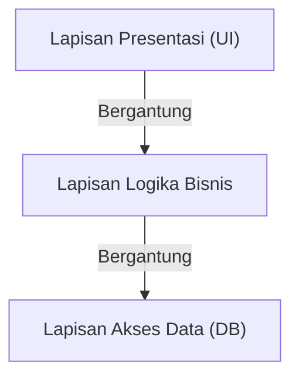
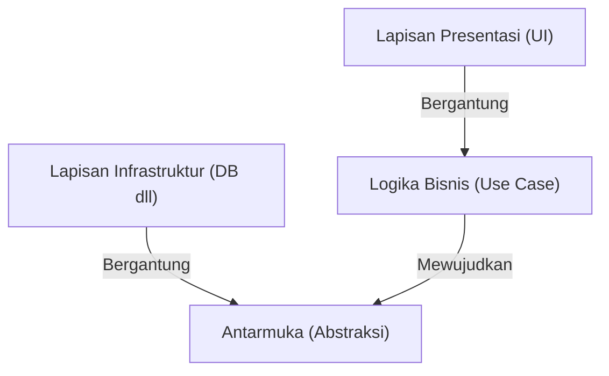

## 1. Pendahuluan: Mengapa Arsitektur Diperlukan?

Dalam sejarah pengembangan perangkat lunak, seiring bertambah besarnya skala sistem, masalah "maintainability", "testability", dan "ketahanan terhadap perubahan" selalu menjadi tantangan. Arsitektur 3-tier (MVC: Model-View-Controller), yang merupakan arus utama dalam pengembangan web awal, adalah pendekatan revolusioner yang memisahkan lapisan presentasi dan lapisan akses data.

Namun, arsitektur 3-tier tradisional memiliki batasan yang signifikan. Hal itu adalah kecenderungan untuk menjadi "database-driven". Ada masalah di mana logika bisnis (domain) bergantung pada lapisan akses data, yang pada gilirannya berpasangan kuat dengan teknologi database spesifik atau ORM.

Untuk mengatasi masalah ini, diusulkanlah "Hexagonal Architecture" oleh Alistair Cockburn, "Onion Architecture" oleh Jeffrey Palermo, dan "Clean Architecture" oleh Uncle Bob (Robert C. Martin). Arsitektur ini direpresentasikan dengan nama dan diagram yang berbeda, tetapi filosofi dasarnya sangatlah mirip.

## 2. Batasan Arsitektur 3-Tier dan Ketergantungan DB

Dalam arsitektur 3-tier tradisional, ketergantungan mengalir dari atas ke bawah seperti berikut.

Masalah terbesar dengan struktur ini adalah bahwa logika bisnis bergantung pada lapisan akses data (infrastruktur). Dengan kata lain, aturan bisnis terseret oleh cara menjalankan SQL atau struktur tabel database. Ini menyebabkan mimpi buruk di mana mengubah database atau mencoba memperkenalkan framework baru akan berdampak ke seluruh logika bisnis.

## 3. Silsilah Tiga Arsitektur

### 3.1 Hexagonal Architecture (Ports and Adapters)
Arsitektur yang diusulkan oleh Alistair Cockburn ini juga dikenal sebagai "Ports and Adapters". Tujuannya adalah untuk memisahkan core dari aplikasi (logika bisnis) dari luar (UI, database, test, dll). Aplikasi menyediakan dan membutuhkan antarmuka yang disebut "port", dan dunia luar terhubung ke port tersebut melalui "adapter".

### 3.2 Onion Architecture
Diusulkan oleh Jeffrey Palermo. Arsitektur ini menempatkan model domain di pusat, dan mengelilinginya dengan domain service, application service, dan menempatkan infrastruktur serta UI di lapisan terluar. Aturan yang dengan jelas mendefinisikan bahwa ketergantungan selalu mengarah "dari luar ke dalam".

### 3.3 Clean Architecture
Arsitektur yang dipresentasikan oleh Uncle Bob. Terkenal dengan diagram lingkaran konsentrisnya, yang menempatkan entitas (aturan bisnis perusahaan secara keseluruhan) di pusat, use cases (aturan bisnis spesifik aplikasi) di luarnya, controllers dan gateways lebih luar lagi, dan detail seperti Web dan DB (infrastruktur) di bagian paling luar.

## 4. Filosofi Bersama di Intinya: Prinsip Inversi Ketergantungan (DIP)

Ketiga arsitektur ini semuanya mengambil pendekatan "menempatkan logika bisnis di pusat (dalam), dan menempatkan infrastruktur dan framework di luar". Dan senjata ampuh untuk mencapai struktur ini adalah "Dependency Inversion Principle (DIP)".

DIP sesuai dengan huruf "D" dalam prinsip SOLID, dan memiliki dua aturan berikut:
1. Modul tingkat tinggi tidak boleh bergantung pada modul tingkat rendah. Keduanya harus bergantung pada "abstraksi".
2. Abstraksi tidak boleh bergantung pada "detail". Detail harus bergantung pada "abstraksi".

Dalam arsitektur-arsitektur ini, DIP digunakan untuk "membalikkan" ketergantungan tradisional.

Logika bisnis tidak perlu tahu di mana data disimpan. Logika bisnis hanya bergantung pada "fungsi (antarmuka) untuk menyimpan data". Dan lapisan infrastruktur mengimplementasikan antarmuka tersebut. Hasilnya, ketergantungan dibalik menjadi "Infrastruktur -> Logika Bisnis", memungkinkan logika bisnis untuk sepenuhnya independen dari elemen eksternal apa pun.

## 5. Pentingnya Pemisahan Lapisan Infrastruktur

Mengapa sangat penting untuk memisahkan infrastruktur sejauh ini?

1. **Testability (Kemudahan Pengujian):** Memungkinkan logika bisnis itu sendiri untuk diuji dengan cepat dan andal menggunakan mock, tanpa memerlukan database atau API eksternal.
2. **Deferring Decisions (Menunda Keputusan):** Tidak perlu memutuskan database atau framework web pada tahap awal proyek. Logika bisnis inti dapat dibangun terlebih dahulu, sementara detail infrastruktur dapat ditunda.
3. **Kebebasan dari Framework:** Usia aturan bisnis jauh lebih panjang daripada usia framework. Hal ini mencegah logika bisnis terpengaruh oleh pembaruan atau perubahan versi framework.

## Kesimpulan

Clean Architecture, Hexagonal Architecture, dan Onion Architecture. Meskipun gambar dan istilah yang digunakan berbeda, tujuan dan metodenya sepenuhnya sama. Intinya adalah "menempatkan inti bisnis di pusat, memisahkan concern, dan membalikkan ketergantungan untuk menciptakan sistem berkelanjutan yang kuat terhadap perubahan lingkungan eksternal".
