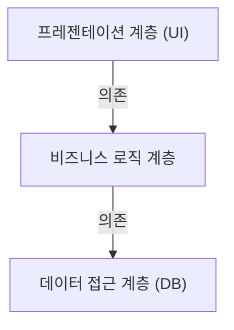
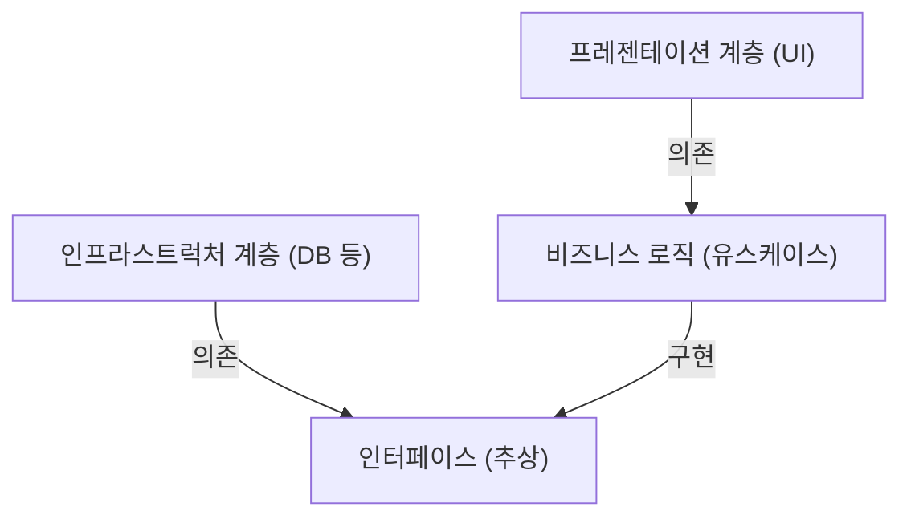

## 1. 시작하며: 왜 아키텍처가 필요한가?

소프트웨어 개발의 역사에서 시스템의 규모가 커짐에 따라 '유지보수성', '테스트 용이성', '변경에 대한 내성'이 항상 과제가 되어왔습니다. 초기 웹 개발에서 주류였던 3계층 아키텍처(MVC: Model-View-Controller)는 프레젠테이션 계층과 데이터 접근 계층을 분리하는 획기적인 기법이었습니다.

하지만 기존의 3계층 아키텍처에는 큰 한계가 있었습니다. 그것은 '데이터베이스 주도'가 되기 쉽다는 것입니다. 비즈니스 로직(도메인)이 데이터 접근 계층에 의존하게 되고, 나아가 특정 데이터베이스 기술이나 ORM과 강하게 결합해 버리는 문제가 있었습니다.

이 문제를 해결하기 위해 제안된 것이 Alistair Cockburn의 '헥사고날 아키텍처', Jeffrey Palermo의 '어니언 아키텍처', 그리고 Uncle Bob(Robert C. Martin)의 '클린 아키텍처'입니다. 이들은 서로 다른 이름과 다이어그램으로 표현되지만, 근저에 있는 사상은 놀랍도록 공통적입니다.

## 2. 3계층 아키텍처의 한계와 DB 의존성

기존의 3계층 아키텍처는 다음과 같이 의존 관계가 위에서 아래로 흐릅니다.

이 구조의 가장 큰 문제는 비즈니스 로직이 데이터 접근 계층(인프라스트럭처)에 의존한다는 것입니다. 즉, 비즈니스 규칙이 SQL 발행 방법이나 데이터베이스 테이블 구조에 이끌려가게 됩니다. 데이터베이스를 변경하거나 새로운 프레임워크를 도입하려고 하면 비즈니스 로직 전체에 수정이 파급되는 악몽을 초래합니다.

## 3. 3가지 아키텍처의 계보

### 3.1 헥사고날 아키텍처 (Ports and Adapters)
Alistair Cockburn이 제창한 이 아키텍처는 '포트와 어댑터'라고도 불립니다. 애플리케이션의 핵심(비즈니스 로직)을 외부(UI, 데이터베이스, 테스트 등)로부터 분리하는 것을 목적으로 합니다. 애플리케이션은 '포트'라고 불리는 인터페이스를 제공 및 요구하고, 외부 세계는 '어댑터'를 통해 그 포트들에 연결됩니다.

### 3.2 어니언 아키텍처
Jeffrey Palermo가 제창했습니다. 도메인 모델을 중심에 두고, 그것을 둘러싸듯이 도메인 서비스, 애플리케이션 서비스, 그리고 가장 바깥쪽에 인프라스트럭처나 UI를 배치합니다. 의존 관계는 항상 '바깥쪽에서 안쪽'을 향한다는 규칙을 명확하게 정의했습니다.

### 3.3 클린 아키텍처
Uncle Bob이 발표한 아키텍처입니다. 동심원 다이어그램으로 유명하며, 중심에 엔티티(기업 전체의 비즈니스 규칙), 그 바깥쪽에 유스케이스(애플리케이션 고유의 비즈니스 규칙)를 배치하고, 더 바깥쪽에 컨트롤러나 게이트웨이, 가장 바깥쪽에 Web이나 DB 등의 세부 사항(인프라스트럭처)을 배치합니다.

## 4. 핵심에 있는 공통된 사상: 의존성 역전 원칙 (DIP)

이 세 가지 아키텍처는 모두 "비즈니스 로직을 중심(안쪽)에 두고, 인프라나 프레임워크를 바깥쪽에 둔다"는 접근 방식을 취하고 있습니다. 그리고 이 구조를 실현하기 위한 강력한 무기가 바로 '의존성 역전 원칙(Dependency Inversion Principle: DIP)'입니다.

DIP란 SOLID 원칙의 'D'에 해당하며, 다음의 2가지 규칙을 가집니다.
1. 상위 수준의 모듈은 하위 수준의 모듈에 의존해서는 안 된다. 둘 다 '추상화'에 의존해야 한다.
2. 추상화는 '세부 사항'에 의존해서는 안 된다. 세부 사항은 '추상화'에 의존해야 한다.

이러한 아키텍처들에서는 DIP를 사용하여 기존의 의존 관계를 '역전'시킵니다.

비즈니스 로직은 데이터의 저장소를 알 필요가 없습니다. '데이터를 저장하는 기능(인터페이스)'에만 의존합니다. 그리고 인프라스트럭처 계층이 그 인터페이스를 구현합니다. 이를 통해 의존 관계가 '인프라 → 비즈니스 로직'으로 역전되어, 비즈니스 로직을 모든 외부 요소로부터 완전히 독립시킬 수 있습니다.

## 5. 인프라스트럭처 계층 분리의 중요성

왜 이렇게까지 인프라스트럭처를 분리하는 것일까요?

1. **테스트 용이성 (Testability):** 데이터베이스나 외부 API 없이도 비즈니스 로직 단일 단위 모의 객체(mock)를 사용하여 빠르고 확실하게 테스트할 수 있게 됩니다.
2. **지연된 결정 (Deferring Decisions):** 프로젝트 초기 단계에서 데이터베이스나 Web 프레임워크를 결정할 필요가 사라집니다. 핵심 비즈니스 로직을 먼저 구축하고, 인프라의 세부 사항은 나중으로 미룰 수 있습니다.
3. **프레임워크로부터의 해방:** 프레임워크의 수명보다 비즈니스 규칙의 수명이 훨씬 더 깁니다. 프레임워크의 버전 업이나 변경에 비즈니스 로직이 휘말리는 것을 방지합니다.

## 요약

클린 아키텍처, 헥사고날 아키텍처, 어니언 아키텍처. 이들은 다이어그램을 그리는 방식이나 용어만 다를 뿐, 목표로 하는 최종 목적과 수단은 완전히 일치합니다. 그것은 "중심에 비즈니스의 핵심을 두고, 관심사를 분리하며, 의존 관계를 역전시킴으로써 외부 환경 변화에 강하고 지속 가능한 시스템을 만든다"는 것입니다.
