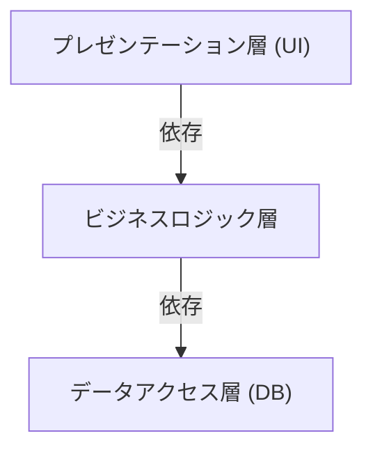
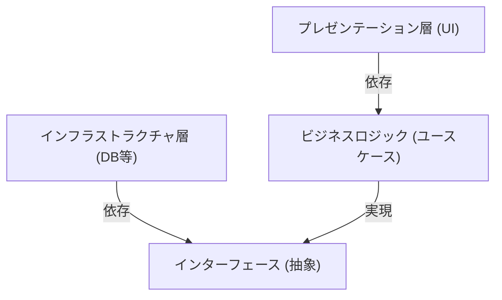

## 1. はじめに：なぜアーキテクチャが必要なのか？

ソフトウェア開発の歴史において、システムの規模が大きくなるにつれて「保守性」「テスト容易性」「変更への耐性」が常に課題となってきました。初期のウェブ開発において主流であった3層アーキテクチャ（MVC：Model-View-Controller）は、プレゼンテーション層とデータアクセス層を分離する画期的な手法でした。

しかし、従来の3層アーキテクチャには大きな限界がありました。それは「データベース駆動」になりがちだということです。ビジネスロジック（ドメイン）がデータアクセス層に依存し、ひいては特定のデータベース技術やORMに強く結合してしまう問題がありました。

この問題を解決するために提案されたのが、Alistair Cockburnによる「ヘキサゴナルアーキテクチャ」、Jeffrey Palermoによる「オニオンアーキテクチャ」、そしてUncle Bob（Robert C. Martin）による「クリーンアーキテクチャ」です。これらは異なる名前と図で表現されますが、根底にある思想は驚くほど共通しています。

## 2. 3層アーキテクチャの限界とDB依存

従来の3層アーキテクチャは、以下のように依存関係が上から下へと流れます。

この構造の最大の問題は、ビジネスロジックがデータアクセス層（インフラストラクチャ）に依存していることです。つまり、ビジネスルールがSQLの発行方法やデータベースのテーブル構造に引きずられてしまいます。データベースを変更したり、新しいフレームワークを導入しようとしたりすると、ビジネスロジック全体に修正が波及するという悪夢を引き起こします。

## 3. 3つのアーキテクチャの系譜

### 3.1 ヘキサゴナルアーキテクチャ (Ports and Adapters)
Alistair Cockburnによって提唱されたこのアーキテクチャは、「ポートとアダプタ」とも呼ばれます。アプリケーションのコア（ビジネスロジック）を外部（UI、データベース、テストなど）から分離することを目的としています。アプリケーションは「ポート」と呼ばれるインターフェースを提供・要求し、外部の世界は「アダプタ」を通じてそれらのポートに接続します。

### 3.2 オニオンアーキテクチャ
Jeffrey Palermoによって提唱されました。ドメインモデルを中心に据え、それを囲むようにドメインサービス、アプリケーションサービス、そして最も外側にインフラストラクチャやUIを配置します。依存関係は常に「外側から内側」に向かうというルールを明確に定義しました。

### 3.3 クリーンアーキテクチャ
Uncle Bobが発表したアーキテクチャです。同心円状の図で有名であり、中心にエンティティ（企業全体のビジネスルール）、その外側にユースケース（アプリケーション固有のビジネスルール）を配置し、さらに外側にコントローラーやゲートウェイ、最も外側にWebやDBなどの詳細（インフラストラクチャ）を配置します。

## 4. 核心にある共通の思想：依存関係逆転の原則 (DIP)

これら3つのアーキテクチャはすべて、「ビジネスロジックを中心（内側）に置き、インフラやフレームワークを外側に置く」というアプローチをとっています。そして、この構造を実現するための強力な武器が「依存関係逆転の原則（Dependency Inversion Principle: DIP）」です。

DIPとは、SOLID原則の「D」にあたり、以下の2つのルールを持ちます。
1. 上位レベルのモジュールは、下位レベルのモジュールに依存してはならない。両者は「抽象」に依存すべきである。
2. 抽象は「詳細」に依存してはならない。詳細は「抽象」に依存すべきである。

これらのアーキテクチャでは、DIPを用いて従来の依存関係を「逆転」させます。

ビジネスロジックは、データの保存先を知る必要はありません。「データを保存する機能（インターフェース）」にのみ依存します。そして、インフラストラクチャ層がそのインターフェースを実装します。これにより、依存関係が「インフラ → ビジネスロジック」へと逆転し、ビジネスロジックをあらゆる外部要素から完全に独立させることができます。

## 5. インフラストラクチャ層の分離の重要性

なぜここまでしてインフラストラクチャを分離するのでしょうか？

1. **テスト容易性 (Testability):** データベースや外部APIなしで、ビジネスロジック単体をモックを使って高速かつ確実にテストできるようになります。
2. **遅延決定 (Deferring Decisions):** プロジェクトの初期段階でデータベースやWebフレームワークを決定する必要がなくなります。コアのビジネスロジックを先に構築し、インフラの詳細は後回しにできます。
3. **フレームワークからの解放:** フレームワークの寿命よりも、ビジネスルールの寿命のほうがはるかに長いです。フレームワークのバージョンアップや変更にビジネスロジックが巻き込まれるのを防ぎます。

## まとめ

クリーンアーキテクチャ、ヘキサゴナルアーキテクチャ、オニオンアーキテクチャ。これらは図の描き方や用語こそ違えど、目指すゴールと手段は完全に一致しています。それは「中心にビジネスの核を置き、関心事を分離し、依存関係を逆転させることで、外部環境の変化に強い、持続可能なシステムを作る」ということです。
