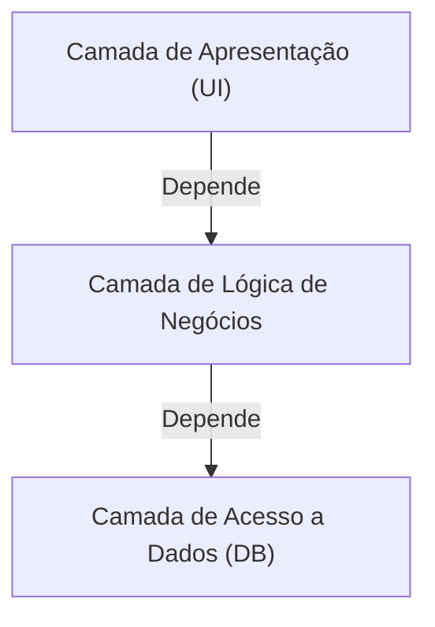
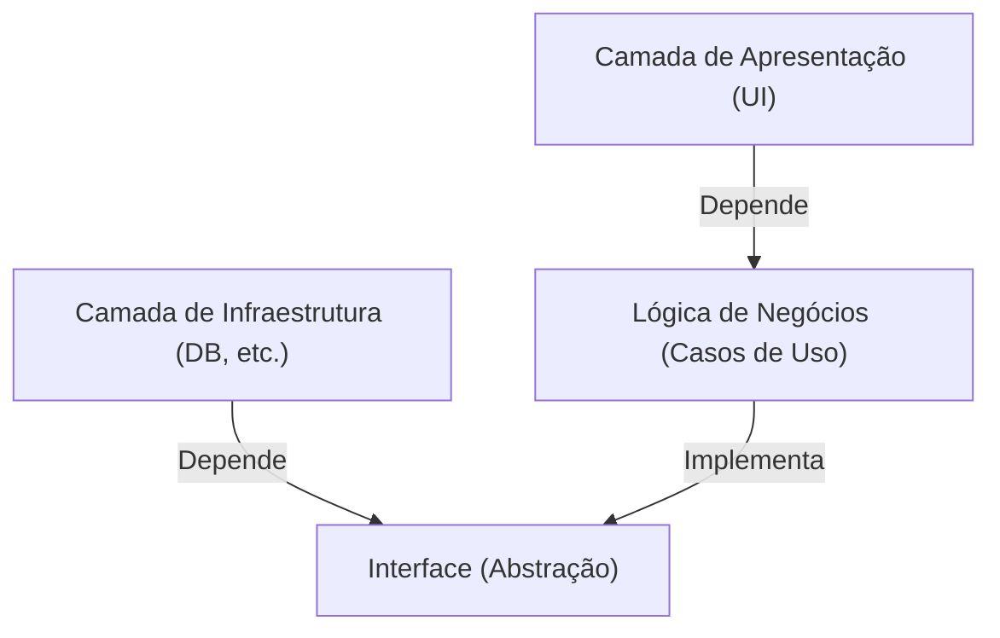

## 1. Introdução: Por que precisamos de arquitetura?

Na história do desenvolvimento de software, à medida que os sistemas crescem em escala, "manutenibilidade", "testabilidade" e "tolerância a mudanças" sempre foram desafios. A arquitetura de três camadas (MVC: Model-View-Controller), que foi predominante no desenvolvimento web inicial, foi uma abordagem revolucionária que separou a camada de apresentação e a camada de acesso a dados.

No entanto, a arquitetura tradicional de três camadas tinha grandes limitações. A principal é que ela tendia a ser "orientada a banco de dados". A lógica de negócios (domínio) dependia da camada de acesso a dados, o que, por sua vez, causava o problema de forte acoplamento a tecnologias de banco de dados específicas ou ORMs.

Para resolver esse problema, foram propostas a "Arquitetura Hexagonal" por Alistair Cockburn, a "Onion Architecture" por Jeffrey Palermo e a "Clean Architecture" por Uncle Bob (Robert C. Martin). Embora sejam expressas com nomes e diagramas diferentes, as ideias subjacentes são surpreendentemente comuns.

## 2. Limitações da Arquitetura de 3 Camadas e Dependência de DB

Na arquitetura tradicional de três camadas, as dependências fluem de cima para baixo da seguinte forma:

O maior problema com essa estrutura é que a lógica de negócios depende da camada de acesso a dados (infraestrutura). Em outras palavras, as regras de negócios são arrastadas por como o SQL é emitido e pela estrutura das tabelas do banco de dados. Mudar o banco de dados ou tentar introduzir um novo framework causa um pesadelo onde as modificações se propagam por toda a lógica de negócios.

## 3. A Genealogia das 3 Arquiteturas

### 3.1 Arquitetura Hexagonal (Ports and Adapters)
Proposta por Alistair Cockburn, esta arquitetura também é chamada de "Portas e Adaptadores". Seu objetivo é separar o núcleo da aplicação (lógica de negócios) do exterior (UI, banco de dados, testes, etc.). A aplicação fornece e requer interfaces chamadas "portas", e o mundo externo se conecta a essas portas através de "adaptadores".

### 3.2 Onion Architecture
Proposta por Jeffrey Palermo. Ela coloca o modelo de domínio no centro, cercado por serviços de domínio, serviços de aplicação e, no exterior, infraestrutura e UI. Definiu claramente a regra de que as dependências sempre apontam de "fora para dentro".

### 3.3 Clean Architecture
Uma arquitetura anunciada por Uncle Bob. É famosa por seu diagrama concêntrico, com entidades (regras de negócios de toda a empresa) no centro, casos de uso (regras de negócios específicas da aplicação) no exterior, controladores e gateways mais fora, e detalhes (infraestrutura) como Web e DB no anel mais externo.

## 4. A Ideia Comum no Núcleo: O Princípio de Inversão de Dependência (DIP)

Todas essas três arquiteturas adotam a abordagem de "colocar a lógica de negócios no centro (dentro) e infraestrutura e frameworks fora". E a arma poderosa para alcançar essa estrutura é o "Princípio de Inversão de Dependência (Dependency Inversion Principle: DIP)".

DIP corresponde ao "D" nos princípios SOLID e tem as duas regras a seguir:
1. Módulos de alto nível não devem depender de módulos de baixo nível. Ambos devem depender de "abstrações".
2. Abstrações não devem depender de "detalhes". Detalhes devem depender de "abstrações".

Nessas arquiteturas, o DIP é usado para "inverter" a dependência tradicional.

A lógica de negócios não precisa saber onde salvar os dados. Ela depende apenas da "funcionalidade de salvar dados (interface)". E a camada de infraestrutura implementa essa interface. Como resultado, a relação de dependência é invertida para "Infraestrutura -> Lógica de Negócios", permitindo que a lógica de negócios seja completamente independente de quaisquer elementos externos.

## 5. A Importância de Separar a Camada de Infraestrutura

Por que ir tão longe para separar a infraestrutura?

1. **Testabilidade:** Sem um banco de dados ou API externa, a lógica de negócios em si pode ser testada de forma rápida e confiável usando mocks.
2. **Decisões Adiadas (Deferring Decisions):** Não há necessidade de decidir sobre um banco de dados ou framework web nos estágios iniciais do projeto. A lógica central de negócios pode ser construída primeiro, deixando os detalhes de infraestrutura para depois.
3. **Libertação de Frameworks:** A vida útil das regras de negócios é muito maior do que a vida útil de um framework. Isso evita que a lógica de negócios seja pega em atualizações ou mudanças no framework.

## Conclusão

Clean Architecture, Hexagonal Architecture e Onion Architecture. Embora a maneira de desenhar os diagramas e a terminologia possam diferir, os objetivos e meios para alcançá-los estão em completo acordo. Trata-se de "colocar o núcleo do negócio no centro, separar preocupações e inverter dependências para criar sistemas sustentáveis e resilientes a mudanças no ambiente externo".
