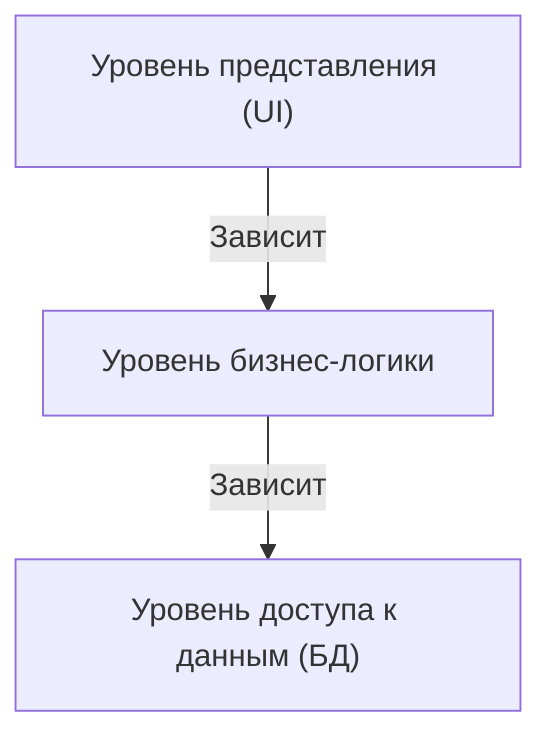
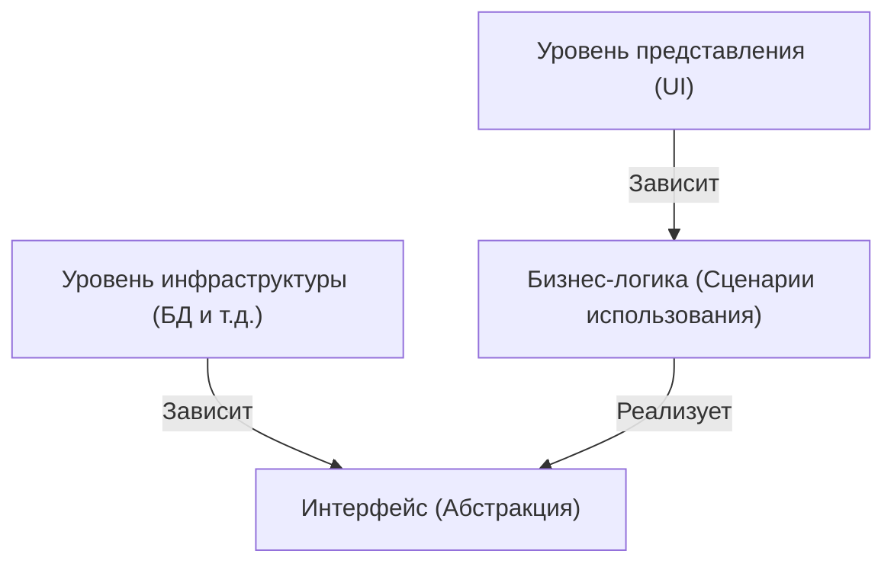

## 1. Введение: Зачем нужна архитектура?

В истории разработки программного обеспечения по мере роста масштабов систем «ремонтопригодность», «тестируемость» и «устойчивость к изменениям» всегда были проблемами. В ранней веб-разработке преобладающая трехслойная архитектура (MVC: Model-View-Controller) была новаторским подходом, который разделял уровень представления и уровень доступа к данным.

Однако традиционная трехслойная архитектура имела серьезные ограничения. Это то, что она склонна быть «управляемой базой данных». Проблема заключалась в том, что бизнес-логика (домен) зависела от уровня доступа к данным и, следовательно, была сильно связана с конкретной технологией базы данных или ORM.

Чтобы решить эту проблему, Алистер Кокберн предложил «гексагональную архитектуру», Джеффри Палермо - «луковичную архитектуру», а дядя Боб (Роберт С. Мартин) - «чистую архитектуру». Хотя они представлены разными названиями и диаграммами, лежащая в их основе философия удивительно схожа.

## 2. Ограничения трехслойной архитектуры и зависимость от БД

В традиционной трехслойной архитектуре зависимости протекают сверху вниз следующим образом.

Самая большая проблема с этой структурой заключается в том, что бизнес-логика зависит от уровня доступа к данным (инфраструктуры). То есть бизнес-правила тянутся за тем, как выполняются SQL-запросы и структурой таблиц базы данных. При попытке изменить базу данных или внедрить новый фреймворк возникает кошмар, при котором модификации распространяются на всю бизнес-логику.

## 3. Генеалогия трех архитектур

### 3.1 Гексагональная архитектура (Порты и Адаптеры)
Эта архитектура, предложенная Алистером Кокберном, также известна как «Порты и Адаптеры». Цель состоит в том, чтобы изолировать ядро приложения (бизнес-логику) от внешнего мира (пользовательский интерфейс, база данных, тесты и т.д.). Приложение предоставляет и запрашивает интерфейсы, называемые «портами», а внешний мир подключается к этим портам через «адаптеры».

### 3.2 Луковичная архитектура
Предложена Джеффри Палермо. В центре находится доменная модель, которую окружают доменные службы, службы приложения, а инфраструктура и пользовательский интерфейс размещаются на самом внешнем уровне. Он четко определил правило, согласно которому зависимости всегда направлены «снаружи внутрь».

### 3.3 Чистая архитектура
Архитектура, анонсированная Дядей Бобом (Uncle Bob). Она известна своей концентрической диаграммой: сущности (корпоративные бизнес-правила) расположены в центре, сценарии использования (бизнес-правила конкретного приложения) расположены снаружи от них, далее идут контроллеры и шлюзы, а детали (инфраструктура), такие как Web и БД, расположены на самом внешнем уровне.

## 4. Общая основная философия: Принцип инверсии зависимостей (DIP)

Все эти три архитектуры используют подход, при котором «бизнес-логика размещается в центре (внутри), а инфраструктура и фреймворки — снаружи». И мощным оружием для реализации этой структуры является «Принцип инверсии зависимостей (Dependency Inversion Principle: DIP)».

DIP соответствует букве «D» в принципах SOLID и имеет два следующих правила:
1. Модули верхнего уровня не должны зависеть от модулей нижнего уровня. Оба должны зависеть от «абстракций».
2. Абстракции не должны зависеть от «деталей». Детали должны зависеть от «абстракций».

В этих архитектурах DIP используется для «инверсии» традиционных зависимостей.

Бизнес-логике не нужно знать, где сохраняются данные. Она зависит только от «функции (интерфейса) сохранения данных». А уровень инфраструктуры реализует этот интерфейс. Это инвертирует зависимость в «Инфраструктура → Бизнес-логика» и позволяет полностью изолировать бизнес-логику от всех внешних элементов.

## 5. Важность изоляции уровня инфраструктуры

Почему так важно изолировать инфраструктуру?

1. **Тестируемость (Testability):** Бизнес-логику можно быстро и надежно протестировать изолированно с использованием моков без базы данных или внешних API.
2. **Отсрочка решений (Deferring Decisions):** Нет необходимости принимать решение о базе данных или веб-фреймворке на ранних этапах проекта. Основная бизнес-логика может быть создана первой, а детали инфраструктуры отложены на потом.
3. **Независимость от фреймворков:** Срок службы бизнес-правил намного превышает срок службы фреймворков. Это предотвращает вовлечение бизнес-логики в обновления или изменения версий фреймворка.

## Заключение

Чистая архитектура, гексагональная архитектура и луковичная архитектура. Хотя они отличаются тем, как рисуются диаграммы и используется терминология, их цели и средства полностью совпадают. Это значит «создать устойчивую систему, устойчивую к изменениям во внешней среде, поместив ядро бизнеса в центр, разделив проблемы и инвертировав зависимости».
