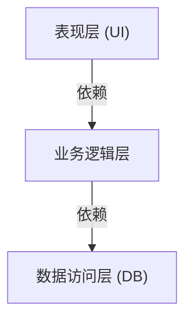
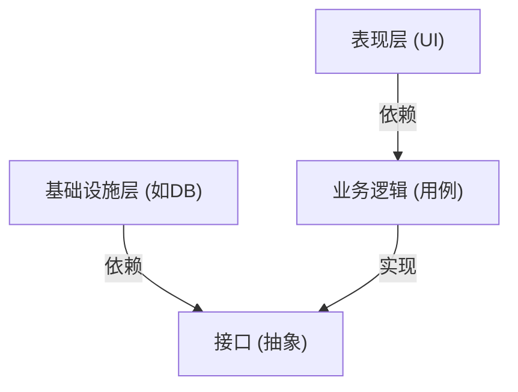

## 1. 引言：为什么需要架构？

在软件开发的历史中，随着系统规模的扩大，“可维护性”、“可测试性”和“对变化的适应能力”一直是我们面临的挑战。在早期Web开发中占据主导地位的三层架构（MVC：模型-视图-控制器）是一种将表现层与数据访问层分离的革命性方法。

然而，传统的三层架构存在一个很大的局限性。那就是它很容易变成“数据库驱动”。存在着业务逻辑（领域）依赖于数据访问层，进而与特定的数据库技术或ORM强耦合的问题。

为了解决这个问题，Alistair Cockburn提出了“六边形架构”（Hexagonal Architecture），Jeffrey Palermo提出了“洋葱架构”（Onion Architecture），而Uncle Bob（Robert C. Martin）提出了“整洁架构”（Clean Architecture）。虽然它们用不同的名称和图表来表达，但底层的核心思想惊人地一致。

## 2. 三层架构的局限性与DB依赖

在传统的三层架构中，依赖关系如下所示从上到下流动。

这种结构最大的问题在于业务逻辑依赖于数据访问层（基础设施）。也就是说，业务规则会被SQL的编写方式或数据库表结构所牵制。一旦试图更改数据库或引入新的框架，就会导致修改波及整个业务逻辑的噩梦。

## 3. 三种架构的谱系

### 3.1 六边形架构 (Ports and Adapters)
由Alistair Cockburn提出的这种架构，也被称为“端口和适配器”。它的目的是将应用程序的核心（业务逻辑）与外部（UI、数据库、测试等）分离开来。应用程序提供和请求被称为“端口”的接口，外部世界通过“适配器”连接到这些端口。

### 3.2 洋葱架构
由Jeffrey Palermo提出。它将领域模型放在中心，然后依次围绕着领域服务、应用服务，最外层放置基础设施和UI。它明确定义了一条规则：依赖关系必须始终“由外向内”指向。

### 3.3 整洁架构
由Uncle Bob发表的架构。它以同心圆的图表而闻名，中心放置实体（企业级的业务规则），其外侧放置用例（特定于应用程序的业务规则），再外层放置控制器和网关，最外层放置Web、DB等细节（基础设施）。

## 4. 核心的共同思想：依赖反转原则 (DIP)

这三种架构都采用了“将业务逻辑放在中心（内侧），将基础设施和框架放在外侧”的方法。而实现这种结构的强大武器就是“依赖反转原则（Dependency Inversion Principle: DIP）”。

DIP是SOLID原则中的“D”，它包含以下两条规则：
1. 高层模块不应该依赖于低层模块，两者都应该依赖于抽象。
2. 抽象不应该依赖于细节，细节应该依赖于抽象。

在这些架构中，利用DIP将传统的依赖关系“反转”。

业务逻辑不需要知道数据的保存位置。它只依赖于“保存数据的功能（接口）”。然后由基础设施层来实现该接口。这样依赖关系就反转为“基础设施 → 业务逻辑”，从而使业务逻辑完全独立于任何外部因素。

## 5. 基础设施层分离的重要性

为什么非要做到分离基础设施的地步呢？

1. **可测试性 (Testability):** 可以在没有数据库或外部API的情况下，使用Mock（模拟对象）快速可靠地对业务逻辑本身进行单元测试。
2. **延迟决策 (Deferring Decisions):** 在项目的初期阶段，不需要立即决定使用什么数据库或Web框架。可以先构建核心的业务逻辑，将基础设施的细节留到以后再做决定。
3. **从框架中解放:** 业务规则的寿命比框架的寿命长得多。它可以防止业务逻辑被卷入框架的升级或更换中。

## 总结

整洁架构、六边形架构、洋葱架构。虽然它们画图的方式和使用的术语不同，但追求的目标和手段完全一致。那就是“把业务核心放在中心，分离关注点，反转依赖关系，从而构建出能够抵御外部环境变化的可持续发展的系统”。
