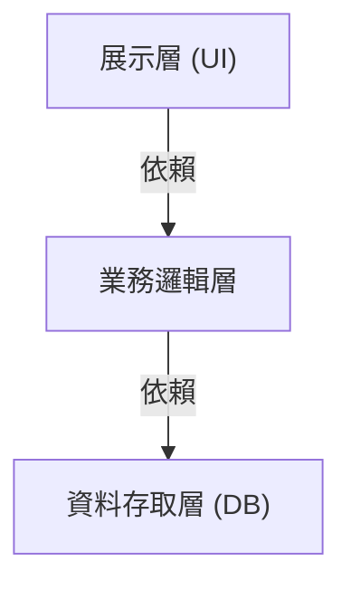
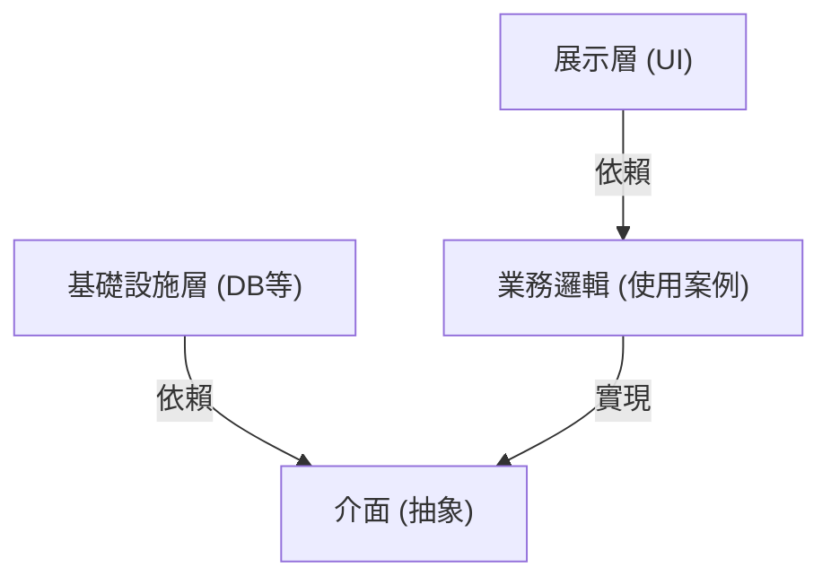

## 1. 簡介：為什麼需要架構？

在軟體開發的歷史中，隨著系統規模變大，「可維護性」、「易測試性」和「對變更的抵抗力」一直是挑戰。在早期網頁開發中成為主流的三層架構（MVC：Model-View-Controller）是一種劃時代的方法，它分離了展示層和資料存取層。

然而，傳統的三層架構有一個很大的限制。那就是它容易變成「資料庫驅動」。存在著業務邏輯（領域）依賴於資料存取層，進而與特定資料庫技術或 ORM 強耦合的問題。

為了解決這個問題，Alistair Cockburn 提出了「六角架構（Hexagonal Architecture）」，Jeffrey Palermo 提出了「洋蔥架構（Onion Architecture）」，以及 Uncle Bob（Robert C. Martin）提出了「乾淨架構（Clean Architecture）」。雖然它們以不同的名稱和圖表來表示，但底層的思想卻驚人地一致。

## 2. 三層架構的限制與資料庫依賴

傳統的三層架構，其依賴關係由上而下流動，如下所示。

這種結構最大的問題是業務邏輯依賴於資料存取層（基礎設施）。也就是說，業務規則會被 SQL 的發行方式或資料庫的資料表結構所牽絆。如果要變更資料庫或導入新框架，就會引發修改波及整個業務邏輯的惡夢。

## 3. 三種架構的系譜

### 3.1 六角架構 (Ports and Adapters)
由 Alistair Cockburn 提出的這種架構，也被稱為「埠與轉接器（Ports and Adapters）」。其目的是將應用程式的核心（業務邏輯）與外部（UI、資料庫、測試等）分離。應用程式提供並要求被稱為「埠（Ports）」的介面，外部世界則透過「轉接器（Adapters）」連接到這些埠。

### 3.2 洋蔥架構
由 Jeffrey Palermo 提出。它以領域模型為中心，周圍環繞著領域服務、應用服務，最外層則是基礎設施或 UI。它明確定義了一條規則：依賴關係必須始終「從外向內」指向。

### 3.3 乾淨架構
這是由 Uncle Bob 發表的架構。以同心圓的圖表聞名，中心是實體（整個企業的業務規則），外面是使用案例（應用程式特定的業務規則），再外層是控制器或閘道器，最外層則是 Web 或 DB 等細節（基礎設施）。

## 4. 核心共通思想：依賴反轉原則 (DIP)

這三種架構都採用了「將業務邏輯放在中心（內側），將基礎設施或框架放在外側」的方法。而實現這種結構的強大武器就是「依賴反轉原則（Dependency Inversion Principle: DIP）」。

DIP 是 SOLID 原則中的「D」，包含以下兩個規則：
1. 高層模組不應該依賴於低層模組。兩者都應該依賴於「抽象」。
2. 抽象不應該依賴於細節。細節應該依賴於「抽象」。

在這些架構中，利用 DIP 來「反轉」傳統的依賴關係。

業務邏輯不需要知道資料儲存的位置。它只依賴於「儲存資料的功能（介面）」。然後，由基礎設施層來實作該介面。這使得依賴關係反轉為「基礎設施 → 業務邏輯」，從而讓業務邏輯能完全獨立於任何外部元素。

## 5. 分離基礎設施層的重要性

為什麼要做到這種程度來分離基礎設施呢？

1. **易測試性 (Testability):** 可以在沒有資料庫或外部 API 的情況下，使用 Mock 來快速且可靠地單獨測試業務邏輯。
2. **延遲決策 (Deferring Decisions):** 在專案初期階段不需要決定資料庫或 Web 框架。可以先建構核心業務邏輯，將基礎設施的細節延後處理。
3. **從框架中解放:** 業務規則的壽命遠長於框架的壽命。可以防止業務邏輯受到框架升級或變更的波及。

## 總結

乾淨架構、六角架構、洋蔥架構。儘管它們的圖表畫法或術語有所不同，但目標和手段是完全一致的。那就是「將業務的核心放在中心，分離關注點，並透過依賴反轉，打造出能夠抵抗外部環境變化、可持續發展的系統」。
