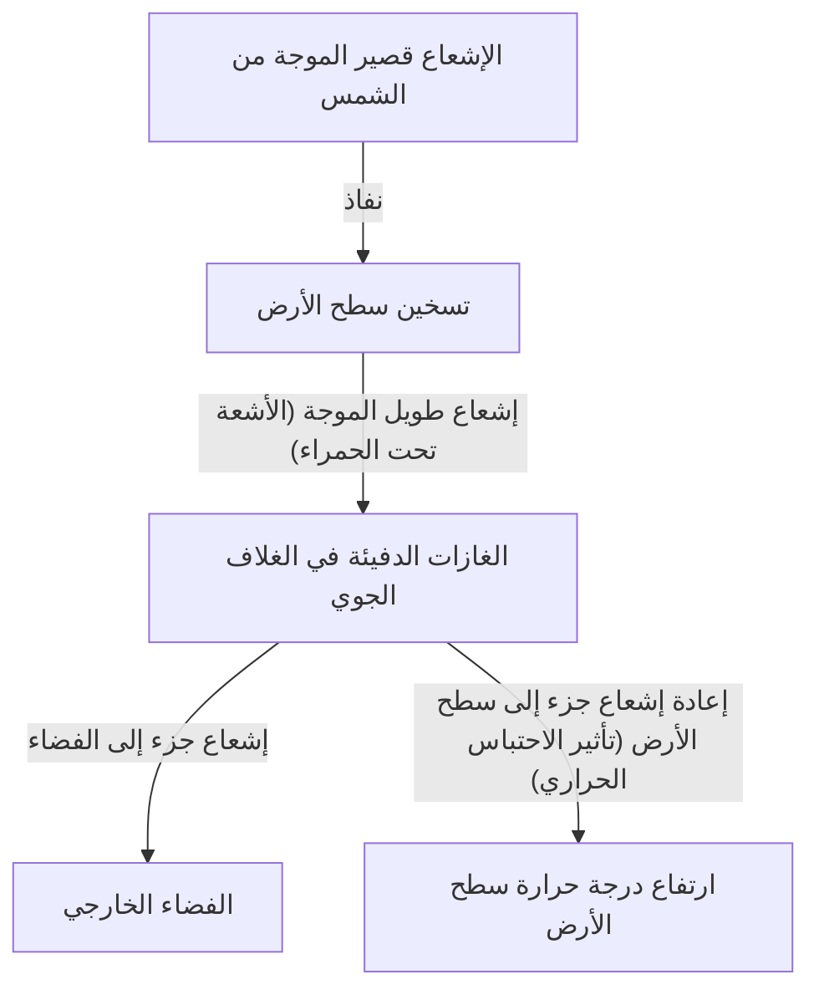

## 1. مقدمة: نظام الأرض المتغير باستمرار

إن الأرض التي نعيش عليها هي نظام ديناميكي مستمر في التغير منذ نشأتها وحتى يومنا هذا. تتشابك الغلاف الجوي، والغلاف المائي، والغلاف الصخري، والمحيط الحيوي بشكل معقد لتشكيل النظام المناخي من خلال دورات الطاقة والمادة. ومع ذلك، عند النظر من خلال النطاق القصير للتاريخ البشري، غالباً ما نقع في وهم أن "المناخ مستقر".

في هذا المقال، سنتعمق في تاريخ تغير المناخ على الأرض، بدءاً من النطاق الجيولوجي وصولاً إلى ظواهر الطقس المتطرفة الحديثة. دعونا نستكشف بشكل شامل الآليات الفيزيائية، والتأثيرات الاجتماعية التاريخية، وأزمة المناخ الحديثة التي نواجهها، والحلول المستقبلية.

## 2. الآليات الفيزيائية لتغير المناخ وتاريخ الأرض

### 2.1 دورات ميلانكوفيتش والفترات الجليدية وبين الجليدية

أحد أكبر العوامل الطبيعية في تغير مناخ الأرض هو التغير في العناصر المدارية للأرض. اقترح عالم الجيوفيزياء الصربي ميلوتين ميلانكوفيتش أن العوامل الثلاثة التالية تؤثر على كمية الإشعاع الشمسي (التشميس) التي تتلقاها الأرض:

1.  **اللامركزية (Eccentricity)**: درجة الانحراف في المدار الإهليلجي للأرض (دورة تبلغ حوالي 100,000 سنة).
2.  **الميل المحوري (Obliquity)**: التغير في زاوية ميل محور الدوران (دورة تبلغ حوالي 41,000 سنة).
3.  **المبادرة المحورية (Precession)**: الحركة التذبذبية لمحور الدوران (دورة تبلغ حوالي 26,000 سنة).

نتيجة لتداخل هذه التقلبات الدورية، مرت الأرض بفترات "جليدية" باردة وفترات "بين جليدية" دافئة نسبياً. نحن نعيش حالياً في فترة بين جليدية تسمى "الهولوسين" (Holocene)، والتي بدأت قبل حوالي 11,700 سنة.

### 2.2 اكتشاف تأثير الاحتباس الحراري وآليته

عنصر آخر مهم في النظام المناخي هو الغازات الدفيئة في الغلاف الجوي. في أوائل القرن التاسع عشر، أدرك جوزيف فورييه أن درجة حرارة الأرض أعلى مما يمكن تفسيره بالطاقة القادمة من الشمس وحدها، واستنتج أن "الغلاف الجوي يعمل كبطانية". لاحقاً، أثبت جون تيندال بالتجربة أن بخار الماء وثاني أكسيد الكربون (CO2) لهما خصائص امتصاص وإشعاع الأشعة تحت الحمراء. وكان سفانتي أرهينيوس أول من حسب العلاقة الكمية بين تركيز ثاني أكسيد الكربون ودرجة حرارة سطح الأرض.

يمكن التعبير عن توازن طاقة الأرض بشكل مبسط بالمعادلات التالية:

$$ E_{in} = S_0 (1 - A) / 4 $$
$$ E_{out} = \sigma T^4 $$

حيث $S_0$ هو الثابت الشمسي، و $A$ هو البياض (الانعكاسية)، و $\sigma$ هو ثابت ستيفان-بولتزمان، و $T$ هو درجة حرارة الإشعاع الفعالة. عندما تزداد الغازات الدفيئة، يمتص الغلاف الجوي الأشعة تحت الحمراء ($E_{out}$) التي ينبغي أن تهرب من السطح إلى الفضاء الخارجي، ويعاد إشعاعها نحو السطح، مما يؤدي إلى ارتفاع درجة حرارة السطح.

## 3. تأثيرات التغيرات المناخية والكوارث الطبيعية التاريخية على المجتمع

تاريخ البشرية هو أيضاً تاريخ من التكيف مع تهديدات تغير المناخ والكوارث الطبيعية.

### 3.1 الانفجارات البركانية و"عام بلا صيف"

تضخ الانفجارات البركانية الكبيرة كميات هائلة من ثاني أكسيد الكبريت (SO2) إلى طبقة الستراتوسفير. يتحول هذا إلى رذاذ الكبريتات، الذي يعكس ضوء الشمس ويبرد الأرض (الشتاء البركاني).

أشهر مثال في التاريخ هو ثوران بركان تامبورا في إندونيسيا عام 1815. تسبب هذا الثوران في "عام بلا صيف" (Year Without a Summer) في نصف الكرة الشمالي في العام التالي، 1816. في أوروبا وأمريكا الشمالية، حدث صقيع في الصيف، ودُمرت المحاصيل، وحدثت مجاعات شديدة. ويُقال إن هذا الطقس المتطرف هو الذي ألهم ماري شيلي لكتابة رواية "فرانكنشتاين".

### 3.2 العصر الجليدي الصغير وازدهار وانهيار الحضارات

من القرن الرابع عشر إلى القرن التاسع عشر، شهدت الأرض فترة باردة نسبياً تُعرف باسم "العصر الجليدي الصغير" (Little Ice Age). وتُعزى أسباب البرودة في هذه الفترة إلى انخفاض النشاط الشمسي (مثل حد ماوندر الأدنى) والنشاط البركاني المتزايد.

كان للعصر الجليدي الصغير تأثير عميق على المجتمعات البشرية. في أوروبا، تكررت المجاعات بسبب فشل المحاصيل، ويُعتقد أنها كانت إحدى خلفيات الاضطرابات الاجتماعية مثل انتشار الموت الأسود (الطاعون) ومحاكمات الساحرات. من ناحية أخرى، في بعض المناطق مثل هولندا، تطورت تقنيات زراعية وأنظمة اقتصادية جديدة تتكيف مع البرودة، مما أدى إلى العصر الذهبي اللاحق.

## 4. الثورة الصناعية وبداية تغير المناخ البشري المنشأ

جلبت الثورة الصناعية، التي بدأت في أواخر القرن الثامن عشر، رخاءً غير مسبوق للبشرية، ولكنها كانت في الوقت نفسه بداية عبء هائل على بيئة الأرض. إن الاستهلاك الكثيف للوقود الأحفوري مثل الفحم، ولاحقاً النفط والغاز الطبيعي، هو عمل يطلق الكربون المتراكم تحت الأرض على مدى عشرات الملايين من السنين إلى الغلاف الجوي في غضون بضعة قرون فقط.

ارتفع تركيز ثاني أكسيد الكربون في الغلاف الجوي من حوالي 280 جزءاً في المليون (ppm) قبل الثورة الصناعية إلى أكثر من 420 جزءاً في المليون حالياً، وهو أعلى مستوى له في ملايين السنين الماضية. هذه الزيادة السريعة في الغازات الدفيئة هي السبب المباشر لـ "الاحتباس الحراري" الحالي.

## 5. الكوارث الطبيعية الحديثة: عصر يصبح فيه "الاستثنائي" هو "اليومي"

الاحتباس الحراري لا يقتصر فقط على "ارتفاع درجات الحرارة". مع تراكم الطاقة في النظام المناخي بأكمله، يزداد تواتر وشدة ظواهر الطقس المتطرفة (الشذوذ المناخي).

### 5.1 الأعاصير والأعاصير المدارية المتزايدة الشدة

يؤدي ارتفاع درجات حرارة مياه البحر إلى زيادة الطاقة الموردة للأعاصير المدارية (التايفون، الهوريكين، السيكلون). وكما تشير معادلة كلاوزيوس-كلابيرون، فإن زيادة درجة الحرارة بمقدار درجة مئوية واحدة تزيد من كمية بخار الماء التي يمكن أن يحتويها الغلاف الجوي بنسبة 7٪ تقريباً. ونتيجة لذلك، يزداد هطول الأمطار بشكل كبير، مما يتسبب في فيضانات وانهيارات أرضية غير مسبوقة.

### 5.2 سلسلة من موجات الحر والجفاف

من ناحية أخرى، بسبب التغيرات في توزيع الضغط الجوي، تطول فترات موجات الحر الشديدة والجفاف في مناطق معينة. ومع تسارع تبخر رطوبة التربة، تجف الأرض، ويرتفع خطر حرائق الغابات واسعة النطاق (الحرائق الضخمة) بشكل كبير. تُظهر الحرائق واسعة النطاق التي حدثت بشكل متكرر في السنوات الأخيرة في أستراليا وكاليفورنيا وسيبيريا بوضوح التهديد المباشر الذي يفرضه تغير المناخ.

### 5.3 ارتفاع مستوى سطح البحر وأزمة المدن الساحلية

بسبب التمدد الحراري لمياه البحر الناتج عن ارتفاع درجات الحرارة وذوبان الصفائح الجليدية في جرينلاند والقارة القطبية الجنوبية، يستمر متوسط مستوى سطح البحر العالمي في الارتفاع. ونتيجة لذلك، لا تواجه الدول الجزرية مثل جزر المالديف وتوفالو فحسب، بل تواجه المدن الساحلية الكبرى في العالم مثل نيويورك وطوكيو وشانغهاي أيضاً خطر العواصف والفيضانات المزمنة.

## 6. تدابير أزمة المناخ وتوقعات المستقبل

يجب علينا اتخاذ إجراءات فورية وواسعة النطاق لتجنب الآثار الكارثية لتغير المناخ. تنقسم التدابير بشكل عام إلى "تدابير التخفيف" (Mitigation) و"تدابير التكيف" (Adaptation).

### 6.1 تدابير التخفيف: الانتقال إلى مجتمع خالٍ من الكربون

الأولوية القصوى هي خفض انبعاثات الغازات الدفيئة إلى الصفر الصافي (Net Zero).
*   **تحول الطاقة**: انتقال واسع النطاق إلى الطاقة المتجددة مثل الطاقة الشمسية، وطاقة الرياح، والطاقة الحرارية الأرضية.
*   **كهربة النقل والصناعة**: نشر السيارات الكهربائية (EV) واستخدام طاقة الهيدروجين.
*   **تقنيات مبتكرة**: البحث والتطوير في تقنيات احتجاز ثاني أكسيد الكربون وتخزينه (CCS)، والالتقاط المباشر من الهواء (DAC).

### 6.2 تدابير التكيف: بناء مجتمع مرن

من الضروري أيضاً زيادة قدرة المجتمع على الصمود (المرونة) ضد تأثيرات تغير المناخ الجارية بالفعل.
*   **تعزيز البنية التحتية**: بناء حواجز بحرية ضخمة وتجهيز أحواض الاحتجاز كتدابير ضد الفيضانات.
*   **تطوير أنظمة الوقاية من الكوارث**: إدخال أنظمة الإنذار المبكر والتنبؤ الدقيق بالطقس باستخدام الذكاء الاصطناعي.
*   **تكيف الزراعة**: تطوير أصناف محاصيل مقاومة للحرارة والجفاف، والإدارة المستدامة للموارد المائية.

## 7. خاتمة

يعلمنا تاريخ تغير المناخ والكوارث الطبيعية عن عجز الإنسان أمام ديناميكية الأرض، وفي الوقت نفسه، يوضح أننا نمتلك الآن القدرة على تغيير بيئة الأرض من خلال أفعالنا.

تختلف أزمة المناخ الحديثة عن أي كارثة طبيعية في التاريخ، فهي مشكلة تسببنا فيها نحن أنفسنا. ومع ذلك، فهي أيضاً تمثل أملاً في أن نتمكن من إيجاد حلول وبناء مستقبل مستدام بأيدينا. ستكون المعرفة العلمية، والتضامن الدولي، وتغيير وعي كل فرد منا هي المفتاح لتوريث كوكب غني للأجيال القادمة.
