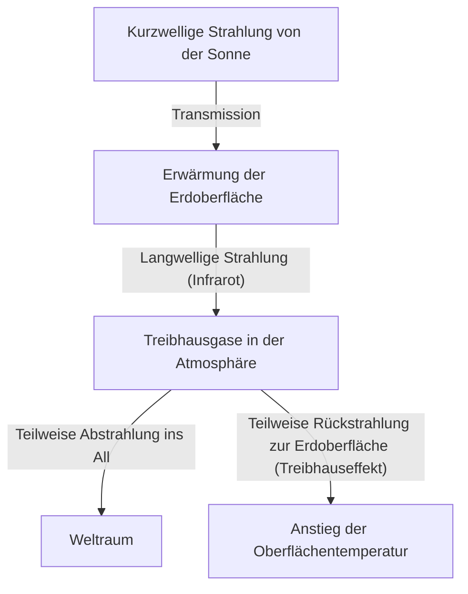

## 1. Einleitung: Das sich ständig verändernde Erdsystem

Die Erde, auf der wir leben, ist ein dynamisches System, das sich von seiner Entstehung bis heute ständig verändert. Atmosphäre, Hydrosphäre, Lithosphäre und Biosphäre sind komplex miteinander verflochten und bilden durch den Energie- und Stoffkreislauf das Klimasystem. Auf der kurzen Skala der Menschheitsgeschichte neigen wir jedoch zu der Illusion, das Klima sei "stabil".

In diesem Artikel werden wir tief in die Geschichte der Klimaveränderungen auf der Erde eintauchen – von geologischen Maßstäben bis hin zu modernen extremen Wetterereignissen. Wir werden die physikalischen Mechanismen, die historischen gesellschaftlichen Auswirkungen sowie die gegenwärtige Klimakrise, vor der wir stehen, und Lösungen für die Zukunft umfassend untersuchen.

## 2. Physikalische Mechanismen des Klimawandels und die Erdgeschichte

### 2.1 Milanković-Zyklen und Kalt-/Warmzeiten

Einer der größten natürlichen Faktoren bei Klimaveränderungen auf der Erde sind Veränderungen der Erdbahnparameter. Der serbische Geophysiker Milutin Milanković schlug vor, dass die folgenden drei Faktoren die Menge an Sonneneinstrahlung (Insolation), die die Erde erhält, beeinflussen:

1.  **Exzentrizität (Eccentricity)**: Der Grad der elliptischen Form der Erdumlaufbahn (Zyklus von etwa 100.000 Jahren).
2.  **Schiefe der Ekliptik (Obliquity)**: Die Schwankung des Neigungswinkels der Erdachse (Zyklus von etwa 41.000 Jahren).
3.  **Präzession (Precession)**: Die Taumelbewegung der Erdachse (Zyklus von etwa 26.000 Jahren).

Durch die Überlagerung dieser zyklischen Schwankungen hat die Erde immer wieder kalte "Kaltzeiten" (Eiszeiten) und relativ warme "Warmzeiten" (Interglaziale) durchlaufen. Gegenwärtig leben wir in einer Warmzeit namens "Holozän" (Holocene), die vor etwa 11.700 Jahren begann.

### 2.2 Die Entdeckung des Treibhauseffekts und sein Mechanismus

Ein weiteres wichtiges Element des Klimasystems sind die Treibhausgase in der Atmosphäre. Im frühen 19. Jahrhundert erkannte Joseph Fourier, dass die Temperatur der Erde viel höher ist, als durch die Sonnenenergie allein erklärt werden könnte, und folgerte, dass "die Atmosphäre wie eine Decke wirkt". Später bewies John Tyndall experimentell, dass Wasserdampf und Kohlendioxid (CO2) die Eigenschaft haben, Infrarotstrahlung zu absorbieren und abzugeben, und Svante Arrhenius berechnete erstmals quantitativ den Zusammenhang zwischen der CO2-Konzentration und der Oberflächentemperatur der Erde.

Die Energiebilanz der Erde lässt sich vereinfacht durch die folgenden Gleichungen ausdrücken:

$$ E_{in} = S_0 (1 - A) / 4 $$
$$ E_{out} = \sigma T^4 $$

Hierbei ist $S_0$ die Solarkonstante, $A$ die Albedo (Reflexionsvermögen), $\sigma$ die Stefan-Boltzmann-Konstante und $T$ die effektive Strahlungstemperatur. Wenn die Treibhausgase zunehmen, wird die Infrarotstrahlung ($E_{out}$), die eigentlich von der Erdoberfläche in den Weltraum entweichen sollte, von der Atmosphäre absorbiert und wieder zur Erdoberfläche zurückgestrahlt, wodurch die Oberflächentemperatur ansteigt.

## 3. Die Auswirkungen historischer Klimaveränderungen und Naturkatastrophen auf die Gesellschaft

Die Geschichte der Menschheit ist auch eine Geschichte der Anpassung an die Bedrohungen durch Klimaveränderungen und Naturkatastrophen.

### 3.1 Vulkanausbrüche und das "Jahr ohne Sommer"

Große Vulkanausbrüche injizieren enorme Mengen an Schwefeldioxid (SO2) in die Stratosphäre. Dieses wandelt sich in Sulfat-Aerosole um, die das Sonnenlicht reflektieren und die Erde abkühlen (vulkanischer Winter).

Das berühmteste Beispiel in der Geschichte ist der Ausbruch des Vulkans Tambora in Indonesien im Jahr 1815. Dieser Ausbruch brachte der Nordhalbkugel im folgenden Jahr 1816 das "Jahr ohne Sommer" (Year Without a Summer). In Europa und Nordamerika gab es im Sommer Frost, Ernten wurden katastrophal geschädigt, und es kam zu schweren Hungersnöten. Es wird auch gesagt, dass diese extremen Wetterbedingungen Mary Shelley die Inspiration gaben, "Frankenstein" zu schreiben.

### 3.2 Die Kleine Eiszeit und der Aufstieg und Fall von Zivilisationen

Vom 14. bis zum 19. Jahrhundert erlebte die Erde eine relativ kalte Periode, die als "Kleine Eiszeit" (Little Ice Age) bezeichnet wird. Als Ursachen für die Abkühlung in dieser Zeit werden eine verringerte Sonnenaktivität (wie das Maunder-Minimum) und aktive vulkanische Aktivitäten genannt.

Die Kleine Eiszeit hatte tiefgreifende Auswirkungen auf die menschliche Gesellschaft. In Europa kam es häufig zu Hungersnöten aufgrund von Missernten, was als einer der Hintergründe für soziale Unruhen wie den Ausbruch des Schwarzen Todes (Pest) und Hexenverfolgungen angesehen wird. Andererseits entwickelten sich in einigen Regionen, wie den Niederlanden, neue, an das kältere Klima angepasste landwirtschaftliche Techniken und Wirtschaftssysteme, die zum späteren Goldenen Zeitalter führten.

## 4. Die industrielle Revolution und der Beginn des anthropogenen Klimawandels

Die industrielle Revolution, die in der zweiten Hälfte des 18. Jahrhunderts begann, brachte der Menschheit einen beispiellosen Wohlstand, war aber gleichzeitig auch der Beginn einer enormen Belastung für die globale Umwelt. Der massive Verbrauch von fossilen Brennstoffen wie Kohle und später Erdöl und Erdgas stellt einen Prozess dar, bei dem Kohlenstoff, der sich über zig Millionen Jahre im Untergrund angesammelt hat, in nur wenigen Jahrhunderten in die Atmosphäre freigesetzt wird.

Die CO2-Konzentration in der Atmosphäre ist von etwa 280 ppm vor der industriellen Revolution auf heute über 420 ppm gestiegen und hat damit den höchsten Stand der letzten Millionen Jahre erreicht. Dieser drastische Anstieg der Treibhausgase ist die direkte Ursache der aktuellen "globalen Erwärmung".

## 5. Moderne Naturkatastrophen: Eine Ära, in der das "Extreme" zur "Normalität" wird

Die globale Erwärmung bedeutet nicht nur, dass "die Temperaturen steigen". Durch die Ansammlung von Energie im gesamten Klimasystem nehmen Häufigkeit und Intensität von extremen Wetterereignissen zu.

### 5.1 Intensivere Taifune und Hurrikane

Der Anstieg der Meerestemperaturen erhöht die Energie, die tropischen Wirbelstürmen (Taifunen, Hurrikanen, Zyklonen) zugeführt wird. Wie die Clausius-Clapeyron-Gleichung zeigt, steigt die Menge an Wasserdampf, die die Atmosphäre aufnehmen kann, um etwa 7 % für jedes Grad Temperaturanstieg. Dies führt zu einer dramatischen Zunahme der Niederschläge, was Überschwemmungen und Erdrutsche von beispiellosem Ausmaß verursacht.

### 5.2 Die Kettenreaktion von Hitzewellen und Dürren

Auf der anderen Seite führen Veränderungen der Drucksysteme in bestimmten Regionen zu anhaltenden, extremen Hitzewellen und Dürren. Da die Verdunstung der Bodenfeuchtigkeit beschleunigt wird, trocknet das Land aus, und das Risiko von großflächigen Waldbränden (Megabränden) steigt sprunghaft an. Die massiven Brände, die in den letzten Jahren häufig in Australien, Kalifornien und Sibirien aufgetreten sind, demonstrieren eindrücklich die direkte Bedrohung durch den Klimawandel.

### 5.3 Meeresspiegelanstieg und die Krise der Küstenstädte

Aufgrund der thermischen Ausdehnung des Meerwassers durch den Temperaturanstieg und des Schmelzens der Eisschilde in Grönland und der Antarktis steigt der globale durchschnittliche Meeresspiegel weiter an. Dadurch sind nicht nur Inselstaaten wie die Malediven und Tuvalu, sondern auch wichtige Küstenstädte der Welt wie New York, Tokio und Shanghai dem Risiko von Sturmfluten und chronischen Überschwemmungen ausgesetzt.

## 6. Maßnahmen gegen die Klimakrise und Ausblick in die Zukunft

Wir müssen sofort und in großem Maßstab handeln, um die katastrophalen Auswirkungen des Klimawandels zu vermeiden. Die Maßnahmen lassen sich grob in "Minderung" (Mitigation) und "Anpassung" (Adaptation) unterteilen.

### 6.1 Minderung: Der Übergang zu einer dekarbonisierten Gesellschaft

Die oberste Priorität ist es, die Treibhausgasemissionen auf netto-null (Net Zero) zu reduzieren.
*   **Energiewende**: Ein massiver Übergang zu erneuerbaren Energien wie Sonne, Wind und Geothermie.
*   **Elektrifizierung von Verkehr und Industrie**: Die Verbreitung von Elektrofahrzeugen (EVs) und die Nutzung von Wasserstoffenergie.
*   **Innovative Technologien**: Forschung und Entwicklung in Bereichen wie CO2-Abscheidung und -Speicherung (CCS) und Direct Air Capture (DAC).

### 6.2 Anpassung: Aufbau einer resilienten Gesellschaft

Es ist auch unerlässlich, die Widerstandsfähigkeit (Resilienz) der Gesellschaft gegenüber den bereits im Gange befindlichen Auswirkungen des Klimawandels zu erhöhen.
*   **Stärkung der Infrastruktur**: Bau riesiger Deiche und Einrichtung von Rückhaltebecken zum Hochwasserschutz.
*   **Verbesserung von Katastrophenschutzsystemen**: Einführung von Frühwarnsystemen und hochpräzisen Wettervorhersagen mithilfe von KI.
*   **Anpassung der Landwirtschaft**: Entwicklung von hitze- und dürreresistenten Pflanzensorten und nachhaltiges Wasserressourcenmanagement.

## 7. Fazit

Die Geschichte der Klimaveränderungen und Naturkatastrophen lehrt uns die Machtlosigkeit des Menschen gegenüber der Dynamik der Erde, zeigt aber gleichzeitig auch, dass wir durch unser Handeln die Macht erlangt haben, die globale Umwelt zu verändern.

Die moderne Klimakrise unterscheidet sich von allen historischen Naturkatastrophen, da es ein Problem ist, das wir selbst ausgelöst haben. Das bedeutet jedoch zugleich auch, dass wir selbst Lösungen finden und eine nachhaltige Zukunft aufbauen können. Wissenschaftliches Wissen, internationale Solidarität und der Bewusstseinswandel jedes Einzelnen werden der Schlüssel sein, um künftigen Generationen eine reiche Erde zu hinterlassen.
