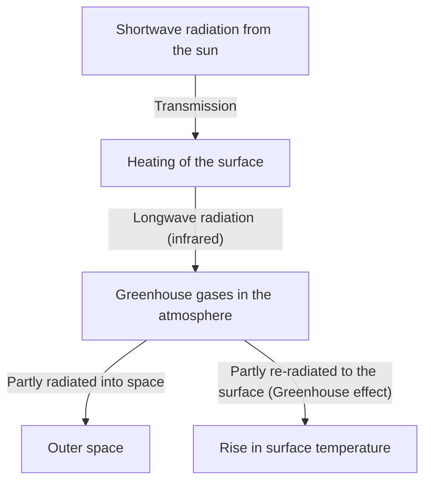

## 1. Introduction: The Constantly Changing Earth System

The Earth we live on is a dynamic system that has been constantly changing since its birth to the present day. The atmosphere, hydrosphere, lithosphere, and biosphere are intricately intertwined, forming the climate system through the circulation of energy and matter. However, looking at the short scale of human history, we tend to fall into the illusion that "the climate is stable."

In this article, we will delve deep into the history of Earth's climate change, from a geological scale to modern extreme weather. Let's comprehensively explore the physical mechanisms, historical social impacts, and the modern climate crisis we are facing along with solutions for the future.

## 2. Physical Mechanisms of Climate Change and Earth's History

### 2.1 Milankovitch Cycles and Glacial-Interglacial Periods

One of the greatest natural drivers of climate change on Earth is the variation in its orbital parameters. Serbian geophysicist Milutin Milanković proposed that the following three elements affect the amount of solar radiation (insolation) the Earth receives:

1.  **Eccentricity**: The degree to which Earth's orbit around the sun departs from a perfect circle (a cycle of about 100,000 years).
2.  **Obliquity**: The variation in the tilt of Earth's axis of rotation (a cycle of about 41,000 years).
3.  **Precession**: The wobble of the Earth's rotational axis (a cycle of about 26,000 years).

Through the overlapping of these cyclical variations, the Earth has repeatedly undergone cold "glacial periods" and relatively warm "interglacial periods." Currently, we live in an interglacial period called the "Holocene," which began approximately 11,700 years ago.

### 2.2 Discovery of the Greenhouse Effect and Its Mechanism

Another crucial element of the climate system is greenhouse gases in the atmosphere. In the early 19th century, Joseph Fourier realized that the Earth's temperature was higher than could be explained by the energy from the sun alone, deducing that "the atmosphere acts like a blanket." Later, John Tyndall experimentally proved that water vapor and carbon dioxide (CO2) have the property of absorbing and emitting infrared radiation, and Svante Arrhenius calculated for the first time the quantitative relationship between CO2 concentration and Earth's surface temperature.

The Earth's energy balance is simplified by the following equations:

$$ E_{in} = S_0 (1 - A) / 4 $$
$$ E_{out} = \sigma T^4 $$

Here, $S_0$ is the solar constant, $A$ is the albedo (reflectivity), $\sigma$ is the Stefan-Boltzmann constant, and $T$ is the effective emission temperature. As greenhouse gases increase, the infrared radiation ($E_{out}$) that would normally escape from the surface into space is absorbed by the atmosphere and re-radiated toward the surface, causing the surface temperature to rise.

## 3. The Impact of Historical Climate Change and Natural Disasters on Society

The history of humanity is also a history of adaptation to the threats of climate change and natural disasters.

### 3.1 Volcanic Eruptions and the "Year Without a Summer"

Large-scale volcanic eruptions inject massive amounts of sulfur dioxide (SO2) into the stratosphere. This transforms into sulfate aerosols, which reflect sunlight and cool the Earth (volcanic winter).

The most famous example in history is the eruption of Mount Tambora in Indonesia in 1815. This eruption brought the "Year Without a Summer" to the Northern Hemisphere the following year, in 1816. In Europe and North America, frost occurred in the summer, crops suffered catastrophic damage, and severe famine ensued. This extreme weather is also said to have provided the inspiration that led Mary Shelley to write *Frankenstein*.

### 3.2 The Little Ice Age and the Rise and Fall of Civilizations

From the 14th to the 19th century, the Earth experienced a relatively cold period known as the "Little Ice Age." Reduced solar activity (such as the Maunder Minimum) and active volcanic activity have been pointed out as causes for the cooling during this period.

The Little Ice Age had a profound impact on human society. In Europe, frequent famines due to crop failures occurred, which is considered one of the background factors for social unrest such as the outbreak of the Black Death (plague) and witch hunts. On the other hand, in certain regions like the Netherlands, new agricultural techniques and economic systems adapted to the cooling developed, leading to a subsequent Golden Age.

## 4. The Industrial Revolution and the Dawn of Anthropogenic Climate Change

The Industrial Revolution, which began in the late 18th century, brought unprecedented prosperity to humanity, but it also marked the beginning of a massive burden on the global environment. The mass consumption of fossil fuels such as coal, and later oil and natural gas, is the act of releasing carbon accumulated underground over tens of millions of years into the atmosphere in just a few centuries.

The atmospheric CO2 concentration has exceeded 420 ppm today from about 280 ppm before the Industrial Revolution, reaching its highest level in the past few million years. This rapid increase in greenhouse gases is the direct cause of the current "global warming."

## 5. Modern Natural Disasters: An Era Where the "Abnormal" Becomes "Normal"

Global warming is not just about "temperatures rising." The accumulation of energy in the entire climate system is increasing the frequency and intensity of extreme weather events.

### 5.1 Intensifying Typhoons and Hurricanes

The rise in sea surface temperatures increases the energy supplied to tropical cyclones (typhoons, hurricanes, and cyclones). As shown by the Clausius-Clapeyron equation, a 1-degree rise in temperature increases the amount of water vapor the atmosphere can hold by about 7%. This has led to a dramatic increase in precipitation, triggering floods and landslides of unprecedented scale.

### 5.2 The Chain of Heatwaves and Droughts

On the other hand, changes in pressure patterns are prolonging extreme heatwaves and droughts in specific regions. As the evaporation of soil moisture accelerates, the land dries out, and the risk of massive forest fires (megafires) skyrockets. The large-scale fires that have occurred frequently in recent years in Australia, California, and Siberia vividly demonstrate the direct threat posed by climate change.

### 5.3 Sea-Level Rise and the Crisis of Coastal Cities

Due to the thermal expansion of seawater caused by rising temperatures and the melting of ice sheets in Greenland and Antarctica, the global average sea level continues to rise. Because of this, not only island nations like the Maldives and Tuvalu, but also major global coastal cities such as New York, Tokyo, and Shanghai are exposed to the risk of storm surges and chronic flooding.

## 6. Measures Against the Climate Crisis and Prospects for the Future

We must take immediate and massive action to avoid the catastrophic impacts of climate change. The measures are broadly divided into "Mitigation" and "Adaptation."

### 6.1 Mitigation: Transitioning to a Decarbonized Society

The top priority is to bring greenhouse gas emissions to net zero.
*   **Energy Transition**: A massive shift to renewable energy such as solar, wind, and geothermal power.
*   **Electrification of Transport and Industry**: The widespread adoption of EVs (electric vehicles) and the utilization of hydrogen energy.
*   **Innovative Technologies**: Research and development of Carbon Capture and Storage (CCS) and Direct Air Capture (DAC) technologies.

### 6.2 Adaptation: Building a Resilient Society

It is also essential to enhance society's resilience against the impacts of climate change that are already underway.
*   **Strengthening Infrastructure**: Flood control measures such as constructing massive seawalls and developing retarding basins.
*   **Advancing Disaster Prevention Systems**: The introduction of early warning systems and highly accurate weather forecasting utilizing AI.
*   **Agricultural Adaptation**: The development of crop varieties resistant to high temperatures and drought, and sustainable water resource management.

## 7. Conclusion

The history of climate change and natural disasters teaches us human powerlessness against the dynamism of the Earth, while simultaneously showing that we now possess the power to alter the global environment through our own actions.

The modern climate crisis differs from any historical natural disaster in that it is a problem triggered by ourselves. However, this also offers the hope that we can find solutions with our own hands and build a sustainable future. Scientific knowledge, international solidarity, and a change in consciousness by each individual will be the key to passing on a rich Earth to the next generation.
