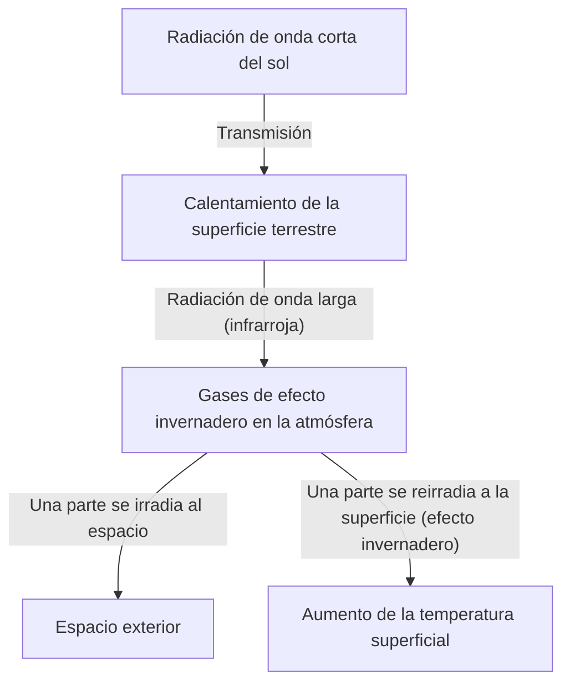

## 1. Introducción: El sistema terrestre en constante cambio

Nuestro planeta ha sido un sistema dinámico en constante cambio desde su nacimiento hasta el presente. La atmósfera, la hidrosfera, la litosfera y la biosfera están intrincadamente entrelazadas, formando el sistema climático a través de la circulación de energía y materia. Sin embargo, en la corta escala de la historia humana, tendemos a caer en la ilusión de que "el clima es estable".

En este artículo, profundizaremos en la historia del cambio climático en la Tierra, desde las escalas de tiempo geológicas hasta los fenómenos meteorológicos extremos modernos. Exploraremos de manera integral los mecanismos físicos, los impactos sociales históricos, y la crisis climática moderna que enfrentamos junto con soluciones para el futuro.

## 2. Los mecanismos físicos del cambio climático y la historia de la Tierra

### 2.1 Los ciclos de Milankovitch y los períodos glaciales e interglaciales

Uno de los mayores factores naturales en el cambio climático de la Tierra es la variación de sus parámetros orbitales. El geofísico serbio Milutin Milankovitch propuso que los tres elementos siguientes afectan la cantidad de radiación solar (insolación) que recibe la Tierra:

1.  **Excentricidad (Eccentricity)**: El grado en que la órbita de la Tierra alrededor del sol es elíptica (ciclo de aproximadamente 100.000 años).
2.  **Oblicuidad (Obliquity)**: La variación del ángulo de inclinación del eje de rotación (ciclo de aproximadamente 41.000 años).
3.  **Precesión (Precession)**: El movimiento de bamboleo del eje de rotación (ciclo de aproximadamente 26.000 años).

La superposición de estas variaciones cíclicas ha causado que la Tierra alterne entre períodos fríos "glaciales" y períodos relativamente cálidos "interglaciales". Actualmente, vivimos en un período interglacial llamado "Holoceno (Holocene)", que comenzó hace unos 11.700 años.

### 2.2 El descubrimiento del efecto invernadero y su mecanismo

Otro elemento crucial del sistema climático son los gases de efecto invernadero en la atmósfera. A principios del siglo XIX, Joseph Fourier notó que la temperatura de la Tierra era más alta de lo que podría explicarse únicamente por la energía del sol, deduciendo que "la atmósfera actúa como una manta". Más tarde, John Tyndall demostró experimentalmente que el vapor de agua y el dióxido de carbono (CO2) absorben y emiten radiación infrarroja, y Svante Arrhenius calculó por primera vez la relación cuantitativa entre la concentración de CO2 y la temperatura de la superficie de la Tierra.

El balance energético de la Tierra se expresa de forma simplificada con las siguientes ecuaciones:

$$ E_{in} = S_0 (1 - A) / 4 $$
$$ E_{out} = \sigma T^4 $$

Aquí, $S_0$ es la constante solar, $A$ es el albedo (reflectividad), $\sigma$ es la constante de Stefan-Boltzmann y $T$ es la temperatura de radiación efectiva. Cuando aumentan los gases de efecto invernadero, la radiación infrarroja ($E_{out}$) que debería escapar de la superficie al espacio es absorbida por la atmósfera y reemitida de nuevo hacia la superficie, lo que provoca un aumento en la temperatura superficial.

## 3. El impacto del cambio climático histórico y los desastres naturales en la sociedad

La historia de la humanidad es también una historia de adaptación a los cambios climáticos y a la amenaza de los desastres naturales.

### 3.1 Erupciones volcánicas y "el año sin verano"

Las erupciones volcánicas masivas inyectan grandes cantidades de dióxido de azufre (SO2) en la estratosfera. Esto se convierte en aerosoles de sulfato, que reflejan la luz solar y enfrían la Tierra (invierno volcánico).

El ejemplo más famoso en la historia es la erupción del Monte Tambora en Indonesia en 1815. Esta erupción provocó un "Año sin verano (Year Without a Summer)" en el hemisferio norte en 1816. En Europa y América del Norte, hubo heladas durante el verano, las cosechas fueron devastadas y ocurrieron graves hambrunas. Se dice que este clima anómalo inspiró a Mary Shelley a escribir "Frankenstein".

### 3.2 La Pequeña Edad de Hielo y el auge y caída de las civilizaciones

Entre los siglos XIV y XIX, la Tierra experimentó un período relativamente frío conocido como la "Pequeña Edad de Hielo (Little Ice Age)". Las causas de este enfriamiento apuntan a una disminución de la actividad solar (como el Mínimo de Maunder) y a una mayor actividad volcánica.

La Pequeña Edad de Hielo tuvo un profundo impacto en la sociedad humana. En Europa, ocurrieron frecuentes hambrunas debido a las malas cosechas, lo que se considera parte del contexto de inestabilidad social como los brotes de peste bubónica (la Peste Negra) y la caza de brujas. Por otro lado, en algunas regiones como los Países Bajos, se desarrollaron nuevas tecnologías agrícolas y sistemas económicos adaptados al frío, lo que llevó a su posterior Siglo de Oro.

## 4. La Revolución Industrial y el amanecer del cambio climático antropogénico

La Revolución Industrial, que comenzó a finales del siglo XVIII, trajo una prosperidad sin precedentes a la humanidad, pero al mismo tiempo marcó el inicio de una enorme carga para el medio ambiente global. El consumo masivo de carbón y, posteriormente, de combustibles fósiles como el petróleo y el gas natural, es el acto de liberar a la atmósfera en unos pocos cientos de años el carbono acumulado bajo tierra durante decenas de millones de años.

La concentración de CO2 en la atmósfera ha aumentado de aproximadamente 280 ppm antes de la Revolución Industrial a más de 420 ppm en la actualidad, alcanzando su nivel más alto en los últimos millones de años. Este rápido aumento de los gases de efecto invernadero es la causa directa del actual "calentamiento global".

## 5. Desastres naturales modernos: La era donde lo "anormal" se vuelve "normal"

El calentamiento global no se limita a "aumentos de temperatura". A medida que se acumula energía en todo el sistema climático, la frecuencia y la intensidad de los fenómenos meteorológicos extremos aumentan.

### 5.1 Tifones y huracanes cada vez más severos

El aumento de la temperatura del agua del mar incrementa la energía suministrada a los ciclones tropicales (tifones, huracanes). Como muestra la ecuación de Clausius-Clapeyron, por cada grado de aumento en la temperatura del aire, la cantidad de vapor de agua que puede contener la atmósfera aumenta aproximadamente un 7%. Esto ha provocado un aumento dramático en las precipitaciones, causando inundaciones y deslizamientos de tierra de proporciones sin precedentes.

### 5.2 La cadena de olas de calor y sequías

Por otro lado, los cambios en los patrones de presión atmosférica están provocando olas de calor extremas y sequías prolongadas en ciertas regiones. Al acelerarse la evaporación de la humedad del suelo, la tierra se seca, lo que aumenta enormemente el riesgo de grandes incendios forestales (megaincendios). Los incendios a gran escala que han ocurrido con frecuencia en los últimos años en Australia, California y Siberia demuestran vívidamente la amenaza directa que representa el cambio climático.

### 5.3 El aumento del nivel del mar y la crisis de las ciudades costeras

Debido a la expansión térmica del agua del mar por el aumento de las temperaturas y al derretimiento de las capas de hielo en Groenlandia y la Antártida, el nivel medio global del mar continúa subiendo. Como resultado, no solo las naciones insulares como las Maldivas y Tuvalu, sino también las principales ciudades costeras del mundo como Nueva York, Tokio y Shanghái, están expuestas al riesgo de marejadas ciclónicas e inundaciones crónicas.

## 6. Respuestas a la crisis climática y perspectivas de futuro

Debemos tomar medidas inmediatas y a gran escala para evitar los impactos catastróficos del cambio climático. Las medidas se pueden dividir en gran medida en "Mitigación (Mitigation)" y "Adaptación (Adaptation)".

### 6.1 Mitigación: Transición hacia una sociedad descarbonizada

La principal prioridad es reducir a cero las emisiones netas de gases de efecto invernadero (cero neto).
*   **Transición energética**: Una transición a gran escala hacia energías renovables como la solar, eólica y geotérmica.
*   **Electrificación del transporte y la industria**: La adopción de vehículos eléctricos (VE) y la utilización de la energía del hidrógeno.
*   **Tecnologías innovadoras**: Investigación y desarrollo de tecnologías de captura y almacenamiento de carbono (CCS) y de captura directa de aire (DAC).

### 6.2 Adaptación: Construcción de una sociedad resiliente

También es esencial mejorar la resiliencia de la sociedad frente a los impactos del cambio climático que ya están en curso.
*   **Fortalecimiento de la infraestructura**: Construcción de enormes diques y desarrollo de cuencas de retención para el control de inundaciones.
*   **Avance de los sistemas de prevención de desastres**: Introducción de sistemas de alerta temprana y previsiones meteorológicas de alta precisión utilizando IA.
*   **Adaptación agrícola**: Desarrollo de variedades de cultivos resistentes a altas temperaturas y sequías, y gestión sostenible de los recursos hídricos.

## 7. Conclusión

La historia del cambio climático y los desastres naturales nos enseña la impotencia humana frente al dinamismo de la Tierra, al mismo tiempo que demuestra que hemos adquirido el poder de alterar el medio ambiente global a través de nuestras propias acciones.

La crisis climática moderna, a diferencia de cualquier desastre natural en la historia, es un problema que nosotros mismos hemos desencadenado. Sin embargo, esto también ofrece la esperanza de que, con nuestras propias manos, podemos encontrar soluciones y construir un futuro sostenible. El conocimiento científico, la solidaridad internacional y un cambio de mentalidad en cada individuo serán la clave para dejar en herencia una Tierra próspera a la próxima generación.
