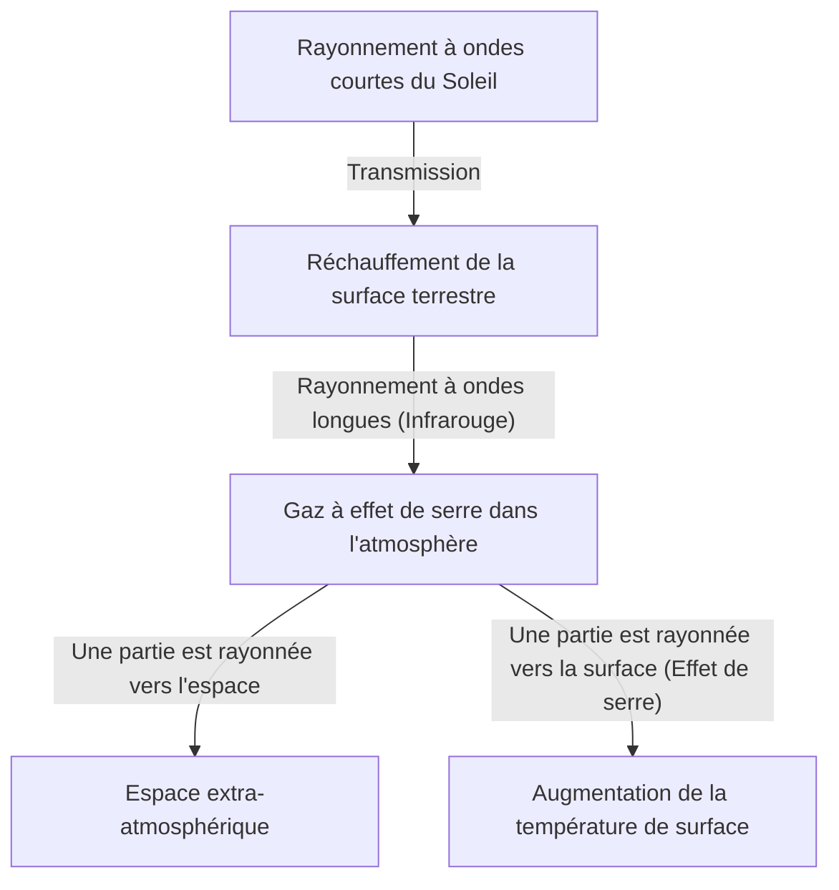

## 1. Introduction : Un système terrestre en constante évolution

Notre Terre, de sa naissance à nos jours, est un système dynamique en constante évolution. L'atmosphère, l'hydrosphère, la lithosphère et la biosphère sont intimement liées, formant le système climatique à travers le cycle de l'énergie et de la matière. Cependant, à la courte échelle de l'histoire humaine, nous avons tendance à tomber dans l'illusion que « le climat est stable ».

Dans cet article, nous plongerons dans l'histoire des changements climatiques de la Terre, de l'échelle géologique aux conditions météorologiques extrêmes modernes. Explorons de manière exhaustive les mécanismes physiques, les impacts sociaux historiques, ainsi que la crise climatique moderne à laquelle nous sommes confrontés et les solutions pour l'avenir.

## 2. Les mécanismes physiques du changement climatique et l'histoire de la Terre

### 2.1 Les cycles de Milankovitch et les périodes glaciaires/interglaciaires

L'un des plus grands facteurs naturels des changements climatiques sur Terre est la variation des paramètres orbitaux de la planète. Le géophysicien serbe Milutin Milanković a proposé que les trois éléments suivants affectent la quantité de rayonnement solaire (insolation) reçue par la Terre :

1.  **L'excentricité (Eccentricity)** : Le degré d'ellipticité de l'orbite de la Terre (cycle d'environ 100 000 ans).
2.  **L'obliquité (Obliquity)** : La variation de l'angle d'inclinaison de l'axe de rotation (cycle d'environ 41 000 ans).
3.  **La précession (Precession)** : Le mouvement de toupie de l'axe de rotation (cycle d'environ 26 000 ans).

La superposition de ces variations cycliques a conduit la Terre à alterner entre des « périodes glaciaires » froides et des « périodes interglaciaires » relativement chaudes. Actuellement, nous vivons dans une période interglaciaire appelée « Holocène (Holocene) », qui a débuté il y a environ 11 700 ans.

### 2.2 La découverte de l'effet de serre et son mécanisme

Un autre élément crucial du système climatique est constitué par les gaz à effet de serre dans l'atmosphère. Au début du 19ème siècle, Joseph Fourier a remarqué que la température de la Terre était trop élevée pour être expliquée uniquement par l'énergie solaire, déduisant que « l'atmosphère agit comme une couverture ». Plus tard, John Tyndall a prouvé expérimentalement que la vapeur d'eau et le dioxyde de carbone (CO2) ont la propriété d'absorber et de rayonner l'infrarouge, et Svante Arrhenius a calculé pour la première fois la relation quantitative entre la concentration de CO2 et la température de surface de la Terre.

Le bilan énergétique de la Terre est simplifié par les équations suivantes :

$$ E_{in} = S_0 (1 - A) / 4 $$
$$ E_{out} = \sigma T^4 $$

Où $S_0$ est la constante solaire, $A$ est l'albédo (réflectivité), $\sigma$ est la constante de Stefan-Boltzmann, et $T$ est la température de rayonnement effectif. Lorsque les gaz à effet de serre augmentent, le rayonnement infrarouge ($E_{out}$) qui devrait s'échapper de la surface de la Terre vers l'espace est absorbé par l'atmosphère et renvoyé vers la surface, provoquant ainsi une augmentation de la température de surface.

## 3. L'impact des changements climatiques et des catastrophes naturelles sur la société à travers l'histoire

L'histoire de l'humanité est aussi l'histoire de l'adaptation à la menace des changements climatiques et des catastrophes naturelles.

### 3.1 Les éruptions volcaniques et « l'année sans été »

Les éruptions volcaniques massives injectent de grandes quantités de dioxyde de soufre (SO2) dans la stratosphère. Celui-ci se transforme en aérosols de sulfate, qui réfléchissent la lumière du soleil et refroidissent la Terre (hiver volcanique).

L'exemple le plus célèbre de l'histoire est l'éruption du mont Tambora en Indonésie en 1815. Cette éruption a provoqué une « année sans été (Year Without a Summer) » dans l'hémisphère nord en 1816. En Europe et en Amérique du Nord, des gelées estivales ont détruit les récoltes, provoquant une grave famine. On dit que ces conditions météorologiques extrêmes ont inspiré Mary Shelley pour écrire « Frankenstein ».

### 3.2 Le petit âge glaciaire et la montée et la chute des civilisations

Du 14ème au 19ème siècle, la Terre a connu une période relativement froide appelée le « petit âge glaciaire (Little Ice Age) ». Les causes de ce refroidissement seraient dues à une diminution de l'activité solaire (comme le minimum de Maunder) et à une forte activité volcanique.

Le petit âge glaciaire a eu un impact profond sur la société humaine. En Europe, des famines fréquentes dues aux mauvaises récoltes auraient été l'un des facteurs sous-jacents de l'instabilité sociale, telle que l'épidémie de peste noire et la chasse aux sorcières. D'un autre côté, dans certaines régions comme les Pays-Bas, de nouvelles technologies agricoles et des systèmes économiques adaptés au refroidissement se sont développés, menant à l'Âge d'or qui a suivi.

## 4. La révolution industrielle et l'aube du changement climatique anthropique

La révolution industrielle, qui a débuté à la fin du 18ème siècle, a apporté une prospérité sans précédent à l'humanité, mais a également marqué le début d'un fardeau colossal sur l'environnement mondial. La consommation massive de charbon, puis de pétrole et de gaz naturel, équivaut à libérer dans l'atmosphère, en quelques centaines d'années, du carbone qui s'était accumulé sous terre pendant des dizaines de millions d'années.

La concentration de CO2 dans l'atmosphère, qui était d'environ 280 ppm avant la révolution industrielle, dépasse aujourd'hui 420 ppm, atteignant son niveau le plus élevé depuis plusieurs millions d'années. Cette augmentation rapide des gaz à effet de serre est la cause directe du « réchauffement climatique » actuel.

## 5. Catastrophes naturelles modernes : L'ère où « l'anormal » devient « normal »

Le réchauffement climatique ne se limite pas à « l'augmentation des températures ». L'accumulation d'énergie dans l'ensemble du système climatique accroît la fréquence et l'intensité des événements météorologiques extrêmes (anomalies climatiques).

### 5.1 Intensification des typhons et des ouragans

L'augmentation de la température de la mer accroît l'énergie fournie aux cyclones tropicaux (typhons, ouragans, cyclones). Comme le montre l'équation de Clausius-Clapeyron, pour chaque degré d'augmentation de la température, la quantité de vapeur d'eau que l'atmosphère peut contenir augmente d'environ 7 %. Cela entraîne une augmentation spectaculaire des précipitations, provoquant des inondations et des glissements de terrain d'une ampleur sans précédent.

### 5.2 La chaîne des vagues de chaleur et des sécheresses

D'autre part, les changements dans la répartition de la pression atmosphérique prolongent les vagues de chaleur extrêmes et les sécheresses dans certaines régions. L'évaporation accélérée de l'humidité du sol assèche la terre, augmentant considérablement le risque d'incendies de forêt à grande échelle (mégafeux). Les incendies massifs qui se sont produits fréquemment ces dernières années en Australie, en Californie et en Sibérie illustrent de manière frappante la menace directe posée par le changement climatique.

### 5.3 L'élévation du niveau de la mer et la crise des villes côtières

En raison de la dilatation thermique de l'eau de mer causée par la hausse des températures et de la fonte des calottes glaciaires du Groenland et de l'Antarctique, le niveau moyen de la mer mondial continue de s'élever. Par conséquent, non seulement les nations insulaires comme les Maldives et les Tuvalu, mais aussi de grandes villes côtières mondiales telles que New York, Tokyo et Shanghai sont exposées au risque d'ondes de tempête et d'inondations chroniques.

## 6. Mesures face à la crise climatique et perspectives d'avenir

Nous devons prendre des mesures immédiates et à grande échelle pour éviter les impacts catastrophiques du changement climatique. Les mesures se divisent globalement en « atténuation (Mitigation) » et « adaptation (Adaptation) ».

### 6.1 Mesures d'atténuation : Transition vers une société décarbonée

La priorité absolue est de réduire à zéro les émissions nettes de gaz à effet de serre (zéro net).
*   **Transition énergétique** : Un passage massif aux énergies renouvelables telles que le solaire, l'éolien et la géothermie.
*   **Électrification des transports et de l'industrie** : La généralisation des véhicules électriques (VE) et l'utilisation de l'énergie hydrogène.
*   **Technologies innovantes** : Recherche et développement de technologies de captage et de stockage du dioxyde de carbone (CSC) et de captage direct dans l'air (DAC).

### 6.2 Mesures d'adaptation : Construire une société résiliente

Il est également essentiel d'accroître la résilience de la société face aux impacts déjà en cours du changement climatique.
*   **Renforcement des infrastructures** : Mesures contre les inondations par la construction d'énormes digues et le développement de bassins de rétention.
*   **Amélioration des systèmes de prévention des catastrophes** : Introduction de systèmes d'alerte précoce et de prévisions météorologiques de haute précision utilisant l'IA.
*   **Adaptation de l'agriculture** : Développement de variétés résistantes aux températures élevées et à la sécheresse, et gestion durable des ressources en eau.

## 7. Conclusion

L'histoire du changement climatique et des catastrophes naturelles nous enseigne l'impuissance humaine face au dynamisme de la Terre, tout en montrant que nous avons acquis le pouvoir de modifier l'environnement mondial par nos propres actions.

La crise climatique moderne, contrairement à toute autre catastrophe naturelle dans l'histoire, est un problème que nous avons nous-mêmes déclenché. Cependant, c'est aussi un espoir que nous pouvons, de nos propres mains, trouver des solutions et construire un avenir durable. Les connaissances scientifiques, la solidarité internationale et le changement de mentalité de chaque individu seront la clé pour transmettre une Terre riche à la prochaine génération.
