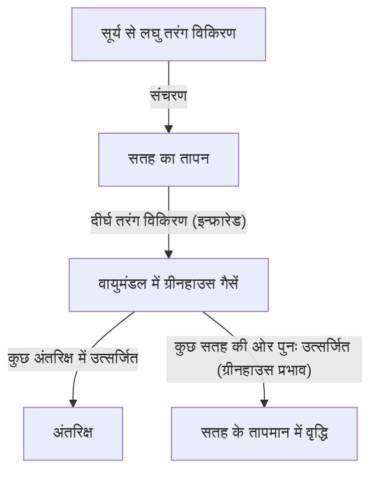

## 1. प्रस्तावना: निरंतर बदलती पृथ्वी प्रणाली

हमारी पृथ्वी एक गतिशील प्रणाली है जो अपने जन्म से लेकर आज तक लगातार बदल रही है। वायुमंडल, जलमंडल, स्थलमंडल और जीवमंडल जटिल रूप से आपस में जुड़े हुए हैं, जो ऊर्जा और पदार्थ के चक्र के माध्यम से जलवायु प्रणाली का निर्माण करते हैं। हालाँकि, मानव इतिहास के संक्षिप्त पैमाने को देखते हुए, हम अक्सर इस भ्रम में पड़ जाते हैं कि "जलवायु एक स्थिर चीज़ है।"

इस लेख में, हम भूवैज्ञानिक पैमाने से लेकर आधुनिक समय की चरम मौसम घटनाओं तक, पृथ्वी के जलवायु परिवर्तन के इतिहास में गहराई से उतरेंगे। आइए भौतिक तंत्रों, ऐतिहासिक सामाजिक प्रभावों और वर्तमान में हमारे सामने आने वाले जलवायु संकट और भविष्य के समाधानों का व्यापक अन्वेषण करें।

## 2. जलवायु परिवर्तन का भौतिक तंत्र और पृथ्वी का इतिहास

### 2.1 मिलनकोविच चक्र (Milankovitch cycles) और हिमयुग-अंतरहिमयुग

पृथ्वी के जलवायु परिवर्तन का सबसे बड़ा प्राकृतिक कारक पृथ्वी के कक्षीय तत्वों में परिवर्तन है। सर्बियाई भूभौतिकीविद् मिलुटिन मिलनकोविच (Milutin Milanković) ने प्रस्ताव दिया कि निम्नलिखित तीन कारक पृथ्वी द्वारा प्राप्त सौर विकिरण की मात्रा को प्रभावित करते हैं:

1.  **उत्केंद्रता (Eccentricity)**: पृथ्वी की कक्षा का अण्डाकार आकार (लगभग 100,000 वर्ष का चक्र)।
2.  **अक्षीय झुकाव (Obliquity)**: पृथ्वी के घूर्णन अक्ष के झुकाव में भिन्नता (लगभग 41,000 वर्ष का चक्र)।
3.  **अयनचलन (Precession)**: घूर्णन अक्ष की लड़खड़ाहट (लगभग 26,000 वर्ष का चक्र)।

इन आवधिक बदलावों के अतिव्यापन के कारण, पृथ्वी ने ठंडे "हिमयुग" और अपेक्षाकृत गर्म "अंतरहिमयुग" के बीच उतार-चढ़ाव का अनुभव किया है। वर्तमान में, हम "होलोसीन" (Holocene) नामक अंतरहिमयुग में रह रहे हैं, जो लगभग 11,700 साल पहले शुरू हुआ था।

### 2.2 ग्रीनहाउस प्रभाव की खोज और इसका तंत्र

जलवायु प्रणाली का एक और महत्वपूर्ण घटक वायुमंडल में मौजूद ग्रीनहाउस गैसें हैं। 19वीं सदी की शुरुआत में, जोसेफ फूरियर (Joseph Fourier) ने महसूस किया कि पृथ्वी का तापमान केवल सूर्य की ऊर्जा से स्पष्ट नहीं किया जा सकता, और उन्होंने निष्कर्ष निकाला कि "वायुमंडल एक कंबल के रूप में कार्य करता है।" बाद में, जॉन टिंडाल (John Tyndall) ने प्रयोगों के माध्यम से साबित किया कि जल वाष्प और कार्बन डाइऑक्साइड (CO2) इन्फ्रारेड विकिरण को अवशोषित और उत्सर्जित करते हैं। स्वांते अरहेनियस (Svante Arrhenius) ने पहली बार CO2 सांद्रता और पृथ्वी के सतह के तापमान के बीच मात्रात्मक संबंध की गणना की।

पृथ्वी के ऊर्जा संतुलन को निम्नलिखित समीकरणों द्वारा सरल रूप से व्यक्त किया जाता है:

$$ E_{in} = S_0 (1 - A) / 4 $$
$$ E_{out} = \sigma T^4 $$

यहाँ, $S_0$ सौर स्थिरांक है, $A$ ऐल्बीडो (परावर्तन) है, $\sigma$ स्टीफन-बोल्ट्जमैन स्थिरांक है, और $T$ प्रभावी विकिरण तापमान है। जैसे-जैसे ग्रीनहाउस गैसें बढ़ती हैं, जो इन्फ्रारेड विकिरण अंतरिक्ष में जाना चाहिए था ($E_{out}$), वह वायुमंडल द्वारा अवशोषित हो जाता है और वापस पृथ्वी की सतह की ओर उत्सर्जित होता है, जिससे सतह का तापमान बढ़ जाता है।

## 3. ऐतिहासिक जलवायु परिवर्तन और प्राकृतिक आपदाओं के सामाजिक प्रभाव

मानव इतिहास जलवायु परिवर्तन और प्राकृतिक आपदाओं के खतरों के अनुकूलन का भी इतिहास है।

### 3.1 ज्वालामुखी विस्फोट और "ग्रीष्म-रहित वर्ष"

बड़े पैमाने पर ज्वालामुखी विस्फोट समताप मंडल में बड़ी मात्रा में सल्फर डाइऑक्साइड (SO2) इंजेक्ट करते हैं। यह सल्फेट एरोसोल में बदल जाता है, जो सूर्य के प्रकाश को परावर्तित करता है और पृथ्वी को ठंडा करता है (ज्वालामुखीय सर्दी)।

इतिहास में सबसे प्रसिद्ध उदाहरण 1815 में इंडोनेशिया में तंबोरा ज्वालामुखी का विस्फोट है। इस विस्फोट के कारण 1816 में उत्तरी गोलार्ध में "ग्रीष्म-रहित वर्ष" (Year Without a Summer) हुआ। यूरोप और उत्तरी अमेरिका में गर्मियों में पाला पड़ा, फसलें नष्ट हो गईं और गंभीर अकाल पड़ा। यह भी कहा जाता है कि इस असामान्य मौसम ने मैरी शेली (Mary Shelley) को 'फ्रेंकस्टीन' लिखने की प्रेरणा दी थी।

### 3.2 लघु हिमयुग और सभ्यताओं का उत्थान-पतन

14वीं से 19वीं सदी तक, पृथ्वी ने "लघु हिमयुग" (Little Ice Age) नामक एक अपेक्षाकृत ठंडी अवधि का अनुभव किया। इस शीतलन के कारणों में सौर गतिविधि में कमी (जैसे मौंडर मिनिमम) और सक्रिय ज्वालामुखी गतिविधि शामिल हैं।

लघु हिमयुग का मानव समाज पर गहरा प्रभाव पड़ा। यूरोप में, फसल की विफलता के कारण लगातार अकाल पड़े, और माना जाता है कि यह ब्लैक डेथ (प्लेग) की महामारी और डायन-शिकार जैसी सामाजिक अशांति की पृष्ठभूमि में से एक था। दूसरी ओर, नीदरलैंड जैसे कुछ क्षेत्रों में, ठंड के अनुकूल नई कृषि तकनीकों और आर्थिक प्रणालियों का विकास हुआ, जिससे उनका स्वर्णिम युग आया।

## 4. औद्योगिक क्रांति और मानव-जनित जलवायु परिवर्तन की शुरुआत

18वीं सदी के उत्तरार्ध में शुरू हुई औद्योगिक क्रांति मानवता के लिए अभूतपूर्व समृद्धि लेकर आई, लेकिन साथ ही यह वैश्विक पर्यावरण पर भारी दबाव की शुरुआत भी थी। कोयले और बाद में तेल और प्राकृतिक गैस जैसे जीवाश्म ईंधन की बड़े पैमाने पर खपत, कार्बन को वायुमंडल में छोड़ रही है जो करोड़ों वर्षों में भूमिगत रूप से जमा हुआ था, वह भी केवल कुछ शताब्दियों में।

वायुमंडलीय CO2 सांद्रता औद्योगिक क्रांति से पहले लगभग 280 ppm थी, और अब 420 ppm से अधिक हो गई है, जो पिछले कई लाख वर्षों में सबसे उच्चतम स्तर है। ग्रीनहाउस गैसों में यह तीव्र वृद्धि वर्तमान "ग्लोबल वार्मिंग" का प्रत्यक्ष कारण है।

## 5. आधुनिक प्राकृतिक आपदाएँ: एक ऐसा युग जहाँ "असामान्य" हो गया है "सामान्य"

ग्लोबल वार्मिंग का मतलब सिर्फ "तापमान बढ़ना" नहीं है। जैसे-जैसे ऊर्जा पूरी जलवायु प्रणाली में जमा होती है, चरम मौसम की घटनाओं की आवृत्ति और तीव्रता बढ़ जाती है।

### 5.1 तीव्र होते टाइफून और तूफान

समुद्र की सतह के बढ़ते तापमान उष्णकटिबंधीय चक्रवातों (टाइफून, तूफान और चक्रवात) को आपूर्ति की जाने वाली ऊर्जा को बढ़ाते हैं। क्लॉसियस-क्लैपेरॉन समीकरण से पता चलता है कि तापमान में हर 1 डिग्री की वृद्धि के लिए, वायुमंडल में मौजूद जल वाष्प की मात्रा लगभग 7% बढ़ जाती है। इसके कारण वर्षा में नाटकीय वृद्धि हुई है, जिससे अभूतपूर्व बाढ़ और भूस्खलन हुआ है।

### 5.2 लू और सूखे की श्रृंखला

दूसरी ओर, वायुमंडलीय दबाव के पैटर्न में बदलाव के कारण, कुछ क्षेत्रों में अत्यधिक गर्मी और सूखा लंबे समय तक बना रहता है। मिट्टी की नमी के वाष्पीकरण में तेजी आने से भूमि सूख जाती है, जिससे बड़े पैमाने पर जंगल की आग (मेगाफायर) का खतरा काफी बढ़ जाता है। हाल के वर्षों में ऑस्ट्रेलिया, कैलिफोर्निया और साइबेरिया में लगातार लगने वाली भीषण आग जलवायु परिवर्तन से उत्पन्न प्रत्यक्ष खतरे को स्पष्ट रूप से दर्शाती है।

### 5.3 समुद्र के स्तर में वृद्धि और तटीय शहरों का संकट

तापमान बढ़ने से समुद्री जल के तापीय विस्तार और ग्रीनलैंड तथा अंटार्कटिका में बर्फ की चादरों के पिघलने के कारण, वैश्विक औसत समुद्र स्तर लगातार बढ़ रहा है। परिणामस्वरूप, न केवल मालदीव और तुवालु जैसे द्वीप राष्ट्र, बल्कि न्यूयॉर्क, टोक्यो और शंघाई जैसे दुनिया के प्रमुख तटीय शहर भी तूफान के बढ़ने और पुरानी बाढ़ के खतरे का सामना कर रहे हैं।

## 6. जलवायु संकट के उपाय और भविष्य की संभावनाएं

जलवायु परिवर्तन के विनाशकारी प्रभावों से बचने के लिए हमें तत्काल और बड़े पैमाने पर कार्रवाई करनी होगी। उपायों को मोटे तौर पर "शमन" (Mitigation) और "अनुकूलन" (Adaptation) में विभाजित किया जा सकता है।

### 6.1 शमन: एक डीकार्बोनाइज्ड समाज में संक्रमण

शीर्ष प्राथमिकता ग्रीनहाउस गैस उत्सर्जन को शुद्ध शून्य (नेट शून्य) तक कम करना है।
*   **ऊर्जा संक्रमण**: सौर, पवन और भूतापीय जैसी नवीकरणीय ऊर्जा (renewable energy) में बड़े पैमाने पर बदलाव।
*   **परिवहन और उद्योग का विद्युतीकरण**: ईवी (इलेक्ट्रिक वाहन) और हाइड्रोजन ऊर्जा का प्रसार।
*   **नवीन प्रौद्योगिकी**: कार्बन कैप्चर और स्टोरेज (CCS) और डायरेक्ट एयर कैप्चर (DAC) का अनुसंधान और विकास।

### 6.2 अनुकूलन: एक लचीले (Resilient) समाज का निर्माण

जलवायु परिवर्तन के उन प्रभावों के प्रति समाज की लचीलापन (resilience) बढ़ाना भी आवश्यक है, जो पहले से ही प्रगति पर हैं।
*   **बुनियादी ढांचे को मजबूत बनाना**: विशाल समुद्री दीवारों का निर्माण करना और बाढ़ को रोकने के लिए प्रतिधारण बेसिन विकसित करना।
*   **उन्नत आपदा रोकथाम प्रणाली**: प्रारंभिक चेतावनी प्रणालियों को लागू करना और AI का उपयोग करके उच्च-सटीक मौसम पूर्वानुमान।
*   **कृषि अनुकूलन**: गर्मी और सूखे के प्रतिरोधी फसल किस्मों का विकास, और टिकाऊ जल संसाधन प्रबंधन।

## 7. निष्कर्ष

जलवायु परिवर्तन और प्राकृतिक आपदाओं का इतिहास हमें पृथ्वी की गतिशीलता के सामने मानव शक्तिहीनता के बारे में सिखाता है, और साथ ही यह भी दिखाता है कि हमने अपने स्वयं के कार्यों के माध्यम से वैश्विक पर्यावरण को बदलने की शक्ति हासिल कर ली है।

आधुनिक जलवायु संकट इतिहास की किसी भी अन्य प्राकृतिक आपदा से भिन्न है, क्योंकि यह एक ऐसी समस्या है जिसे हमने खुद ही पैदा किया है। हालाँकि, यह एक आशा भी है कि हम समाधान खोज सकते हैं और अपने हाथों से एक स्थायी भविष्य का निर्माण कर सकते हैं। वैज्ञानिक ज्ञान, अंतर्राष्ट्रीय एकजुटता और व्यक्तिगत जागरूकता की दिशा में बदलाव अगली पीढ़ी के लिए एक समृद्ध पृथ्वी छोड़ने की कुंजी होगी।
