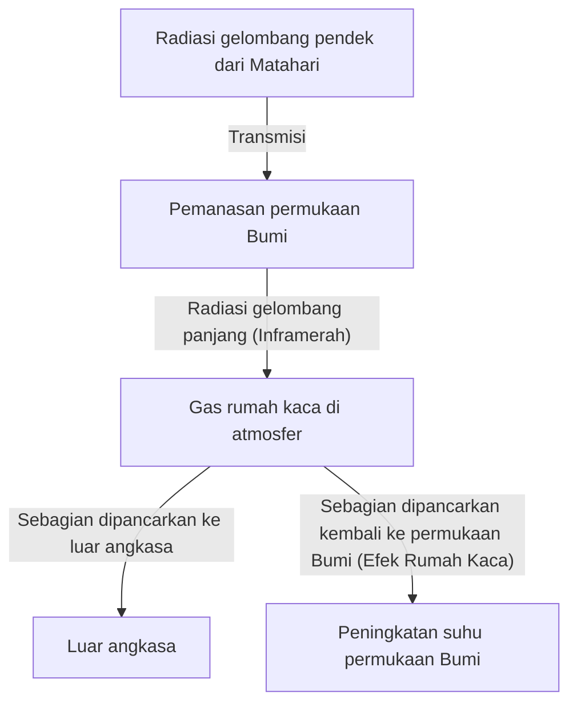

## 1. Pendahuluan: Sistem Bumi yang Terus Berubah

Bumi yang kita tinggali adalah sebuah sistem dinamis yang terus berubah sejak kelahirannya hingga saat ini. Atmosfer, hidrosfer, litosfer, dan biosfer saling terkait secara kompleks, membentuk sistem iklim melalui siklus energi dan materi. Namun, dalam skala pendek sejarah umat manusia, kita sering kali terjebak dalam ilusi bahwa "iklim adalah sesuatu yang stabil".

Artikel ini akan menggali lebih dalam sejarah perubahan iklim Bumi, mulai dari skala geologis hingga cuaca ekstrem modern. Mari kita telusuri secara komprehensif mekanisme fisik, dampak sosial historis, serta krisis iklim modern yang kita hadapi dan solusi untuk masa depan.

## 2. Mekanisme Fisik Perubahan Iklim dan Sejarah Bumi

### 2.1 Siklus Milankovitch dan Periode Glasial-Interglasial

Salah satu faktor alami terbesar dalam perubahan iklim Bumi adalah perubahan parameter orbit Bumi. Ahli geofisika Serbia, Milutin Milankovitch, mengusulkan bahwa tiga faktor berikut memengaruhi jumlah radiasi matahari (insolasi) yang diterima Bumi:

1.  **Eksentrisitas (Eccentricity)**: Tingkat kelonjongan orbit Bumi mengelilingi matahari (siklus sekitar 100.000 tahun).
2.  **Kemiringan Sumbu (Obliquity)**: Perubahan sudut kemiringan sumbu rotasi (siklus sekitar 41.000 tahun).
3.  **Presesi (Precession)**: Perubahan arah sumbu rotasi atau gerak gasing (siklus sekitar 26.000 tahun).

Tumpang tindih fluktuasi siklik ini menyebabkan Bumi berulang kali mengalami "periode glasial" yang dingin dan "periode interglasial" yang relatif hangat. Saat ini, kita hidup di periode interglasial yang disebut "Holosen (Holocene)" yang dimulai sekitar 11.700 tahun yang lalu.

### 2.2 Penemuan Efek Rumah Kaca dan Mekanismenya

Elemen penting lainnya dari sistem iklim adalah gas rumah kaca di atmosfer. Pada awal abad ke-19, Joseph Fourier menyadari bahwa suhu Bumi terlalu tinggi untuk dapat dijelaskan hanya dari energi matahari, dan menyimpulkan bahwa "atmosfer bertindak seperti selimut". Kemudian, John Tyndall melalui eksperimen membuktikan bahwa uap air dan karbon dioksida (CO2) memiliki sifat menyerap dan memancarkan inframerah, dan Svante Arrhenius menghitung untuk pertama kalinya hubungan kuantitatif antara konsentrasi CO2 dan suhu permukaan Bumi.

Keseimbangan energi Bumi secara sederhana dapat dinyatakan dengan persamaan berikut:

$$ E_{in} = S_0 (1 - A) / 4 $$
$$ E_{out} = \sigma T^4 $$

Di sini, $S_0$ adalah konstanta matahari, $A$ adalah albedo (reflektivitas), $\sigma$ adalah konstanta Stefan-Boltzmann, dan $T$ adalah suhu radiasi efektif. Ketika gas rumah kaca meningkat, radiasi inframerah ($E_{out}$) yang seharusnya terlepas dari permukaan Bumi ke luar angkasa diserap oleh atmosfer dan dipancarkan kembali ke permukaan, sehingga menyebabkan kenaikan suhu permukaan Bumi.

## 3. Dampak Perubahan Iklim Historis dan Bencana Alam pada Masyarakat

Sejarah umat manusia juga merupakan sejarah adaptasi terhadap fluktuasi iklim dan ancaman bencana alam.

### 3.1 Letusan Gunung Berapi dan 'Tahun Tanpa Musim Panas'

Letusan gunung berapi skala besar menyuntikkan sejumlah besar sulfur dioksida (SO2) ke stratosfer. Gas ini berubah menjadi aerosol sulfat, yang memantulkan sinar matahari dan mendinginkan Bumi (musim dingin vulkanik).

Contoh paling terkenal dalam sejarah adalah letusan Gunung Tambora di Indonesia pada tahun 1815. Letusan ini menyebabkan belahan bumi utara mengalami "Tahun Tanpa Musim Panas (Year Without a Summer)" pada tahun berikutnya, 1816. Di Eropa dan Amerika Utara, embun beku terjadi di musim panas, tanaman hancur lebur, dan kelaparan parah melanda. Cuaca ekstrem ini juga dikatakan telah memberi inspirasi bagi Mary Shelley untuk menulis novel 'Frankenstein'.

### 3.2 Zaman Es Kecil dan Jatuh Bangunnya Peradaban

Dari abad ke-14 hingga ke-19, Bumi mengalami periode yang relatif dingin yang dikenal sebagai "Zaman Es Kecil (Little Ice Age)". Penurunan aktivitas matahari (seperti Minimum Maunder) dan aktivitas vulkanik yang intens diduga menjadi penyebab pendinginan pada periode ini.

Zaman Es Kecil berdampak besar pada masyarakat manusia. Di Eropa, kegagalan panen memicu kelaparan yang sering terjadi, dan diyakini menjadi salah satu latar belakang keresahan sosial seperti wabah Maut Hitam (Pes) dan perburuan penyihir. Di sisi lain, di beberapa wilayah seperti Belanda, teknik pertanian dan sistem ekonomi baru yang beradaptasi dengan pendinginan berkembang pesat, yang kemudian membuka jalan menuju Zaman Keemasan.

## 4. Revolusi Industri dan Awal Perubahan Iklim Antropogenik

Revolusi Industri, yang dimulai pada akhir abad ke-18, membawa kemakmuran yang belum pernah terjadi sebelumnya bagi umat manusia, tetapi pada saat yang sama, ini juga merupakan awal dari beban besar terhadap lingkungan global. Konsumsi massal bahan bakar fosil seperti batu bara, dan kemudian minyak serta gas alam, merupakan tindakan melepaskan karbon yang terakumulasi selama puluhan juta tahun di bawah tanah ke atmosfer hanya dalam waktu beberapa ratus tahun.

Konsentrasi CO2 di atmosfer telah melonjak dari sekitar 280 ppm sebelum Revolusi Industri menjadi lebih dari 420 ppm saat ini, mencapai tingkat tertinggi dalam jutaan tahun terakhir. Peningkatan gas rumah kaca yang cepat inilah yang menjadi penyebab langsung "pemanasan global" saat ini.

## 5. Bencana Alam Modern: Era di mana 'Abnormal' Menjadi 'Normal'

Pemanasan global tidak sekadar "suhu yang meningkat". Akumulasi energi dalam keseluruhan sistem iklim meningkatkan frekuensi dan intensitas peristiwa cuaca ekstrem.

### 5.1 Topan dan Badai yang Semakin Parah

Naiknya suhu air laut meningkatkan energi yang disuplai ke siklon tropis (topan, badai, siklon). Seperti yang ditunjukkan oleh persamaan Clausius-Clapeyron, ketika suhu naik 1 derajat, jumlah uap air yang dapat ditahan oleh atmosfer meningkat sekitar 7%. Hal ini menyebabkan peningkatan curah hujan secara drastis, memicu banjir dan tanah longsor dalam skala yang belum pernah terjadi sebelumnya.

### 5.2 Rantai Gelombang Panas dan Kekeringan

Di sisi lain, perubahan distribusi tekanan udara menyebabkan gelombang panas ekstrem dan kekeringan yang berkepanjangan di wilayah tertentu. Penguapan kelembapan tanah yang cepat membuat daratan menjadi kering, meningkatkan risiko kebakaran hutan berskala besar (megafire). Kebakaran besar yang sering terjadi di Australia, California, dan Siberia dalam beberapa tahun terakhir jelas menunjukkan ancaman langsung yang ditimbulkan oleh perubahan iklim.

### 5.3 Kenaikan Permukaan Laut dan Krisis Kota Pesisir

Akibat ekspansi termal air laut karena kenaikan suhu dan mencairnya lapisan es di Greenland dan Antartika, permukaan laut rata-rata global terus meningkat. Hal ini membahayakan tidak hanya negara kepulauan seperti Maladewa dan Tuvalu, tetapi juga kota-kota pesisir utama dunia seperti New York, Tokyo, dan Shanghai, yang terpapar risiko gelombang badai dan banjir kronis.

## 6. Penanggulangan Krisis Iklim dan Prospek Masa Depan

Kita harus segera mengambil tindakan besar-besaran untuk menghindari dampak bencana yang ditimbulkan oleh perubahan iklim. Penanggulangan ini secara umum dibagi menjadi "Langkah Mitigasi (Mitigation)" dan "Langkah Adaptasi (Adaptation)".

### 6.1 Langkah Mitigasi: Transisi Menuju Masyarakat Dekarbonisasi

Tantangan prioritas utama adalah menekan emisi gas rumah kaca menjadi nol bersih (net zero).
*   **Transisi Energi**: Peralihan besar-besaran ke energi terbarukan seperti tenaga surya, angin, dan panas bumi.
*   **Elektrifikasi Transportasi dan Industri**: Adopsi luas kendaraan listrik (EV) dan pemanfaatan energi hidrogen.
*   **Teknologi Inovatif**: Penelitian dan pengembangan teknologi penangkapan dan penyimpanan karbon (CCS) serta penangkapan udara langsung (DAC).

### 6.2 Langkah Adaptasi: Membangun Masyarakat yang Tangguh

Sangat penting juga untuk meningkatkan ketangguhan (resiliensi) masyarakat terhadap dampak perubahan iklim yang sudah berlangsung.
*   **Penguatan Infrastruktur**: Pembangunan tanggul laut raksasa dan penataan daerah tangkapan air untuk mencegah banjir.
*   **Peningkatan Sistem Pencegahan Bencana**: Penerapan sistem peringatan dini dan prakiraan cuaca presisi tinggi menggunakan AI.
*   **Adaptasi Pertanian**: Pengembangan varietas yang tahan terhadap suhu tinggi dan kekeringan, serta pengelolaan sumber daya air yang berkelanjutan.

## 7. Kesimpulan

Sejarah perubahan iklim dan bencana alam mengajarkan kita tentang ketidakberdayaan manusia dalam menghadapi dinamika Bumi, tetapi pada saat yang sama juga menunjukkan bahwa kita telah memiliki kekuatan untuk mengubah lingkungan global melalui tindakan kita sendiri.

Krisis iklim modern, tidak seperti bencana alam mana pun dalam sejarah, adalah masalah yang kita picu sendiri. Namun, itu juga menjadi harapan bahwa kita dapat menemukan solusi dengan tangan kita sendiri dan membangun masa depan yang berkelanjutan. Pengetahuan ilmiah, solidaritas internasional, dan reformasi kesadaran setiap individu akan menjadi kunci untuk mewariskan Bumi yang kaya kepada generasi berikutnya.
