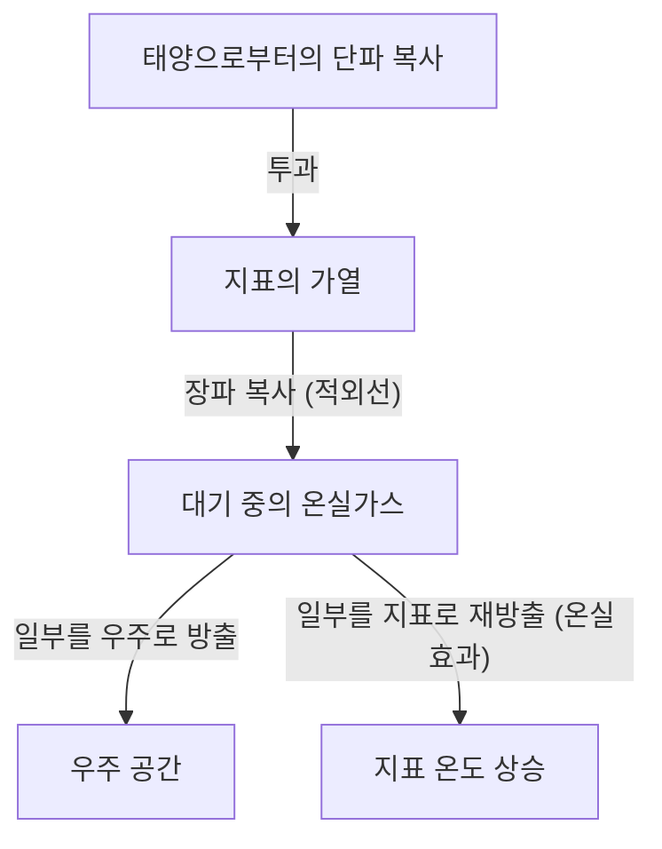

## 1. 서론: 끊임없이 변화하는 지구 시스템

우리가 사는 지구는 탄생부터 현재에 이르기까지 끊임없이 변화를 계속하고 있는 역동적인 시스템입니다. 대기권, 수권, 암석권, 그리고 생물권은 복잡하게 얽혀 있으며, 에너지와 물질의 순환을 통해 기후 시스템을 형성하고 있습니다. 그러나 인류의 역사라는 짧은 시간의 척도에서 보면, 우리는 종종 '기후는 안정적인 것'이라는 착각에 빠지기 쉽습니다.

본 기사에서는 지구의 기후 변화 역사를 지질학적 규모부터 현대의 이상 기후까지 깊이 있게 파헤쳐 봅니다. 물리학적 메커니즘, 역사적인 사회적 영향, 그리고 우리가 직면하고 있는 현대의 기후 위기와 미래를 향한 해결책에 대해 포괄적으로 탐구해 보겠습니다.

## 2. 기후 변화의 물리적 메커니즘과 지구의 역사

### 2.1 밀란코비치 주기와 빙하기·간빙기

지구의 기후 변화에 있어서 가장 큰 자연적 요인 중 하나는 지구 궤도 요소의 변화입니다. 세르비아의 지구물리학자 밀루틴 밀란코비치는 다음 세 가지 요소가 지구가 받는 태양 복사량(일사량)에 영향을 미친다고 제안했습니다.

1.  **이심률 (Eccentricity)**: 지구 공전 궤도의 타원 정도 (약 10만 년 주기).
2.  **자전축의 기울기 (Obliquity)**: 자전축 경사각의 변동 (약 4.1만 년 주기).
3.  **세차 운동 (Precession)**: 자전축의 회전 운동 (약 2.6만 년 주기).

이러한 주기적인 변동이 겹치면서 지구는 한랭한 '빙하기'와 비교적 온난한 '간빙기'를 반복해 왔습니다. 현재 우리는 약 1만 1700년 전에 시작된 '홀로세(Holocene)'라는 간빙기에 살고 있습니다.

### 2.2 온실 효과의 발견과 그 메커니즘

기후 시스템의 또 다른 중요한 요소는 대기 중의 온실가스입니다. 19세기 초, 조제프 푸리에는 지구의 온도가 태양으로부터 오는 에너지만으로는 설명할 수 없을 정도로 높다는 것을 깨닫고 "대기가 담요와 같은 역할을 하고 있다"고 추론했습니다. 그 후 존 틴달이 수증기와 이산화탄소(CO2)가 적외선을 흡수 및 방출하는 성질을 가지고 있다는 것을 실험으로 증명했고, 스반테 아레니우스가 CO2 농도와 지구 표면 온도의 정량적인 관계를 처음으로 계산했습니다.

지구의 에너지 균형은 다음 공식으로 단순화하여 표현됩니다.

$$ E_{in} = S_0 (1 - A) / 4 $$
$$ E_{out} = \sigma T^4 $$

여기서 $S_0$는 태양 상수, $A$는 알베도(반사율), $\sigma$는 슈테판-볼츠만 상수, $T$는 유효 복사 온도입니다. 온실가스가 증가하면 지표에서 우주 공간으로 빠져나가야 할 적외선 복사($E_{out}$)가 대기에 흡수되어 다시 지표를 향해 방출되기 때문에 지표 온도가 상승하는 것입니다.

## 3. 역사 속의 기후 변화와 자연재해가 사회에 미친 영향

인류의 역사는 기후 변화와 자연재해의 위협에 대한 적응의 역사이기도 합니다.

### 3.1 화산 폭발과 '여름 없는 해'

대규모 화산 폭발은 다량의 이산화황(SO2)을 성층권으로 뿜어냅니다. 이것이 황산 에어로졸로 변해 태양빛을 반사하여 지구를 한랭화시킵니다(화산 겨울).

역사상 가장 유명한 예가 1815년 인도네시아 탐보라 화산의 폭발입니다. 이 폭발은 이듬해인 1816년에 북반구에 '여름 없는 해(Year Without a Summer)'를 가져왔습니다. 유럽과 북미에서는 여름에 서리가 내려 농작물이 파멸적인 피해를 입었고, 심각한 기근이 발생했습니다. 이 이상 기후는 메리 셸리에게 『프랑켄슈타인』을 집필하게 한 영감을 주었다고도 알려져 있습니다.

### 3.2 소빙하기와 문명의 흥망성쇠

14세기부터 19세기에 걸쳐 지구는 '소빙하기(Little Ice Age)'라고 불리는 비교적 한랭한 시기를 겪었습니다. 이 시기의 한랭화 원인으로는 태양 활동의 저하(마운더 극소기 등)나 활발한 화산 활동이 지적되고 있습니다.

소빙하기는 인류 사회에 지대한 영향을 미쳤습니다. 유럽에서는 흉작으로 인한 기근이 빈발했고, 흑사병(페스트)의 유행이나 마녀사냥과 같은 사회적 불안의 배경 중 하나가 되었다고 여겨집니다. 한편, 네덜란드 등 일부 지역에서는 한랭화에 적응한 새로운 농업 기술이나 경제 시스템이 발달하여 이후의 황금시대로 이어졌습니다.

## 4. 산업혁명과 인위적 기후 변화의 서막

18세기 후반에 시작된 산업혁명은 인류에게 전례 없는 번영을 가져다주었지만, 동시에 지구 환경에 대한 거대한 부하의 시작이기도 했습니다. 석탄, 그리고 이후의 석유나 천연가스와 같은 화석 연료의 대량 소비는 수천만 년에 걸쳐 지하에 축적된 탄소를 불과 수백 년 만에 대기 중으로 방출하는 행위입니다.

대기 중의 CO2 농도는 산업혁명 이전의 약 280 ppm에서 현재는 420 ppm을 넘어 과거 수백만 년 동안 가장 높은 수준에 도달했습니다. 이 급격한 온실가스의 증가가 현재의 '지구 온난화'의 직접적인 원인입니다.

## 5. 현대의 자연재해: '이상'이 '일상'이 되는 시대

지구 온난화는 단순히 '기온이 올라가는' 것에 그치지 않습니다. 기후 시스템 전체에 에너지가 축적됨으로써 극한 기상 현상(이상 기후)의 빈도와 강도가 증가하고 있습니다.

### 5.1 격심해지는 태풍과 허리케인

해수면 온도의 상승은 열대 저기압(태풍, 허리케인, 사이클론)에 공급되는 에너지를 증대시킵니다. 클라우지우스-클라페이롱 방정식이 보여주듯, 기온이 1도 상승하면 대기가 머금을 수 있는 수증기량은 약 7% 증가합니다. 이로 인해 강수량이 극적으로 증가하고, 유례없는 규모의 홍수나 토사 재해가 발생하고 있습니다.

### 5.2 폭염과 가뭄의 연쇄

한편, 기압 배치의 변화로 인해 특정 지역에서는 극단적인 폭염과 가뭄이 장기화되고 있습니다. 토양 수분의 증발이 촉진되면서 대지는 건조해지고, 대규모 산불(메가파이어)의 위험이 급증합니다. 호주나 캘리포니아, 시베리아 등에서 최근 빈발하고 있는 대규모 산불은 기후 변화가 가져오는 직접적인 위협을 여실히 보여줍니다.

### 5.3 해수면 상승과 연안 도시의 위기

기온 상승으로 인한 바닷물의 열팽창과 그린란드 및 남극 빙상의 융해로 인해 세계의 평균 해수면 수위는 계속해서 상승하고 있습니다. 이로 인해 몰디브나 투발루 등의 섬나라뿐만 아니라 뉴욕, 도쿄, 상하이 등 세계의 주요 연안 도시들도 폭풍해일이나 만성적인 침수 위험에 노출되어 있습니다.

## 6. 기후 위기에 대한 대책과 미래를 향한 전망

우리는 기후 변화가 가져올 파국적인 영향을 피하기 위해 즉각적이고 대규모적인 행동을 취해야 합니다. 대책은 크게 '완화책(Mitigation)'과 '적응책(Adaptation)'으로 나뉩니다.

### 6.1 완화책: 탈탄소 사회로의 전환

최우선 과제는 온실가스 배출을 실질적으로 제로(넷제로)로 만드는 것입니다.
*   **에너지 전환**: 태양광, 풍력, 지열 등 재생에너지로의 대규모 전환.
*   **교통 및 산업의 전동화**: 전기자동차(EV)의 보급 및 수소 에너지의 활용.
*   **혁신적인 기술**: 탄소 포집 및 저장 기술(CCS)이나 직접 공기 포집(DAC)의 연구 개발.

### 6.2 적응책: 회복탄력성 있는 사회의 구축

이미 진행되고 있는 기후 변화의 영향에 대비해 사회의 회복탄력성(레질리언스)을 높이는 것도 필수적입니다.
*   **인프라 강화**: 거대한 방조제 건설이나 유수지 정비를 통한 홍수 대책.
*   **방재 시스템의 고도화**: 조기 경보 시스템 도입과 AI를 활용한 고정밀 기상 예측.
*   **농업의 적응**: 고온이나 건조에 강한 품종의 개발과 지속 가능한 수자원 관리.

## 7. 맺음말

기후 변화와 자연재해의 역사는 지구의 역동성에 대한 인간의 무력함을 가르쳐주는 동시에, 우리가 스스로의 행동을 통해 지구 환경을 변화시킬 수 있는 힘을 가지게 되었음을 보여줍니다.

현대의 기후 위기는 역사상의 어떠한 자연재해와도 다르며, 우리 자신이 방아쇠를 당긴 문제입니다. 그러나 그것은 동시에 우리 스스로의 손으로 해결책을 찾고 지속 가능한 미래를 구축할 수 있다는 희망이기도 합니다. 과학적 지식과 국제적인 연대, 그리고 개개인의 의식 변화가 다음 세대에 풍요로운 지구를 물려주기 위한 열쇠가 될 것입니다.
