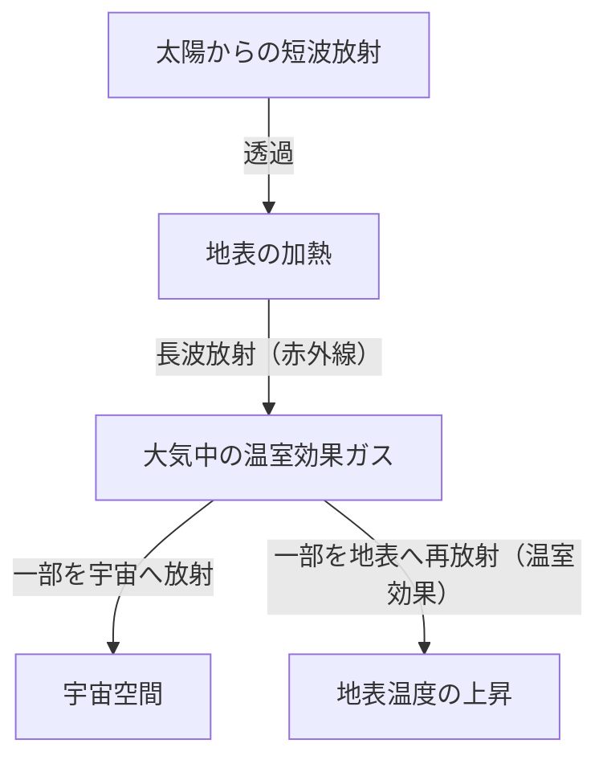

## 1. はじめに：絶え間なく変化する地球システム

私たちの住む地球は、誕生から現在に至るまで常に変動を続けているダイナミックなシステムです。大気圏、水圏、岩石圏、そして生物圏は複雑に絡み合い、エネルギーと物質の循環を通じて気候システムを形成しています。しかし、人類の歴史という短いスケールで見ると、私たちは「気候は安定しているもの」という錯覚に陥りがちです。

本記事では、地球の気候変動の歴史を地質学的スケールから現代の異常気象に至るまで深く掘り下げます。物理学的なメカニズム、歴史的な社会的影響、そして私たちが直面している現代の気候危機と未来に向けた解決策について、包括的に探求していきましょう。

## 2. 気候変動の物理的メカニズムと地球の歴史

### 2.1 ミランコビッチ・サイクルと氷期・間氷期

地球の気候変動における最大の自然要因の一つが、地球の軌道要素の変化です。セルビアの地球物理学者ミルティン・ミランコビッチは、以下の3つの要素が地球が受け取る太陽放射量（インソレーション）に影響を与えると提唱しました。

1.  **離心率（Eccentricity）**: 地球の公転軌道の楕円の度合い（約10万年周期）。
2.  **地軸の傾き（Obliquity）**: 自転軸の傾斜角の変動（約4.1万年周期）。
3.  **歳差運動（Precession）**: 自転軸の首振り運動（約2.6万年周期）。

これらの周期的な変動が重なり合うことで、地球は寒冷な「氷期」と比較的温暖な「間氷期」を繰り返してきました。現在、私たちは約1万1700年前に始まった「完新世（Holocene）」という間氷期に生きています。

### 2.2 温室効果の発見とそのメカニズム

気候システムのもう一つの重要な要素が、大気中の温室効果ガスです。19世紀初頭、ジョゼフ・フーリエは地球の温度が太陽からのエネルギーだけでは説明できないほど高いことに気づき、「大気が毛布のような役割を果たしている」と推論しました。その後、ジョン・ティンダルが水蒸気や二酸化炭素（CO2）が赤外線を吸収・放射する性質を持つことを実験で証明し、スヴァンテ・アレニウスがCO2濃度と地球の表面温度の定量的な関係を初めて計算しました。

地球のエネルギーバランスは以下の式で簡略化して表されます。

$$ E_{in} = S_0 (1 - A) / 4 $$
$$ E_{out} = \sigma T^4 $$

ここで、$S_0$ は太陽定数、$A$ はアルベド（反射率）、$\sigma$ はシュテファン＝ボルツマン定数、$T$ は有効放射温度です。温室効果ガスが増加すると、地表から宇宙空間へ逃げるはずの赤外線放射（$E_{out}$）が大気に吸収され、再び地表に向けて放射されるため、地表温度が上昇するのです。

## 3. 歴史上の気候変動と自然災害が社会に与えた影響

人類の歴史は、気候の変動と自然災害の脅威に対する適応の歴史でもあります。

### 3.1 火山噴火と「夏のない年」

大規模な火山噴火は、大量の二酸化硫黄（SO2）を成層圏に注入します。これが硫酸エアロゾルに変化し、太陽光を反射して地球を寒冷化させます（火山の冬）。

歴史上最も有名な例が、1815年のインドネシア・タンボラ火山の噴火です。この噴火は翌1816年に北半球に「夏のない年（Year Without a Summer）」をもたらしました。ヨーロッパや北米では夏に霜が降り、作物が壊滅的な被害を受け、深刻な飢饉が発生しました。この異常気象は、メアリー・シェリーに『フランケンシュタイン』を執筆させるインスピレーションを与えたとも言われています。

### 3.2 小氷期と文明の盛衰

14世紀から19世紀にかけて、地球は「小氷期（Little Ice Age）」と呼ばれる比較的寒冷な時期を経験しました。この時期の寒冷化の原因には、太陽活動の低下（マウンダー極小期など）や活発な火山活動が指摘されています。

小氷期は人類社会に多大な影響を与えました。ヨーロッパでは凶作による飢饉が頻発し、黒死病（ペスト）の流行や魔女狩りといった社会不安の背景の一つになったと考えられています。一方で、オランダなどの一部の地域では、寒冷化に適応した新しい農業技術や経済システムが発達し、後の黄金時代へと繋がりました。

## 4. 産業革命と人為的気候変動の幕開け

18世紀後半に始まった産業革命は、人類に未曾有の繁栄をもたらしましたが、同時に地球環境に対する巨大な負荷の始まりでもありました。石炭、そして後に石油や天然ガスといった化石燃料の大量消費は、地下に数千万年かけて蓄積された炭素を、わずか数百年で大気中に放出する行為です。

大気中のCO2濃度は、産業革命前の約280 ppmから、現在では420 ppmを超え、過去数百万年間で最も高い水準に達しています。この急激な温室効果ガスの増加が、現在の「地球温暖化」の直接的な原因です。

## 5. 現代の自然災害：「異常」が「日常」になる時代

地球温暖化は単に「気温が上がる」だけにとどまりません。気候システム全体にエネルギーが蓄積されることで、極端な気象現象（異常気象）の頻度と強度が増加しています。

### 5.1 激甚化する台風とハリケーン

海水温の上昇は、熱帯低気圧（台風、ハリケーン、サイクロン）に供給されるエネルギーを増大させます。クラウジウス＝クラペイロンの式が示すように、気温が1度上昇すると大気が含むことのできる水蒸気量は約7%増加します。これにより、降水量が劇的に増加し、かつてない規模の洪水や土砂災害が引き起こされています。

### 5.2 熱波と干ばつの連鎖

一方で、気圧配置の変化により、特定の地域では極端な熱波と干ばつが長期化しています。土壌水分の蒸発が促進されることで大地は乾燥し、大規模な森林火災（メガファイア）のリスクが跳ね上がります。オーストラリアやカリフォルニア、シベリアなどで近年頻発している大規模火災は、気候変動がもたらす直接的な脅威を如実に示しています。

### 5.3 海面上昇と沿岸都市の危機

気温上昇による海水の熱膨張と、グリーンランドや南極の氷床の融解により、世界の平均海面水位は上昇を続けています。これにより、モルディブやツバルなどの島嶼国だけでなく、ニューヨーク、東京、上海といった世界の主要な沿岸都市も、高潮や慢性的な浸水のリスクに晒されています。

## 6. 気候危機への対策と未来への展望

私たちは、気候変動がもたらす破局的な影響を回避するために、即座かつ大規模な行動を起こさなければなりません。対策は大きく「緩和策（Mitigation）」と「適応策（Adaptation）」に分けられます。

### 6.1 緩和策：脱炭素社会への移行

最優先の課題は、温室効果ガスの排出を実質ゼロ（ネットゼロ）にすることです。
*   **エネルギー転換**: 太陽光、風力、地熱などの再生可能エネルギーへの大規模な移行。
*   **交通・産業の電化**: EV（電気自動車）の普及や、水素エネルギーの活用。
*   **革新的技術**: 二酸化炭素回収・貯留技術（CCS）や、直接空気回収（DAC）の研究開発。

### 6.2 適応策：レジリエントな社会の構築

すでに進行している気候変動の影響に対して、社会の回復力（レジリエンス）を高めることも不可欠です。
*   **インフラの強化**: 巨大な防潮堤の建設や、遊水池の整備による洪水対策。
*   **防災システムの高度化**: 早期警戒システムの導入と、AIを活用した高精度な気象予測。
*   **農業の適応**: 高温や乾燥に強い品種の開発と、持続可能な水資源管理。

## 7. おわりに

気候変動と自然災害の歴史は、地球のダイナミズムに対する人間の無力さを教えてくれると同時に、私たちが自らの行動によって地球環境を改変しうる力を持ってしまったことを示しています。

現代の気候危機は、歴史上のいかなる自然災害とも異なり、私たち自身が引き金となった問題です。しかし、それは同時に、私たち自身の手で解決策を見出し、持続可能な未来を築くことができるという希望でもあります。科学の知識と国際的な連帯、そして一人ひとりの意識改革が、次世代に豊かな地球を引き継ぐための鍵となるでしょう。
