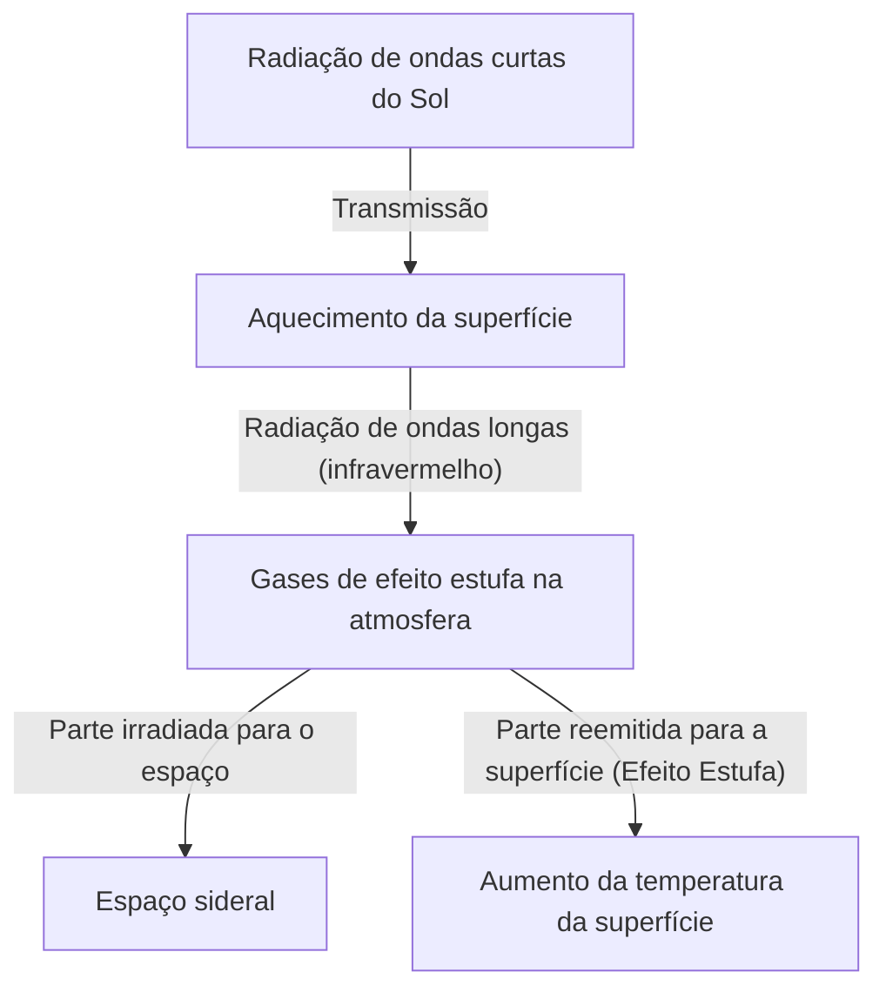

## 1. Introdução: Um Sistema Terrestre em Constante Mudança

A Terra em que vivemos é um sistema dinâmico que está em constante mudança desde o seu nascimento até os dias atuais. A atmosfera, a hidrosfera, a litosfera e a biosfera estão intricadamente interligadas, formando um sistema climático por meio da circulação de energia e matéria. No entanto, na curta escala da história humana, tendemos a cair na ilusão de que "o clima é algo estável".

Neste artigo, vamos explorar profundamente a história das mudanças climáticas na Terra, desde uma escala geológica até os extremos climáticos modernos. Vamos investigar de forma abrangente os mecanismos físicos, os impactos sociais históricos, bem como a atual crise climática que enfrentamos e as soluções para o futuro.

## 2. O Mecanismo Físico das Mudanças Climáticas e a História da Terra

### 2.1 Os Ciclos de Milankovitch e os Períodos Glaciais e Interglaciais

Um dos maiores fatores naturais das mudanças climáticas globais é a variação dos elementos orbitais da Terra. O geofísico sérvio Milutin Milankovitch propôs que os três elementos a seguir afetam a quantidade de radiação solar (insolação) que a Terra recebe:

1.  **Excentricidade (Eccentricity)**: O grau da elipse da órbita da Terra (ciclo de cerca de 100.000 anos).
2.  **Obliquidade (Obliquity)**: A variação do ângulo de inclinação do eixo de rotação (ciclo de cerca de 41.000 anos).
3.  **Precessão (Precession)**: O movimento oscilatório do eixo de rotação (ciclo de cerca de 26.000 anos).

A sobreposição dessas variações periódicas fez com que a Terra passasse por ciclos alternados de períodos "glaciais" frios e períodos "interglaciais" relativamente quentes. Atualmente, vivemos em um período interglacial chamado "Holoceno" (Holocene), que começou há cerca de 11.700 anos.

### 2.2 A Descoberta do Efeito Estufa e seu Mecanismo

Outro elemento crucial do sistema climático são os gases de efeito estufa na atmosfera. No início do século XIX, Joseph Fourier percebeu que a temperatura da Terra era alta demais para ser explicada apenas pela energia do Sol e deduziu que "a atmosfera atua como um cobertor". Mais tarde, John Tyndall provou experimentalmente que o vapor d'água e o dióxido de carbono (CO2) têm a propriedade de absorver e irradiar radiação infravermelha. Posteriormente, Svante Arrhenius calculou pela primeira vez a relação quantitativa entre a concentração de CO2 e a temperatura da superfície da Terra.

O balanço de energia da Terra pode ser expresso de forma simplificada pelas seguintes equações:

$$ E_{in} = S_0 (1 - A) / 4 $$
$$ E_{out} = \sigma T^4 $$

Onde $S_0$ é a constante solar, $A$ é o albedo (refletividade), $\sigma$ é a constante de Stefan-Boltzmann e $T$ é a temperatura de radiação efetiva. Quando os gases de efeito estufa aumentam, a radiação infravermelha ($E_{out}$) que deveria escapar da superfície da Terra para o espaço é absorvida pela atmosfera e reemitida de volta para a superfície, causando o aumento da temperatura da superfície.

## 3. O Impacto das Mudanças Climáticas e Desastres Naturais na Sociedade ao Longo da História

A história da humanidade é também a história da adaptação às mudanças climáticas e à ameaça dos desastres naturais.

### 3.1 Erupções Vulcânicas e o "Ano sem Verão"

Grandes erupções vulcânicas injetam imensas quantidades de dióxido de enxofre (SO2) na estratosfera. Isso se converte em aerossóis de sulfato, que refletem a luz solar e resfriam o planeta (inverno vulcânico).

O exemplo mais famoso da história é a erupção do Monte Tambora, na Indonésia, em 1815. Essa erupção trouxe o "Ano sem Verão" (Year Without a Summer) para o Hemisfério Norte no ano seguinte, em 1816. Na Europa e na América do Norte, houve geadas durante o verão, as colheitas foram devastadas e ocorreu uma grave fome. Diz-se também que esse clima anômalo foi a inspiração que levou Mary Shelley a escrever "Frankenstein".

### 3.2 A Pequena Idade do Gelo e a Ascensão e Queda de Civilizações

Do século XIV ao século XIX, a Terra passou por um período relativamente frio conhecido como a "Pequena Idade do Gelo" (Little Ice Age). As causas desse resfriamento apontadas incluem o declínio da atividade solar (como o Mínimo de Maunder) e a intensa atividade vulcânica.

A Pequena Idade do Gelo teve um impacto profundo na sociedade humana. Na Europa, a fome devido à quebra de safras tornou-se frequente, e acredita-se que tenha sido um dos fatores subjacentes à instabilidade social, como a epidemia da Peste Negra e a caça às bruxas. Por outro lado, em algumas regiões, como na Holanda, desenvolveram-se novas tecnologias agrícolas e sistemas econômicos adaptados ao frio, o que levou à subsequente Era de Ouro.

## 4. A Revolução Industrial e o Início das Mudanças Climáticas Antropogênicas

A Revolução Industrial, que começou no final do século XVIII, trouxe uma prosperidade sem precedentes para a humanidade, mas ao mesmo tempo marcou o início de um imenso fardo sobre o meio ambiente global. O consumo maciço de carvão e, posteriormente, de combustíveis fósseis, como petróleo e gás natural, é o ato de liberar na atmosfera, em apenas algumas centenas de anos, o carbono acumulado no subsolo ao longo de dezenas de milhões de anos.

A concentração de CO2 na atmosfera subiu de cerca de 280 ppm antes da Revolução Industrial para mais de 420 ppm atualmente, atingindo o nível mais alto dos últimos milhões de anos. Esse rápido aumento de gases de efeito estufa é a causa direta do atual "aquecimento global".

## 5. Desastres Naturais Modernos: A Era em que o "Anormal" se Torna "Normal"

O aquecimento global não se resume apenas a "aumentos de temperatura". Com a acumulação de energia em todo o sistema climático, a frequência e a intensidade de eventos meteorológicos extremos estão aumentando.

### 5.1 O Agravamento de Tufões e Furacões

O aumento da temperatura da água do mar aumenta a energia fornecida aos ciclones tropicais (tufões, furacões e ciclones). Como demonstra a equação de Clausius-Clapeyron, um aumento de 1 grau na temperatura aumenta a quantidade de vapor d'água que a atmosfera pode reter em cerca de 7%. Isso levou a um aumento dramático nas precipitações, causando inundações e deslizamentos de terra em escalas sem precedentes.

### 5.2 A Cadeia de Ondas de Calor e Secas

Por outro lado, as mudanças nos padrões de pressão atmosférica causaram ondas de calor extremas e secas prolongadas em regiões específicas. À medida que a evaporação da umidade do solo acelera, a terra seca, aumentando drasticamente o risco de incêndios florestais em larga escala (megaincêndios). Os grandes incêndios que têm ocorrido frequentemente nos últimos anos na Austrália, na Califórnia e na Sibéria ilustram nitidamente a ameaça direta das mudanças climáticas.

### 5.3 O Aumento do Nível do Mar e a Crise das Cidades Costeiras

Devido à expansão térmica da água do mar causada pelo aumento das temperaturas e ao derretimento dos mantos de gelo na Groenlândia e na Antártida, o nível médio do mar em todo o mundo continua a subir. Como resultado, não apenas países insulares como Maldivas e Tuvalu, mas também as principais cidades costeiras globais, como Nova York, Tóquio e Xangai, estão expostas aos riscos de tempestades e inundações crônicas.

## 6. Soluções para a Crise Climática e Perspectivas para o Futuro

Devemos tomar medidas imediatas e em grande escala para evitar as consequências catastróficas das mudanças climáticas. As medidas podem ser amplamente divididas em "Mitigação" (Mitigation) e "Adaptação" (Adaptation).

### 6.1 Mitigação: A Transição para uma Sociedade Descarbonizada

A prioridade máxima é reduzir a zero as emissões líquidas de gases de efeito estufa (net zero).
*   **Transição Energética**: Mudança em grande escala para energias renováveis, como energia solar, eólica e geotérmica.
*   **Eletrificação do Transporte e da Indústria**: Disseminação de VE (veículos elétricos) e utilização da energia do hidrogênio.
*   **Tecnologia Inovadora**: Pesquisa e desenvolvimento em tecnologias de Captura e Armazenamento de Carbono (CCS) e Captura Direta de Ar (DAC).

### 6.2 Adaptação: Construção de uma Sociedade Resiliente

Também é essencial aumentar a resiliência (capacidade de recuperação) da sociedade em relação aos impactos das mudanças climáticas que já estão em andamento.
*   **Fortalecimento da Infraestrutura**: Construção de grandes diques e desenvolvimento de bacias de retenção para proteção contra inundações.
*   **Avanço dos Sistemas de Prevenção de Desastres**: Introdução de sistemas de alerta precoce e previsões meteorológicas de alta precisão baseadas em IA.
*   **Adaptação Agrícola**: Desenvolvimento de cultivares resistentes ao calor e à seca, e o gerenciamento sustentável dos recursos hídricos.

## 7. Conclusão

A história das mudanças climáticas e dos desastres naturais nos ensina sobre a impotência humana diante do dinamismo da Terra e, ao mesmo tempo, mostra que adquirimos o poder de alterar o meio ambiente global por meio de nossas próprias ações.

A crise climática atual é diferente de qualquer desastre natural na história, pois é um problema desencadeado por nós mesmos. No entanto, é também uma esperança de que, com as nossas próprias mãos, possamos encontrar soluções e construir um futuro sustentável. O conhecimento científico, a solidariedade internacional e uma mudança na consciência de cada indivíduo serão as chaves para legar uma Terra abundante para a próxima geração.
