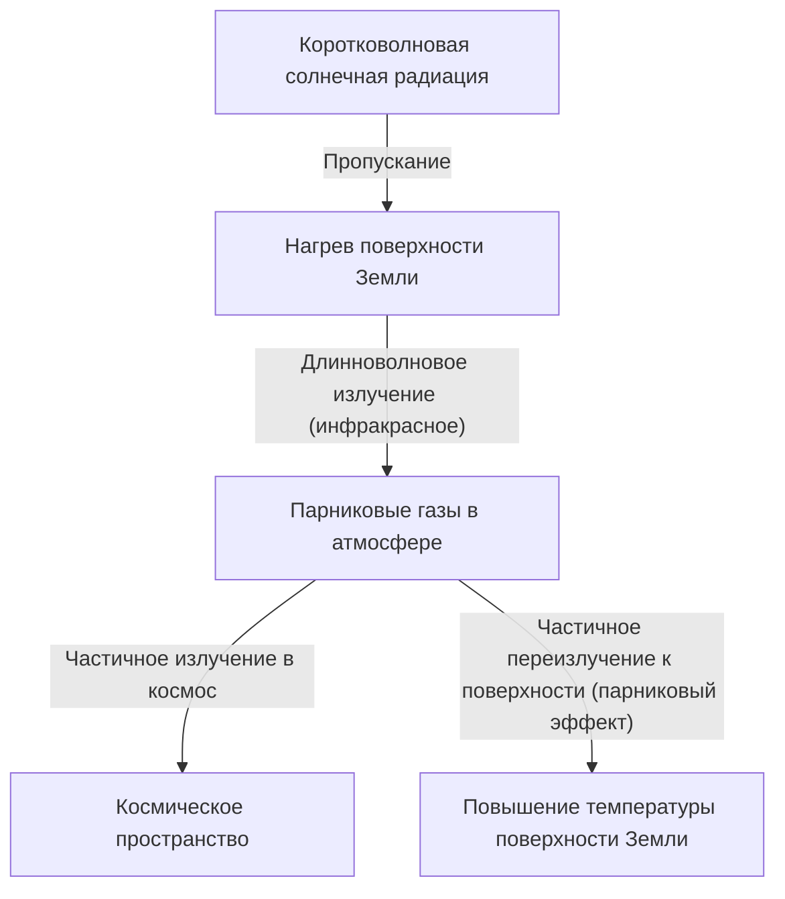

## 1. Введение: постоянно меняющаяся система Земли

Земля, на которой мы живем, — это динамичная система, которая непрерывно изменялась с момента своего зарождения и до наших дней. Атмосфера, гидросфера, литосфера и биосфера сложно переплетены между собой, формируя климатическую систему посредством круговорота энергии и материи. Однако, рассматривая этот процесс в коротких масштабах человеческой истории, мы часто впадаем в иллюзию, что "климат стабилен".

В этой статье мы глубоко исследуем историю изменения климата на Земле: от геологических масштабов до современных аномальных погодных явлений. Мы всесторонне изучим физические механизмы, исторические социальные последствия, а также современный климатический кризис, с которым мы сталкиваемся, и возможные пути его решения в будущем.

## 2. Физические механизмы изменения климата и история Земли

### 2.1 Циклы Миланковича, ледниковые и межледниковые периоды

Одним из важнейших естественных факторов изменения климата на Земле является изменение параметров орбиты нашей планеты. Сербский геофизик Милутин Миланкович предположил, что следующие три фактора влияют на количество солнечной радиации (инсоляцию), получаемой Землей:

1.  **Эксцентриситет (Eccentricity)**: степень эллиптичности орбиты Земли (цикл около 100 000 лет).
2.  **Наклон оси (Obliquity)**: изменение угла наклона оси вращения (цикл около 41 000 лет).
3.  **Прецессия (Precession)**: движение оси вращения, подобное вращению волчка (цикл около 26 000 лет).

В результате наложения этих циклических изменений Земля переживала холодные "ледниковые периоды" и относительно теплые "межледниковые периоды". В настоящее время мы живем в межледниковый период, называемый "Голоцен" (Holocene), который начался около 11 700 лет назад.

### 2.2 Открытие парникового эффекта и его механизмы

Еще одним важным элементом климатической системы являются парниковые газы в атмосфере. В начале XIX века Жозеф Фурье заметил, что температура Земли слишком высока, чтобы ее можно было объяснить только энергией Солнца, и сделал вывод, что "атмосфера действует как одеяло". Позднее Джон Тиндаль экспериментально доказал, что водяной пар и углекислый газ (CO2) обладают свойством поглощать и излучать инфракрасное излучение, а Сванте Аррениус впервые рассчитал количественную зависимость между концентрацией CO2 и температурой поверхности Земли.

Энергетический баланс Земли можно упрощенно выразить следующими формулами:

$$ E_{in} = S_0 (1 - A) / 4 $$
$$ E_{out} = \sigma T^4 $$

Где $S_0$ — солнечная постоянная, $A$ — альбедо (отражательная способность), $\sigma$ — постоянная Стефана — Больцмана, $T$ — эффективная радиационная температура. При увеличении количества парниковых газов инфракрасное излучение ($E_{out}$), которое должно было бы уйти от поверхности Земли в космос, поглощается атмосферой и вновь излучается к поверхности, что приводит к повышению температуры поверхности.

## 3. Влияние исторических изменений климата и стихийных бедствий на общество

История человечества — это также история адаптации к изменениям климата и угрозам стихийных бедствий.

### 3.1 Извержения вулканов и "Год без лета"

Крупномасштабные извержения вулканов выбрасывают в стратосферу огромное количество диоксида серы (SO2). Он превращается в сульфатные аэрозоли, которые отражают солнечный свет и вызывают похолодание на планете (вулканическая зима).

Самым известным примером в истории является извержение вулкана Тамбора в Индонезии в 1815 году. В следующем, 1816 году, это извержение привело к "Году без лета" (Year Without a Summer) в Северном полушарии. В Европе и Северной Америке летом выпадал иней, посевы были катастрофически уничтожены, и начался сильный голод. Считается, что эта аномальная погода послужила источником вдохновения для Мэри Шелли при написании "Франкенштейна".

### 3.2 Малый ледниковый период и взлеты и падения цивилизаций

С XIV по XIX век Земля пережила относительно холодный период, называемый "Малым ледниковым периодом" (Little Ice Age). В качестве причин этого похолодания указываются снижение солнечной активности (например, минимум Маундера) и активная вулканическая деятельность.

Малый ледниковый период оказал огромное влияние на человеческое общество. В Европе часто случался голод из-за неурожаев, что считается одним из факторов социальных волнений, таких как эпидемии бубонной чумы и охота на ведьм. С другой стороны, в некоторых регионах, таких как Нидерланды, развились новые сельскохозяйственные технологии и экономические системы, адаптированные к похолоданию, что привело к их последующему Золотому веку.

## 4. Промышленная революция и начало антропогенного изменения климата

Промышленная революция, начавшаяся во второй половине XVIII века, принесла человечеству беспрецедентное процветание, но в বাতাসে же время стала началом колоссальной нагрузки на окружающую среду. Массовое потребление ископаемых видов топлива, таких как уголь, а затем нефть и природный газ, представляет собой процесс выброса в атмосферу всего за несколько столетий того углерода, который накапливался под землей десятки миллионов лет.

Концентрация CO2 в атмосфере, составлявшая около 280 ppm до промышленной революции, в настоящее время превысила 420 ppm, достигнув самого высокого уровня за последние несколько миллионов лет. Этот резкий рост парниковых газов является непосредственной причиной современного "глобального потепления".

## 5. Современные стихийные бедствия: эпоха, когда "аномалия" становится "нормой"

Глобальное потепление не ограничивается простым "повышением температуры". Накопление энергии во всей климатической системе приводит к увеличению частоты и интенсивности экстремальных погодных явлений (аномальной погоды).

### 5.1 Усиливающиеся тайфуны и ураганы

Повышение температуры морской воды увеличивает энергию, питающую тропические циклоны (тайфуны, ураганы). Как показывает уравнение Клаузиуса-Клапейрона, при повышении температуры на 1 градус количество водяного пара, которое может содержать атмосфера, увеличивается примерно на 7%. В результате этого количество осадков резко возрастает, вызывая беспрецедентные по масштабам наводнения и оползни.

### 5.2 Цепная реакция волн тепла и засух

С другой стороны, из-за изменения распределения атмосферного давления в определенных регионах экстремальные волны тепла и засухи становятся более продолжительными. Повышенное испарение влаги из почвы приводит к ее пересыханию, что резко повышает риск возникновения масштабных лесных пожаров (мегапожаров). Крупные пожары, которые в последние годы часто случаются в Австралии, Калифорнии, Сибири и других местах, наглядно демонстрируют прямую угрозу, которую несет изменение климата.

### 5.3 Повышение уровня моря и угроза прибрежным городам

Из-за теплового расширения морской воды в результате потепления и таяния ледяных щитов в Гренландии и Антарктиде средний уровень мирового океана продолжает повышаться. В результате этого не только островные государства, такие как Мальдивы и Тувалу, но и крупнейшие прибрежные города мира, такие как Нью-Йорк, Токио и Шанхай, подвергаются риску штормовых нагонов и хронических затоплений.

## 6. Меры по борьбе с климатическим кризисом и перспективы на будущее

Мы должны предпринять немедленные и масштабные действия, чтобы избежать катастрофических последствий изменения климата. Меры по противодействию можно разделить на две основные категории: "смягчение последствий" (Mitigation) и "адаптация" (Adaptation).

### 6.1 Смягчение последствий: переход к декарбонизированному обществу

Самой приоритетной задачей является достижение чистого нулевого уровня (net-zero) выбросов парниковых газов.
*   **Энергетический переход**: масштабный переход на возобновляемые источники энергии, такие как солнечная, ветровая и геотермальная энергия.
*   **Электрификация транспорта и промышленности**: популяризация электромобилей (EV) и использование водородной энергии.
*   **Инновационные технологии**: исследования и разработки технологий улавливания и хранения углерода (CCS), а также прямого улавливания из воздуха (DAC).

### 6.2 Адаптация: создание жизнестойкого общества

Также необходимо повышать устойчивость (резилиентность) общества к последствиям изменения климата, которые уже происходят.
*   **Укрепление инфраструктуры**: строительство гигантских волнорезов и обустройство резервуаров для защиты от наводнений.
*   **Совершенствование систем предотвращения стихийных бедствий**: внедрение систем раннего предупреждения и высокоточных прогнозов погоды с использованием ИИ.
*   **Адаптация сельского хозяйства**: выведение сортов, устойчивых к высоким температурам и засухе, а также устойчивое управление водными ресурсами.

## 7. Заключение

История изменения климата и стихийных бедствий показывает нам человеческое бессилие перед динамизмом Земли, и в то же время свидетельствует о том, что мы обрели силу, способную изменять окружающую среду планеты своими собственными действиями.

Современный климатический кризис, в отличие от любых стихийных бедствий в истории, является проблемой, спусковым крючком для которой стали мы сами. Но в то же время это дает надежду на то, что мы сможем найти решения своими собственными руками и построить устойчивое будущее. Научные знания, международная солидарность и изменение сознания каждого человека станут ключом к передаче богатой Земли следующим поколениям.
