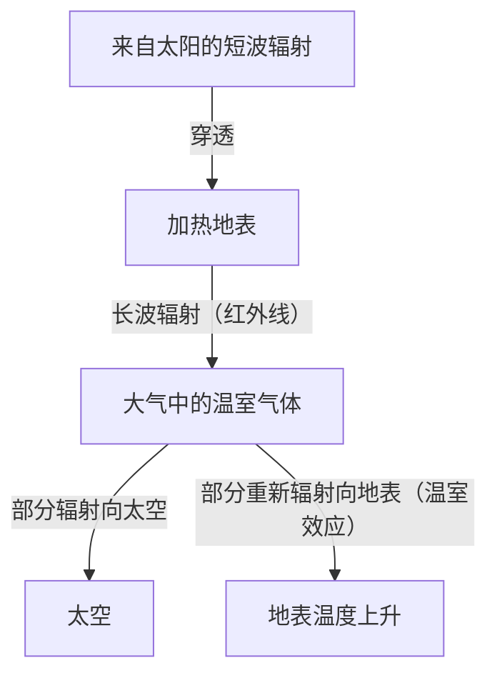

## 1. 引言：不断变化的地球系统

我们居住的地球，从诞生到今天，一直是一个处于不断变化中的动态系统。大气圈、水圈、岩石圈以及生物圈相互交织，通过能量与物质的循环形成了气候系统。然而，在人类历史这个短暂的时间尺度上，我们很容易陷入“气候是稳定不变的”这一错觉。

在本文中，我们将从地质学尺度到现代极端天气，深入探讨地球气候变化的历史。让我们全面探究物理学机制、历史上的社会影响，以及我们正面临的现代气候危机和面向未来的解决方案。

## 2. 气候变化的物理机制与地球历史

### 2.1 米兰科维奇循环与冰期、间冰期

地球气候变化中最大的自然因素之一，是地球轨道要素的变化。塞尔维亚地球物理学家米卢廷·米兰科维奇提出，以下三个要素会影响地球接收到的太阳辐射量（Insolation）：

1.  **偏心率 (Eccentricity)**: 地球公转轨道椭圆的程度（周期约10万年）。
2.  **转轴倾角 (Obliquity)**: 自转轴倾斜角的变化（周期约4.1万年）。
3.  **岁差 (Precession)**: 自转轴的摇摆运动（周期约2.6万年）。

由于这些周期性变化的叠加，地球经历了寒冷的“冰期”和相对温暖的“间冰期”的交替。目前，我们生活在始于约11700年前的被称为“全新世 (Holocene)”的间冰期。

### 2.2 温室效应的发现及其机制

气候系统另一个重要的组成部分，是大气中的温室气体。19世纪初，约瑟夫·傅里叶注意到地球的温度之高，仅靠来自太阳的能量是无法解释的，他推论“大气起到了类似毯子的作用”。此后，约翰·廷德尔通过实验证明了水蒸气和二氧化碳（CO2）具有吸收和辐射红外线的性质，斯凡特·阿伦尼乌斯则首次计算出了CO2浓度与地球表面温度之间的定量关系。

地球的能量平衡可以用以下公式简化表示：

$$ E_{in} = S_0 (1 - A) / 4 $$
$$ E_{out} = \sigma T^4 $$

这里，$S_0$ 是太阳常数，$A$ 是反照率（反射率），$\sigma$ 是斯特藩-玻尔兹曼常数，$T$ 是有效辐射温度。当温室气体增加时，本应从地表逃逸到太空的红外线辐射（$E_{out}$）被大气吸收，并重新向地表辐射，从而导致地表温度上升。

## 3. 历史上的气候变化与自然灾害对社会的影响

人类的历史，也是一部适应气候变化与自然灾害威胁的历史。

### 3.1 火山喷发与“无夏之年”

大规模的火山喷发会将大量二氧化硫（SO2）注入平流层。这些二氧化硫会转化为硫酸气溶胶，反射阳光并导致地球变冷（火山冬天）。

历史上最著名的例子是1815年印度尼西亚坦博拉火山的喷发。这次喷发给次年（1816年）的北半球带来了一个“无夏之年 (Year Without a Summer)”。在欧洲和北美，夏天出现了霜冻，农作物遭到毁灭性破坏，引发了严重的饥荒。据说，这种极端天气也为玛丽·雪莱创作《科学怪人》提供了灵感。

### 3.2 小冰期与文明的兴衰

从14世纪到19世纪，地球经历了一段相对寒冷的时期，被称为“小冰期 (Little Ice Age)”。导致这一时期变冷的原因，被认为是太阳活动减弱（如蒙德极小期）以及活跃的火山活动。

小冰期对人类社会产生了巨大影响。在欧洲，由于歉收而导致饥荒频发，这被认为是黑死病（鼠疫）流行和猎巫运动等社会动荡的背景之一。另一方面，在荷兰等一些地区，发展出了适应寒冷化趋势的新型农业技术和经济系统，并促成了随后的黄金时代。

## 4. 工业革命与人为气候变化的开端

始于18世纪下半叶的工业革命，为人类带来了前所未有的繁荣，但同时也开启了对地球环境造成巨大压力的时代。大量消耗煤炭，以及后来的石油和天然气等化石燃料，实际上是在短短几百年的时间内，将地下积累了数千万年的碳排放到大气中。

大气中的二氧化碳浓度，已从工业革命前的约 280 ppm，上升到目前的超过 420 ppm，达到了过去数百万年来的最高水平。这种温室气体浓度的急剧增加，正是当前“全球变暖”的直接原因。

## 5. 现代的自然灾害：“异常”变为“日常”的时代

全球变暖并不仅仅停留在“气温上升”的层面。随着整个气候系统积聚越来越多的能量，极端天气事件的频率和强度都在增加。

### 5.1 愈发猛烈的台风与飓风

海水温度的上升，为热带气旋（台风、飓风）提供了更多的能量。正如克劳修斯-克拉佩龙方程所示，气温每升高1度，大气所能容纳的水蒸气量就会增加约7%。这导致降水量急剧增加，引发了前所未有规模的洪水和泥石流等灾害。

### 5.2 热浪与干旱的连锁反应

另一方面，由于气压分布的变化，某些地区的极端热浪和干旱长期持续。土壤水分加速蒸发导致大地干燥，使得大规模森林火灾（巨型火灾）的风险剧增。近年来在澳大利亚、加利福尼亚和西伯利亚等地频发的大规模火灾，真实地展现了气候变化带来的直接威胁。

### 5.3 海平面上升与沿海城市的危机

气温上升导致的海水热膨胀，以及格陵兰岛和南极冰盖的融化，使得全球平均海平面持续上升。这不仅使马尔代夫、图瓦卢等岛国面临危机，也让纽约、东京、上海等全球主要沿海城市暴露在风暴潮和慢性洪涝的风险之中。

## 6. 应对气候危机的对策与未来展望

为了避免气候变化带来灾难性的影响，我们必须立即采取大规模的行动。这些对策主要分为“减缓 (Mitigation)”和“适应 (Adaptation)”。

### 6.1 减缓对策：向脱碳社会转型

首要任务是将温室气体的排放量降至净零（Net Zero）。
*   **能源转型**: 大规模转向太阳能、风能、地热能等可再生能源。
*   **交通与工业电气化**: 普及电动汽车（EV），以及利用氢能。
*   **创新技术**: 碳捕集与封存技术（CCS）以及直接空气捕集（DAC）的研发。

### 6.2 适应对策：构建充满韧性的社会

对于已经发生的气候变化影响，提高社会的恢复力（韧性）也至关重要。
*   **加强基础设施**: 通过建设大型防波堤和蓄滞洪区来防洪。
*   **升级防灾系统**: 引入早期预警系统，并利用AI进行高精度的天气预测。
*   **农业适应**: 培育耐高温、耐旱的品种，并进行可持续的水资源管理。

## 7. 结语

气候变化和自然灾害的历史，既告诉我们在地球的动态变化面前人类的无力，也表明我们已经拥有了通过自身行为改变地球环境的力量。

现代的气候危机有别于历史上任何一次自然灾害，它是由我们自己引发的问题。但同时，这也带来了希望：我们能够依靠自己的双手找到解决方案，并建立一个可持续的未来。科学知识、国际团结以及每个人的意识转变，将是把一个富饶的地球交接给下一代的关键。
