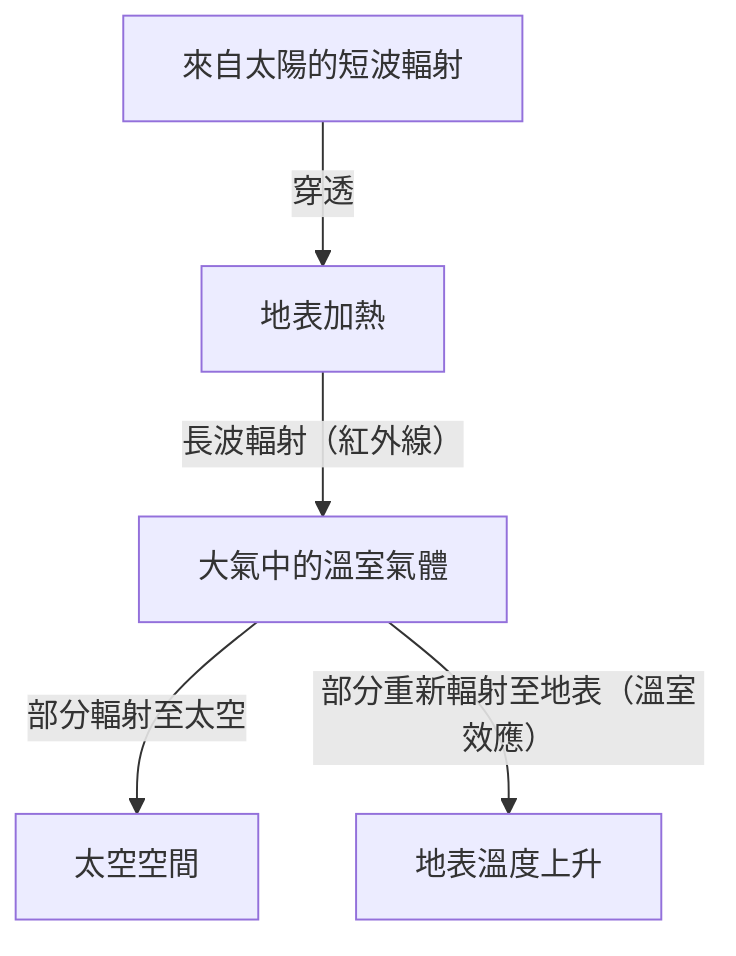

## 1. 前言：不斷變化的地球系統

我們居住的地球，從誕生到現在，一直是一個持續變動的動態系統。大氣圈、水圈、岩石圈以及生物圈錯綜複雜地交織在一起，透過能量與物質的循環，形成了氣候系統。然而，在人類歷史這短暫的尺度來看，我們很容易陷入「氣候是穩定的」這種錯覺。

本文將從地質學尺度到現代的極端天氣，深入探討地球氣候變遷的歷史。從物理機制、歷史上的社會影響，到我們目前面臨的氣候危機與未來的解決方案，進行全面性的探索。

## 2. 氣候變遷的物理機制與地球歷史

### 2.1 米蘭科維奇循環與冰期、間冰期

地球氣候變遷中最大的自然因素之一，是地球軌道要素的變化。塞爾維亞地球物理學家米盧廷·米蘭科維奇（Milutin Milanković）提出，以下三個要素會影響地球接收到的太陽輻射量（日照量）：

1.  **離心率（Eccentricity）**：地球公轉軌道的橢圓程度（約10萬年週期）。
2.  **轉軸傾角（Obliquity）**：自轉軸傾斜角的變動（約4.1萬年週期）。
3.  **歲差（Precession）**：自轉軸的進動（約2.6萬年週期）。

這些週期性變動相互疊加，使得地球不斷在寒冷的「冰期」與相對溫暖的「間冰期」之間交替。目前，我們正處於約1萬1700年前開始的「全新世（Holocene）」間冰期。

### 2.2 溫室效應的發現與其機制

氣候系統的另一個重要元素，是大氣中的溫室氣體。19世紀初，約瑟夫·傅立葉（Joseph Fourier）意識到，地球的溫度之高，無法單靠來自太陽的能量來解釋，並推論出「大氣層發揮了類似毛毯的作用」。隨後，約翰·廷得耳（John Tyndall）透過實驗證明了水蒸氣與二氧化碳（CO2）具有吸收和輻射紅外線的特性；斯凡特·阿倫尼烏斯（Svante Arrhenius）則首次計算出CO2濃度與地球表面溫度之間的定量關係。

地球的能量平衡可以用以下公式簡化表示：

$$ E_{in} = S_0 (1 - A) / 4 $$
$$ E_{out} = \sigma T^4 $$

在這裡，$S_0$ 為太陽常數，$A$ 為反照率（Albedo），$\sigma$ 為史蒂芬-波茲曼常數（Stefan-Boltzmann constant），$T$ 為有效輻射溫度。當溫室氣體增加時，本應從地表逃逸到太空的紅外線輻射（$E_{out}$）會被大氣吸收，並再次向地表輻射，從而導致地表溫度上升。

## 3. 歷史上的氣候變遷與自然災害對社會的影響

人類的歷史，同時也是一部適應氣候變動與自然災害威脅的歷史。

### 3.1 火山噴發與「無夏之年」

大規模的火山噴發會將大量的二氧化硫（SO2）注入平流層。這些二氧化硫會轉化為硫酸氣溶膠，反射陽光，導致地球變冷（火山冬天）。

歷史上最著名的例子是1815年印尼坦博拉火山的噴發。這次噴發導致隔年（1816年）北半球出現了「無夏之年（Year Without a Summer）」。歐洲與北美在夏季出現降霜，農作物遭到毀滅性破壞，引發了嚴重的飢荒。據說，這場極端氣候也成為了瑪麗·雪萊創作《科學怪人》（Frankenstein）的靈感來源。

### 3.2 小冰期與文明的興衰

從14世紀到19世紀，地球經歷了一段相對寒冷的時期，被稱為「小冰期（Little Ice Age）」。造成這段時期變冷的原因，被認為與太陽活動減弱（如蒙德極小期）以及活躍的火山活動有關。

小冰期對人類社會產生了深遠的影響。在歐洲，農作物歉收導致飢荒頻發，被認為是黑死病（鼠疫）流行與獵巫等社會動盪的背景因素之一。另一方面，在荷蘭等部分地區，人們發展出適應寒冷氣候的新型農業技術與經濟體系，進而迎來了後來的黃金時代。

## 4. 工業革命與人為氣候變遷的開端

18世紀後半葉開始的工業革命，為人類帶來了前所未有的繁榮，但同時也標誌著對地球環境造成巨大負擔的開始。大量消耗煤炭，以及隨後的石油與天然氣等化石燃料，等同於將地下花費數千萬年累積的碳，在短短數百年內排放到大氣中。

大氣中的CO2濃度，從工業革命前的約280 ppm，攀升至目前的超過420 ppm，達到了過去數百萬年來的最高水準。這種溫室氣體的急劇增加，正是目前「全球暖化」的直接原因。

## 5. 現代的自然災害：「異常」成為「日常」的時代

全球暖化不僅僅是「氣溫上升」而已。隨著整個氣候系統累積越來越多的能量，極端天氣現象的發生頻率與強度都在不斷增加。

### 5.1 威力增強的颱風與颶風

海水溫度上升，為熱帶氣旋（颱風、颶風、氣旋）提供了更多的能量。正如克勞修斯-克拉佩龍方程（Clausius-Clapeyron equation）所示，氣溫每上升1度，大氣所能容納的水蒸氣量就會增加約7%。這導致降雨量急劇增加，引發了前所未有規模的洪水與土石流災害。

### 5.2 熱浪與乾旱的連鎖反應

另一方面，由於氣壓配置的改變，特定地區的極端熱浪與乾旱現象變得更加長期化。土壤水分加速蒸發導致大地乾涸，進而使得大規模森林大火（巨型火災）的風險大幅上升。近年來在澳洲、加州、西伯利亞等地頻繁發生的大規模火災，如實地展現了氣候變遷所帶來的直接威脅。

### 5.3 海平面上升與沿海城市的危機

由於氣溫上升導致海水熱膨脹，加上格陵蘭與南極冰蓋的融化，全球平均海平面正在持續上升。這使得不僅是馬爾地夫、吐瓦魯等島嶼國家，包括紐約、東京、上海等全球主要的沿海城市，也面臨著風暴潮與慢性淹水的風險。

## 6. 應對氣候危機的對策與未來展望

為了避免氣候變遷帶來災難性的影響，我們必須立即採取大規模的行動。對策主要可分為「減緩（Mitigation）」與「適應（Adaptation）」兩大類。

### 6.1 減緩對策：向脫碳社會轉型

最優先的課題是將溫室氣體排放量降至實質為零（淨零排放）。
*   **能源轉型**：大規模轉向太陽能、風能、地熱能等再生能源。
*   **交通與工業的電氣化**：普及電動車（EV），以及氫能的應用。
*   **創新技術**：研發碳捕集與封存技術（CCS）以及直接空氣捕獲（DAC）技術。

### 6.2 適應對策：建立具備韌性的社會

針對已經在進行中的氣候變遷影響，提升社會的恢復力（韌性）也是不可或缺的。
*   **強化基礎設施**：建設巨型防波堤、整備滯洪池等防洪對策。
*   **升級防災系統**：導入早期預警系統，並利用AI進行高精準度的氣象預測。
*   **農業的適應**：開發耐高溫、耐乾旱的品種，以及永續的水資源管理。

## 7. 結語

氣候變遷與自然災害的歷史，在在告訴我們人類在面對地球動態時的無力感，但同時也顯示出我們擁有藉由自身行為改變地球環境的龐大力量。

現代的氣候危機與歷史上任何自然災害都不同，這是一個由我們自己引發的問題。然而，這也意味著我們有希望透過自己的雙手找出解決方案，建立一個永續的未來。科學知識、國際團結，以及每個人的意識改革，將是我們將一個豐富的地球傳承給下一代的關鍵。
