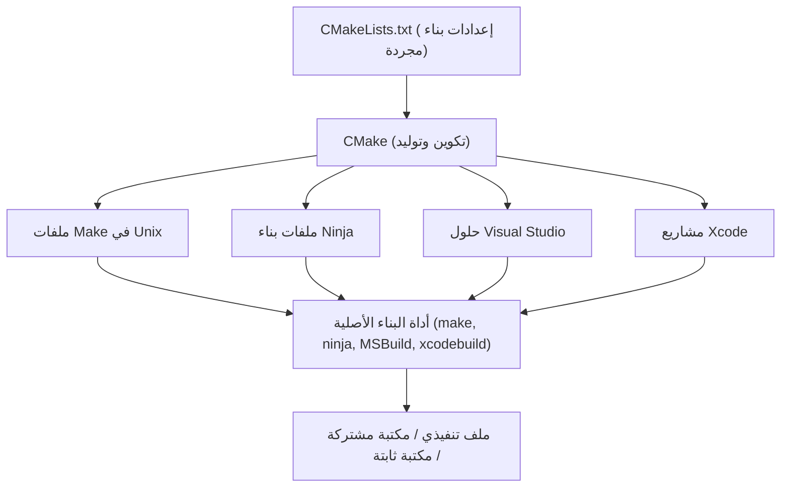
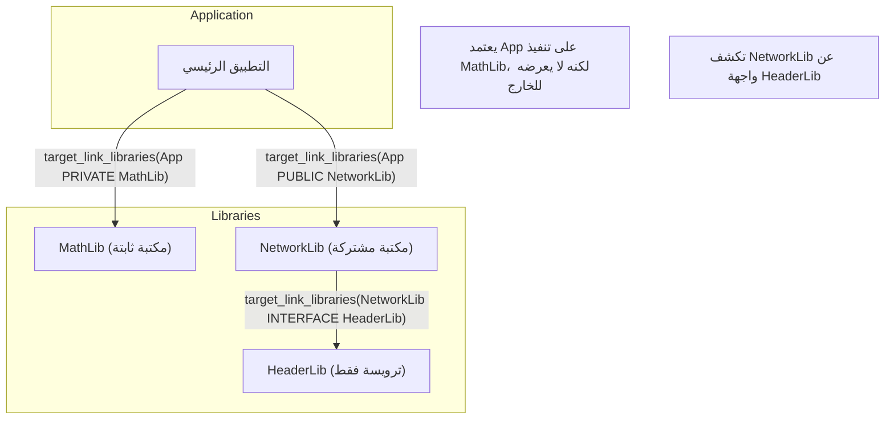
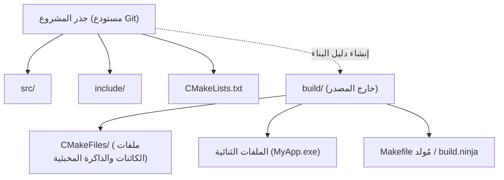

في تطوير برمجيات C++، كان اختيار "نظام البناء" وإعداده مشكلة تزعج العديد من المطورين لسنوات طويلة. نظرًا لعدم وجود مدير حزم قياسي رسمي أو نظام بناء للغة C++، كان من الضروري استخدام مترجمات وأدوات بناء مختلفة (مثل MSVC، GCC، Clang، Make، Ninja) وفقًا لكل منصة (Windows، Linux، macOS).

ومع ذلك، أصبح **CMake** الآن المعيار الفعلي في الصناعة، ومن خلال استخدام CMake بشكل صحيح، يمكنك بناء بيئة بناء متعددة المنصات بأناقة من ملف `CMakeLists.txt` واحد.

في هذا المقال، سنشرح بشكل شامل ومفصل خطوات إعداد بيئة بناء C++ متعددة المنصات باستخدام أحدث أساليب CMake (Modern CMake)، بدءًا من الأساسيات وحتى التقنيات المتقدمة.

## 1. ما هو CMake؟ (مفهوم نظام البناء الوصفي Meta-Build System)

أداة CMake في حد ذاتها ليست أداة لترجمة كود المصدر مباشرة. إنما هي "نظام لتوليد أنظمة البناء"، أي أنها **نظام بناء وصفي (Meta-Build System)**.

يتمثل الدور الرئيسي لـ CMake في قراءة ملفات إعدادات مجردة لا تعتمد على المنصة أو المترجم (`CMakeLists.txt`)، وتوليد نصوص البناء الأصلية تلقائيًا (Native Build Scripts) والمناسبة لكل بيئة (مثل: `Makefile` لنظام Linux، أو ملفات مشروع `.sln` لـ Visual Studio في Windows، أو `build.ninja` السريع).

يوضح الشكل التالي عملية التوليد في CMake.



وبهذه الطريقة، من خلال وضع CMake في المنتصف، يمكن للمطورين إدارة مشاريع C++ دون القلق بشأن الاختلافات الدقيقة في الأوامر بين أنظمة التشغيل المختلفة.

## 2. أساسيات Modern CMake: من المتغيرات إلى الأهداف (Targets)

يُطلق على الصياغة المستخدمة في CMake الإصدار 3.0 وما بعده اسم "Modern CMake"، وتختلف فلسفة تصميمها جذريًا عن الإصدارات السابقة (Legacy CMake). في الإصدارات القديمة، كان النهج السائد هو إعادة كتابة المتغيرات العامة على مستوى الدليل (مثل استخدام `include_directories()` أو `link_libraries()`)، ولكن هذا غالبًا ما كان يتسبب في آثار جانبية خطيرة حيث تنتقل الإعدادات عن غير قصد إلى وحدات أخرى.

أما في Modern CMake، يتم التعامل مع كل شيء على أنه **أهداف (Targets)** و**خصائص (Properties)**. وهو يشبه العلاقة بين الفئات (Classes) والمتغيرات العضوة في البرمجة كائنية التوجه.

- **الأهداف (Targets)**: الملفات التنفيذية (Executables) والمكتبات (Libraries).
- **الخصائص (Properties)**: ملفات المصدر، وأدلة التضمين، وخيارات الترجمة، والمكتبات الأخرى المرتبطة اللازمة لبناء هذا الهدف.

من خلال تغليف الإعدادات وتخصيصها لهدف معين فقط، يصبح من الممكن إنشاء تعريفات بناء آمنة لا تنهار حتى في المشاريع الكبيرة.

### ملف `CMakeLists.txt` بالأدنى المطلوب

أولاً، دعنا نلقي نظرة على ملف `CMakeLists.txt` الأساسي.

```cmake
# تحديد الحد الأدنى المطلوب لإصدار CMake
cmake_minimum_required(VERSION 3.20)

# تحديد اسم المشروع واللغة المستخدمة
project(MyAwesomeApp VERSION 1.0.0 LANGUAGES CXX)

# طلب معيار C++ القياسي (C++20)
set(CMAKE_CXX_STANDARD 20)
set(CMAKE_CXX_STANDARD_REQUIRED ON)
set(CMAKE_CXX_EXTENSIONS OFF) # تعطيل الامتدادات الخاصة بالمترجم

# تعريف هدف الملف التنفيذي
add_executable(MyAwesomeApp main.cpp)
```

في بضعة أسطر فقط، يكتمل إعداد البناء لملف تنفيذي محمول يطلب C++20 ويعطل امتدادات المترجم.

## 3. التبعيات والنطاق: PUBLIC / PRIVATE / INTERFACE

لإتقان Modern CMake، فإن المفهوم الأهم والأكثر تعقيدًا هو معدّلات الوصول الثلاثة (النطاقات) **`PUBLIC` و `PRIVATE` و `INTERFACE`** المستخدمة في وظائف مثل `target_include_directories` و `target_link_libraries`.

تُستخدم هذه المعدّلات للتحكم في خصائص الهدف (مثل مسارات التضمين والمكتبات التابعة) من حيث ما إذا كانت "مطلوبة لبناء الهدف نفسه؟" و "هل يجب تمريرها إلى الأهداف الأخرى التي تعتمد عليه؟".

1. **`PRIVATE`**: مطلوب فقط لبناء الهدف نفسه. **لا** ينتقل إلى الأهداف التابعة.
2. **`INTERFACE`**: غير مطلوب لبناء الهدف نفسه، لكنه **ينتقل** إلى بناء الأهداف التابعة (يُستخدم في المكتبات التي تتكون من ملفات ترويسة فقط).
3. **`PUBLIC`**: مطلوب لبناء الهدف نفسه، و**ينتقل** أيضًا إلى الأهداف التابعة (`PRIVATE` + `INTERFACE`).

دعنا نتصور نقل التبعيات (انتقال متطلبات الاستخدام Usage Requirements) في الشكل التالي.



### أمثلة محددة على استخدام النطاقات

لنفترض أن مكتبة `MyLib` تستخدم `nlohmann/json` كجزء من تنفيذها الداخلي، ولكنها لا تضمن `nlohmann/json` في ملف الترويسة العام `MyLib.hpp`. في هذه الحالة، لا يحتاج مستخدم `MyLib` (التطبيق) إلى معرفة وجود مكتبة JSON.

```cmake
# تعريف المكتبة
add_library(MyLib src/MyLib.cpp)

# تحديد أدلة التضمين لمشروعنا
# دليل include مطلوب لمن يستخدم MyLib، لذا يتم تعيينه كـ PUBLIC
# دليل src يُستخدم فقط في تنفيذ MyLib، لذا يتم تعيينه كـ PRIVATE
target_include_directories(MyLib
    PUBLIC 
        $<BUILD_INTERFACE:${CMAKE_CURRENT_SOURCE_DIR}/include>
        $<INSTALL_INTERFACE:include>
    PRIVATE
        ${CMAKE_CURRENT_SOURCE_DIR}/src
)

# تُستخدم مكتبة json في التنفيذ الداخلي فقط، لذا يتم ربطها كـ PRIVATE
target_link_libraries(MyLib PRIVATE nlohmann_json::nlohmann_json)
```

على العكس، إذا كان ملف `MyLib.hpp` يحتوي على `#include <nlohmann/json.hpp>`، فإن المستخدم الذي يستدعي `MyLib` سيحتاج إلى معرفة مسار ترويسة JSON وإلا سيحدث خطأ في الترجمة، لذا يجب ربطها كـ `PUBLIC`. من خلال تعيين هذا النطاق بشكل صحيح، يمكنك تقليل وقت البناء ومنع تسرب التبعيات غير الضرورية.

## 4. البناء خارج المصدر (Out-of-source Build)

أحد أفضل الممارسات التي يجب اتباعها دائمًا عند استخدام CMake هو **البناء خارج المصدر**.
هذا يعني عدم إخراج أي نتائج بناء (مثل ملفات الكائنات أو الملفات التنفيذية) في الدليل الذي توجد به التعليمات البرمجية المصدرية (شجرة المصدر)، ولكن يتم البناء في دليل مخصص منفصل (عادةً `build/`).



باستخدام هذا الهيكل، إذا كنت ترغب في إعادة ضبط بيئة البناء، فما عليك سوى حذف دليل `build` بالكامل. ونظرًا لعدم تلويث شجرة المصدر، تصبح إدارتها في Git أسهل (تحتاج فقط إلى إضافة `build/` إلى `.gitignore`).

### خطوات تنفيذ البناء

في Modern CMake، يمكنك تنفيذ البناء باستخدام أوامر مشتركة لا تعتمد على نظام التشغيل أو أدوات البناء.

```bash
# 1. التكوين والتوليد (إنشاء دليل البناء مع تعيين الإعدادات)
cmake -S . -B build

# 2. البناء الفعلي (الترجمة والربط)
cmake --build build --config Release

# (اختياري) استخدم الخيار -j للبناء متعدد مؤشرات الترابط (Multithreaded)
cmake --build build --config Release -j 8
```

هنا يعني الأمر `cmake -S . -B build` "استخدم الدليل الحالي (`.`) كدليل مصدر، واجعل الدليل `build` هو دليل البناء".

## 5. كيفية إدراج مكتبات الطرف الثالث

في تطوير C++، لطالما كان إدراج مكتبات خارجية (مكتبات الطرف الثالث) يشكل تحديًا. ومع ذلك، هناك الآن ثلاثة أساليب رئيسية تعتبر قياسية:

### 5.1. find_package (البحث عن المكتبات المثبتة في النظام)

هذه هي الطريقة الأكثر تقليدية، حيث يتم البحث عن المكتبات المثبتة بالفعل في النظام (مثل OpenSSL أو Zlib) وربطها.

```cmake
find_package(ZLIB REQUIRED)
if(ZLIB_FOUND)
    target_link_libraries(MyAwesomeApp PRIVATE ZLIB::ZLIB)
endif()
```

### 5.2. FetchContent (التحميل من المصدر والدمج)

تم تقديم هذه الوحدة في CMake 3.11، وأصبحت أقوى منذ 3.14. تقوم هذه الوحدة بتنزيل التعليمات البرمجية المصدرية مباشرة من مستودع Git أو رابط URL خارجي أثناء وقت البناء، وتقوم ببنائها مع المشروع كجزء منه. وبما أنه يمكن إدارة التبعيات مركزيًا، فإنه يوفر مستوى عاليًا جدًا من قابلية إعادة الإنتاج عبر المنصات المختلفة.

فيما يلي مثال على إدراج GoogleTest باستخدام FetchContent:

```cmake
include(FetchContent)

FetchContent_Declare(
  googletest
  GIT_REPOSITORY https://github.com/google/googletest.git
  GIT_TAG        v1.14.0
)

# توفير المكتبة للمشروع
FetchContent_MakeAvailable(googletest)

# إنشاء ملف تنفيذي للاختبار وربطه
add_executable(MyTests test/main.cpp)
target_link_libraries(MyTests PRIVATE gtest_main)
```

### 5.3. التكامل مع vcpkg

باستخدام **vcpkg**، وهو مدير حزم لـ C++ تديره Microsoft، يمكنك بسهولة إدراج الآلاف من المكتبات. تم تصميم vcpkg ليتكامل بسلاسة مع CMake.

عند تشغيل CMake، ما عليك سوى تحديد ملف أداة السلسلة (Toolchain) الخاص بـ vcpkg، وسيؤدي ذلك إلى جعل `find_package` يبحث تلقائيًا عن المكتبات داخل vcpkg.

```bash
cmake -S . -B build -DCMAKE_TOOLCHAIN_FILE=/path/to/vcpkg/scripts/buildsystems/vcpkg.cmake
```

علاوة على ذلك، من خلال وضع `vcpkg.json` (وضع البيان Manifest Mode) في جذر المشروع، يمكنك أتمتة إدارة إصدارات المكتبات المطلوبة بالكامل.

## 6. علامات المترجم للتعامل مع الأنظمة المتعددة المنصات (Cross-Platform Compiler Flags)

لتجاوز البناء في بيئات مثل Windows (MSVC) و Linux (GCC/Clang) و macOS (Apple Clang)، من الضروري تعيين العلامات الخاصة بالمترجم بشكل صحيح.

باستخدام **تعبيرات المولد (Generator Expressions)** الخاصة بـ CMake، يمكنك كتابة تفريعات شرطية بشكل تصريحي، مثل "إذا كان المترجم هو MSVC، استخدم هذه العلامة، وإلا استخدم تلك". تستخدم تعبيرات المولد صيغة `$<...>` ويتم تقييمها في مرحلة توليد نظام البناء (مرحلة Generate).

```cmake
# مثال على تمكين أعلى مستوى من التحذيرات على جميع المنصات
target_compile_options(MyAwesomeApp PRIVATE
    # في حالة MSVC
    $<$<CXX_COMPILER_ID:MSVC>:/W4 /WX>
    
    # في حالة GCC أو Clang
    $<$<OR:$<CXX_COMPILER_ID:GNU>,$<CXX_COMPILER_ID:Clang>,$<CXX_COMPILER_ID:AppleClang>>:-Wall -Wextra -Wpedantic -Werror>
)
```

باستخدام هذه الطريقة، تتجنب الإفراط في استخدام التفريعات الشرطية مثل `if(MSVC)` التي تجعل `CMakeLists.txt` صعب القراءة، وتتيح إعدادات مرنة لكل هدف على حدة.

## 7. إعداد بيئة الاختبار (CTest)

يعد إدخال الاختبارات الآلية أمرًا ضروريًا لضمان الجودة في البيئات متعددة المنصات. يأتي CMake مزودًا بمشغل اختبارات يُدعى **CTest** بشكل افتراضي.

إليك خطوات دمج GoogleTest، الذي تم إدراجه مسبقًا عبر `FetchContent`، مع CTest:

```cmake
# تفعيل ميزة الاختبار (يُكتب مرة واحدة في ملف CMakeLists.txt الجذري)
enable_testing()

add_executable(MyMathTests test/math_test.cpp)
target_link_libraries(MyMathTests PRIVATE gtest_main MyLib)

# تسجيل كاختبار في CTest
include(GoogleTest)
gtest_discover_tests(MyMathTests)
```

بعد البناء، ما عليك سوى تنفيذ الأمر `ctest` داخل دليل البناء، وسيتم تشغيل جميع الاختبارات والإبلاغ عن النتائج.

```bash
cd build
ctest --output-on-failure -C Release
```

## 8. النظرية والنماذج الرياضية لأنظمة البناء

دعونا نغير المنظور قليلًا وندرس نظام البناء وكفاءة الترجمة المتوازية في المشاريع الكبيرة باستخدام نماذج رياضية.

تقليل وقت البناء (وقت الترجمة) هو التحدي الأبدي في تطوير C++. يمكن تقليل وقت البناء من خلال تقسيم التعليمات البرمجية المصدرية والترجمة المتوازية. يتم نمذجة هذا التسريع (Speedup) الناتج عن التوازي باستخدام **قانون أمدال (Amdahl's Law)**.

إذا افترضنا أن نسبة الجزء القابل للتوازي من البرنامج هي $P$، ونسبة الجزء الذي يجب تنفيذه تسلسليًا (غير القابل للتوازي) هي $1-P$، وأن عدد المعالجات المستخدمة هو $N$، فإن الحد الأقصى النظري لنسبة التسريع الإجمالية $S(N)$ يُعبر عنه بالمعادلة التالية:

$$ S(N) = \frac{1}{(1 - P) + \frac{P}{N}} $$

في عملية بناء C++، تكون عملية "ترجمة كل ملف `.cpp` إلى `.o` أو `.obj`" مستقلة وقابلة للتوازي (وهي تمثل الجزء $P$)، بينما "عملية الدمج النهائية بواسطة الرابط (Linker)" تتم بشكل تسلسلي أساسي (وهي تمثل الجزء $1-P$).

لذلك، مهما زاد عدد نوى وحدة المعالجة المركزية (CPU) المُجهزة ($N \to \infty$)، طالما أن عنق الزجاجة المتمثل في وقت الربط موجود، فإن الحد الأقصى لنسبة التسريع سيقترب من المعادلة التالية:

$$ \lim_{N \to \infty} S(N) = \frac{1}{1 - P} $$

ما تشير إليه هذه المعادلة هو أن "هناك حدود لتقليل وقت البناء بمجرد زيادة نوى وحدة المعالجة المركزية". إن الاستخدام السليم لـ `PRIVATE` و `INTERFACE` في Modern CMake لتقليل تبعيات ملفات الترويسة إلى الحد الأدنى (مثل استخدام التصريحات الأمامية Forward Declarations)، وبالتالي زيادة نسبة $P$ وتقليل الأجزاء التي تحتاج إلى إعادة الترجمة أثناء البناء التزايدي (Incremental Build)، هو استراتيجية تسريع البناء الأكثر فعالية عمليًا.

بالإضافة إلى ذلك، لتقليل وقت الربط، من المهم التبديل من المكتبات الثابتة (Static Libraries) إلى المكتبات المشتركة / DLL (Shared Libraries)، أو استخدام روابط سريعة مثل LLD / Mold.

في CMake، يمكنك تحديد الرابط بسهولة كما يلي:

```cmake
# إعداد لاستخدام رابط lld في بيئة Clang/GCC
if(UNIX AND NOT APPLE)
    target_link_options(MyAwesomeApp PRIVATE "-fuse-ld=lld")
endif()
```

## 9. مثال عملي على هياكل الأدلة المعقدة

في تطوير التطبيقات الفعلية، يكون هيكل الدليل مزيجًا من العديد من الوحدات (Modules). أخيرًا، سنعرض الهيكل المثالي لدليل مشروع متوسط الحجم والعلاقة بين ملفات `CMakeLists.txt` للأب والابن.

```text
ProjectRoot/
├── CMakeLists.txt (الجذر: تعريف المشروع بالكامل)
├── vcpkg.json     (تعريف المكتبات التابعة)
├── external/      (الوحدات الخارجية)
├── include/       (الترويسات العامة)
│   └── myapp/
├── src/           (التعليمات البرمجية المصدرية وتعريفات البناء الداخلية)
│   ├── CMakeLists.txt
│   ├── main.cpp
│   ├── math/
│   │   ├── CMakeLists.txt
│   │   ├── Vector3.hpp
│   │   └── Vector3.cpp
│   └── network/
│       ├── CMakeLists.txt
│       └── NetworkManager.cpp
└── tests/         (أكواد الاختبار)
    ├── CMakeLists.txt
    └── math_test.cpp
```

ملف `CMakeLists.txt` في الجذر يقوم فقط بإعداد البيئة وتعريف الخيارات العامة، ويضيف الأدلة الفرعية باستخدام `add_subdirectory()`.

**Root `CMakeLists.txt`**:
```cmake
cmake_minimum_required(VERSION 3.20)
project(ComplexApp LANGUAGES CXX)

# الإعدادات العامة
set(CMAKE_CXX_STANDARD 20)
set(CMAKE_CXX_STANDARD_REQUIRED ON)

# تفعيل الاختبارات
enable_testing()

# إضافة الأدلة الفرعية
add_subdirectory(src)
add_subdirectory(tests)
```

**`src/CMakeLists.txt`**:
```cmake
# إضافة كل وحدة
add_subdirectory(math)
add_subdirectory(network)

# الملف التنفيذي النهائي
add_executable(ComplexApp main.cpp)

# ربط الوحدات
target_link_libraries(ComplexApp
    PRIVATE
        MathLib
        NetworkLib
)
```

من خلال تقسيم `CMakeLists.txt` لكل دليل بهذه الطريقة وتحديدها كتابعيات بين الأهداف، تزداد قابلية إعادة الاستخدام للوحدات وتتحسن وتيرة التوازي في البناء. هذا هو الجوهر الحقيقي "لبيئة البناء القائمة على الوحدات" التي يدعو إليها Modern CMake.

## 10. الخلاصة

لقد شرحنا خطوات إعداد بيئة بناء C++ متعددة المنصات باستخدام CMake.
دعونا نراجع النقاط الرئيسية:

1. **فهم نظام البناء الوصفي (Meta-Build System)**: أداة CMake هي أداة لتوليد نصوص البناء.
2. **التزام نهج Modern CMake**: عدم استخدام المتغيرات، بل تغليف الإعدادات بنهج **موجه نحو الهدف (Target-Oriented)** باستخدام وظائف مثل `add_executable` و `target_link_libraries` و `target_include_directories`.
3. **التعيين السليم للنطاق (Scope)**: الاستخدام الصحيح لـ `PUBLIC` و `PRIVATE` و `INTERFACE` للتحكم في امتداد التبعيات.
4. **التزام البناء خارج المصدر (Out-of-source Build)**: إجراء البناء داخل دليل `build/` وعدم تلويث شجرة المصدر.
5. **تكامل الطرف الثالث**: أتمتة حل المكتبات التابعة باستخدام `FetchContent` و `vcpkg`.
6. **الاستفادة من تعبيرات المولد (Generator Expressions)**: استيعاب الفروق الذكية في علامات كل مترجم.
7. **النهج الرياضي**: الوعي بقانون أمدال لتقليل التبعيات وزيادة كفاءة الترجمة المتوازية.

قد يبدو CMake معقدًا في البداية، ولكن بمجرد أن تفهم مفهوم الأهداف والخصائص، يمكنك الحفاظ على بيئة بناء منظمة مهما كان مشروع C++ معقدًا أو ضخمًا. نأمل أن تستخدم هذا المقال كمرجع لإعداد بيئة تطوير C++ باستخدام أحدث صياغات Modern CMake.
