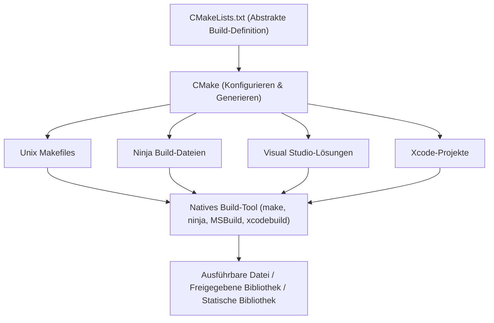
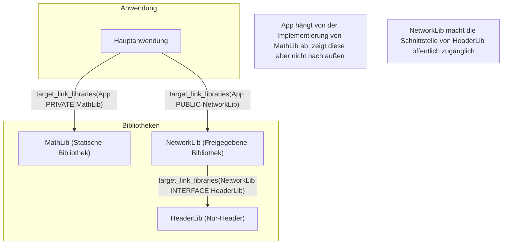
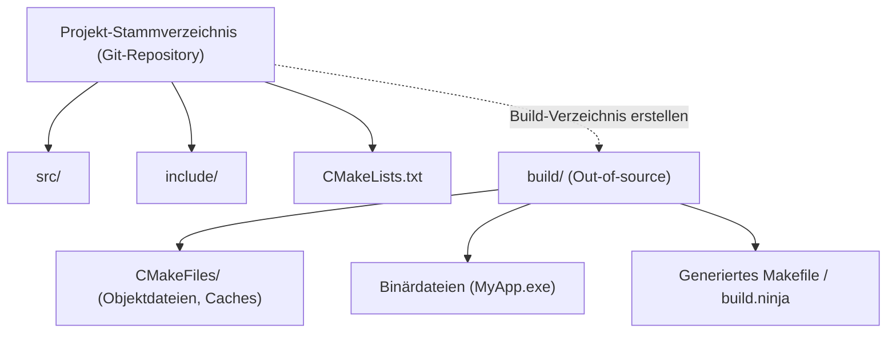

Bei der Softwareentwicklung mit C++ ist die Auswahl und Einrichtung eines „Build-Systems“ ein Thema, das vielen Entwicklern seit Jahren Kopfzerbrechen bereitet. Da es in C++ keinen offiziellen Standard-Paketmanager oder ein einheitliches Build-System gibt, war es bisher notwendig, je nach Plattform (Windows, Linux, macOS) unterschiedliche Compiler und Build-Tools (MSVC, GCC, Clang, Make, Ninja usw.) zu verwenden.

Heutzutage hat sich jedoch **CMake** als De-facto-Branchenstandard etabliert. Wenn CMake richtig eingesetzt wird, lässt sich aus einer einzigen `CMakeLists.txt`-Datei elegant eine plattformübergreifende Build-Umgebung aufbauen.

In diesem Artikel werden die Schritte zur Einrichtung einer modernen, plattformübergreifenden C++-Build-Umgebung (Modern CMake) von den Grundlagen bis hin zu fortgeschrittenen Techniken ausführlich und detailliert erläutert.

## 1. Was ist CMake? (Das Konzept des Meta-Build-Systems)

CMake ist kein Werkzeug, das den Quellcode selbst direkt kompiliert. CMake ist ein „System, das Build-Systeme generiert“, also ein **Meta-Build-System**.

Die Hauptaufgabe von CMake besteht darin, eine abstrakte Konfigurationsdatei (`CMakeLists.txt`), die unabhängig von Plattform oder Compiler ist, einzulesen und die jeweils optimalen nativen Build-Skripte für die jeweilige Umgebung (z. B. `Makefile` für Linux, Visual Studio `.sln`-Projektdateien für Windows oder das schnelle `build.ninja`) automatisch zu generieren.

Das folgende Diagramm veranschaulicht den Generierungsprozess von CMake.



Durch das Dazwischenschalten von CMake können Entwickler C++-Projekte verwalten, ohne sich um die feinen Befehlsunterschiede der einzelnen Betriebssysteme kümmern zu müssen.

## 2. Grundlagen von Modern CMake: Von Variablen zu Targets

Die Schreibweise ab CMake 3.0 wird als „Modern CMake“ bezeichnet und unterscheidet sich in ihrer Designphilosophie grundlegend von früheren Versionen (Legacy CMake). In Legacy CMake war der Ansatz vorherrschend, globale Variablen verzeichnisweise zu überschreiben (z. B. durch die Verwendung von `include_directories()` oder `link_libraries()`). Dies führte jedoch oft zu schwerwiegenden Nebenwirkungen, bei denen Konfigurationen unbeabsichtigt auf andere Module übergriffen.

In Modern CMake wird alles als **Target (Ziel)** und **Property (Eigenschaft)** behandelt. Dies ähnelt der Beziehung zwischen Klassen und Membervariablen in der objektorientierten Programmierung.

- **Target**: Eine ausführbare Datei (Executable) oder eine Bibliothek (Library).
- **Property**: Quelldateien, Include-Verzeichnisse, Kompilierungsoptionen, andere zu verlinkende Bibliotheken usw., die zum Erstellen dieses Targets erforderlich sind.

Indem die Einstellungen ausschließlich in bestimmten Targets gekapselt (eingeschlossen) werden, ist eine sichere Build-Definition möglich, die auch bei Großprojekten nicht zusammenbricht.

### Ein minimales `CMakeLists.txt`

Sehen wir uns zunächst die grundlegendste `CMakeLists.txt` an.

```cmake
# CMake-Mindestversion festlegen
cmake_minimum_required(VERSION 3.20)

# Projektname und zu verwendende Sprache festlegen
project(MyAwesomeApp VERSION 1.0.0 LANGUAGES CXX)

# C++-Standard (C++20) anfordern
set(CMAKE_CXX_STANDARD 20)
set(CMAKE_CXX_STANDARD_REQUIRED ON)
set(CMAKE_CXX_EXTENSIONS OFF) # Compiler-spezifische Erweiterungen deaktivieren

# Ausführbares Target definieren
add_executable(MyAwesomeApp main.cpp)
```

Mit nur diesen wenigen Zeilen ist die Build-Konfiguration für eine portable, ausführbare Datei, die C++20 erfordert und Compiler-Erweiterungen deaktiviert, abgeschlossen.

## 3. Abhängigkeiten und Gültigkeitsbereich: PUBLIC / PRIVATE / INTERFACE

Das wichtigste und zugleich schwierigste Konzept, das es bei Modern CMake zu meistern gilt, sind die drei Zugriffsmodifikatoren (Sichtbarkeitsbereiche) **`PUBLIC`, `PRIVATE`, `INTERFACE`**, die beispielsweise in `target_include_directories` oder `target_link_libraries` verwendet werden.

Diese dienen dazu, zu steuern, ob die Eigenschaften eines Targets (Include-Pfade oder abhängige Bibliotheken) „für den eigenen Build benötigt werden“ und ob sie „auch an andere Targets, die von diesem Target abhängen, weitergegeben werden“.

1. **`PRIVATE`**: Wird nur für den Build des Targets selbst benötigt. Es wird **nicht** an abhängige Targets weitergegeben.
2. **`INTERFACE`**: Wird für den eigenen Build des Targets nicht benötigt, wird aber an den Build abhängiger Targets **weitergegeben** (z. B. bei Header-only-Bibliotheken verwendet).
3. **`PUBLIC`**: Wird für den eigenen Build des Targets benötigt und wird auch an abhängige Targets **weitergegeben** (`PRIVATE` + `INTERFACE`).

Lassen Sie uns die Weitergabe von Abhängigkeiten (Weitergabe von Usage Requirements) im folgenden Diagramm visualisieren.



### Konkretes Anwendungsbeispiel für Sichtbarkeitsbereiche

Angenommen, eine Bibliothek `MyLib` verwendet intern `nlohmann/json` als Implementierung, ohne dass `nlohmann/json` in der öffentlichen Header-Datei `MyLib.hpp` inkludiert wird. In diesem Fall muss der Nutzer von `MyLib` (die Anwendung) nichts von der Existenz der JSON-Bibliothek wissen.

```cmake
# Bibliotheksdefinition
add_library(MyLib src/MyLib.cpp)

# Angabe der Include-Verzeichnisse des eigenen Projekts
# Das include-Verzeichnis wird PUBLIC gemacht, da es auch für die Nutzer von MyLib erforderlich ist
# Das src-Verzeichnis wird PRIVATE gemacht, da es nur in der Implementierung von MyLib verwendet wird
target_include_directories(MyLib
    PUBLIC 
        $<BUILD_INTERFACE:${CMAKE_CURRENT_SOURCE_DIR}/include>
        $<INSTALL_INTERFACE:include>
    PRIVATE
        ${CMAKE_CURRENT_SOURCE_DIR}/src
)

# Die JSON-Bibliothek wird nur in der internen Implementierung verwendet, daher wird sie als PRIVATE verlinkt
target_link_libraries(MyLib PRIVATE nlohmann_json::nlohmann_json)
```

Wenn andererseits `#include <nlohmann/json.hpp>` in `MyLib.hpp` steht, erhält die Seite, die `MyLib` verwendet, einen Kompilierungsfehler, wenn sie den JSON-Header-Pfad nicht kennt. Daher muss sie als `PUBLIC` verlinkt werden. Durch die richtige Einstellung dieser Sichtbarkeitsbereiche können Build-Zeiten verkürzt und die Weitergabe unnötiger Abhängigkeiten (Re-Poisoning) verhindert werden.

## 4. Out-of-Source-Build

Eine Best Practice, die bei der Verwendung von CMake immer befolgt werden sollte, ist der **Out-of-Source-Build**.
Dies ist eine Methode, bei der die Build-Ergebnisse (Objektdateien und ausführbare Dateien) überhaupt nicht in das Verzeichnis ausgegeben werden, in dem sich der Quellcode befindet (der Quellcode-Baum). Stattdessen findet der Build getrennt in einem speziellen Verzeichnis (normalerweise `build/`) statt.



Mit dieser Struktur reicht es bei einem gewünschten Zurücksetzen der Build-Umgebung aus, einfach das gesamte `build`-Verzeichnis zu löschen. Da der Quellcode-Baum nicht verunreinigt wird, ist auch die Verwaltung mit Git einfach (es reicht aus, `build/` zur `.gitignore` hinzuzufügen).

### Ausführungsschritte des Builds

In Modern CMake kann der Build mit gängigen Befehlen ausgeführt werden, die nicht vom Betriebssystem oder Build-Tool abhängen.

```bash
# 1. Konfiguration und Generierung (Erstellen des Build-Verzeichnisses und Festlegen der Einstellungen)
cmake -S . -B build

# 2. Der eigentliche Build (Kompilieren und Linken)
cmake --build build --config Release

# (Optional) Für Multithreading-Builds die Option -j verwenden
cmake --build build --config Release -j 8
```

Hier bedeutet `cmake -S . -B build`: „Setze das aktuelle Verzeichnis (`.`) als Quellverzeichnis und `build` als Build-Verzeichnis.“

## 5. Methoden zur Einbindung von Drittanbieter-Bibliotheken

In der C++-Entwicklung war die Einführung externer Bibliotheken (Drittanbieter-Bibliotheken) schon immer eine hohe Hürde. Heutzutage sind jedoch vor allem die folgenden drei Ansätze Standard.

### 5.1. find_package (Suche nach im System installierten Bibliotheken)

Dies ist die traditionellste Methode, um Bibliotheken zu finden und zu verlinken, die bereits auf dem System installiert sind (z. B. OpenSSL oder Zlib).

```cmake
find_package(ZLIB REQUIRED)
if(ZLIB_FOUND)
    target_link_libraries(MyAwesomeApp PRIVATE ZLIB::ZLIB)
endif()
```

### 5.2. FetchContent (Herunterladen aus Quelltexten und Integration)

Ein Modul, das in CMake 3.11 eingeführt wurde und ab 3.14 sehr leistungsstark geworden ist. Während des Builds wird der Quellcode direkt aus einem externen Git-Repository oder über eine URL heruntergeladen und gemeinsam als Teil des Projekts kompiliert. Da Abhängigkeiten zentral verwaltet werden können, ist die Reproduzierbarkeit auf verschiedenen Plattformen extrem hoch.

Das folgende Beispiel zeigt die Einführung von GoogleTest mittels FetchContent.

```cmake
include(FetchContent)

FetchContent_Declare(
  googletest
  GIT_REPOSITORY https://github.com/google/googletest.git
  GIT_TAG        v1.14.0
)

# Die Bibliothek in das Projekt aufnehmen
FetchContent_MakeAvailable(googletest)

# Erstellen und Linken der ausführbaren Datei für Tests
add_executable(MyTests test/main.cpp)
target_link_libraries(MyTests PRIVATE gtest_main)
```

### 5.3. Integration mit vcpkg

Durch die Verwendung von **vcpkg**, einem von Microsoft geleiteten Paketmanager für C++, können Tausende von Bibliotheken problemlos eingeführt werden. vcpkg ist für eine nahtlose Integration in CMake konzipiert.

Wenn CMake ausgeführt wird und die Toolchain-Datei für vcpkg angegeben wird, beginnt `find_package` automatisch nach Bibliotheken innerhalb von vcpkg zu suchen.

```bash
cmake -S . -B build -DCMAKE_TOOLCHAIN_FILE=/path/to/vcpkg/scripts/buildsystems/vcpkg.cmake
```

Indem `vcpkg.json` (Manifest-Modus) im Projektstamm abgelegt wird, lässt sich außerdem die Versionsverwaltung der erforderlichen Bibliotheken vollständig automatisieren.

## 6. Plattformübergreifende Compiler-Flags

Damit der Build in jeder der Umgebungen Windows (MSVC), Linux (GCC/Clang) und macOS (Apple Clang) erfolgreich ist, müssen compiler-spezifische Flags entsprechend gesetzt werden.

Durch die Verwendung der **Generator Expressions (Generatorausdrücke)** von CMake können Sie deklarativ bedingte Verzweigungen beschreiben, wie z. B.: „Wenn der Compiler MSVC ist, verwende dieses Flag, andernfalls verwende jenes Flag.“ Generatorausdrücke verwenden die Syntax `$<...>` und werden während der Generierungsphase (Generate) des Build-Systems ausgewertet.

```cmake
# Beispiel zur Aktivierung der höchsten Warnstufe auf allen Plattformen
target_compile_options(MyAwesomeApp PRIVATE
    # Für MSVC
    $<$<CXX_COMPILER_ID:MSVC>:/W4 /WX>
    
    # Für GCC oder Clang
    $<$<OR:$<CXX_COMPILER_ID:GNU>,$<CXX_COMPILER_ID:Clang>,$<CXX_COMPILER_ID:AppleClang>>:-Wall -Wextra -Wpedantic -Werror>
)
```

Mit dieser Methode wird verhindert, dass `CMakeLists.txt` durch übermäßige Verwendung von bedingten Verzweigungen wie `if(MSVC)` unleserlich wird, und es ermöglicht eine flexible Konfiguration für jedes Target.

## 7. Einrichtung der Testumgebung (CTest)

Bei der Qualitätssicherung in einer plattformübergreifenden Umgebung ist die Einführung von automatisierten Tests unerlässlich. CMake wird standardmäßig mit einem Test-Runner namens **CTest** geliefert.

Das Verfahren zur Integration von GoogleTest, das zuvor mit `FetchContent` eingeführt wurde, in CTest ist wie folgt.

```cmake
# Testfunktionen aktivieren (nur einmal in der Root-CMakeLists.txt geschrieben)
enable_testing()

add_executable(MyMathTests test/math_test.cpp)
target_link_libraries(MyMathTests PRIVATE gtest_main MyLib)

# Bei CTest als Test registrieren
include(GoogleTest)
gtest_discover_tests(MyMathTests)
```

Führen Sie nach dem Build einfach den Befehl `ctest` im Build-Verzeichnis aus. Daraufhin werden alle Tests ausgeführt und die Ergebnisse gemeldet.

```bash
cd build
ctest --output-on-failure -C Release
```

## 8. Theorie der Build-Systeme und mathematische Modelle

Wechseln wir die Perspektive ein wenig und betrachten die Effizienz von Build-Systemen und der parallelen Kompilierung in Großprojekten anhand eines mathematischen Modells.

Die Verkürzung der Build-Zeit (Kompilierzeit) ist eine ständige Herausforderung bei der C++-Entwicklung. Durch das Aufteilen des Quellcodes und paralleles Kompilieren kann die Build-Zeit verkürzt werden. Diese Beschleunigung (Speedup) durch Parallelisierung wird durch das **Amdahlsche Gesetz (Amdahl's Law)** modelliert.

Wenn der parallelisierbare Anteil eines Programms $P$ ist, der seriell (nicht parallelisierbar) auszuführende Anteil $1-P$ beträgt und die Anzahl der verwendeten Prozessoren $N$ ist, dann wird die theoretisch maximale Gesamtbeschleunigung $S(N)$ durch die folgende Formel ausgedrückt:

$$ S(N) = \frac{1}{(1 - P) + \frac{P}{N}} $$

Im C++-Build-Prozess ist „die Kompilierung von jeder `.cpp`-Datei zu `.o` oder `.obj`“ unabhängig und parallelisierbar (der $P$-Teil), aber „der abschließende Verknüpfungsprozess durch den Linker“ wird grundsätzlich seriell ausgeführt (der $1-P$-Teil).

Daher wird, egal wie viele CPU-Kerne ($N \to \infty$) bereitgestellt werden, die maximale Beschleunigungsrate asymtotisch gegen die folgende Formel streben, solange der Engpass der Linkzeit besteht:

$$ \lim_{N \to \infty} S(N) = \frac{1}{1 - P} $$

Was diese Formel besagt, ist: „Die bloße Erhöhung der Anzahl der CPU-Kerne hat Grenzen bei der Verkürzung der Build-Zeit.“ In Modern CMake ist die richtige Unterscheidung von `PRIVATE` und `INTERFACE` und die Minimierung von Header-Datei-Abhängigkeiten (z. B. durch die Verwendung von Vorwärtsdeklarationen (Forward Declarations)), um den Anteil von $P$ zu erhöhen und die neu zu kompilierenden Ziele bei inkrementellen Builds zu reduzieren, praktisch die effektivste Strategie zur Beschleunigung des Builds.

Darüber hinaus ist zur Verkürzung der Linkzeit der Wechsel von statischen Bibliotheken (Static Libraries) zu freigegebenen Bibliotheken / DLLs (Shared Libraries) oder die Verwendung von schnellen Linkern wie LLD / Mold wichtig.

In CMake lässt sich der Linker leicht wie folgt spezifizieren:

```cmake
# Konfiguration zur Verwendung des lld-Linkers in einer Clang/GCC-Umgebung
if(UNIX AND NOT APPLE)
    target_link_options(MyAwesomeApp PRIVATE "-fuse-ld=lld")
endif()
```

## 9. Praxisbeispiel einer komplexen Verzeichnisstruktur

In der tatsächlichen Anwendungsentwicklung ergibt sich eine Verzeichnisstruktur, in der viele Module kombiniert sind. Zum Schluss zeigen wir die ideale Verzeichnisstruktur eines mittelgroßen Projekts und die Beziehung zwischen übergeordneten und untergeordneten `CMakeLists.txt`-Dateien.

```text
ProjectRoot/
├── CMakeLists.txt (Root: Definition des gesamten Projekts)
├── vcpkg.json     (Definition der abhängigen Bibliotheken)
├── external/      (Externe Module)
├── include/       (Öffentliche Header)
│   └── myapp/
├── src/           (Quellcode und interne Build-Definitionen)
│   ├── CMakeLists.txt
│   ├── main.cpp
│   ├── math/
│   │   ├── CMakeLists.txt
│   │   ├── Vector3.hpp
│   │   └── Vector3.cpp
│   └── network/
│       ├── CMakeLists.txt
│       └── NetworkManager.cpp
└── tests/         (Testcode)
    ├── CMakeLists.txt
    └── math_test.cpp
```

Die Root-`CMakeLists.txt` führt nur Umgebungseinstellungen und globale Optionsdefinitionen durch, und Unterverzeichnisse werden mit `add_subdirectory()` hinzugefügt.

**Root `CMakeLists.txt`**:
```cmake
cmake_minimum_required(VERSION 3.20)
project(ComplexApp LANGUAGES CXX)

# Globale Einstellungen
set(CMAKE_CXX_STANDARD 20)
set(CMAKE_CXX_STANDARD_REQUIRED ON)

# Tests aktivieren
enable_testing()

# Unterverzeichnisse hinzufügen
add_subdirectory(src)
add_subdirectory(tests)
```

**`src/CMakeLists.txt`**:
```cmake
# Jedes Modul hinzufügen
add_subdirectory(math)
add_subdirectory(network)

# Die endgültige ausführbare Datei
add_executable(ComplexApp main.cpp)

# Module verlinken
target_link_libraries(ComplexApp
    PRIVATE
        MathLib
        NetworkLib
)
```

Durch das Aufteilen der `CMakeLists.txt` für jedes Verzeichnis auf diese Weise und deren Definition als Abhängigkeiten zwischen den Targets wird die Wiederverwendbarkeit von Modulen erhöht und die Parallelität des Builds ebenfalls verbessert. Dies ist der wahre Wert der „modularisierten Build-Umgebung“, die Modern CMake propagiert.

## 10. Zusammenfassung

Wir haben die Schritte zum Aufbau einer plattformübergreifenden C++-Build-Umgebung mit CMake erläutert.
Fassen wir die wichtigsten Punkte noch einmal zusammen:

1. **Verständnis des Meta-Build-Systems**: CMake ist ein Werkzeug zur Generierung von Build-Skripten.
2. **Konsequente Anwendung von Modern CMake**: Kapseln Sie Einstellungen **zielorientiert (Target-orientiert)** mit `add_executable`, `target_link_libraries`, `target_include_directories` usw., ohne globale Variablen zu verwenden.
3. **Angemessene Festlegung des Gültigkeitsbereichs**: Setzen Sie `PUBLIC`, `PRIVATE` und `INTERFACE` korrekt ein, um die Ausbreitung von Abhängigkeiten zu kontrollieren.
4. **Konsequente Out-of-Source-Builds**: Führen Sie Builds im `build/`-Verzeichnis aus, um den Quellcode-Baum nicht zu verschmutzen.
5. **Integration von Drittanbietern**: Nutzen Sie `FetchContent` oder `vcpkg`, um die Auflösung von abhängigen Bibliotheken zu automatisieren.
6. **Nutzung von Generatorausdrücken (Generator Expressions)**: Gleichen Sie Unterschiede in den Flags verschiedener Compiler elegant aus.
7. **Mathematischer Ansatz**: Berücksichtigen Sie das Amdahlsche Gesetz, um Abhängigkeiten zu reduzieren und die Effizienz des parallelen Kompilierens zu steigern.

Anfangs mag CMake schwer verständlich erscheinen, aber sobald Sie die Konzepte von Targets und Properties verstanden haben, können Sie eine geordnete Build-Umgebung aufrechterhalten, egal wie komplex oder riesig ein C++-Projekt ist. Bitte nutzen Sie diesen Artikel als Referenz und versuchen Sie, eine C++-Entwicklungsumgebung mit der neuesten Modern CMake-Schreibweise aufzubauen.
