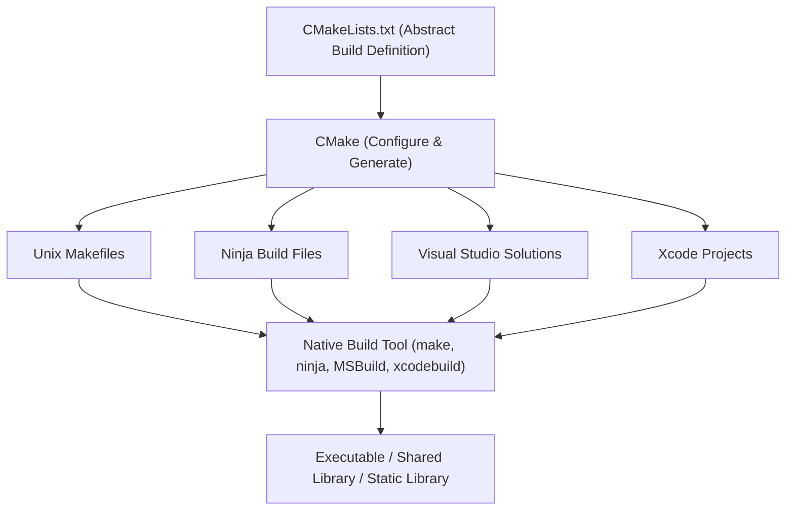
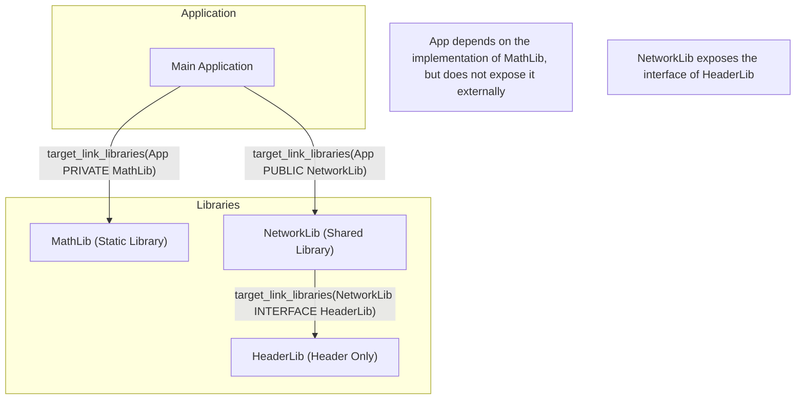
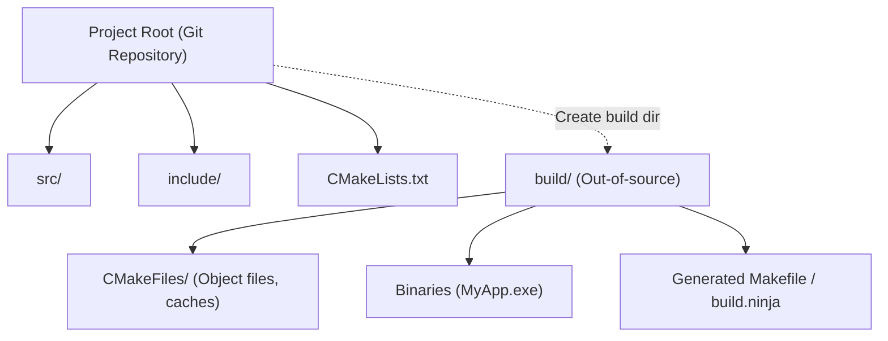

In C++ software development, choosing and setting up a "build system" has long been a source of frustration for many developers. Since C++ does not have an official standard package manager or build system, it was necessary to use different compilers and build tools (such as MSVC, GCC, Clang, Make, Ninja) depending on the platform (Windows, Linux, macOS).

However, **CMake** has now established itself as the de facto industry standard. By utilizing CMake correctly, you can elegantly construct a cross-platform build environment from a single `CMakeLists.txt`.

In this article, we will thoroughly and comprehensively explain the procedure for building a modern, cross-platform C++ build environment using CMake, from the basics to advanced techniques.

## 1. What is CMake? (The Concept of a Meta-Build System)

CMake itself is not a tool that compiles source code directly. CMake is a "system that generates a build system," that is, a **Meta-Build System**.

The main role of CMake is to read abstract configuration files (`CMakeLists.txt`) that do not depend on platforms or compilers, and automatically generate native build scripts optimized for each environment (e.g., `Makefile` for Linux, Visual Studio `.sln` project files for Windows, or the fast `build.ninja`).

The following diagram illustrates the generation process of CMake.



As seen here, by interposing CMake, developers can manage C++ projects without having to worry about the minor differences in commands for each OS.

## 2. Basics of Modern CMake: From Variables to Targets

The notation used in CMake 3.0 and later is called "Modern CMake," and its design philosophy is fundamentally different from the earlier "Legacy CMake." In Legacy CMake, the mainstream approach was to rewrite global variables on a per-directory basis (e.g., using `include_directories()` and `link_libraries()`), but this often caused severe side effects where settings unintentionally propagated to other modules.

In Modern CMake, everything is treated as **Targets** and **Properties**. It is similar to the relationship between classes and member variables in object-oriented programming.

- **Targets**: Executables or Libraries.
- **Properties**: The source files, include directories, compile options, other libraries to link against, etc., required to build that target.

By encapsulating (confining) settings only to specific targets, it becomes possible to define a safe build process that will not break down even in large-scale projects.

### A Minimal `CMakeLists.txt`

First, let's look at the most basic `CMakeLists.txt`.

```cmake
# Specify the minimum required version of CMake
cmake_minimum_required(VERSION 3.20)

# Specify the project name and the language to use
project(MyAwesomeApp VERSION 1.0.0 LANGUAGES CXX)

# Request the C++ standard (C++20)
set(CMAKE_CXX_STANDARD 20)
set(CMAKE_CXX_STANDARD_REQUIRED ON)
set(CMAKE_CXX_EXTENSIONS OFF) # Disable compiler-specific extensions

# Define the executable target
add_executable(MyAwesomeApp main.cpp)
```

With just these few lines, the portable build settings for an executable file requiring C++20 and disabling compiler extensions are complete.

## 3. Dependencies and Scope: PUBLIC / PRIVATE / INTERFACE

The most important and difficult concept to master in Modern CMake is the three access modifiers (scopes): **`PUBLIC`, `PRIVATE`, `INTERFACE`**, used in commands like `target_include_directories` and `target_link_libraries`.

These are used to control whether a target's properties (such as include paths or dependent libraries) are "needed for its own build" and whether they should be "propagated to other targets that depend on it".

1. **`PRIVATE`**: Only needed for the target's own build. Does **not** propagate to dependent targets.
2. **`INTERFACE`**: Not needed for the target's own build, but **does** propagate to dependent targets (used in header-only libraries, etc.).
3. **`PUBLIC`**: Needed for the target's own build, and **does** propagate to dependent targets (`PRIVATE` + `INTERFACE`).

Let's visualize the propagation of dependencies (Usage Requirements) in the diagram below.



### Specific Use Cases of Scope

Suppose a library `MyLib` uses `nlohmann/json` as part of its internal implementation, but does not include `nlohmann/json` in its exposed header file `MyLib.hpp`. In this case, the user (application) of `MyLib` does not need to know about the existence of the JSON library.

```cmake
# Define the library
add_library(MyLib src/MyLib.cpp)

# Specify the include directories for the project
# The include directory is needed by those who use MyLib, so set it to PUBLIC
# The src directory is only used in MyLib's implementation, so set it to PRIVATE
target_include_directories(MyLib
    PUBLIC 
        $<BUILD_INTERFACE:${CMAKE_CURRENT_SOURCE_DIR}/include>
        $<INSTALL_INTERFACE:include>
    PRIVATE
        ${CMAKE_CURRENT_SOURCE_DIR}/src
)

# The json library is only used internally, so link it as PRIVATE
target_link_libraries(MyLib PRIVATE nlohmann_json::nlohmann_json)
```

Conversely, if you write `#include <nlohmann/json.hpp>` in `MyLib.hpp`, the side using `MyLib` will encounter a compilation error unless they also know the JSON header path, so you need to link it as `PUBLIC`. By setting this scope appropriately, you can reduce build times and prevent the leakage of unnecessary dependencies (re-poisoning).

## 4. Out-of-source Build

A best practice that you must follow when using CMake is the **Out-of-source Build**.
This is a method where you do not output any build artifacts (object files or executables) in the directory where the source code is located (the source tree), but rather isolate the build in a separate, dedicated directory (usually `build/`).



With this structure, if you want to reset the build environment, you simply delete the entire `build` directory, and since the source tree is not dirtied, Git management also becomes easier (just add `build/` to `.gitignore`).

### Steps to Execute a Build

With Modern CMake, you can execute a build using common commands that do not depend on the OS or build tool.

```bash
# 1. Configuration and generation (creating the build directory and setting it up)
cmake -S . -B build

# 2. Actual build (compilation and linking)
cmake --build build --config Release

# (Optional) Use the -j option to build with multiple threads
cmake --build build --config Release -j 8
```

Here, `cmake -S . -B build` means "Set the current directory (`.`) as the source directory, and `build` as the build directory."

## 5. How to Introduce Third-Party Libraries

In C++ development, introducing external libraries (third-party libraries) has always been a high hurdle. However, nowadays, the following three approaches are standard.

### 5.1. find_package (Searching for System-Installed Libraries)

This is the most traditional method of finding and linking libraries already installed on the system (e.g., OpenSSL or Zlib).

```cmake
find_package(ZLIB REQUIRED)
if(ZLIB_FOUND)
    target_link_libraries(MyAwesomeApp PRIVATE ZLIB::ZLIB)
endif()
```

### 5.2. FetchContent (Downloading and Incorporating from Source)

This module was introduced in CMake 3.11 and became more powerful in 3.14 and later. It downloads source code directly from an external Git repository or URL during the build and builds it together as part of the project. Since dependencies can be managed centrally, cross-platform reproducibility is extremely high.

Below is an example of introducing GoogleTest using FetchContent.

```cmake
include(FetchContent)

FetchContent_Declare(
  googletest
  GIT_REPOSITORY https://github.com/google/googletest.git
  GIT_TAG        v1.14.0
)

# Incorporate the library into the project
FetchContent_MakeAvailable(googletest)

# Create and link the test executable
add_executable(MyTests test/main.cpp)
target_link_libraries(MyTests PRIVATE gtest_main)
```

### 5.3. Integration with vcpkg

Using **vcpkg**, a C++ package manager led by Microsoft, allows you to easily introduce thousands of libraries. vcpkg is designed to integrate seamlessly with CMake.

By simply specifying the vcpkg toolchain file when running CMake, `find_package` will automatically search for libraries within vcpkg.

```bash
cmake -S . -B build -DCMAKE_TOOLCHAIN_FILE=/path/to/vcpkg/scripts/buildsystems/vcpkg.cmake
```

Furthermore, by placing `vcpkg.json` (manifest mode) in the project root, you can fully automate the version control of the required libraries.

## 6. Compiler Flags for Cross-Platform Support

To successfully build in any environment, whether Windows (MSVC), Linux (GCC/Clang), or macOS (Apple Clang), you need to properly set compiler-specific flags.

By using CMake's **Generator Expressions**, you can declaratively write conditional branching such as, "If the compiler is MSVC, use this flag; otherwise, use that flag." Generator expressions use the syntax `$<...>` and are evaluated when the build system is generated (the Generate phase).

```cmake
# Example of enabling the highest level of warnings on all platforms
target_compile_options(MyAwesomeApp PRIVATE
    # For MSVC
    $<$<CXX_COMPILER_ID:MSVC>:/W4 /WX>
    
    # For GCC or Clang
    $<$<OR:$<CXX_COMPILER_ID:GNU>,$<CXX_COMPILER_ID:Clang>,$<CXX_COMPILER_ID:AppleClang>>:-Wall -Wextra -Wpedantic -Werror>
)
```

By using this method, you can prevent `CMakeLists.txt` from becoming difficult to read due to heavy use of `if(MSVC)`-like conditionals, and allow for flexible configurations per target.

## 7. Setting up a Testing Environment (CTest)

Introducing automated testing is essential for quality assurance in a cross-platform environment. CMake comes standard with a test runner called **CTest**.

The procedure to integrate GoogleTest, introduced earlier via `FetchContent`, with CTest is as follows.

```cmake
# Enable testing capabilities (written once in the root CMakeLists.txt)
enable_testing()

add_executable(MyMathTests test/math_test.cpp)
target_link_libraries(MyMathTests PRIVATE gtest_main MyLib)

# Register as a test in CTest
include(GoogleTest)
gtest_discover_tests(MyMathTests)
```

After building, you can simply run the `ctest` command in the build directory, and all tests will be executed and the results reported.

```bash
cd build
ctest --output-on-failure -C Release
```

## 8. Build System Theory and Mathematical Models

Let's change our perspective slightly and consider the efficiency of build systems and parallel compilation in large-scale projects using a mathematical model.

Reducing build time (compilation time) is an eternal challenge in C++ development. You can reduce build time by splitting the source code and compiling it in parallel. The speed improvement (Speedup) achieved by this parallelization is modeled by **Amdahl's Law**.

If the fraction of the program that can be parallelized is $P$, the fraction that must be executed sequentially (cannot be parallelized) is $1-P$, and the number of processors used is $N$, the overall theoretical maximum speedup factor $S(N)$ is expressed by the following formula:

$$ S(N) = \frac{1}{(1 - P) + \frac{P}{N}} $$

In the C++ build process, "compiling each `.cpp` file to `.o` or `.obj`" is independent and parallelizable (the $P$ part), but "the final combining process by the Linker" is basically executed sequentially (the $1-P$ part).

Therefore, no matter how many CPU cores you provide ($N \to \infty$), as long as the bottleneck of link time exists, the maximum speedup factor will asymptote to the following formula:

$$ \lim_{N \to \infty} S(N) = \frac{1}{1 - P} $$

What this formula suggests is that "simply increasing the number of CPU cores has a limit in reducing build time." In Modern CMake, properly distinguishing between `PRIVATE` and `INTERFACE`, and minimizing header file dependencies (such as by utilizing forward declarations) to increase the proportion of $P$ and reduce the targets for recompilation during an incremental build, is practically the most effective strategy for speeding up builds.

Also, to reduce link time, it is important to switch from Static Libraries to Shared Libraries / DLLs, or to adopt a fast linker such as LLD or Mold.

In CMake, you can easily specify the linker as follows:

```cmake
# Set to use the lld linker in a Clang/GCC environment
if(UNIX AND NOT APPLE)
    target_link_options(MyAwesomeApp PRIVATE "-fuse-ld=lld")
endif()
```

## 9. Practical Example of a Complex Directory Structure

In actual application development, the directory structure will be a combination of numerous modules. Finally, we show an ideal directory structure for a medium-sized project and the relationship between parent and child `CMakeLists.txt` files.

```text
ProjectRoot/
├── CMakeLists.txt (Root: Overall project definitions)
├── vcpkg.json     (Dependency library definitions)
├── external/      (External modules)
├── include/       (Public headers)
│   └── myapp/
├── src/           (Source code and internal build definitions)
│   ├── CMakeLists.txt
│   ├── main.cpp
│   ├── math/
│   │   ├── CMakeLists.txt
│   │   ├── Vector3.hpp
│   │   └── Vector3.cpp
│   └── network/
│       ├── CMakeLists.txt
│       └── NetworkManager.cpp
└── tests/         (Test code)
    ├── CMakeLists.txt
    └── math_test.cpp
```

The root `CMakeLists.txt` only performs environment settings and overall option definitions, and adds subdirectories using `add_subdirectory()`.

**Root `CMakeLists.txt`**:
```cmake
cmake_minimum_required(VERSION 3.20)
project(ComplexApp LANGUAGES CXX)

# Global settings
set(CMAKE_CXX_STANDARD 20)
set(CMAKE_CXX_STANDARD_REQUIRED ON)

# Enable testing
enable_testing()

# Add subdirectories
add_subdirectory(src)
add_subdirectory(tests)
```

**`src/CMakeLists.txt`**:
```cmake
# Add each module
add_subdirectory(math)
add_subdirectory(network)

# Final executable
add_executable(ComplexApp main.cpp)

# Link modules
target_link_libraries(ComplexApp
    PRIVATE
        MathLib
        NetworkLib
)
```

By splitting the `CMakeLists.txt` for each directory in this way and defining them as dependencies between targets, the reusability of modules increases, and the build parallelization also improves. This is the true worth of the "modular build environment" advocated by Modern CMake.

## 10. Conclusion

We have explained the procedure for building a cross-platform C++ build environment using CMake.
Let's review the key points.

1. **Understanding the Meta-Build System**: CMake is a tool for generating build scripts.
2. **Commitment to Modern CMake**: Avoid using variables, and encapsulate settings in a **target-oriented** manner using `add_executable`, `target_link_libraries`, `target_include_directories`, etc.
3. **Appropriate Scope Settings**: Properly distinguish between `PUBLIC`, `PRIVATE`, and `INTERFACE` to control the propagation of dependencies.
4. **Strict Use of Out-of-source Builds**: Perform builds inside the `build/` directory so as not to dirty the source tree.
5. **Third-Party Integration**: Fully utilize `FetchContent` and `vcpkg` to automate the resolution of dependency libraries.
6. **Utilization of Generator Expressions**: Smartly absorb differences in flags across compilers.
7. **Mathematical Approach**: Be mindful of Amdahl's Law, reduce dependencies, and increase the efficiency of parallel compilation.

CMake might seem difficult to understand at first, but once you grasp the concepts of targets and properties, you will be able to maintain a well-organized build environment, no matter how complex or large your C++ project may be. We hope you will use this article as a reference to construct your C++ development environment using the latest Modern CMake notation.
