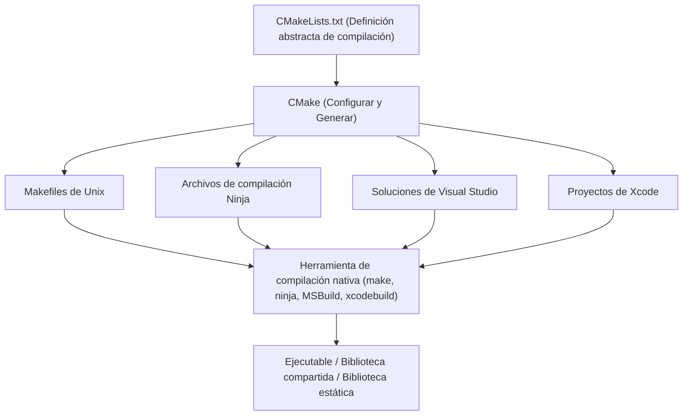
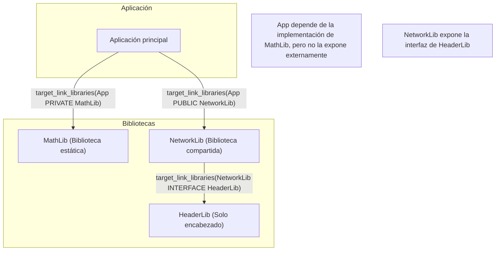
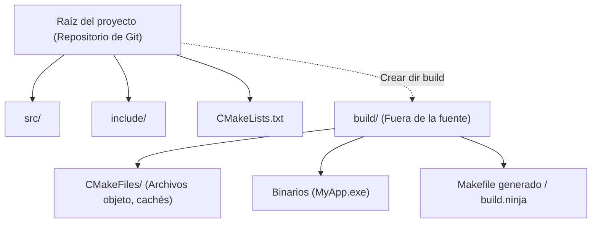

En el desarrollo de software con C++, la elección y construcción de un "sistema de compilación" ha sido un dolor de cabeza para muchos desarrolladores durante años. Dado que C++ no tiene un gestor de paquetes o sistema de compilación estándar oficial, era necesario utilizar diferentes compiladores y herramientas de compilación (MSVC, GCC, Clang, Make, Ninja, etc.) dependiendo de la plataforma (Windows, Linux, macOS).

Sin embargo, en la actualidad, **CMake** se ha establecido como el estándar de facto de la industria, y al usar CMake correctamente, ahora es posible construir elegantemente un entorno de compilación multiplataforma desde un único `CMakeLists.txt`.

En este artículo, explicaremos de forma exhaustiva y detallada los pasos para construir un entorno de compilación de C++ multiplataforma utilizando CMake moderno, desde lo básico hasta técnicas avanzadas.

## 1. ¿Qué es CMake? (El concepto de metasistema de compilación)

CMake no es una herramienta que compila código fuente directamente por sí misma. CMake es un "sistema que genera sistemas de compilación", es decir, un **metasistema de compilación (Meta-Build System)**.

La función principal de CMake es leer un archivo de configuración abstracto (`CMakeLists.txt`) que no depende de la plataforma o el compilador, y generar automáticamente los scripts de compilación nativos óptimos para cada entorno (por ejemplo, `Makefile` para Linux, el archivo de proyecto `.sln` de Visual Studio para Windows, o el rápido `build.ninja`).

El siguiente diagrama muestra el proceso de generación de CMake.



De esta manera, al usar CMake como intermediario, los desarrolladores pueden gestionar proyectos C++ sin tener que preocuparse por las diferencias menores en los comandos de cada sistema operativo.

## 2. Conceptos básicos de CMake moderno: De variables a objetivos (targets)

La notación de CMake 3.0 en adelante se llama "CMake moderno", y su filosofía de diseño es fundamentalmente diferente de la anterior (CMake heredado). En CMake heredado, el enfoque principal era sobrescribir variables globales por directorio (por ejemplo, usando `include_directories()` y `link_libraries()`), pero esto a menudo causaba efectos secundarios graves donde las configuraciones se propagaban accidentalmente a otros módulos.

En CMake moderno, todo se trata como **objetivos (Targets)** y **propiedades (Properties)**. Es similar a la relación entre clases y variables miembro en la programación orientada a objetos.

- **Objetivo (Target)**: Archivos ejecutables (Executable) y bibliotecas (Library).
- **Propiedad (Property)**: Archivos fuente, directorios de inclusión, opciones de compilación, otras bibliotecas a enlazar, etc., necesarios para compilar ese objetivo.

Al encapsular (confinar) la configuración solo en objetivos específicos, es posible crear definiciones de compilación seguras que no fallen ni siquiera en proyectos a gran escala.

### El `CMakeLists.txt` mínimo

Primero, echemos un vistazo al `CMakeLists.txt` más básico.

```cmake
# Especifica la versión mínima requerida de CMake
cmake_minimum_required(VERSION 3.20)

# Especifica el nombre del proyecto y el lenguaje utilizado
project(MyAwesomeApp VERSION 1.0.0 LANGUAGES CXX)

# Requiere el estándar de C++ (C++20)
set(CMAKE_CXX_STANDARD 20)
set(CMAKE_CXX_STANDARD_REQUIRED ON)
set(CMAKE_CXX_EXTENSIONS OFF) # Desactiva las extensiones específicas del compilador

# Definición del objetivo ejecutable
add_executable(MyAwesomeApp main.cpp)
```

Con estas pocas líneas, se completa la configuración de compilación de un archivo ejecutable portátil que requiere C++20 y desactiva las extensiones del compilador.

## 3. Dependencias y alcance: PUBLIC / PRIVATE / INTERFACE

El concepto más importante y difícil para dominar CMake moderno es el de los tres modificadores de acceso (alcances): **`PUBLIC`, `PRIVATE` e `INTERFACE`**, que se utilizan en comandos como `target_include_directories` y `target_link_libraries`.

Estos controlan si las propiedades de un objetivo (rutas de inclusión o bibliotecas dependientes) son "necesarias para su propia compilación" y si deben "propagarse a otros objetivos que dependen de él".

1. **`PRIVATE`**: Necesario solo para la propia compilación del objetivo. **No** se propaga a los objetivos dependientes.
2. **`INTERFACE`**: No es necesario para la propia compilación del objetivo, pero **sí** se propaga para compilar los objetivos dependientes (utilizado en bibliotecas solo de encabezado, etc.).
3. **`PUBLIC`**: Necesario para la propia compilación del objetivo, y también se **propaga** a los objetivos dependientes (`PRIVATE` + `INTERFACE`).

Visualicemos la propagación de dependencias (propagación de requisitos de uso) con el siguiente diagrama.



### Ejemplo específico del uso del alcance

Supongamos que una biblioteca `MyLib` usa `nlohmann/json` como implementación interna y no incluye `nlohmann/json` en su archivo de encabezado público `MyLib.hpp`. En este caso, el usuario de `MyLib` (la aplicación) no necesita conocer la existencia de la biblioteca JSON.

```cmake
# Definición de la biblioteca
add_library(MyLib src/MyLib.cpp)

# Especificación de los directorios de inclusión del propio proyecto
# El directorio include es necesario para los usuarios de MyLib, por lo que es PUBLIC
# El directorio src solo se usa en la implementación de MyLib, por lo que es PRIVATE
target_include_directories(MyLib
    PUBLIC 
        $<BUILD_INTERFACE:${CMAKE_CURRENT_SOURCE_DIR}/include>
        $<INSTALL_INTERFACE:include>
    PRIVATE
        ${CMAKE_CURRENT_SOURCE_DIR}/src
)

# La biblioteca json se usa solo en la implementación interna, por lo que se enlaza como PRIVATE
target_link_libraries(MyLib PRIVATE nlohmann_json::nlohmann_json)
```

Por el contrario, si escribe `#include <nlohmann/json.hpp>` dentro de `MyLib.hpp`, el usuario de `MyLib` también debe conocer la ruta del encabezado de JSON o se producirá un error de compilación, por lo que debe enlazarse como `PUBLIC`. Al establecer este alcance adecuadamente, puede acortar el tiempo de compilación y evitar la fuga de dependencias innecesarias.

## 4. Compilación fuera de la fuente (Out-of-source Build)

Una mejor práctica que siempre se debe seguir al usar CMake es la **compilación fuera de la fuente**.
Este es un método en el que los artefactos de compilación (archivos objeto y archivos ejecutables) no se generan en absoluto en el directorio donde se encuentra el código fuente (árbol de fuentes), sino que se separan en un directorio dedicado diferente (generalmente `build/`) para la compilación.



Con esta configuración, si desea restablecer el entorno de compilación, solo necesita eliminar el directorio `build` por completo, y dado que el árbol de fuentes no se contamina, la gestión con Git también es más fácil (solo necesita agregar `build/` al `.gitignore`).

### Pasos para ejecutar la compilación

En CMake moderno, puede ejecutar la compilación con comandos comunes que no dependen del sistema operativo o la herramienta de compilación.

```bash
# 1. Configuración y generación (creando el directorio de compilación y configurando)
cmake -S . -B build

# 2. Compilación real (compilación y enlace)
cmake --build build --config Release

# (Opcional) Usar la opción -j para compilación multihilo
cmake --build build --config Release -j 8
```

Aquí, `cmake -S . -B build` significa "establecer el directorio actual (`.`) como directorio fuente y `build` como directorio de compilación".

## 5. Cómo integrar bibliotecas de terceros

En el desarrollo de C++, la integración de bibliotecas externas (bibliotecas de terceros) siempre ha sido un gran obstáculo. Sin embargo, hoy en día, los siguientes 3 enfoques son principalmente el estándar.

### 5.1. find_package (Búsqueda de bibliotecas instaladas en el sistema)

Este es el método más tradicional para encontrar y enlazar bibliotecas que ya están instaladas en el sistema (por ejemplo, OpenSSL, Zlib, etc.).

```cmake
find_package(ZLIB REQUIRED)
if(ZLIB_FOUND)
    target_link_libraries(MyAwesomeApp PRIVATE ZLIB::ZLIB)
endif()
```

### 5.2. FetchContent (Descarga desde el código fuente e integración)

Este es un módulo introducido en CMake 3.11 y mejorado desde la versión 3.14. Durante la compilación, descarga el código fuente directamente desde un repositorio de Git externo o URL, y lo compila junto como parte del proyecto. Dado que las dependencias se pueden administrar de forma centralizada, la reproducibilidad multiplataforma es extremadamente alta.

El siguiente es un ejemplo de cómo integrar GoogleTest usando FetchContent.

```cmake
include(FetchContent)

FetchContent_Declare(
  googletest
  GIT_REPOSITORY https://github.com/google/googletest.git
  GIT_TAG        v1.14.0
)

# Integrar la biblioteca en el proyecto
FetchContent_MakeAvailable(googletest)

# Creación y enlace de archivo ejecutable para pruebas
add_executable(MyTests test/main.cpp)
target_link_libraries(MyTests PRIVATE gtest_main)
```

### 5.3. Integración con vcpkg

Al usar el gestor de paquetes para C++ **vcpkg**, liderado por Microsoft, puede integrar fácilmente miles de bibliotecas. vcpkg está diseñado para integrarse perfectamente con CMake.

Simplemente especificando el archivo de cadena de herramientas de vcpkg al ejecutar CMake, `find_package` buscará automáticamente las bibliotecas dentro de vcpkg.

```bash
cmake -S . -B build -DCMAKE_TOOLCHAIN_FILE=/path/to/vcpkg/scripts/buildsystems/vcpkg.cmake
```

Además, al colocar `vcpkg.json` (modo de manifiesto) en la raíz del proyecto, puede automatizar completamente el control de versiones de las bibliotecas necesarias.

## 6. Banderas del compilador multiplataforma

Para que la compilación se complete en cualquiera de los entornos Windows (MSVC), Linux (GCC/Clang) y macOS (Apple Clang), es necesario establecer adecuadamente las banderas específicas del compilador.

Al usar las **expresiones de generador (Generator Expressions)** de CMake, puede describir declarativamente bifurcaciones condicionales como "si el compilador es MSVC, esta bandera, de lo contrario, aquella bandera". Las expresiones de generador utilizan la sintaxis `$<...>` y se evalúan durante la generación del sistema de compilación (fase Generate).

```cmake
# Ejemplo de habilitación del nivel máximo de advertencias en todas las plataformas
target_compile_options(MyAwesomeApp PRIVATE
    # En el caso de MSVC
    $<$<CXX_COMPILER_ID:MSVC>:/W4 /WX>
    
    # En el caso de GCC o Clang
    $<$<OR:$<CXX_COMPILER_ID:GNU>,$<CXX_COMPILER_ID:Clang>,$<CXX_COMPILER_ID:AppleClang>>:-Wall -Wextra -Wpedantic -Werror>
)
```

El uso de este método evita que `CMakeLists.txt` se vuelva difícil de leer debido al uso frecuente de bifurcaciones condicionales como `if(MSVC)`, y permite una configuración flexible para cada objetivo.

## 7. Construcción del entorno de pruebas (CTest)

En el aseguramiento de la calidad en un entorno multiplataforma, la introducción de pruebas automáticas es indispensable. CMake incluye un ejecutor de pruebas llamado **CTest** de serie.

Los pasos para integrar GoogleTest, que se introdujo anteriormente con `FetchContent`, con CTest son los siguientes:

```cmake
# Habilitar la funcionalidad de pruebas (escribir solo una vez en el CMakeLists.txt de la raíz)
enable_testing()

add_executable(MyMathTests test/math_test.cpp)
target_link_libraries(MyMathTests PRIVATE gtest_main MyLib)

# Registrar como prueba en CTest
include(GoogleTest)
gtest_discover_tests(MyMathTests)
```

Después de la compilación, simplemente ejecute el comando `ctest` dentro del directorio de compilación para ejecutar todas las pruebas y reportar los resultados.

```bash
cd build
ctest --output-on-failure -C Release
```

## 8. Teoría y modelo matemático de los sistemas de compilación

Aquí, cambiando un poco la perspectiva, consideremos la eficiencia de los sistemas de compilación y la compilación en paralelo en proyectos a gran escala utilizando un modelo matemático.

La reducción del tiempo de compilación (tiempo de compilación) es un desafío eterno en el desarrollo de C++. Al dividir el código fuente y compilar en paralelo, se puede reducir el tiempo de compilación. Esta mejora de velocidad (Speedup) debida a la paralelización se modela mediante la **Ley de Amdahl (Amdahl's Law)**.

Si la proporción de la parte de un programa que se puede paralelizar es $P$, la proporción de la parte que debe ejecutarse secuencialmente (no paralelizable) es $1-P$, y el número de procesadores utilizados es $N$, entonces la tasa de mejora de velocidad máxima teórica general $S(N)$ se expresa con la siguiente fórmula:

$$ S(N) = \frac{1}{(1 - P) + \frac{P}{N}} $$

En el proceso de compilación de C++, la "compilación de cada archivo `.cpp` a `.o` u `.obj`" es independiente y paralelizable (la parte de $P$), pero el "proceso de enlace final (Linker)" se realiza básicamente de forma secuencial (la parte de $1-P$).

Por lo tanto, no importa cuántos núcleos de CPU ($N \to \infty$) se proporcionen, mientras exista el cuello de botella del tiempo de enlace, la tasa de mejora de velocidad máxima se acercará asintóticamente a la siguiente fórmula:

$$ \lim_{N \to \infty} S(N) = \frac{1}{1 - P} $$

Lo que esta fórmula sugiere es que "simplemente aumentar los núcleos de la CPU tiene un límite en la reducción del tiempo de compilación". Al utilizar adecuadamente `PRIVATE` e `INTERFACE` en CMake moderno y minimizar las dependencias de los archivos de encabezado (utilizando declaraciones anticipadas, etc.), aumentar la proporción de $P$ y reducir los objetivos de recompilación durante la compilación incremental se convierte en la estrategia de aceleración de compilación más efectiva en la práctica.

Además, para reducir el tiempo de enlace, es importante cambiar de bibliotecas estáticas (Static Library) a bibliotecas compartidas / DLL (Shared Library), e incorporar enlazadores rápidos como LLD / Mold.

En CMake, puede especificar fácilmente el enlazador de la siguiente manera:

```cmake
# Configurar para usar el enlazador lld en el entorno Clang/GCC
if(UNIX AND NOT APPLE)
    target_link_options(MyAwesomeApp PRIVATE "-fuse-ld=lld")
endif()
```

## 9. Ejemplo práctico de una estructura de directorios compleja

En el desarrollo real de aplicaciones, la estructura de directorios es una combinación de múltiples módulos. Por último, mostraremos la estructura de directorios ideal para un proyecto de mediana escala y la relación entre los `CMakeLists.txt` padre e hijo.

```text
ProjectRoot/
├── CMakeLists.txt (Root: Definición de todo el proyecto)
├── vcpkg.json     (Definición de bibliotecas dependientes)
├── external/      (Módulos externos)
├── include/       (Encabezados públicos)
│   └── myapp/
├── src/           (Código fuente y definiciones de compilación internas)
│   ├── CMakeLists.txt
│   ├── main.cpp
│   ├── math/
│   │   ├── CMakeLists.txt
│   │   ├── Vector3.hpp
│   │   └── Vector3.cpp
│   └── network/
│       ├── CMakeLists.txt
│       └── NetworkManager.cpp
└── tests/         (Código de prueba)
    ├── CMakeLists.txt
    └── math_test.cpp
```

El `CMakeLists.txt` raíz solo realiza configuraciones de entorno y definiciones de opciones globales, y agrega subdirectorios con `add_subdirectory()`.

**`CMakeLists.txt` raíz**:
```cmake
cmake_minimum_required(VERSION 3.20)
project(ComplexApp LANGUAGES CXX)

# Configuración global
set(CMAKE_CXX_STANDARD 20)
set(CMAKE_CXX_STANDARD_REQUIRED ON)

# Habilitar pruebas
enable_testing()

# Agregar subdirectorios
add_subdirectory(src)
add_subdirectory(tests)
```

**`src/CMakeLists.txt`**:
```cmake
# Agregar cada módulo
add_subdirectory(math)
add_subdirectory(network)

# Archivo ejecutable final
add_executable(ComplexApp main.cpp)

# Enlace de módulos
target_link_libraries(ComplexApp
    PRIVATE
        MathLib
        NetworkLib
)
```

Al dividir el `CMakeLists.txt` por directorio y definir dependencias entre objetivos de esta manera, aumenta la reutilización de los módulos y también mejora el paralelismo de la compilación. Esta es la verdadera esencia del "entorno de compilación modularizado" defendido por CMake moderno.

## 10. Resumen

Hemos explicado los pasos para construir un entorno de compilación de C++ multiplataforma utilizando CMake.
Repasemos los puntos clave.

1. **Comprensión del metasistema de compilación**: CMake es una herramienta que genera scripts de compilación.
2. **Implementación de CMake moderno**: No usar variables, y encapsular la configuración en una forma **orientada a objetivos** con comandos como `add_executable`, `target_link_libraries` y `target_include_directories`.
3. **Configuración adecuada del alcance**: Usar correctamente `PUBLIC`, `PRIVATE` e `INTERFACE` para controlar la propagación de dependencias.
4. **Compilación estricta fuera de la fuente**: Compilar dentro del directorio `build/` y no ensuciar el árbol de fuentes.
5. **Integración con terceros**: Utilizar `FetchContent` y `vcpkg` para automatizar la resolución de bibliotecas dependientes.
6. **Uso de expresiones de generador**: Absorber inteligentemente las diferencias en las banderas de cada compilador.
7. **Enfoque matemático**: Ser consciente de la Ley de Amdahl, reducir las dependencias y aumentar la eficiencia de la compilación en paralelo.

CMake puede parecer difícil al principio, pero una vez que comprenda los conceptos de objetivos y propiedades, podrá mantener un entorno de compilación ordenado, sin importar cuán complejo y grande sea su proyecto C++. Esperamos que utilice este artículo como referencia y construya su entorno de desarrollo en C++ con la sintaxis más reciente de CMake moderno.
