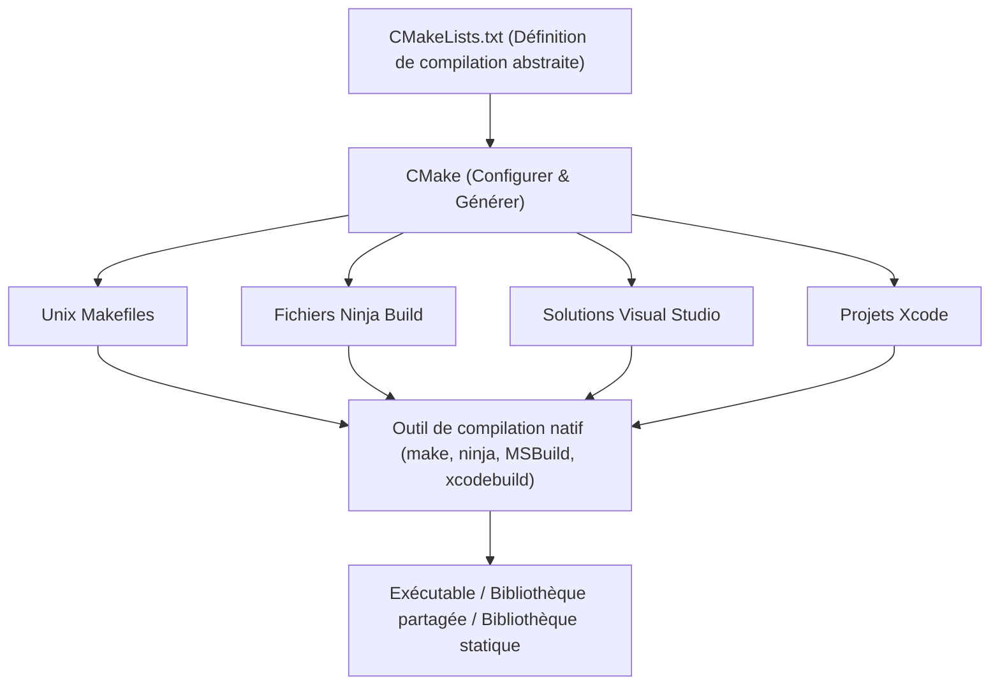
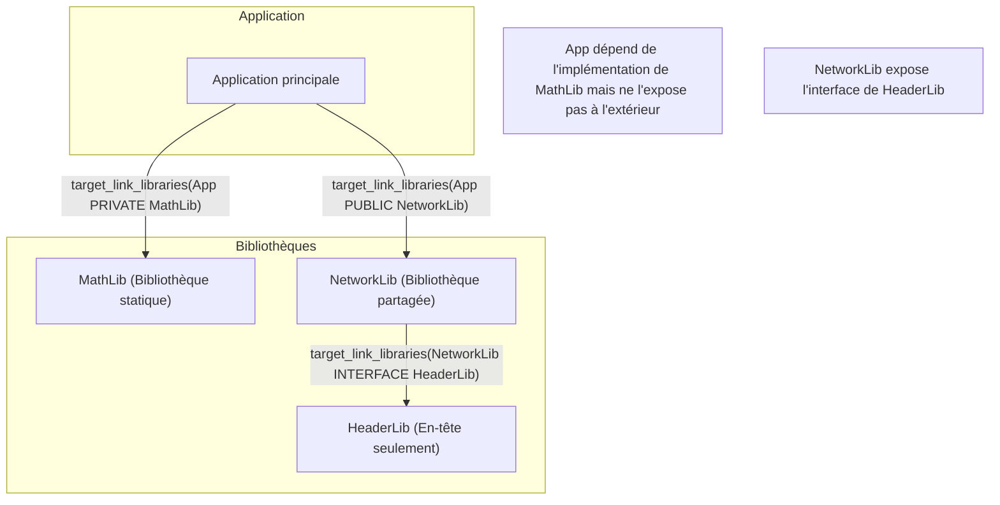
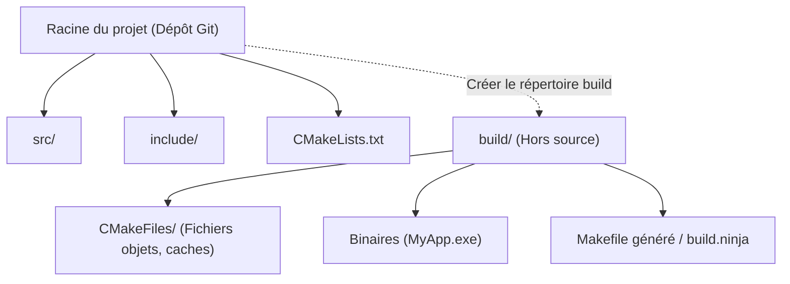

Dans le développement de logiciels en C++, le choix et la configuration du « système de compilation » (build system) ont longtemps été un casse-tête pour de nombreux développeurs. Comme le C++ n'a pas de gestionnaire de paquets ou de système de compilation standard officiel, il était nécessaire d'utiliser différents compilateurs et outils de compilation (MSVC, GCC, Clang, Make, Ninja, etc.) selon la plateforme (Windows, Linux, macOS).

Cependant, aujourd'hui, **CMake** s'est imposé comme le standard de facto de l'industrie. En utilisant correctement CMake, il est devenu possible de configurer élégamment un environnement de compilation multiplateforme à partir d'un seul `CMakeLists.txt`.

Dans cet article, nous expliquerons en détail et de manière exhaustive les étapes de configuration d'un environnement de compilation C++ multiplateforme en utilisant la version la plus récente de CMake (Modern CMake), des bases jusqu'aux techniques avancées.

## 1. Qu'est-ce que CMake ? (Le concept de méta-système de compilation)

CMake n'est pas un outil qui compile directement le code source par lui-même. CMake est un « système qui génère des systèmes de compilation », c'est-à-dire un **méta-système de compilation (Meta-Build System)**.

Le rôle principal de CMake est de lire un fichier de configuration abstrait, indépendant de la plateforme et du compilateur (`CMakeLists.txt`), et de générer automatiquement les scripts de compilation natifs optimaux pour chaque environnement (par exemple : `Makefile` pour Linux, les fichiers de projet `.sln` de Visual Studio pour Windows, ou le rapide `build.ninja`).

Le schéma suivant illustre le processus de génération de CMake.



De cette façon, en interposant CMake, les développeurs peuvent gérer des projets C++ sans avoir à se soucier des légères différences de commandes entre les systèmes d'exploitation.

## 2. Les bases du Modern CMake : Des variables aux cibles (Targets)

La syntaxe à partir de CMake 3.0 est appelée « Modern CMake » et a une philosophie de conception fondamentalement différente des versions antérieures (Legacy CMake). Dans Legacy CMake, l'approche dominante consistait à écraser des variables globales au niveau des répertoires (par exemple en utilisant `include_directories()` et `link_libraries()`), ce qui entraînait souvent des effets secondaires graves où les paramètres se propageaient involontairement à d'autres modules.

Dans le Modern CMake, tout est traité comme des **Cibles (Targets)** et des **Propriétés (Properties)**. C'est similaire à la relation entre les classes et les variables membres dans la programmation orientée objet.

- **Cible (Target)** : Fichier exécutable (Executable) ou bibliothèque (Library).
- **Propriété (Property)** : Fichiers sources nécessaires pour compiler cette cible, répertoires d'inclusion, options de compilation, autres bibliothèques à lier, etc.

En encapsulant (isolant) la configuration uniquement à une cible spécifique, il devient possible de créer des définitions de compilation sûres qui ne s'effondrent pas, même dans les projets à grande échelle.

### Un `CMakeLists.txt` minimal

Tout d'abord, regardons le `CMakeLists.txt` le plus basique.

```cmake
# Spécifier la version minimale requise de CMake
cmake_minimum_required(VERSION 3.20)

# Spécifier le nom du projet et les langages utilisés
project(MyAwesomeApp VERSION 1.0.0 LANGUAGES CXX)

# Exiger la norme C++ (C++20)
set(CMAKE_CXX_STANDARD 20)
set(CMAKE_CXX_STANDARD_REQUIRED ON)
set(CMAKE_CXX_EXTENSIONS OFF) # Désactiver les extensions spécifiques au compilateur

# Définition de la cible exécutable
add_executable(MyAwesomeApp main.cpp)
```

En seulement ces quelques lignes, la configuration de la compilation d'un fichier exécutable portable nécessitant C++20 et désactivant les extensions du compilateur est terminée.

## 3. Dépendances et portée (Scope) : PUBLIC / PRIVATE / INTERFACE

Le concept le plus important et le plus difficile à maîtriser dans le Modern CMake est l'utilisation des trois modificateurs d'accès (portées) **`PUBLIC`, `PRIVATE`, `INTERFACE`**, utilisés dans des commandes comme `target_include_directories` et `target_link_libraries`.

Ceux-ci servent à contrôler si les propriétés d'une cible (chemins d'inclusion et bibliothèques dépendantes) sont « nécessaires pour sa propre compilation ? » et si elles « doivent être propagées aux autres cibles qui en dépendent ? ».

1. **`PRIVATE`** : Nécessaire uniquement pour la compilation de la cible elle-même. Ne se propage **pas** aux cibles dépendantes.
2. **`INTERFACE`** : Inutile pour la compilation de la cible elle-même, mais se propage **aux** cibles dépendantes (utilisé pour les bibliothèques d'en-têtes seuls (header-only), par exemple).
3. **`PUBLIC`** : Nécessaire pour la compilation de la cible elle-même ET se propage **aux** cibles dépendantes (`PRIVATE` + `INTERFACE`).

Visualisons la propagation des dépendances (propagation des Exigences d'Utilisation - Usage Requirements) avec le schéma suivant.



### Exemples d'utilisation concrets de la portée

Supposons qu'une bibliothèque `MyLib` utilise `nlohmann/json` comme implémentation interne, mais n'inclut pas `nlohmann/json` dans son fichier d'en-tête public `MyLib.hpp`. Dans ce cas, l'utilisateur (l'application) de `MyLib` n'a pas besoin de connaître l'existence de la bibliothèque JSON.

```cmake
# Définition de la bibliothèque
add_library(MyLib src/MyLib.cpp)

# Spécification du répertoire d'inclusion du projet lui-même
# Le répertoire include est nécessaire pour ceux qui utilisent MyLib, on utilise donc PUBLIC
# Le répertoire src n'est utilisé que pour l'implémentation de MyLib, on utilise donc PRIVATE
target_include_directories(MyLib
    PUBLIC 
        $<BUILD_INTERFACE:${CMAKE_CURRENT_SOURCE_DIR}/include>
        $<INSTALL_INTERFACE:include>
    PRIVATE
        ${CMAKE_CURRENT_SOURCE_DIR}/src
)

# La bibliothèque json n'est utilisée que dans l'implémentation interne, on la lie donc avec PRIVATE
target_link_libraries(MyLib PRIVATE nlohmann_json::nlohmann_json)
```

À l'inverse, si vous écrivez `#include <nlohmann/json.hpp>` dans `MyLib.hpp`, ceux qui utilisent `MyLib` doivent également connaître le chemin d'en-tête de JSON, sinon une erreur de compilation se produira. Vous devez donc le lier avec `PUBLIC`. En définissant ces portées de manière appropriée, vous pouvez réduire les temps de compilation et éviter la fuite de dépendances inutiles.

## 4. Compilation hors source (Out-of-source Build)

La meilleure pratique à respecter impérativement lors de l'utilisation de CMake est la **compilation hors source** (Out-of-source build).
Il s'agit d'une méthode où aucun artefact de compilation (fichiers objets ou fichiers exécutables) n'est généré dans le répertoire où se trouve le code source (l'arborescence des sources), mais ils sont isolés dans un répertoire dédié distinct (généralement `build/`) pour effectuer la compilation.



Avec cette configuration, si vous souhaitez réinitialiser l'environnement de compilation, il vous suffit de supprimer entièrement le répertoire `build`. Comme l'arborescence des sources reste propre, la gestion avec Git est également simplifiée (il suffit d'ajouter `build/` à `.gitignore`).

### Procédure d'exécution de la compilation

Avec le Modern CMake, vous pouvez exécuter la compilation à l'aide d'une commande commune indépendante du système d'exploitation ou de l'outil de compilation.

```bash
# 1. Configuration et génération (création du répertoire de build et configuration)
cmake -S . -B build

# 2. Compilation réelle (compilation et liaison)
cmake --build build --config Release

# (Optionnel) Pour compiler en multithread, utilisez l'option -j
cmake --build build --config Release -j 8
```

Ici, `cmake -S . -B build` signifie « définir le répertoire actuel (`.`) comme répertoire source et `build` comme répertoire de compilation ».

## 5. Comment introduire des bibliothèques tierces

Dans le développement C++, l'introduction de bibliothèques externes (bibliothèques tierces) a toujours été un obstacle. Cependant, aujourd'hui, les trois approches suivantes sont principalement standard.

### 5.1. find_package (Recherche de bibliothèques installées sur le système)

C'est la méthode la plus traditionnelle pour trouver et lier des bibliothèques déjà installées sur le système (par exemple : OpenSSL ou Zlib).

```cmake
find_package(ZLIB REQUIRED)
if(ZLIB_FOUND)
    target_link_libraries(MyAwesomeApp PRIVATE ZLIB::ZLIB)
endif()
```

### 5.2. FetchContent (Téléchargement et intégration à partir du code source)

Il s'agit d'un module introduit dans CMake 3.11 et devenu puissant à partir de la version 3.14. Il télécharge directement le code source depuis un dépôt Git externe ou une URL au moment de la compilation et le compile avec votre projet. Comme il permet de centraliser la gestion des dépendances, la reproductibilité multiplateforme est extrêmement élevée.

Voici un exemple de l'introduction de GoogleTest à l'aide de FetchContent.

```cmake
include(FetchContent)

FetchContent_Declare(
  googletest
  GIT_REPOSITORY https://github.com/google/googletest.git
  GIT_TAG        v1.14.0
)

# Intégrer la bibliothèque dans le projet
FetchContent_MakeAvailable(googletest)

# Création et liaison de l'exécutable pour les tests
add_executable(MyTests test/main.cpp)
target_link_libraries(MyTests PRIVATE gtest_main)
```

### 5.3. Intégration avec vcpkg

En utilisant **vcpkg**, le gestionnaire de paquets pour C++ dirigé par Microsoft, vous pouvez facilement introduire des milliers de bibliothèques. vcpkg est conçu pour s'intégrer de manière transparente à CMake.

Lors de l'exécution de CMake, il suffit de spécifier le fichier de toolchain de vcpkg pour que `find_package` recherche automatiquement les bibliothèques dans vcpkg.

```bash
cmake -S . -B build -DCMAKE_TOOLCHAIN_FILE=/path/to/vcpkg/scripts/buildsystems/vcpkg.cmake
```

De plus, en plaçant un fichier `vcpkg.json` (mode manifeste) à la racine du projet, vous pouvez automatiser complètement la gestion des versions des bibliothèques nécessaires.

## 6. Drapeaux de compilateur compatibles multiplateformes (Compiler flags)

Pour que la compilation réussisse dans n'importe quel environnement, qu'il s'agisse de Windows (MSVC), Linux (GCC/Clang) ou macOS (Apple Clang), il est nécessaire de configurer de manière appropriée les drapeaux spécifiques au compilateur.

En utilisant les **expressions génératrices (Generator Expressions)** de CMake, vous pouvez décrire de manière déclarative des branchements conditionnels tels que « si le compilateur est MSVC, utilisez ce drapeau, sinon, utilisez celui-ci ». Les expressions génératrices utilisent la syntaxe `$<...>` et sont évaluées lors de la génération du système de compilation (phase Generate).

```cmake
# Exemple pour activer le plus haut niveau d'avertissement sur toutes les plateformes
target_compile_options(MyAwesomeApp PRIVATE
    # Pour MSVC
    $<$<CXX_COMPILER_ID:MSVC>:/W4 /WX>
    
    # Pour GCC ou Clang
    $<$<OR:$<CXX_COMPILER_ID:GNU>,$<CXX_COMPILER_ID:Clang>,$<CXX_COMPILER_ID:AppleClang>>:-Wall -Wextra -Wpedantic -Werror>
)
```

En utilisant cette méthode, on évite d'utiliser excessivement des branchements conditionnels comme `if(MSVC)`, ce qui rendrait le `CMakeLists.txt` difficile à lire. Cela permet également des configurations flexibles cible par cible.

## 7. Configuration de l'environnement de test (CTest)

L'introduction de tests automatisés est indispensable pour l'assurance qualité dans un environnement multiplateforme. CMake est livré en standard avec un exécuteur de tests appelé **CTest**.

La procédure pour intégrer GoogleTest (introduit via `FetchContent` précédemment) avec CTest est la suivante.

```cmake
# Activer la fonctionnalité de test (à écrire une seule fois dans le CMakeLists.txt racine)
enable_testing()

add_executable(MyMathTests test/math_test.cpp)
target_link_libraries(MyMathTests PRIVATE gtest_main MyLib)

# Enregistrer en tant que test dans CTest
include(GoogleTest)
gtest_discover_tests(MyMathTests)
```

Après la compilation, il suffit d'exécuter la commande `ctest` dans le répertoire de compilation pour lancer tous les tests et obtenir un rapport des résultats.

```bash
cd build
ctest --output-on-failure -C Release
```

## 8. Théorie et modèle mathématique des systèmes de compilation

Changeons un peu de perspective et examinons l'efficacité des systèmes de compilation et de la compilation parallèle dans les projets à grande échelle, à l'aide d'un modèle mathématique.

La réduction du temps de compilation est un défi éternel dans le développement C++. En divisant le code source et en compilant en parallèle, vous pouvez réduire ce temps. L'amélioration de la vitesse (Speedup) grâce à cette parallélisation est modélisée par la **loi d'Amdahl (Amdahl's Law)**.

Si on définit $P$ comme la proportion de la partie du programme qui peut être parallélisée, $1-P$ comme la proportion de la partie qui doit être exécutée de manière séquentielle (non parallélisable), et $N$ comme le nombre de processeurs utilisés, l'amélioration théorique maximale de la vitesse globale $S(N)$ est exprimée par la formule suivante :

$$ S(N) = \frac{1}{(1 - P) + \frac{P}{N}} $$

Dans le processus de compilation C++, la « compilation de chaque fichier `.cpp` en fichier `.o` ou `.obj` » est indépendante et peut être parallélisée (la partie $P$), mais « le processus de liaison (linking) final par le linker » s'effectue fondamentalement de manière séquentielle (la partie $1-P$).

Par conséquent, peu importe combien de cœurs de processeur vous avez à disposition ($N \to \infty$), tant qu'il y a le goulot d'étranglement du temps de liaison (linking), l'amélioration maximale de la vitesse convergera de manière asymptotique vers la formule suivante :

$$ \lim_{N \to \infty} S(N) = \frac{1}{1 - P} $$

Ce que cette formule suggère, c'est qu'« il y a une limite à la réduction du temps de compilation par la simple augmentation du nombre de cœurs de processeur ». En utilisant correctement `PRIVATE` et `INTERFACE` dans le Modern CMake, et en minimisant les dépendances des fichiers d'en-tête (par exemple en utilisant des déclarations anticipées - forward declarations), on augmente la proportion de $P$. Réduire le nombre de fichiers à recompiler lors de la compilation incrémentielle constitue la stratégie la plus efficace en pratique pour accélérer la compilation.

De plus, pour réduire le temps de liaison, il est important de passer des bibliothèques statiques (Static Library) aux bibliothèques partagées / DLL (Shared Library), ou d'adopter des linkers rapides tels que LLD ou Mold.

Dans CMake, vous pouvez facilement spécifier le linker de la manière suivante.

```cmake
# Configuration pour utiliser le linker lld dans un environnement Clang/GCC
if(UNIX AND NOT APPLE)
    target_link_options(MyAwesomeApp PRIVATE "-fuse-ld=lld")
endif()
```

## 9. Exemple pratique d'une structure de répertoires complexe

Dans le développement d'applications réelles, on se retrouve avec une structure de répertoires combinant de nombreux modules. Enfin, voici une structure de répertoires idéale pour un projet de taille moyenne, et la relation parent-enfant entre les fichiers `CMakeLists.txt`.

```text
ProjectRoot/
├── CMakeLists.txt (Racine : Définition de l'ensemble du projet)
├── vcpkg.json     (Définition des bibliothèques dépendantes)
├── external/      (Modules externes)
├── include/       (En-têtes publics)
│   └── myapp/
├── src/           (Code source et définitions de compilation internes)
│   ├── CMakeLists.txt
│   ├── main.cpp
│   ├── math/
│   │   ├── CMakeLists.txt
│   │   ├── Vector3.hpp
│   │   └── Vector3.cpp
│   └── network/
│       ├── CMakeLists.txt
│       └── NetworkManager.cpp
└── tests/         (Code de test)
    ├── CMakeLists.txt
    └── math_test.cpp
```

Le fichier `CMakeLists.txt` racine gère uniquement les paramètres d'environnement et la définition globale des options, tandis que les sous-répertoires sont ajoutés à l'aide de `add_subdirectory()`.

**Root `CMakeLists.txt`**:
```cmake
cmake_minimum_required(VERSION 3.20)
project(ComplexApp LANGUAGES CXX)

# Paramètres globaux
set(CMAKE_CXX_STANDARD 20)
set(CMAKE_CXX_STANDARD_REQUIRED ON)

# Activation des tests
enable_testing()

# Ajout des sous-répertoires
add_subdirectory(src)
add_subdirectory(tests)
```

**`src/CMakeLists.txt`**:
```cmake
# Ajouter chaque module
add_subdirectory(math)
add_subdirectory(network)

# Fichier exécutable final
add_executable(ComplexApp main.cpp)

# Liaison des modules
target_link_libraries(ComplexApp
    PRIVATE
        MathLib
        NetworkLib
)
```

En divisant le `CMakeLists.txt` pour chaque répertoire de cette manière et en définissant les dépendances entre les cibles, vous augmentez la réutilisabilité des modules et améliorez également le parallélisme de la compilation. C'est la véritable essence de « l'environnement de compilation modularisé » prôné par le Modern CMake.

## 10. Conclusion

Nous avons expliqué les étapes de configuration d'un environnement de compilation C++ multiplateforme à l'aide de CMake.
Récapitulons les points clés.

1. **Compréhension du méta-système de compilation** : CMake est un outil qui génère des scripts de compilation.
2. **Adoption du Modern CMake** : N'utilisez pas de variables. Encapsulez la configuration avec une approche **orientée cible** comme `add_executable`, `target_link_libraries`, `target_include_directories`.
3. **Configuration appropriée de la portée** : Utilisez correctement `PUBLIC`, `PRIVATE`, `INTERFACE` pour contrôler la propagation des dépendances.
4. **Respect strict de la compilation hors source** : Compilez dans le répertoire `build/` afin de ne pas polluer l'arborescence des sources.
5. **Intégration de bibliothèques tierces** : Tirez parti de `FetchContent` et `vcpkg` pour automatiser la résolution des bibliothèques dépendantes.
6. **Utilisation des expressions génératrices** : Absorbez intelligemment les différences de drapeaux entre les compilateurs.
7. **Approche mathématique** : Gardez à l'esprit la loi d'Amdahl et réduisez les dépendances pour améliorer l'efficacité de la compilation parallèle.

CMake peut sembler difficile à comprendre au début, mais une fois que vous avez saisi les concepts de cibles et de propriétés, vous pouvez maintenir un environnement de compilation bien organisé, quelle que soit la taille ou la complexité du projet C++. N'hésitez pas à utiliser cet article comme référence pour configurer votre environnement de développement C++ avec la syntaxe la plus récente du Modern CMake.
