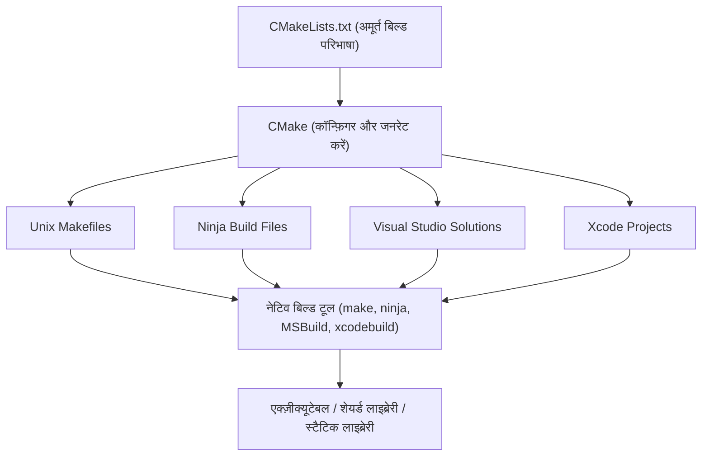
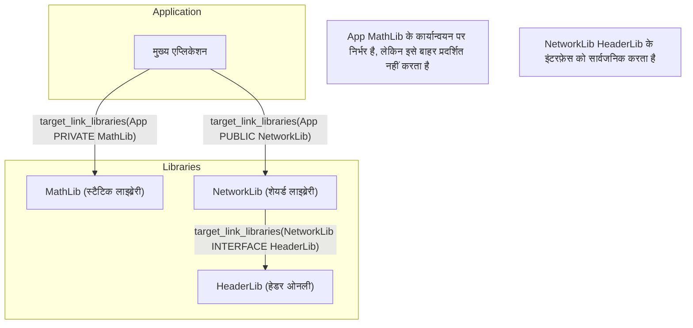
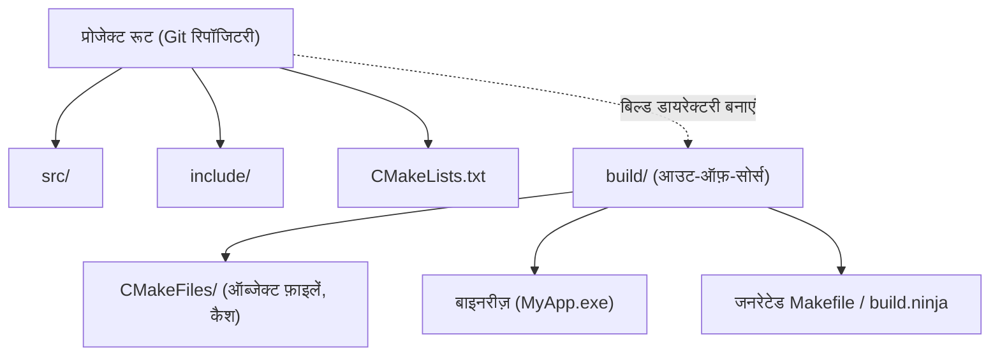

C++ सॉफ़्टवेयर विकास में, कई वर्षों से अधिकांश डेवलपर्स को परेशान करने वाली चीज़ "बिल्ड सिस्टम" का चयन और सेटअप रहा है। चूंकि C++ में कोई आधिकारिक मानक पैकेज मैनेजर या बिल्ड सिस्टम नहीं है, इसलिए प्रत्येक प्लेटफ़ॉर्म (Windows, Linux, macOS) के लिए अलग-अलग कंपाइलर और बिल्ड टूल (MSVC, GCC, Clang, Make, Ninja, आदि) का उपयोग करना आवश्यक था।

हालाँकि, वर्तमान में **CMake** वास्तविक उद्योग मानक (डि-फैक्टो स्टैंडर्ड) के रूप में स्थापित हो गया है, और CMake का सही उपयोग करके, आप एकल `CMakeLists.txt` से एक क्रॉस-प्लेटफ़ॉर्म बिल्ड वातावरण को खूबसूरती से स्थापित कर सकते हैं।

इस लेख में, हम CMake (आधुनिक CMake) का उपयोग करके एक क्रॉस-प्लेटफ़ॉर्म C++ बिल्ड वातावरण स्थापित करने की प्रक्रिया के बारे में, बुनियादी से लेकर उन्नत तकनीकों तक, पूरी तरह से और विस्तार से चर्चा करेंगे।

## 1. CMake क्या है? (मेटा-बिल्ड सिस्टम की अवधारणा)

CMake अपने आप में सीधे सोर्स कोड को कंपाइल करने वाला टूल नहीं है। CMake "बिल्ड सिस्टम उत्पन्न करने वाला सिस्टम" है, अर्थात **मेटा-बिल्ड सिस्टम (Meta-Build System)**।

CMake की मुख्य भूमिका प्लेटफ़ॉर्म- और कंपाइलर-स्वतंत्र अमूर्त कॉन्फ़िगरेशन फ़ाइलों (`CMakeLists.txt`) को पढ़ना है, और स्वचालित रूप से प्रत्येक वातावरण के लिए उपयुक्त नेटिव बिल्ड स्क्रिप्ट (उदाहरण: Linux के लिए `Makefile`, Windows के लिए Visual Studio `.sln` प्रोजेक्ट फ़ाइलें, या तेज़ `build.ninja`) उत्पन्न करना है।

नीचे दिया गया आरेख CMake की जनरेशन प्रक्रिया को दर्शाता है।



इस तरह, बीच में CMake को रखकर, डेवलपर्स OS-विशिष्ट कमांड में छोटे अंतरों की चिंता किए बिना C++ प्रोजेक्ट्स को प्रबंधित कर सकते हैं।

## 2. आधुनिक CMake की मूल बातें: चर से लक्ष्य (Target) तक

CMake 3.0 और उसके बाद के सिंटैक्स को "आधुनिक CMake" कहा जाता है, और इसकी डिज़ाइन फिलॉसफी इसके पूर्ववर्ती (लिगेसी CMake) से मौलिक रूप से भिन्न है। लिगेसी CMake में, डायरेक्टरी स्तर पर ग्लोबल चरों को फिर से लिखने का दृष्टिकोण (जैसे `include_directories()` या `link_libraries()` का उपयोग करना) मुख्यधारा था, लेकिन इसके परिणामस्वरूप अक्सर गंभीर दुष्प्रभाव होते थे जहाँ सेटिंग्स अनजाने में अन्य मॉड्यूल को प्रभावित करती थीं।

आधुनिक CMake में, हर चीज़ को **लक्ष्य (Target)** और **संपत्ति (Property)** के रूप में माना जाता है। यह ऑब्जेक्ट-ओरिएंटेड प्रोग्रामिंग में क्लास और मेंबर वेरिएबल्स के बीच के संबंध के समान है।

- **लक्ष्य (Target)**: एक्ज़ीक्यूटेबल (Executable) या लाइब्रेरी (Library)।
- **संपत्ति (Property)**: उस लक्ष्य को बनाने के लिए आवश्यक सोर्स फ़ाइलें, इंक्लूड डायरेक्टरीज़, कंपाइल विकल्प, लिंक करने के लिए अन्य लाइब्रेरीज़ आदि।

सेटिंग्स को केवल विशिष्ट लक्ष्यों के लिए एनकैप्सुलेट (सीमित) करके, बड़े प्रोजेक्ट्स के लिए भी एक सुरक्षित बिल्ड परिभाषा संभव हो जाती है जो टूटती नहीं है।

### न्यूनतम `CMakeLists.txt`

सबसे पहले, आइए सबसे बुनियादी `CMakeLists.txt` देखें।

```cmake
# CMake की न्यूनतम आवश्यक संस्करण निर्दिष्ट करें
cmake_minimum_required(VERSION 3.20)

# प्रोजेक्ट का नाम और उपयोग की जाने वाली भाषा निर्दिष्ट करें
project(MyAwesomeApp VERSION 1.0.0 LANGUAGES CXX)

# C++ मानक (C++20) का अनुरोध करें
set(CMAKE_CXX_STANDARD 20)
set(CMAKE_CXX_STANDARD_REQUIRED ON)
set(CMAKE_CXX_EXTENSIONS OFF) # कंपाइलर-विशिष्ट एक्सटेंशन अक्षम करें

# एक्ज़ीक्यूटेबल लक्ष्य की परिभाषा
add_executable(MyAwesomeApp main.cpp)
```

केवल इन कुछ पंक्तियों के साथ, C++20 की आवश्यकता वाली और कंपाइलर एक्सटेंशन को अक्षम करने वाली पोर्टेबल एक्ज़ीक्यूटेबल फ़ाइल के लिए बिल्ड सेटिंग पूरी हो जाती है।

## 3. निर्भरता और स्कोप (Scope): PUBLIC / PRIVATE / INTERFACE

आधुनिक CMake में महारत हासिल करने के लिए सबसे महत्वपूर्ण और कठिन अवधारणा **`PUBLIC`, `PRIVATE`, `INTERFACE`** नामक तीन एक्सेस मॉडिफायर (स्कोप) हैं, जिनका उपयोग `target_include_directories` और `target_link_libraries` आदि में किया जाता है।

ये लक्ष्य की संपत्तियों (इंक्लूड पाथ और निर्भर लाइब्रेरीज़) को नियंत्रित करने के लिए उपयोग किए जाते हैं: "क्या यह मेरे स्वयं के बिल्ड के लिए आवश्यक है?" और "क्या इसे मुझ पर निर्भर अन्य लक्ष्यों तक भी फैलाया जाना चाहिए?"

1. **`PRIVATE`**: केवल उस लक्ष्य के स्वयं के बिल्ड के लिए आवश्यक है। यह निर्भर लक्ष्यों तक **प्रसारित नहीं** होता है।
2. **`INTERFACE`**: उस लक्ष्य के स्वयं के बिल्ड के लिए आवश्यक नहीं है, लेकिन निर्भर लक्ष्यों के बिल्ड में **प्रसारित होता** है (जैसे कि हेडर-ओनली लाइब्रेरीज़ में उपयोग किया जाता है)।
3. **`PUBLIC`**: उस लक्ष्य के स्वयं के बिल्ड के लिए आवश्यक है और निर्भर लक्ष्यों में भी **प्रसारित होता** है (`PRIVATE` + `INTERFACE`)।

आइए नीचे दिए गए आरेख में निर्भरताओं के प्रसार (उपयोग आवश्यकताओं का प्रसार) की कल्पना करें।



### स्कोप के विशिष्ट उपयोग के उदाहरण

मान लीजिए कि एक लाइब्रेरी `MyLib` आंतरिक कार्यान्वयन के रूप में `nlohmann/json` का उपयोग करती है, और सार्वजनिक रूप से उपलब्ध हेडर फ़ाइल `MyLib.hpp` में `nlohmann/json` को शामिल (include) नहीं करती है। इस स्थिति में, `MyLib` का उपयोग करने वाले पक्ष (एप्लिकेशन) को JSON लाइब्रेरी के अस्तित्व को जानने की आवश्यकता नहीं है।

```cmake
# लाइब्रेरी की परिभाषा
add_library(MyLib src/MyLib.cpp)

# अपने प्रोजेक्ट के इंक्लूड डायरेक्टरीज़ निर्दिष्ट करना
# include डायरेक्टरी MyLib का उपयोग करने वालों के लिए भी आवश्यक है, इसलिए PUBLIC का उपयोग करें
# src डायरेक्टरी केवल MyLib के कार्यान्वयन में उपयोग की जाती है, इसलिए PRIVATE का उपयोग करें
target_include_directories(MyLib
    PUBLIC 
        $<BUILD_INTERFACE:${CMAKE_CURRENT_SOURCE_DIR}/include>
        $<INSTALL_INTERFACE:include>
    PRIVATE
        ${CMAKE_CURRENT_SOURCE_DIR}/src
)

# json लाइब्रेरी का उपयोग केवल आंतरिक कार्यान्वयन के लिए किया जाता है, इसलिए इसे PRIVATE के साथ लिंक करें
target_link_libraries(MyLib PRIVATE nlohmann_json::nlohmann_json)
```

इसके विपरीत, यदि `MyLib.hpp` में `#include <nlohmann/json.hpp>` लिखा गया है, तो `MyLib` का उपयोग करने वाले पक्ष को भी JSON का हेडर पाथ पता होना चाहिए, अन्यथा कंपाइल एरर होगा, इसलिए इसे `PUBLIC` के रूप में लिंक करने की आवश्यकता है। इन स्कोप्स को उचित रूप से सेट करके, आप बिल्ड समय को कम कर सकते हैं और अनावश्यक निर्भरता के रिसाव (Repackaging/Poisoning) को रोक सकते हैं।

## 4. आउट-ऑफ़-सोर्स बिल्ड (Out-of-source Build)

CMake का उपयोग करते समय सबसे महत्वपूर्ण सर्वोत्तम अभ्यास जिसका हमेशा पालन किया जाना चाहिए, वह है **आउट-ऑफ़-सोर्स बिल्ड**।

यह एक ऐसी विधि है जहाँ कोई भी बिल्ड आर्टिफैक्ट (ऑब्जेक्ट फ़ाइलें या एक्ज़ीक्यूटेबल फ़ाइलें) उस डायरेक्टरी (सोर्स ट्री) में आउटपुट नहीं होते हैं जहाँ सोर्स कोड स्थित है, बल्कि बिल्ड को एक अलग समर्पित डायरेक्टरी (आमतौर पर `build/`) में अलग से निष्पादित किया जाता है।



इस कॉन्फ़िगरेशन के साथ, यदि आप बिल्ड वातावरण को रीसेट करना चाहते हैं, तो आपको केवल `build` डायरेक्टरी को पूरी तरह से हटाना होगा। चूंकि सोर्स ट्री प्रदूषित नहीं होता है, इसलिए Git के साथ प्रबंधन भी आसान हो जाता है (आपको बस `.gitignore` में `build/` जोड़ना होगा)।

### बिल्ड निष्पादन प्रक्रिया

आधुनिक CMake में, आप OS या बिल्ड टूल की परवाह किए बिना सामान्य कमांड का उपयोग करके बिल्ड चला सकते हैं।

```bash
# 1. कॉन्फ़िगरेशन और जनरेशन (बिल्ड डायरेक्टरी बनाते समय सेटिंग)
cmake -S . -B build

# 2. वास्तविक बिल्ड (कंपाइल और लिंक)
cmake --build build --config Release

# (वैकल्पिक) मल्टीथ्रेडेड बिल्ड के लिए -j विकल्प का उपयोग करें
cmake --build build --config Release -j 8
```

यहाँ `cmake -S . -B build` का अर्थ है "वर्तमान डायरेक्टरी (`.`) को सोर्स डायरेक्टरी के रूप में सेट करें और `build` को बिल्ड डायरेक्टरी के रूप में सेट करें।"

## 5. थर्ड-पार्टी लाइब्रेरीज़ कैसे शामिल करें

C++ विकास में, बाहरी लाइब्रेरीज़ (थर्ड-पार्टी लाइब्रेरीज़) को शामिल करना हमेशा से एक कठिन काम रहा है। हालाँकि, वर्तमान में, निम्नलिखित तीन दृष्टिकोण मुख्य रूप से मानक हैं।

### 5.1. find_package (सिस्टम में इंस्टॉल की गई लाइब्रेरीज़ खोजें)

सिस्टम में पहले से इंस्टॉल की गई लाइब्रेरीज़ (जैसे OpenSSL या Zlib) को खोजने और लिंक करने का यह सबसे पारंपरिक तरीका है।

```cmake
find_package(ZLIB REQUIRED)
if(ZLIB_FOUND)
    target_link_libraries(MyAwesomeApp PRIVATE ZLIB::ZLIB)
endif()
```

### 5.2. FetchContent (स्रोत से डाउनलोड और एकीकरण)

यह मॉड्यूल CMake 3.11 में पेश किया गया था और 3.14 के बाद से शक्तिशाली बन गया है। बिल्ड समय पर, यह सीधे बाहरी Git रिपॉजिटरी या URL से सोर्स कोड डाउनलोड करता है और इसे प्रोजेक्ट के हिस्से के रूप में एक साथ बनाता है। चूँकि निर्भरताओं को केंद्रीय रूप से प्रबंधित किया जा सकता है, क्रॉस-प्लेटफ़ॉर्म प्रतिलिपि प्रस्तुत करने योग्यता (reproducibility) अत्यधिक उच्च हो जाती है।

नीचे GoogleTest को FetchContent के साथ शामिल करने का एक उदाहरण दिया गया है।

```cmake
include(FetchContent)

FetchContent_Declare(
  googletest
  GIT_REPOSITORY https://github.com/google/googletest.git
  GIT_TAG        v1.14.0
)

# लाइब्रेरी को प्रोजेक्ट में उपलब्ध कराएं
FetchContent_MakeAvailable(googletest)

# परीक्षण के लिए एक्ज़ीक्यूटेबल फ़ाइल बनाना और लिंक करना
add_executable(MyTests test/main.cpp)
target_link_libraries(MyTests PRIVATE gtest_main)
```

### 5.3. vcpkg के साथ एकीकरण

Microsoft के नेतृत्व वाले C++ पैकेज मैनेजर **vcpkg** का उपयोग करके, आप आसानी से हजारों लाइब्रेरीज़ शामिल कर सकते हैं। vcpkg को CMake के साथ मूल रूप से काम करने के लिए डिज़ाइन किया गया है।

CMake चलाते समय, केवल vcpkg टूलचेन फ़ाइल निर्दिष्ट करके, `find_package` स्वचालित रूप से vcpkg के भीतर लाइब्रेरीज़ की खोज करेगा।

```bash
cmake -S . -B build -DCMAKE_TOOLCHAIN_FILE=/path/to/vcpkg/scripts/buildsystems/vcpkg.cmake
```

इसके अतिरिक्त, प्रोजेक्ट रूट में `vcpkg.json` (मेनिफेस्ट मोड) रखकर, आप आवश्यक लाइब्रेरीज़ के संस्करण नियंत्रण को पूरी तरह से स्वचालित कर सकते हैं।

## 6. क्रॉस-प्लेटफ़ॉर्म सपोर्ट के लिए कंपाइलर फ़्लैग

Windows (MSVC), Linux (GCC/Clang), या macOS (Apple Clang) में से किसी भी वातावरण में सफलतापूर्वक निर्माण करने के लिए, आपको उचित कंपाइलर-विशिष्ट फ़्लैग सेट करने होंगे।

CMake के **जेनरेटर एक्सप्रेशन (Generator Expressions)** का उपयोग करके, आप "यदि कंपाइलर MSVC है तो यह फ़्लैग, अन्यथा वह फ़्लैग" जैसी सशर्त शाखाओं (conditional branches) को घोषणात्मक रूप से लिख सकते हैं। जेनरेटर एक्सप्रेशन `$<...>` सिंटैक्स का उपयोग करते हैं और बिल्ड सिस्टम जनरेशन (Generate phase) के दौरान मूल्यांकित किए जाते हैं।

```cmake
# सभी प्लेटफ़ॉर्म पर उच्चतम स्तर की चेतावनियों को सक्षम करने का उदाहरण
target_compile_options(MyAwesomeApp PRIVATE
    # MSVC के मामले में
    $<$<CXX_COMPILER_ID:MSVC>:/W4 /WX>
    
    # GCC या Clang के मामले में
    $<$<OR:$<CXX_COMPILER_ID:GNU>,$<CXX_COMPILER_ID:Clang>,$<CXX_COMPILER_ID:AppleClang>>:-Wall -Wextra -Wpedantic -Werror>
)
```

इस पद्धति का उपयोग करके, आप `if(MSVC)` जैसी सशर्त शाखाओं के अत्यधिक उपयोग को रोक सकते हैं जो `CMakeLists.txt` को पढ़ने में कठिन बनाते हैं, और प्रति-लक्ष्य लचीली सेटिंग्स को सक्षम करते हैं।

## 7. परीक्षण वातावरण स्थापित करना (CTest)

क्रॉस-प्लेटफ़ॉर्म वातावरण में गुणवत्ता आश्वासन (Quality Assurance) के लिए स्वचालित परीक्षण शुरू करना आवश्यक है। CMake डिफ़ॉल्ट रूप से **CTest** नामक एक टेस्ट रनर के साथ आता है।

ऊपर बताए गए `FetchContent` का उपयोग करके शामिल किए गए GoogleTest को CTest के साथ एकीकृत करने की प्रक्रिया निम्नलिखित है:

```cmake
# परीक्षण सुविधाएँ सक्षम करें (रूट CMakeLists.txt में केवल एक बार लिखा गया)
enable_testing()

add_executable(MyMathTests test/math_test.cpp)
target_link_libraries(MyMathTests PRIVATE gtest_main MyLib)

# CTest में परीक्षण के रूप में पंजीकृत करें
include(GoogleTest)
gtest_discover_tests(MyMathTests)
```

बिल्ड के बाद, बस बिल्ड डायरेक्टरी में `ctest` कमांड चलाएं, और सभी परीक्षण निष्पादित किए जाएंगे और परिणामों की रिपोर्ट की जाएगी।

```bash
cd build
ctest --output-on-failure -C Release
```

## 8. बिल्ड सिस्टम का सिद्धांत और गणितीय मॉडल

यहाँ दृष्टिकोण को थोड़ा बदलते हैं और एक गणितीय मॉडल का उपयोग करके बड़े पैमाने की परियोजनाओं में बिल्ड सिस्टम और समानांतर संकलन (parallel compilation) की दक्षता पर विचार करते हैं।

बिल्ड समय (संकलन समय) को कम करना C++ विकास में एक शाश्वत चुनौती है। आप सोर्स कोड को विभाजित करके और इसे समानांतर में कंपाइल करके बिल्ड समय को कम कर सकते हैं। इस समानांतरकरण द्वारा गति में वृद्धि (Speedup) को **एमडाहल के नियम (Amdahl's Law)** द्वारा प्रतिरूपित (modeled) किया गया है।

यदि प्रोग्राम में समानांतरकरण योग्य भाग का अनुपात $P$ है, और क्रमिक रूप से निष्पादित किए जाने वाले (समानांतरकरण योग्य नहीं) भाग का अनुपात $1-P$ है, और उपयोग किए जाने वाले प्रोसेसर की संख्या $N$ है, तो समग्र सैद्धांतिक अधिकतम गति वृद्धि दर $S(N)$ निम्नलिखित सूत्र द्वारा व्यक्त की जाती है:

$$ S(N) = \frac{1}{(1 - P) + \frac{P}{N}} $$

C++ बिल्ड प्रक्रिया में, "प्रत्येक `.cpp` फ़ाइल को `.o` या `.obj` में कंपाइल करना" स्वतंत्र है और समानांतरकरण योग्य है ($P$ का भाग), लेकिन "अंतिम लिंकर (Linker) द्वारा संयोजन प्रक्रिया" मूल रूप से क्रमिक रूप से की जाती है ($1-P$ का भाग)।

इसलिए, भले ही आप कितने भी कोर वाले CPU ($N \to \infty$) तैयार कर लें, जब तक लिंक समय नामक अड़चन (bottleneck) मौजूद है, अधिकतम गति वृद्धि दर निम्नलिखित समीकरण के समान हो जाएगी (asymptotic)।

$$ \lim_{N \to \infty} S(N) = \frac{1}{1 - P} $$

यह सूत्र बताता है कि "बिल्ड समय को कम करने के लिए केवल CPU कोर बढ़ाना एक सीमा तक ही सीमित है।" आधुनिक CMake में `PRIVATE` और `INTERFACE` का उचित उपयोग करके, और हेडर फ़ाइलों की निर्भरता को न्यूनतम करके (जैसे फ़ॉरवर्ड डिक्लेरेशन का उपयोग करना), $P$ के अनुपात को बढ़ाना और इंक्रीमेंटल बिल्ड के दौरान रीकंपाइल लक्ष्य को कम करना व्यावहारिक रूप से सबसे प्रभावी बिल्ड गतिवर्धन रणनीति है।

इसके अतिरिक्त, लिंक समय को कम करने में, स्टैटिक लाइब्रेरीज़ से शेयर्ड लाइब्रेरीज़ / DLLs पर स्विच करना, या LLD / Mold जैसे तेज़ लिंकर को अपनाना महत्वपूर्ण है।

CMake में, आप आसानी से लिंकर को निम्नानुसार निर्दिष्ट कर सकते हैं:

```cmake
# Clang/GCC वातावरण में lld लिंकर का उपयोग करने के लिए सेट करें
if(UNIX AND NOT APPLE)
    target_link_options(MyAwesomeApp PRIVATE "-fuse-ld=lld")
endif()
```

## 9. जटिल डायरेक्टरी संरचना का व्यावहारिक उदाहरण

वास्तविक एप्लिकेशन विकास में, आपके पास एक डायरेक्टरी संरचना होगी जिसमें कई मॉड्यूल संयोजित होंगे। अंत में, हम एक आदर्श मध्यम आकार के प्रोजेक्ट की डायरेक्टरी संरचना और माता-पिता/बच्चे `CMakeLists.txt` के बीच संबंध दिखाते हैं।

```text
ProjectRoot/
├── CMakeLists.txt (Root: पूरे प्रोजेक्ट की परिभाषा)
├── vcpkg.json     (निर्भर लाइब्रेरीज़ की परिभाषा)
├── external/      (बाहरी मॉड्यूल)
├── include/       (सार्वजनिक हेडर)
│   └── myapp/
├── src/           (सोर्स कोड और आंतरिक बिल्ड परिभाषा)
│   ├── CMakeLists.txt
│   ├── main.cpp
│   ├── math/
│   │   ├── CMakeLists.txt
│   │   ├── Vector3.hpp
│   │   └── Vector3.cpp
│   └── network/
│       ├── CMakeLists.txt
│       └── NetworkManager.cpp
└── tests/         (परीक्षण कोड)
    ├── CMakeLists.txt
    └── math_test.cpp
```

रूट `CMakeLists.txt` केवल पर्यावरण सेटिंग्स और समग्र विकल्प परिभाषाएँ निष्पादित करता है, और सबडायरेक्टरीज़ को `add_subdirectory()` का उपयोग करके जोड़ता है।

**Root `CMakeLists.txt`**:
```cmake
cmake_minimum_required(VERSION 3.20)
project(ComplexApp LANGUAGES CXX)

# ग्लोबल सेटिंग्स
set(CMAKE_CXX_STANDARD 20)
set(CMAKE_CXX_STANDARD_REQUIRED ON)

# परीक्षण सक्षम करना
enable_testing()

# सबडायरेक्टरीज़ जोड़ना
add_subdirectory(src)
add_subdirectory(tests)
```

**`src/CMakeLists.txt`**:
```cmake
# प्रत्येक मॉड्यूल जोड़ें
add_subdirectory(math)
add_subdirectory(network)

# अंतिम एक्ज़ीक्यूटेबल फ़ाइल
add_executable(ComplexApp main.cpp)

# मॉड्यूल्स को लिंक करना
target_link_libraries(ComplexApp
    PRIVATE
        MathLib
        NetworkLib
)
```

इस तरह डायरेक्टरी द्वारा `CMakeLists.txt` को विभाजित करके और लक्ष्यों के बीच निर्भरता को परिभाषित करके, मॉड्यूल की पुन: प्रयोज्यता बढ़ जाती है और बिल्ड समानता (parallelism) में भी सुधार होता है। यही आधुनिक CMake द्वारा प्रस्तावित "मॉड्यूलर बिल्ड वातावरण" का असली सार है।

## 10. निष्कर्ष

हमने CMake का उपयोग करके क्रॉस-प्लेटफ़ॉर्म C++ बिल्ड वातावरण स्थापित करने की प्रक्रिया के बारे में बताया।
आइए मुख्य बिंदुओं की समीक्षा करें:

1. **मेटा-बिल्ड सिस्टम को समझना**: CMake एक टूल है जो बिल्ड स्क्रिप्ट उत्पन्न करता है।
2. **आधुनिक CMake का पूर्ण उपयोग**: चर (variables) का उपयोग न करें, बल्कि `add_executable`, `target_link_libraries`, `target_include_directories` आदि जैसे **लक्ष्य-उन्मुख (Target-oriented)** सेटिंग्स को एनकैप्सुलेट करें।
3. **उचित स्कोप सेटिंग**: निर्भरताओं के प्रसार को नियंत्रित करने के लिए `PUBLIC`, `PRIVATE`, और `INTERFACE` का सही ढंग से उपयोग करें।
4. **आउट-ऑफ़-सोर्स बिल्ड को पूरी तरह लागू करना**: `build/` डायरेक्टरी के भीतर निर्माण करें ताकि सोर्स ट्री प्रदूषित न हो।
5. **थर्ड-पार्टी एकीकरण**: निर्भर लाइब्रेरीज़ के समाधान को स्वचालित करने के लिए `FetchContent` और `vcpkg` का पूरा उपयोग करें।
6. **जेनरेटर एक्सप्रेशन्स का लाभ उठाएं**: विभिन्न कंपाइलरों के बीच फ़्लैग के अंतर को स्मार्ट तरीके से संभालें।
7. **गणितीय दृष्टिकोण**: एमडाहल के नियम के बारे में जागरूक रहें, और समानांतर संकलन की दक्षता बढ़ाने के लिए निर्भरता को कम करें।

हालाँकि CMake शुरू में समझना मुश्किल लग सकता है, लेकिन एक बार जब आप लक्ष्य (Target) और संपत्ति (Property) की अवधारणा को समझ लेते हैं, तो आप एक सुव्यवस्थित बिल्ड वातावरण बनाए रख सकते हैं, चाहे C++ प्रोजेक्ट कितना भी जटिल या विशाल क्यों न हो। कृपया इस लेख को एक संदर्भ के रूप में उपयोग करें और नवीनतम आधुनिक CMake सिंटैक्स के साथ C++ विकास वातावरण स्थापित करने का प्रयास करें।
