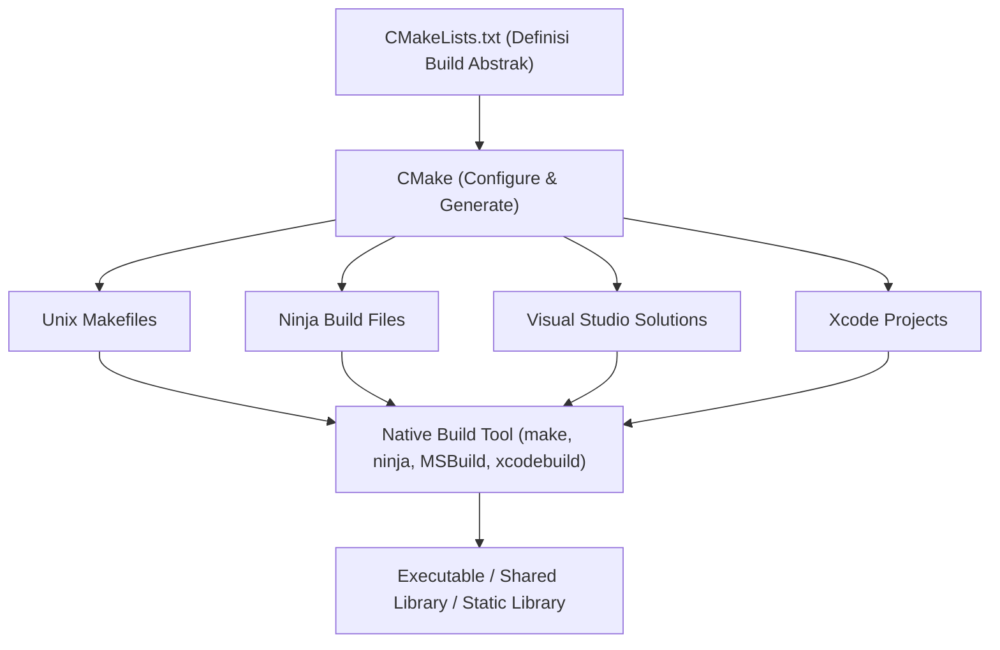
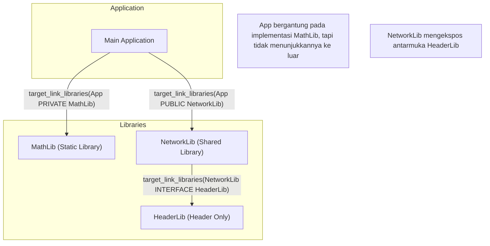
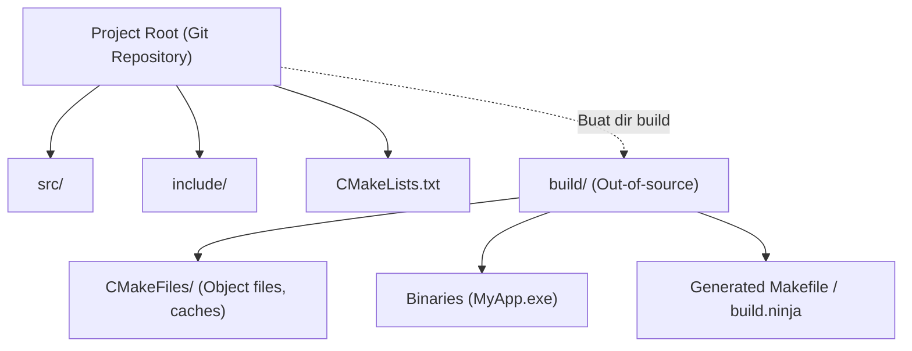

Dalam pengembangan perangkat lunak dengan C++, hal yang sering menyusahkan banyak pengembang selama bertahun-tahun adalah pemilihan dan pembangunan "sistem build". Karena C++ tidak memiliki manajer paket standar resmi atau sistem build, kita perlu menggunakan kompiler dan alat build yang berbeda-beda (MSVC, GCC, Clang, Make, Ninja, dll.) untuk setiap platform (Windows, Linux, macOS).

Namun, saat ini **CMake** telah ditetapkan sebagai standar industri de facto, dan dengan memanfaatkan CMake secara tepat, kita dapat dengan elegan membangun lingkungan build lintas platform dari satu `CMakeLists.txt`.

Pada artikel ini, kita akan membahas secara menyeluruh dan terperinci mengenai langkah-langkah membangun lingkungan build C++ lintas platform terbaru (Modern CMake) menggunakan CMake, dari dasar hingga teknik tingkat lanjut.

## 1. Apa itu CMake? (Konsep Sistem Meta-Build)

CMake pada dasarnya bukanlah alat yang mengkompilasi kode sumber secara langsung. CMake adalah "sistem yang menghasilkan sistem build", yaitu **Sistem Meta-Build (Meta-Build System)**.

Peran utama CMake adalah membaca file konfigurasi abstrak yang independen terhadap platform dan kompiler (`CMakeLists.txt`), lalu secara otomatis menghasilkan skrip build asli yang paling sesuai untuk setiap lingkungan (misalnya: `Makefile` untuk Linux, file proyek `.sln` Visual Studio untuk Windows, atau `build.ninja` yang cepat).

Diagram berikut menunjukkan proses generasi CMake.



Dengan menempatkan CMake di tengah seperti ini, pengembang dapat mengelola proyek C++ tanpa perlu memperhatikan perbedaan kecil pada perintah untuk setiap OS.

## 2. Dasar Modern CMake: Dari Variabel ke Target

Sintaks CMake 3.0 ke atas disebut "Modern CMake", yang filosofi desainnya secara mendasar berbeda dari yang sebelumnya (Legacy CMake). Pada Legacy CMake, pendekatan utamanya adalah dengan menimpa variabel global per direktori (misalnya menggunakan `include_directories()` atau `link_libraries()`), tetapi hal ini sering menimbulkan efek samping yang serius di mana pengaturan dapat memengaruhi modul lain secara tidak sengaja.

Pada Modern CMake, semuanya diperlakukan sebagai **Target** dan **Properti (Property)**. Ini mirip dengan hubungan antara kelas dan variabel anggota dalam pemrograman berorientasi objek.

- **Target**: File yang dapat dieksekusi (Executable) atau pustaka (Library).
- **Properti**: File sumber, direktori penyertaan (include), opsi kompilasi, pustaka lain yang akan ditautkan, dll. yang diperlukan untuk membangun target tersebut.

Dengan merangkum (mengenkapsulasi) pengaturan hanya pada target tertentu, dimungkinkan untuk membuat definisi build yang aman tanpa kerusakan bahkan pada proyek skala besar.

### `CMakeLists.txt` Minimal

Pertama-tama, mari kita lihat `CMakeLists.txt` yang paling mendasar.

```cmake
# Menentukan versi minimum CMake yang dibutuhkan
cmake_minimum_required(VERSION 3.20)

# Menentukan nama proyek dan bahasa yang digunakan
project(MyAwesomeApp VERSION 1.0.0 LANGUAGES CXX)

# Meminta standar C++ (C++20)
set(CMAKE_CXX_STANDARD 20)
set(CMAKE_CXX_STANDARD_REQUIRED ON)
set(CMAKE_CXX_EXTENSIONS OFF) # Menonaktifkan ekstensi khusus kompiler

# Definisi target yang dapat dieksekusi
add_executable(MyAwesomeApp main.cpp)
```

Hanya dengan beberapa baris ini, pengaturan build untuk file yang dapat dieksekusi portabel yang membutuhkan C++20 dan menonaktifkan ekstensi kompiler telah selesai.

## 3. Ketergantungan dan Lingkup: PUBLIC / PRIVATE / INTERFACE

Hal yang paling penting dan juga paling sulit untuk dikuasai dalam Modern CMake adalah konsep 3 pengubah akses (lingkup) yang digunakan dalam `target_include_directories` atau `target_link_libraries`, yaitu **`PUBLIC`, `PRIVATE`, `INTERFACE`**.

Pengubah ini mengontrol properti target (seperti jalur penyertaan dan dependensi pustaka), yakni apakah properti tersebut "diperlukan untuk membangun dirinya sendiri?" dan "apakah itu diteruskan ke target lain yang bergantung padanya?".

1. **`PRIVATE`**: Hanya diperlukan untuk membangun target itu sendiri. **Tidak** diteruskan ke target yang bergantung padanya.
2. **`INTERFACE`**: Tidak diperlukan untuk membangun target itu sendiri, tetapi **diteruskan** ke target yang bergantung padanya (biasanya digunakan pada pustaka header-only).
3. **`PUBLIC`**: Diperlukan untuk membangun target itu sendiri, dan juga **diteruskan** ke target yang bergantung padanya (`PRIVATE` + `INTERFACE`).

Mari kita visualisasikan penyebaran dependensi (Propagasi Usage Requirements) melalui diagram berikut.



### Contoh Penggunaan Lingkup Secara Konkret

Misalkan sebuah pustaka `MyLib` menggunakan `nlohmann/json` sebagai implementasi internal, dan di dalam file header publiknya `MyLib.hpp`, ia tidak menyertakan (include) `nlohmann/json`. Dalam hal ini, pihak yang menggunakan `MyLib` (aplikasi) tidak perlu mengetahui keberadaan pustaka JSON tersebut.

```cmake
# Definisi pustaka
add_library(MyLib src/MyLib.cpp)

# Menentukan direktori penyertaan untuk proyek sendiri
# Direktori include diperlukan juga oleh pengguna MyLib sehingga disetel ke PUBLIC
# Direktori src hanya digunakan dalam implementasi MyLib sehingga disetel ke PRIVATE
target_include_directories(MyLib
    PUBLIC 
        $<BUILD_INTERFACE:${CMAKE_CURRENT_SOURCE_DIR}/include>
        $<INSTALL_INTERFACE:include>
    PRIVATE
        ${CMAKE_CURRENT_SOURCE_DIR}/src
)

# Pustaka json hanya digunakan dalam implementasi internal, jadi tautkan dengan PRIVATE
target_link_libraries(MyLib PRIVATE nlohmann_json::nlohmann_json)
```

Sebaliknya, jika di dalam `MyLib.hpp` kita menulis `#include <nlohmann/json.hpp>`, maka pihak yang menggunakan `MyLib` juga harus mengetahui jalur header JSON agar tidak terjadi kesalahan kompilasi. Oleh karena itu, penautan (link) harus dilakukan secara `PUBLIC`. Dengan mengatur lingkup ini secara tepat, kita dapat mengurangi waktu build dan mencegah kebocoran dependensi yang tidak perlu.

## 4. Build di Luar Sumber (Out-of-source Build)

Praktik terbaik yang harus selalu diikuti saat menggunakan CMake adalah **Build di Luar Sumber (Out-of-source Build)**.
Ini adalah metode di mana tidak ada hasil build (seperti file objek atau file eksekusi) yang dikeluarkan ke direktori tempat kode sumber berada (source tree), melainkan dipisahkan dan dibangun di direktori khusus lain (biasanya `build/`).



Dengan struktur ini, jika kita ingin mereset lingkungan build, kita cukup menghapus seluruh direktori `build`, dan karena source tree tidak kotor, pengelolaan Git juga menjadi lebih mudah (cukup dengan menambahkan `build/` ke `.gitignore`).

### Prosedur Eksekusi Build

Pada Modern CMake, build dapat dieksekusi dengan perintah umum yang independen dari OS maupun alat build.

```bash
# 1. Konfigurasi dan generasi (melakukan pengaturan sekaligus membuat direktori build)
cmake -S . -B build

# 2. Build aktual (kompilasi dan penautan)
cmake --build build --config Release

# (Opsional) Gunakan opsi -j untuk build dengan multithread
cmake --build build --config Release -j 8
```

Di sini `cmake -S . -B build` berarti "gunakan direktori saat ini (`.`) sebagai direktori sumber, dan atur `build` sebagai direktori build".

## 5. Metode Memasukkan Pustaka Pihak Ketiga

Dalam pengembangan C++, memasukkan pustaka eksternal (pustaka pihak ketiga) selalu menjadi rintangan tersendiri. Namun saat ini, tiga pendekatan berikut umumnya menjadi standar.

### 5.1. find_package (Mencari Pustaka yang Telah Terpasang di Sistem)

Ini adalah metode paling tradisional untuk menemukan dan menautkan pustaka yang sudah diinstal di sistem (contoh: OpenSSL atau Zlib).

```cmake
find_package(ZLIB REQUIRED)
if(ZLIB_FOUND)
    target_link_libraries(MyAwesomeApp PRIVATE ZLIB::ZLIB)
endif()
```

### 5.2. FetchContent (Mengunduh dari Sumber dan Memasukkannya)

Ini adalah modul yang diperkenalkan pada CMake 3.11 dan menjadi lebih canggih sejak 3.14. Ia mengunduh kode sumber secara langsung dari repositori Git eksternal atau URL saat waktu build, dan membangunnya bersama-sama sebagai bagian dari proyek. Karena dependensi dapat dikelola secara terpusat, reproduktibilitas lintas platformnya sangat tinggi.

Berikut adalah contoh untuk memasukkan GoogleTest menggunakan FetchContent.

```cmake
include(FetchContent)

FetchContent_Declare(
  googletest
  GIT_REPOSITORY https://github.com/google/googletest.git
  GIT_TAG        v1.14.0
)

# Membawa pustaka ke dalam proyek
FetchContent_MakeAvailable(googletest)

# Membuat file eksekusi untuk pengujian dan menautkannya
add_executable(MyTests test/main.cpp)
target_link_libraries(MyTests PRIVATE gtest_main)
```

### 5.3. Integrasi dengan vcpkg

Dengan menggunakan **vcpkg**, manajer paket untuk C++ yang dipimpin oleh Microsoft, ribuan pustaka dapat dimasukkan dengan mudah. vcpkg dirancang untuk terintegrasi secara mulus dengan CMake.

Saat menjalankan CMake, cukup dengan menentukan file toolchain dari vcpkg, `find_package` akan secara otomatis mencari pustaka di dalam vcpkg.

```bash
cmake -S . -B build -DCMAKE_TOOLCHAIN_FILE=/path/to/vcpkg/scripts/buildsystems/vcpkg.cmake
```

Selain itu, dengan menempatkan `vcpkg.json` (mode manifest) di root proyek, pengelolaan versi dari pustaka-pustaka yang dibutuhkan dapat diotomatisasi sepenuhnya.

## 6. Flag Kompiler untuk Dukungan Lintas Platform

Untuk dapat berhasil melakukan build di lingkungan Windows (MSVC), Linux (GCC/Clang), maupun macOS (Apple Clang), kita perlu mengatur flag spesifik kompiler secara tepat.

Dengan menggunakan **Ekspresi Generator (Generator Expressions)** dari CMake, kita dapat menulis percabangan kondisional secara deklaratif, seperti "jika kompilernya MSVC gunakan flag ini, jika tidak gunakan flag itu". Ekspresi generator menggunakan sintaks `$<...>` dan dievaluasi saat waktu generasi sistem build (fase Generate).

```cmake
# Contoh mengaktifkan peringatan tingkat tertinggi untuk semua platform
target_compile_options(MyAwesomeApp PRIVATE
    # Untuk MSVC
    $<$<CXX_COMPILER_ID:MSVC>:/W4 /WX>
    
    # Untuk GCC atau Clang
    $<$<OR:$<CXX_COMPILER_ID:GNU>,$<CXX_COMPILER_ID:Clang>,$<CXX_COMPILER_ID:AppleClang>>:-Wall -Wextra -Wpedantic -Werror>
)
```

Dengan metode ini, kita dapat mencegah file `CMakeLists.txt` menjadi sulit dibaca karena terlalu banyak percabangan kondisional seperti `if(MSVC)`, serta memungkinkan pengaturan yang fleksibel untuk setiap target.

## 7. Membangun Lingkungan Pengujian (CTest)

Dalam penjaminan mutu pada lingkungan lintas platform, penerapan pengujian otomatis adalah suatu keharusan. CMake sudah dilengkapi dengan test runner standar bernama **CTest**.

Berikut adalah langkah-langkah untuk mengintegrasikan GoogleTest, yang dimasukkan menggunakan `FetchContent` sebelumnya, dengan CTest.

```cmake
# Mengaktifkan fitur pengujian (ditulis sekali saja di CMakeLists.txt pada root)
enable_testing()

add_executable(MyMathTests test/math_test.cpp)
target_link_libraries(MyMathTests PRIVATE gtest_main MyLib)

# Mendaftarkan sebagai tes ke dalam CTest
include(GoogleTest)
gtest_discover_tests(MyMathTests)
```

Setelah build, hanya dengan menjalankan perintah `ctest` di dalam direktori build, semua tes akan dieksekusi dan hasilnya akan dilaporkan.

```bash
cd build
ctest --output-on-failure -C Release
```

## 8. Teori Sistem Build dan Model Matematis

Mari ubah perspektif sejenak dan pertimbangkan efisiensi sistem build serta kompilasi paralel pada proyek berskala besar menggunakan model matematis.

Pengurangan waktu build (waktu kompilasi) adalah tantangan abadi dalam pengembangan C++. Waktu build dapat dipersingkat dengan memecah kode sumber dan melakukan kompilasi secara paralel. Peningkatan kecepatan (Speedup) akibat paralelisasi ini dimodelkan oleh **Hukum Amdahl (Amdahl's Law)**.

Jika porsi program yang dapat diparalelkan adalah $P$, porsi yang harus dieksekusi secara berurutan (tidak dapat diparalelkan) adalah $1-P$, dan jumlah prosesor yang digunakan adalah $N$, maka rasio peningkatan kecepatan maksimal secara teoretis $S(N)$ dinyatakan dengan persamaan berikut.

$$ S(N) = \frac{1}{(1 - P) + \frac{P}{N}} $$

Pada proses build C++, "kompilasi dari setiap file `.cpp` menjadi `.o` atau `.obj`" bersifat independen dan dapat diparalelkan (bagian $P$), namun "proses penggabungan akhir oleh penaut (Linker)" pada dasarnya dilakukan secara berurutan (bagian $1-P$).

Oleh karena itu, sebanyak apa pun inti CPU ($N \to \infty$) yang disiapkan, selama kemacetan proses tautan (link time) masih ada, rasio kecepatan maksimum asimtotiknya adalah terhadap rumus berikut:

$$ \lim_{N \to \infty} S(N) = \frac{1}{1 - P} $$

Yang disiratkan dari persamaan ini adalah "sekadar menambah inti CPU memiliki batasan dalam mempercepat waktu build". Pada Modern CMake, penggunaan `PRIVATE` dan `INTERFACE` secara tepat serta meminimalkan dependensi file header (seperti pemanfaatan deklarasi maju/forward declaration) dapat meningkatkan proporsi $P$ dan mengurangi target yang harus dikompilasi ulang selama build bertahap (incremental build), yang mana secara praktis merupakan strategi paling efektif untuk mempercepat build.

Selain itu, untuk mempercepat waktu tautan (link time), sangat penting untuk beralih dari pustaka statis (Static Library) ke pustaka bersama / DLL (Shared Library), atau mengadopsi linker cepat seperti LLD / Mold.

Di CMake, Anda dapat dengan mudah menentukan linker sebagai berikut.

```cmake
# Pengaturan untuk menggunakan linker lld di lingkungan Clang/GCC
if(UNIX AND NOT APPLE)
    target_link_options(MyAwesomeApp PRIVATE "-fuse-ld=lld")
endif()
```

## 9. Contoh Praktis Struktur Direktori yang Kompleks

Dalam pengembangan aplikasi yang sebenarnya, struktur direktorinya akan terdiri dari berbagai modul yang digabungkan. Terakhir, berikut adalah struktur direktori proyek skala menengah yang ideal dan hubungan antara `CMakeLists.txt` induk dan anak.

```text
ProjectRoot/
├── CMakeLists.txt (Root: Definisi keseluruhan proyek)
├── vcpkg.json     (Definisi pustaka dependensi)
├── external/      (Modul eksternal)
├── include/       (Header publik)
│   └── myapp/
├── src/           (Kode sumber dan definisi build internal)
│   ├── CMakeLists.txt
│   ├── main.cpp
│   ├── math/
│   │   ├── CMakeLists.txt
│   │   ├── Vector3.hpp
│   │   └── Vector3.cpp
│   └── network/
│       ├── CMakeLists.txt
│       └── NetworkManager.cpp
└── tests/         (Kode pengujian)
    ├── CMakeLists.txt
    └── math_test.cpp
```

File `CMakeLists.txt` pada root hanya berisi pengaturan lingkungan dan definisi opsi keseluruhan, lalu menambahkan subdirektori menggunakan `add_subdirectory()`.

**Root `CMakeLists.txt`**:
```cmake
cmake_minimum_required(VERSION 3.20)
project(ComplexApp LANGUAGES CXX)

# Pengaturan global
set(CMAKE_CXX_STANDARD 20)
set(CMAKE_CXX_STANDARD_REQUIRED ON)

# Mengaktifkan pengujian
enable_testing()

# Menambahkan subdirektori
add_subdirectory(src)
add_subdirectory(tests)
```

**`src/CMakeLists.txt`**:
```cmake
# Menambahkan setiap modul
add_subdirectory(math)
add_subdirectory(network)

# File eksekusi akhir
add_executable(ComplexApp main.cpp)

# Penautan modul
target_link_libraries(ComplexApp
    PRIVATE
        MathLib
        NetworkLib
)
```

Dengan membagi `CMakeLists.txt` untuk setiap direktori dengan cara ini dan mendefinisikannya sebagai dependensi antar target, reusabilitas modul menjadi lebih tinggi, dan paralelisme build pun meningkat. Inilah nilai sesungguhnya dari "lingkungan build termodularisasi" yang diusung oleh Modern CMake.

## 10. Kesimpulan

Kami telah menjelaskan langkah-langkah untuk membangun lingkungan build C++ lintas platform menggunakan CMake.
Mari kita ulas poin-poin utamanya.

1. **Pemahaman Sistem Meta-Build**: CMake adalah alat yang menghasilkan skrip build.
2. **Penerapan Penuh Modern CMake**: Hindari penggunaan variabel; enkapsulasi konfigurasi secara **berorientasi target** menggunakan perintah seperti `add_executable`, `target_link_libraries`, dan `target_include_directories`.
3. **Pengaturan Lingkup yang Tepat**: Gunakan `PUBLIC`, `PRIVATE`, dan `INTERFACE` secara tepat untuk mengontrol penyebaran dependensi.
4. **Penerapan Penuh Out-of-source Build**: Lakukan build di dalam direktori `build/` dan hindari mengotori source tree.
5. **Integrasi Pihak Ketiga**: Manfaatkan `FetchContent` atau `vcpkg` untuk mengotomatisasi penyelesaian dependensi pustaka.
6. **Pemanfaatan Ekspresi Generator**: Menyerap perbedaan flag tiap kompiler secara elegan.
7. **Pendekatan Matematis**: Perhatikan Hukum Amdahl, kurangi dependensi untuk meningkatkan efisiensi kompilasi paralel.

Meski awalnya mungkin terasa sulit, namun setelah Anda menguasai konsep target dan properti, sekompleks dan sebesar apa pun proyek C++ yang ditangani, Anda akan dapat menjaga lingkungan build yang tertata rapi. Silakan jadikan artikel ini sebagai referensi dan cobalah membangun lingkungan pengembangan C++ dengan sintaks Modern CMake terbaru.
