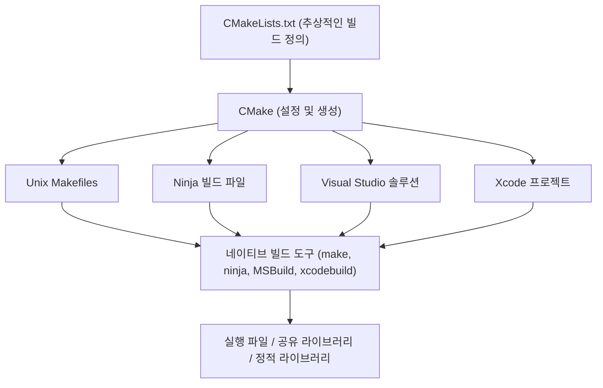
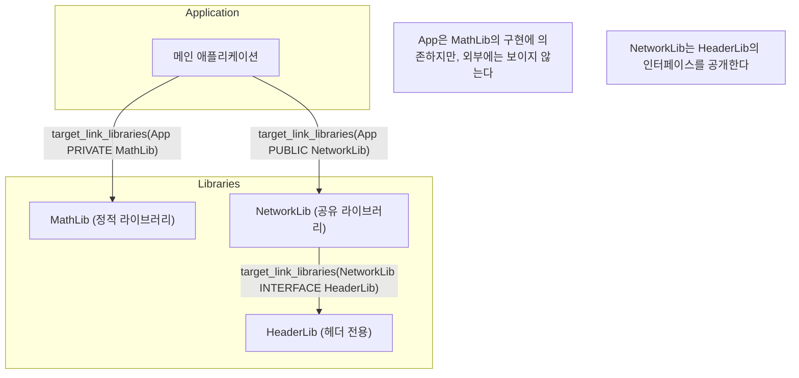
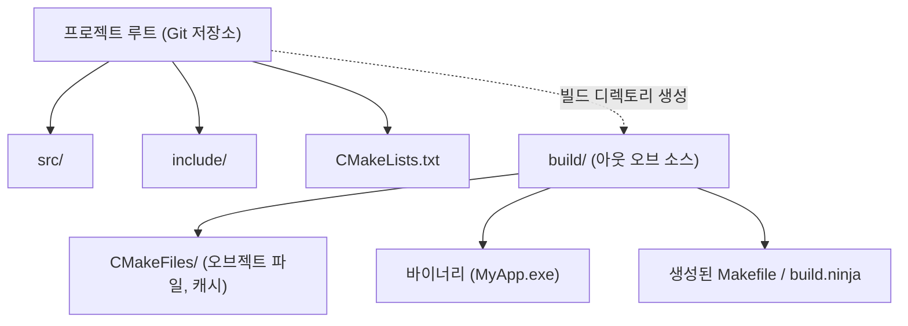

C++에서의 소프트웨어 개발에 있어 오랜 기간 많은 개발자들을 괴롭혀 온 것이 바로 '빌드 시스템'의 선택과 구축입니다. C++에는 공식적인 표준 패키지 매니저나 빌드 시스템이 존재하지 않기 때문에 플랫폼(Windows, Linux, macOS)마다 다른 컴파일러와 빌드 도구(MSVC, GCC, Clang, Make, Ninja 등)를 상황에 맞게 사용해야 했습니다.

하지만 현재는 **CMake**가 사실상의 업계 표준(디팩토 스탠다드)으로 자리 잡았으며, CMake를 올바르게 활용함으로써 단일 `CMakeLists.txt`에서 크로스 플랫폼 빌드 환경을 우아하게 구축할 수 있게 되었습니다.

본 문서에서는 CMake를 사용한 최신(모던 CMake) 크로스 플랫폼 C++ 빌드 환경의 구축 절차에 대해 기초부터 고급 기술까지 철저하고 상세하게 해설합니다.

## 1. CMake란 무엇인가? (메타 빌드 시스템의 개념)

CMake는 그 자체가 직접 소스 코드를 컴파일하는 도구가 아닙니다. CMake는 '빌드 시스템을 생성하는 시스템', 즉 **메타 빌드 시스템(Meta-Build System)**입니다.

CMake의 주된 역할은 플랫폼이나 컴파일러에 의존하지 않는 추상적인 설정 파일(`CMakeLists.txt`)을 읽어들여, 각각의 환경에 최적화된 네이티브 빌드 스크립트(예: Linux라면 `Makefile`, Windows라면 Visual Studio의 `.sln` 프로젝트 파일, 혹은 빠른 `build.ninja`)를 자동 생성하는 것입니다.

다음 그림은 CMake의 생성 프로세스를 나타냅니다.



이처럼 CMake를 중간에 둠으로써, 개발자는 OS별 세세한 명령어 차이를 의식하지 않고 C++ 프로젝트를 관리할 수 있습니다.

## 2. 모던 CMake의 기본: 변수에서 타겟으로

CMake 3.0 이후의 표기법은 '모던 CMake(Modern CMake)'라고 불리며, 그 이전(레거시 CMake)과는 설계 사상이 근본적으로 다릅니다. 레거시 CMake에서는 디렉토리 단위로 전역 변수를 재작성해 나가는(예: `include_directories()`나 `link_libraries()`를 사용하는) 접근 방식이 주류였으나, 이는 설정이 의도치 않게 다른 모듈로 파급되어 버리는 심각한 부작용을 일으키기 쉬웠습니다.

모던 CMake에서는 모든 것을 **타겟(Target)**과 **프로퍼티(Property)**로 취급합니다. 객체 지향 프로그래밍에서의 클래스와 멤버 변수의 관계와 비슷합니다.

- **타겟**: 실행 파일(Executable)이나 라이브러리(Library).
- **프로퍼티**: 해당 타겟을 빌드하기 위해 필요한 소스 파일, 인클루드 디렉토리, 컴파일 옵션, 링크할 다른 라이브러리 등.

설정을 특정 타겟에만 캡슐화(가둬둠)함으로써, 대규모 프로젝트에서도 파탄나지 않는 안전한 빌드 정의가 가능해집니다.

### 최소한의 `CMakeLists.txt`

먼저, 가장 기본적인 `CMakeLists.txt`를 살펴보겠습니다.

```cmake
# CMake의 최소 요구 버전을 지정
cmake_minimum_required(VERSION 3.20)

# 프로젝트 이름과 사용할 언어를 지정
project(MyAwesomeApp VERSION 1.0.0 LANGUAGES CXX)

# C++ 표준 규격(C++20)을 요구
set(CMAKE_CXX_STANDARD 20)
set(CMAKE_CXX_STANDARD_REQUIRED ON)
set(CMAKE_CXX_EXTENSIONS OFF) # 컴파일러 고유의 확장 기능을 비활성화

# 실행 가능 타겟의 정의
add_executable(MyAwesomeApp main.cpp)
```

이 단 몇 줄만으로, C++20을 요구하고 컴파일러 확장을 비활성화한 이식성 있는 실행 파일의 빌드 설정이 완료됩니다.

## 3. 의존 관계와 스코프: PUBLIC / PRIVATE / INTERFACE

모던 CMake를 마스터하는 데 있어 가장 중요하고 난해한 것이, `target_include_directories`나 `target_link_libraries` 등에서 사용되는 **`PUBLIC`, `PRIVATE`, `INTERFACE`**라는 3가지 접근 제어자(스코프)의 개념입니다.

이들은 타겟의 프로퍼티(인클루드 경로 및 의존 라이브러리)를, '자신의 빌드에 필요한가?', '자신에게 의존하고 있는 다른 타겟에도 전파시킬 것인가?'를 제어하기 위한 것입니다.

1. **`PRIVATE`**: 해당 타겟 자신의 빌드에만 필요. 의존하는 대상 타겟에는 전파**되지 않음**.
2. **`INTERFACE`**: 해당 타겟 자신의 빌드에는 불필요하지만, 의존하는 대상 타겟의 빌드에는 전파**됨** (헤더 온리 라이브러리 등에서 사용).
3. **`PUBLIC`**: 해당 타겟 자신의 빌드에 필요하며, 의존하는 대상 타겟에도 전파**됨** (`PRIVATE` + `INTERFACE`).

다음 그림에서 의존 관계의 전파(Usage Requirements의 전파)를 시각화해 보겠습니다.



### 스코프의 구체적인 사용 예

어떤 라이브러리 `MyLib`가 내부 구현으로서 `nlohmann/json`을 사용하고 있으며, 공개하고 있는 헤더 파일 `MyLib.hpp` 안에서는 `nlohmann/json`을 인클루드하지 않았다고 가정합니다. 이 경우, `MyLib`를 사용하는 측(애플리케이션)은 JSON 라이브러리의 존재를 알 필요가 없습니다.

```cmake
# 라이브러리 정의
add_library(MyLib src/MyLib.cpp)

# 내 프로젝트의 인클루드 디렉토리 지정
# include 디렉토리는 MyLib를 사용하는 사람에게도 필요하므로 PUBLIC으로 설정
# src 디렉토리는 MyLib의 구현에서만 사용하므로 PRIVATE으로 설정
target_include_directories(MyLib
    PUBLIC 
        $<BUILD_INTERFACE:${CMAKE_CURRENT_SOURCE_DIR}/include>
        $<INSTALL_INTERFACE:include>
    PRIVATE
        ${CMAKE_CURRENT_SOURCE_DIR}/src
)

# json 라이브러리는 내부 구현에서만 사용하므로 PRIVATE으로 링크함
target_link_libraries(MyLib PRIVATE nlohmann_json::nlohmann_json)
```

반대로, `MyLib.hpp` 안에서 `#include <nlohmann/json.hpp>`라고 적은 경우에는 `MyLib`를 사용하는 측도 JSON의 헤더 경로를 알아야만 컴파일 에러가 나지 않으므로, `PUBLIC`으로 링크해야 합니다. 이 스코프를 적절히 설정함으로써 빌드 시간 단축이나 불필요한 의존 관계의 유출을 방지할 수 있습니다.

## 4. 아웃 오브 소스 빌드 (Out-of-source Build)

CMake를 사용할 때 반드시 지켜야 할 모범 사례(Best Practice)가 **아웃 오브 소스 빌드**입니다.
이는 소스 코드가 위치한 디렉토리(소스 트리)에 빌드 결과물(오브젝트 파일이나 실행 파일)을 일절 출력하지 않고, 다른 전용 디렉토리(일반적으로 `build/`)로 분리하여 빌드를 수행하는 기법입니다.



이 구성을 통해, 빌드 환경을 초기화하고 싶을 때는 `build` 디렉토리를 통째로 삭제하기만 하면 되며, 소스 트리가 더러워지지 않으므로 Git 관리도 쉬워집니다(`.gitignore`에 `build/`를 추가하기만 하면 됩니다).

### 빌드 실행 절차

모던 CMake에서는 OS나 빌드 도구에 의존하지 않는 공통된 명령어로 빌드를 실행할 수 있습니다.

```bash
# 1. 환경 설정 및 생성 (빌드 디렉토리를 생성하며 설정)
cmake -S . -B build

# 2. 실제 빌드 (컴파일 및 링크)
cmake --build build --config Release

# (선택) 멀티스레드로 빌드할 경우 -j 옵션 사용
cmake --build build --config Release -j 8
```

여기서 `cmake -S . -B build`는 "현재 디렉토리(`.`)를 소스 디렉토리로 하고, `build`를 빌드 디렉토리로 설정한다"는 의미가 됩니다.

## 5. 서드파티 라이브러리 도입 방법

C++ 개발에 있어 외부 라이브러리(서드파티 라이브러리)의 도입은 항상 진입 장벽이 높았습니다. 하지만 현재는 주로 다음 3가지 접근 방식이 표준입니다.

### 5.1. find_package (시스템에 설치된 라이브러리 검색)

시스템에 이미 설치된 라이브러리(예: OpenSSL이나 Zlib 등)를 찾아 링크하는, 가장 전통적인 방법입니다.

```cmake
find_package(ZLIB REQUIRED)
if(ZLIB_FOUND)
    target_link_libraries(MyAwesomeApp PRIVATE ZLIB::ZLIB)
endif()
```

### 5.2. FetchContent (소스로부터 다운로드 및 포함)

CMake 3.11에 도입되어 3.14 이후로 강력해진 모듈입니다. 빌드 시에 외부 Git 저장소나 URL로부터 직접 소스 코드를 다운로드하고, 프로젝트의 일부로서 함께 빌드합니다. 의존 관계를 일원화하여 관리할 수 있으므로, 크로스 플랫폼에서의 재현성이 극히 높아집니다.

다음은 GoogleTest를 FetchContent로 도입하는 예시입니다.

```cmake
include(FetchContent)

FetchContent_Declare(
  googletest
  GIT_REPOSITORY https://github.com/google/googletest.git
  GIT_TAG        v1.14.0
)

# 라이브러리를 프로젝트에 포함하기
FetchContent_MakeAvailable(googletest)

# 테스트용 실행 파일 생성 및 링크
add_executable(MyTests test/main.cpp)
target_link_libraries(MyTests PRIVATE gtest_main)
```

### 5.3. vcpkg와의 연동

Microsoft가 주도하는 C++용 패키지 매니저 **vcpkg**를 사용하면 수천 개의 라이브러리를 간단히 도입할 수 있습니다. vcpkg는 CMake와 매끄럽게 연동되도록 설계되어 있습니다.

CMake 실행 시에 vcpkg의 툴체인 파일을 지정하기만 하면, `find_package`가 자동으로 vcpkg 내의 라이브러리를 탐색하게 됩니다.

```bash
cmake -S . -B build -DCMAKE_TOOLCHAIN_FILE=/path/to/vcpkg/scripts/buildsystems/vcpkg.cmake
```

또한, `vcpkg.json`(매니페스트 모드)을 프로젝트 루트에 배치함으로써 필요한 라이브러리의 버전 관리를 완전히 자동화할 수 있습니다.

## 6. 크로스 플랫폼 대응 컴파일러 플래그

Windows (MSVC), Linux (GCC/Clang), macOS (Apple Clang) 어느 환경에서든 빌드를 통과시키기 위해서는 컴파일러 고유의 플래그를 적절히 설정해야 합니다.

CMake의 **제너레이터 표현식 (Generator Expressions)**을 사용하면, "만약 컴파일러가 MSVC라면 이 플래그, 그렇지 않다면 저 플래그"와 같은 조건 분기를 선언적으로 기술할 수 있습니다. 제너레이터 표현식은 `$<...>`라는 구문을 사용하며, 빌드 시스템 생성 시(Generate 단계)에 평가됩니다.

```cmake
# 모든 플랫폼에서 최고 수준의 경고를 활성화하는 예
target_compile_options(MyAwesomeApp PRIVATE
    # MSVC인 경우
    $<$<CXX_COMPILER_ID:MSVC>:/W4 /WX>
    
    # GCC 또는 Clang인 경우
    $<$<OR:$<CXX_COMPILER_ID:GNU>,$<CXX_COMPILER_ID:Clang>,$<CXX_COMPILER_ID:AppleClang>>:-Wall -Wextra -Wpedantic -Werror>
)
```

이 방법을 사용하면 `if(MSVC)`와 같은 조건 분기를 남용하여 `CMakeLists.txt`가 읽기 어려워지는 것을 방지하고, 타겟마다 유연한 설정이 가능해집니다.

## 7. 테스트 환경 구축 (CTest)

크로스 플랫폼 환경에서의 품질 보증을 위해 자동 테스트 도입은 필수입니다. CMake에는 **CTest**라는 테스트 러너가 표준으로 부속되어 있습니다.

앞서 언급한 `FetchContent`로 도입한 GoogleTest를 CTest와 통합하는 절차는 다음과 같습니다.

```cmake
# 테스트 기능 활성화 (루트의 CMakeLists.txt에 한 번만 작성)
enable_testing()

add_executable(MyMathTests test/math_test.cpp)
target_link_libraries(MyMathTests PRIVATE gtest_main MyLib)

# CTest에 테스트로 등록하기
include(GoogleTest)
gtest_discover_tests(MyMathTests)
```

빌드 후, 빌드 디렉토리 내에서 `ctest` 명령어를 실행하기만 하면 모든 테스트가 실행되고 결과가 리포트됩니다.

```bash
cd build
ctest --output-on-failure -C Release
```

## 8. 빌드 시스템의 이론과 수리 모델

여기서 시점을 조금 바꾸어, 대규모 프로젝트에서의 빌드 시스템과 병렬 컴파일의 효율성에 대해 수학적 모델을 사용하여 고찰해 보겠습니다.

빌드 시간(컴파일 시간) 단축은 C++ 개발에 있어 영원한 과제입니다. 소스 코드 분할과 병렬 컴파일을 수행함으로써 빌드 시간을 단축할 수 있습니다. 이 병렬화에 의한 속도 향상(Speedup)은 **암달의 법칙(Amdahl's Law)**으로 모델화됩니다.

프로그램 중에서 병렬화 가능한 부분의 비율을 $P$, 직렬로 실행해야 하는(병렬화 불가능한) 부분의 비율을 $1-P$라고 하고, 사용하는 프로세서의 수를 $N$이라고 했을 때, 전체적인 이론상 최대 속도 향상률 $S(N)$은 다음 수식으로 나타냅니다.

$$ S(N) = \frac{1}{(1 - P) + \frac{P}{N}} $$

C++ 빌드 프로세스에 있어서, '각 `.cpp` 파일에서 `.o` 또는 `.obj`로의 컴파일'은 독립적이며 병렬화 가능하지만($P$의 부분), '최종적인 링커(Linker)에 의한 결합 처리'는 기본적으로 직렬로 수행됩니다($1-P$의 부분).

따라서 아무리 코어 수가 많은 CPU($N \to \infty$)를 준비한다고 하더라도, 링크 시간이라는 병목이 존재하는 한 최대 속도 향상률은 아래의 식에 점근하게 됩니다.

$$ \lim_{N \to \infty} S(N) = \frac{1}{1 - P} $$

이 수식이 시사하는 바는 "단순히 CPU 코어를 늘리는 것만으로는 빌드 시간 단축에 한계가 있다"는 것입니다. 모던 CMake에서의 `PRIVATE`나 `INTERFACE`를 적절하게 구별해서 사용하고, 헤더 파일의 의존 관계를 최소한으로 억제(전방 선언 활용 등)함으로써, $P$의 비율을 크게 하고 증분 빌드(Incremental Build) 시의 재컴파일 대상을 줄이는 것이 실용상 가장 효과적인 빌드 고속화 전략이 됩니다.

또한, 링크 시간 단축에 있어서는 정적 라이브러리(Static Library)에서 공유 라이브러리 / DLL(Shared Library)로의 전환이나, LLD / Mold 등의 고속 링커를 도입하는 것이 중요합니다.

CMake에서는 다음과 같이 링커 지정을 간단하게 할 수 있습니다.

```cmake
# Clang/GCC 환경에서 lld 링커를 사용하도록 설정
if(UNIX AND NOT APPLE)
    target_link_options(MyAwesomeApp PRIVATE "-fuse-ld=lld")
endif()
```

## 9. 복잡한 디렉토리 구성의 실천 예

실제 애플리케이션 개발에서는 다수의 모듈이 조합된 디렉토리 구성이 됩니다. 마지막으로 이상적인 중규모 프로젝트의 디렉토리 구조와, 부모와 자식 `CMakeLists.txt`의 관계를 보여줍니다.

```text
ProjectRoot/
├── CMakeLists.txt (Root: 프로젝트 전체의 정의)
├── vcpkg.json     (의존 라이브러리의 정의)
├── external/      (외부 모듈)
├── include/       (공개 헤더)
│   └── myapp/
├── src/           (소스 코드 및 내부 빌드 정의)
│   ├── CMakeLists.txt
│   ├── main.cpp
│   ├── math/
│   │   ├── CMakeLists.txt
│   │   ├── Vector3.hpp
│   │   └── Vector3.cpp
│   └── network/
│       ├── CMakeLists.txt
│       └── NetworkManager.cpp
└── tests/         (테스트 코드)
    ├── CMakeLists.txt
    └── math_test.cpp
```

루트의 `CMakeLists.txt`는 환경 설정이나 전체 옵션 정의만을 수행하고, 서브 디렉토리를 `add_subdirectory()`로 추가해 나갑니다.

**Root `CMakeLists.txt`**:
```cmake
cmake_minimum_required(VERSION 3.20)
project(ComplexApp LANGUAGES CXX)

# 전역 설정
set(CMAKE_CXX_STANDARD 20)
set(CMAKE_CXX_STANDARD_REQUIRED ON)

# 테스트 활성화
enable_testing()

# 서브 디렉토리 추가
add_subdirectory(src)
add_subdirectory(tests)
```

**`src/CMakeLists.txt`**:
```cmake
# 각 모듈 추가
add_subdirectory(math)
add_subdirectory(network)

# 최종적인 실행 파일
add_executable(ComplexApp main.cpp)

# 모듈 링크
target_link_libraries(ComplexApp
    PRIVATE
        MathLib
        NetworkLib
)
```

이와 같이 디렉토리마다 `CMakeLists.txt`를 분할하고, 타겟 간의 의존 관계로 정의해 나감으로써 모듈의 재사용성이 높아지고 빌드의 병렬성도 향상됩니다. 이것이 모던 CMake가 제창하는 '모듈화된 빌드 환경'의 진면목입니다.

## 10. 요약

CMake를 사용한 크로스 플랫폼 C++ 빌드 환경의 구축 절차에 대해 해설했습니다.
요점은 다음과 같습니다.

1. **메타 빌드 시스템의 이해**: CMake는 빌드 스크립트를 생성하는 도구이다.
2. **모던 CMake의 철저**: 변수를 사용하지 않고, `add_executable`, `target_link_libraries`, `target_include_directories` 등의 **타겟 지향**으로 설정을 캡슐화한다.
3. **스코프의 적절한 설정**: `PUBLIC`, `PRIVATE`, `INTERFACE`를 올바르게 구별해서 사용하고, 의존 관계의 파급을 제어한다.
4. **아웃 오브 소스 빌드의 철저**: `build/` 디렉토리 내에서 빌드를 수행하고, 소스 트리를 더럽히지 않는다.
5. **서드파티 연동**: `FetchContent`나 `vcpkg`를 적극 활용하여, 의존 라이브러리 해결을 자동화한다.
6. **제너레이터 표현식의 활용**: 컴파일러별 플래그 차이를 스마트하게 흡수한다.
7. **수리적 접근**: 암달의 법칙을 의식하여, 의존 관계를 줄이고 병렬 컴파일의 효율을 높인다.

처음에는 난해하게 느껴지는 CMake이지만, 타겟과 프로퍼티의 개념만 잡고 나면 아무리 복잡하고 거대한 C++ 프로젝트라 하더라도 정돈된 빌드 환경을 유지할 수 있습니다. 꼭 본 문서를 참고하여, 최신 모던 CMake 표기법으로 C++ 개발 환경을 구축해 보시기 바랍니다.
