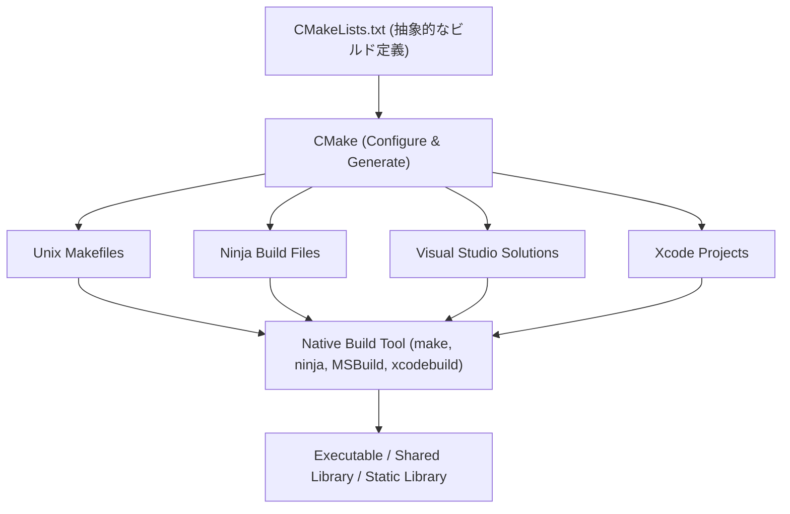
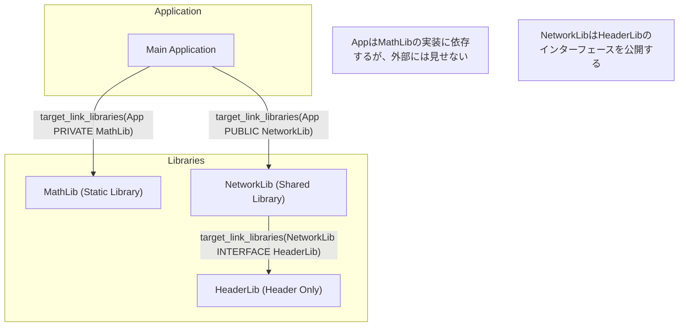
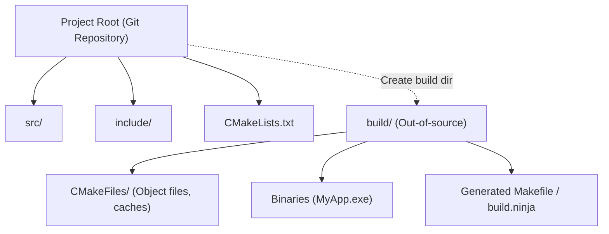

C++でのソフトウェア開発において、長年多くの開発者を悩ませてきたのが「ビルドシステム」の選択と構築です。C++には公式の標準パッケージマネージャやビルドシステムが存在しないため、プラットフォーム（Windows、Linux、macOS）ごとに異なるコンパイラやビルドツール（MSVC、GCC、Clang、Make、Ninjaなど）を使い分ける必要がありました。

しかし、現在では **CMake** が事実上の業界標準（デファクトスタンダード）として定着しており、CMakeを正しく活用することで、単一の `CMakeLists.txt` からクロスプラットフォームなビルド環境をエレガントに構築できるようになっています。

本記事では、CMakeを用いた最新（モダンCMake）のクロスプラットフォームなC++ビルド環境の構築手順について、基礎から高度なテクニックまで、徹底的かつ詳細に解説します。

## 1. CMakeとは何か？（メタビルドシステムの概念）

CMakeは、それ自体が直接ソースコードをコンパイルするツールではありません。CMakeは「ビルドシステムを生成するシステム」、すなわち **メタビルドシステム (Meta-Build System)** です。

CMakeの主な役割は、プラットフォームやコンパイラに依存しない抽象的な設定ファイル（`CMakeLists.txt`）を読み込み、それぞれの環境に最適なネイティブのビルドスクリプト（例：Linuxなら `Makefile`、Windowsなら Visual Studioの `.sln` プロジェクトファイル、あるいは高速な `build.ninja`）を自動生成することです。

以下の図は、CMakeの生成プロセスを表しています。



このように、CMakeを間に挟むことで、開発者はOSごとの細かなコマンドの違いを意識することなく、C++プロジェクトを管理できます。

## 2. モダンCMakeの基本：変数からターゲットへ

CMake 3.0以降の記法は「モダンCMake」と呼ばれ、それ以前（レガシーCMake）とは設計思想が根本的に異なります。レガシーCMakeでは、ディレクトリ単位でグローバル変数を書き換えていく（例：`include_directories()` や `link_libraries()` を使う）アプローチが主流でしたが、これは設定が意図せず他のモジュールに波及してしまうという深刻な副作用を引き起こしがちでした。

モダンCMakeでは、すべてを **ターゲット (Target)** と **プロパティ (Property)** として扱います。オブジェクト指向プログラミングにおけるクラスとメンバ変数の関係に似ています。

- **ターゲット**: 実行可能ファイル（Executable）やライブラリ（Library）。
- **プロパティ**: そのターゲットをビルドするために必要なソースファイル、インクルードディレクトリ、コンパイルオプション、リンクする他のライブラリなど。

設定を特定のターゲットにのみカプセル化（閉じ込める）することで、大規模なプロジェクトでも破綻しない安全なビルド定義が可能になります。

### 最小限の `CMakeLists.txt`

まずは、もっとも基本的な `CMakeLists.txt` を見てみましょう。

```cmake
# CMakeの最小要求バージョンを指定
cmake_minimum_required(VERSION 3.20)

# プロジェクト名と使用する言語を指定
project(MyAwesomeApp VERSION 1.0.0 LANGUAGES CXX)

# C++の標準規格（C++20）を要求
set(CMAKE_CXX_STANDARD 20)
set(CMAKE_CXX_STANDARD_REQUIRED ON)
set(CMAKE_CXX_EXTENSIONS OFF) # コンパイラ固有の拡張機能を無効化

# 実行可能ターゲットの定義
add_executable(MyAwesomeApp main.cpp)
```

このわずか数行で、C++20を要求し、コンパイラ拡張を無効化したポータブルな実行可能ファイルのビルド設定が完了します。

## 3. 依存関係とスコープ: PUBLIC / PRIVATE / INTERFACE

モダンCMakeをマスターする上で最も重要かつ難解なのが、`target_include_directories` や `target_link_libraries` などで使用される **`PUBLIC`, `PRIVATE`, `INTERFACE`** という3つのアクセス修飾子（スコープ）の概念です。

これらは、ターゲットのプロパティ（インクルードパスや依存ライブラリ）を、「自分自身のビルドに必要か？」「自分に依存している他のターゲットにも伝播させるか？」を制御するためのものです。

1. **`PRIVATE`**: そのターゲット自身のビルドにのみ必要。依存先のターゲットには伝播**しない**。
2. **`INTERFACE`**: そのターゲット自身のビルドには不要だが、依存先のターゲットのビルドには伝播**する**（ヘッダーオンリーライブラリなどで使用）。
3. **`PUBLIC`**: そのターゲット自身のビルドに必要であり、かつ、依存先のターゲットにも伝播**する**（`PRIVATE` + `INTERFACE`）。

以下の図で、依存関係の伝播（Usage Requirements の伝播）を視覚化してみましょう。



### スコープの具体的な使用例

あるライブラリ `MyLib` が、内部の実装として `nlohmann/json` を使用しており、公開しているヘッダファイル `MyLib.hpp` の中では `nlohmann/json` をインクルードしていないと仮定します。この場合、`MyLib` を使う側（アプリケーション）は JSONライブラリの存在を知る必要はありません。

```cmake
# ライブラリの定義
add_library(MyLib src/MyLib.cpp)

# 自プロジェクトのインクルードディレクトリの指定
# includeディレクトリは、MyLibを使う人にも必要なので PUBLIC にする
# srcディレクトリは、MyLibの実装でのみ使うので PRIVATE にする
target_include_directories(MyLib
    PUBLIC 
        $<BUILD_INTERFACE:${CMAKE_CURRENT_SOURCE_DIR}/include>
        $<INSTALL_INTERFACE:include>
    PRIVATE
        ${CMAKE_CURRENT_SOURCE_DIR}/src
)

# jsonライブラリは内部実装でのみ使うため PRIVATE でリンクする
target_link_libraries(MyLib PRIVATE nlohmann_json::nlohmann_json)
```

逆に、`MyLib.hpp` の中で `#include <nlohmann/json.hpp>` と書いている場合は、`MyLib` を使う側も JSON のヘッダパスを知らなければコンパイルエラーになるため、`PUBLIC` でリンクする必要があります。このスコープを適切に設定することで、ビルド時間の短縮や不要な依存関係の漏洩（リポイズニング）を防ぐことができます。

## 4. アウトオブソースビルド (Out-of-source Build)

CMakeを使う上で必ず守るべきベストプラクティスが **アウトオブソースビルド** です。
これは、ソースコードが置かれているディレクトリ（ソースツリー）にビルド成果物（オブジェクトファイルや実行ファイル）を一切出力せず、別の専用ディレクトリ（通常は `build/`）に分離してビルドを行う手法です。



この構成により、ビルド環境をリセットしたい場合は `build` ディレクトリを丸ごと削除するだけで済み、ソースツリーが汚れないため Git の管理も容易になります（`.gitignore` に `build/` を追加するだけで済みます）。

### ビルドの実行手順

モダンCMakeでは、OSやビルドツールに依存しない共通のコマンドでビルドを実行できます。

```bash
# 1. コンフィグレーションと生成（ビルドディレクトリを作成しつつ設定）
cmake -S . -B build

# 2. 実際のビルド（コンパイルとリンク）
cmake --build build --config Release

# (オプション) マルチスレッドでビルドする場合は -j オプションを使用
cmake --build build --config Release -j 8
```

ここで `cmake -S . -B build` は、「現在のディレクトリ（`.`）をソースディレクトリとし、`build` をビルドディレクトリとして設定する」という意味になります。

## 5. サードパーティライブラリの導入方法

C++開発において、外部ライブラリ（サードパーティ製ライブラリ）の導入は常にハードルが高いものでした。しかし現在では、主に以下の3つのアプローチが標準的です。

### 5.1. find_package (システムインストール済みのライブラリ検索)

システムに既にインストールされているライブラリ（例: OpenSSLやZlibなど）を見つけてリンクする、最も伝統的な方法です。

```cmake
find_package(ZLIB REQUIRED)
if(ZLIB_FOUND)
    target_link_libraries(MyAwesomeApp PRIVATE ZLIB::ZLIB)
endif()
```

### 5.2. FetchContent (ソースからのダウンロードと組み込み)

CMake 3.11で導入され、3.14以降で強力になったモジュールです。ビルド時に外部のGitリポジトリやURLから直接ソースコードをダウンロードし、プロジェクトの一部として一緒にビルドします。依存関係を一元管理できるため、クロスプラットフォームでの再現性が極めて高くなります。

以下は GoogleTest を FetchContent で導入する例です。

```cmake
include(FetchContent)

FetchContent_Declare(
  googletest
  GIT_REPOSITORY https://github.com/google/googletest.git
  GIT_TAG        v1.14.0
)

# ライブラリをプロジェクトに取り込む
FetchContent_MakeAvailable(googletest)

# テスト用実行ファイルの作成とリンク
add_executable(MyTests test/main.cpp)
target_link_libraries(MyTests PRIVATE gtest_main)
```

### 5.3. vcpkg との連携

Microsoftが主導するC++向けパッケージマネージャ **vcpkg** を使うと、何千ものライブラリを簡単に導入できます。vcpkg はCMakeとシームレスに連携できるように設計されています。

CMake実行時に、vcpkg のツールチェーンファイルを指定するだけで、`find_package` が自動的に vcpkg 内のライブラリを探索するようになります。

```bash
cmake -S . -B build -DCMAKE_TOOLCHAIN_FILE=/path/to/vcpkg/scripts/buildsystems/vcpkg.cmake
```

また、`vcpkg.json`（マニフェストモード）をプロジェクトルートに配置することで、必要なライブラリのバージョン管理を完全に自動化できます。

## 6. クロスプラットフォーム対応のコンパイラフラグ

Windows (MSVC)、Linux (GCC/Clang)、macOS (Apple Clang) のいずれの環境でもビルドを通すためには、コンパイラ固有のフラグを適切に設定する必要があります。

CMakeの **ジェネレータ式 (Generator Expressions)** を使うことで、「もしコンパイラがMSVCならこのフラグ、そうでないならあのフラグ」といった条件分岐を宣言的に記述できます。ジェネレータ式は `$<...>` という構文を使用し、ビルドシステムの生成時（Generateフェーズ）に評価されます。

```cmake
# 全プラットフォームで最高レベルの警告を有効にする例
target_compile_options(MyAwesomeApp PRIVATE
    # MSVCの場合
    $<$<CXX_COMPILER_ID:MSVC>:/W4 /WX>
    
    # GCC または Clang の場合
    $<$<OR:$<CXX_COMPILER_ID:GNU>,$<CXX_COMPILER_ID:Clang>,$<CXX_COMPILER_ID:AppleClang>>:-Wall -Wextra -Wpedantic -Werror>
)
```

この方法を用いることで、`if(MSVC)` のような条件分岐を多用して `CMakeLists.txt` が読みにくくなるのを防ぎ、ターゲットごとに柔軟な設定が可能になります。

## 7. テスト環境の構築 (CTest)

クロスプラットフォーム環境における品質保証において、自動テストの導入は必須です。CMakeには **CTest** というテストランナーが標準で付属しています。

前述の `FetchContent` で導入した GoogleTest を CTest と統合する手順は以下の通りです。

```cmake
# テスト機能を有効化（ルートのCMakeLists.txtに一度だけ記述）
enable_testing()

add_executable(MyMathTests test/math_test.cpp)
target_link_libraries(MyMathTests PRIVATE gtest_main MyLib)

# CTestにテストとして登録する
include(GoogleTest)
gtest_discover_tests(MyMathTests)
```

ビルド後、ビルドディレクトリ内で `ctest` コマンドを実行するだけで、すべてのテストが実行され結果がレポートされます。

```bash
cd build
ctest --output-on-failure -C Release
```

## 8. ビルドシステムの理論と数理モデル

ここで少し視点を変えて、大規模プロジェクトにおけるビルドシステムと並列コンパイルの効率性について、数学的なモデルを用いて考察してみましょう。

ビルド時間（コンパイル時間）の短縮は、C++開発における永遠の課題です。ソースコードの分割と並列コンパイルを行うことで、ビルド時間を短縮できます。この並列化による速度向上（Speedup）は、**アムダールの法則 (Amdahl's Law)** によってモデル化されます。

プログラムのうち、並列化可能な部分の割合を $P$ 、直列で実行しなければならない（並列化不可能な）部分の割合を $1-P$ とし、使用するプロセッサの数を $N$ とした場合、全体的な理論上の最大速度向上率 $S(N)$ は次の数式で表されます。

$$ S(N) = \frac{1}{(1 - P) + \frac{P}{N}} $$

C++のビルドプロセスにおいて、「各 `.cpp` ファイルから `.o` または `.obj` へのコンパイル」は独立しており並列化可能ですが（$P$ の部分）、「最終的なリンカ (Linker) による結合処理」は基本的に直列で行われます（$1-P$ の部分）。

したがって、どれだけコア数の多いCPU（$N \to \infty$）を用意したとしても、リンク時間というボトルネックが存在する限り、最大速度向上率は以下の式に漸近してしまいます。

$$ \lim_{N \to \infty} S(N) = \frac{1}{1 - P} $$

この数式が示唆しているのは、「単にCPUコアを増やすだけではビルド時間の短縮には限界がある」ということです。モダンCMakeにおける `PRIVATE` や `INTERFACE` を適切に使い分け、ヘッダーファイルの依存関係を最小限に抑える（前方宣言を活用する等）ことで、$P$ の割合を大きくし、インクリメンタルビルド時の再コンパイル対象を減らすことが、実用上最も効果的なビルド高速化の戦略となります。

また、リンク時間の短縮においては、静的ライブラリ（Static Library）から共有ライブラリ / DLL （Shared Library）への切り替えや、LLD / Mold などの高速なリンカを採用することが重要です。

CMakeでは、次のようにリンカの指定を簡単に行うことができます。

```cmake
# Clang/GCC環境で lld リンカを使用するよう設定
if(UNIX AND NOT APPLE)
    target_link_options(MyAwesomeApp PRIVATE "-fuse-ld=lld")
endif()
```

## 9. 複雑なディレクトリ構成の実践例

実際のアプリケーション開発では、多数のモジュールが組み合わさったディレクトリ構成になります。最後に、理想的な中規模プロジェクトのディレクトリ構造と、親子の `CMakeLists.txt` の関係を示します。

```text
ProjectRoot/
├── CMakeLists.txt (Root: プロジェクト全体の定義)
├── vcpkg.json     (依存ライブラリの定義)
├── external/      (外部モジュール)
├── include/       (公開ヘッダー)
│   └── myapp/
├── src/           (ソースコードと内部ビルド定義)
│   ├── CMakeLists.txt
│   ├── main.cpp
│   ├── math/
│   │   ├── CMakeLists.txt
│   │   ├── Vector3.hpp
│   │   └── Vector3.cpp
│   └── network/
│       ├── CMakeLists.txt
│       └── NetworkManager.cpp
└── tests/         (テストコード)
    ├── CMakeLists.txt
    └── math_test.cpp
```

ルートの `CMakeLists.txt` は、環境設定や全体のオプション定義のみを行い、サブディレクトリを `add_subdirectory()` で追加していきます。

**Root `CMakeLists.txt`**:
```cmake
cmake_minimum_required(VERSION 3.20)
project(ComplexApp LANGUAGES CXX)

# グローバルな設定
set(CMAKE_CXX_STANDARD 20)
set(CMAKE_CXX_STANDARD_REQUIRED ON)

# テストの有効化
enable_testing()

# サブディレクトリの追加
add_subdirectory(src)
add_subdirectory(tests)
```

**`src/CMakeLists.txt`**:
```cmake
# 各モジュールを追加
add_subdirectory(math)
add_subdirectory(network)

# 最終的な実行ファイル
add_executable(ComplexApp main.cpp)

# モジュールのリンク
target_link_libraries(ComplexApp
    PRIVATE
        MathLib
        NetworkLib
)
```

このようにディレクトリごとに `CMakeLists.txt` を分割し、ターゲット同士の依存関係として定義していくことで、モジュールの再利用性が高まり、ビルドの並列性も向上します。これがモダンCMakeが提唱する「モジュール化されたビルド環境」の真骨頂です。

## 10. まとめ

CMakeを用いたクロスプラットフォームなC++ビルド環境の構築手順について解説しました。
ポイントを振り返ります。

1. **メタビルドシステムの理解**: CMakeはビルドスクリプトを生成するツールである。
2. **モダンCMakeの徹底**: 変数を使わず、`add_executable`, `target_link_libraries`, `target_include_directories` などの**ターゲット指向**で設定をカプセル化する。
3. **スコープの適切な設定**: `PUBLIC`, `PRIVATE`, `INTERFACE` を正しく使い分け、依存関係の波及を制御する。
4. **アウトオブソースビルドの徹底**: `build/` ディレクトリ内でビルドを行い、ソースツリーを汚さない。
5. **サードパーティ連携**: `FetchContent` や `vcpkg` を駆使し、依存ライブラリの解決を自動化する。
6. **ジェネレータ式の活用**: コンパイラごとのフラグの違いをスマートに吸収する。
7. **数理的アプローチ**: アムダールの法則を意識し、依存関係を減らして並列コンパイルの効率を高める。

最初は難解に感じるCMakeですが、ターゲットとプロパティの概念さえ掴んでしまえば、どんなに複雑で巨大なC++プロジェクトであっても、整然としたビルド環境を維持することができます。ぜひ本記事を参考に、最新のモダンCMakeの記法でC++開発環境を構築してみてください。
