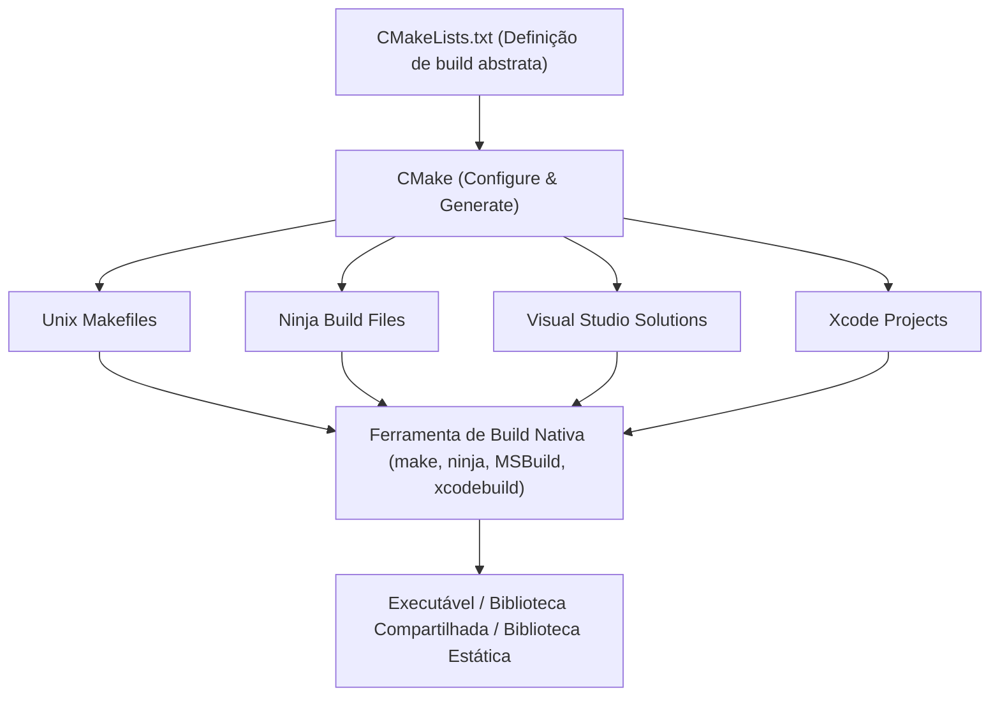
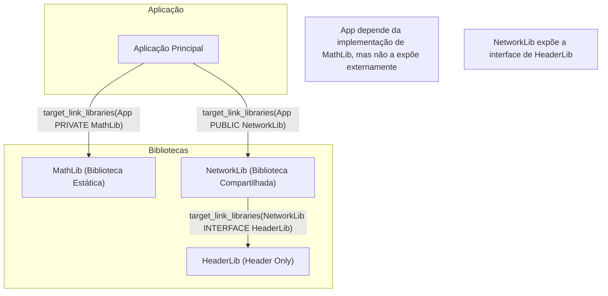
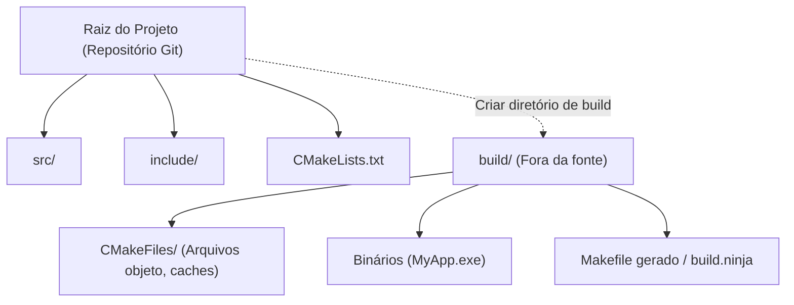

No desenvolvimento de software em C++, a escolha e a configuração de um "sistema de build" têm sido um desafio para muitos desenvolvedores há anos. Como o C++ não possui um gerenciador de pacotes padrão oficial ou um sistema de build embutido, era necessário utilizar diferentes compiladores e ferramentas de build (MSVC, GCC, Clang, Make, Ninja, etc.) para cada plataforma (Windows, Linux, macOS).

No entanto, atualmente, o **CMake** se consolidou como o padrão da indústria (de facto). Ao utilizar o CMake corretamente, é possível construir de forma elegante um ambiente de build multiplataforma a partir de um único `CMakeLists.txt`.

Neste artigo, explicaremos de forma minuciosa e detalhada as etapas de configuração de um ambiente de build C++ multiplataforma utilizando a versão mais recente do CMake (CMake moderno), desde os conceitos básicos até as técnicas mais avançadas.

## 1. O que é o CMake? (O conceito de sistema de meta-build)

O CMake não é uma ferramenta que compila o código-fonte diretamente. O CMake é um "sistema gerador de sistema de build", ou seja, um **sistema de meta-build (Meta-Build System)**.

O principal papel do CMake é ler um arquivo de configuração abstrato e independente de plataforma ou compilador (`CMakeLists.txt`) e gerar automaticamente os scripts de build nativos ideais para cada ambiente (ex.: `Makefile` no Linux, arquivos de projeto `.sln` do Visual Studio no Windows, ou o rápido `build.ninja`).

O diagrama abaixo ilustra o processo de geração do CMake.



Dessa forma, ao colocar o CMake no meio, os desenvolvedores podem gerenciar projetos C++ sem se preocupar com as pequenas diferenças de comandos entre cada sistema operacional.

## 2. O básico do CMake Moderno: Das variáveis aos alvos (Targets)

A notação a partir do CMake 3.0 é chamada de "CMake Moderno", e sua filosofia de design é fundamentalmente diferente das versões anteriores (CMake Legado). No CMake Legado, a abordagem principal era reescrever variáveis globais por diretório (ex.: usando `include_directories()` ou `link_libraries()`), mas isso frequentemente causava o grave efeito colateral de configurações se propagando involuntariamente para outros módulos.

No CMake Moderno, tudo é tratado como **Alvo (Target)** e **Propriedade (Property)**. É semelhante à relação entre classes e variáveis de membro na programação orientada a objetos.

- **Alvo (Target)**: Um arquivo executável (Executable) ou uma biblioteca (Library).
- **Propriedade (Property)**: Os arquivos de código-fonte, diretórios de inclusão (include), opções de compilação, outras bibliotecas a serem linkadas e tudo o mais necessário para construir esse alvo.

Ao encapsular (isolar) a configuração apenas em alvos específicos, é possível ter definições de build seguras que não quebram mesmo em projetos de grande escala.

### Um `CMakeLists.txt` mínimo

Primeiramente, vejamos um `CMakeLists.txt` na sua forma mais básica.

```cmake
# Especifica a versão mínima exigida do CMake
cmake_minimum_required(VERSION 3.20)

# Especifica o nome do projeto e a linguagem a ser utilizada
project(MyAwesomeApp VERSION 1.0.0 LANGUAGES CXX)

# Exige o padrão C++ (C++20)
set(CMAKE_CXX_STANDARD 20)
set(CMAKE_CXX_STANDARD_REQUIRED ON)
set(CMAKE_CXX_EXTENSIONS OFF) # Desabilita extensões específicas do compilador

# Definição do alvo executável
add_executable(MyAwesomeApp main.cpp)
```

Com apenas estas poucas linhas, completa-se a configuração de build para um arquivo executável portável que exige C++20 e tem as extensões do compilador desabilitadas.

## 3. Dependências e Escopo: PUBLIC / PRIVATE / INTERFACE

O conceito mais importante e complexo para dominar o CMake Moderno são os três modificadores de acesso (escopos) **`PUBLIC`, `PRIVATE`, `INTERFACE`**, usados em comandos como `target_include_directories` ou `target_link_libraries`.

Eles servem para controlar se as propriedades de um alvo (caminhos de inclusão ou bibliotecas dependentes) são "necessárias para a própria construção?" e se devem ser "propagadas para outros alvos que dependem dele?".

1. **`PRIVATE`**: Necessário apenas para o build do próprio alvo. **Não** se propaga para os alvos dependentes.
2. **`INTERFACE`**: Não é necessário para o build do próprio alvo, mas se propaga para o build dos alvos dependentes (usado, por exemplo, em bibliotecas do tipo header-only).
3. **`PUBLIC`**: Necessário para o build do próprio alvo e **também** se propaga para os alvos dependentes (`PRIVATE` + `INTERFACE`).

Vejamos a propagação de dependências (Usage Requirements) ilustrada no diagrama abaixo.



### Exemplo prático de uso dos escopos

Suponha que uma biblioteca `MyLib` use internamente `nlohmann/json` na sua implementação, e o arquivo de cabeçalho público `MyLib.hpp` não inclua `nlohmann/json`. Neste caso, quem utiliza a `MyLib` (a aplicação) não precisa saber da existência da biblioteca JSON.

```cmake
# Definição da biblioteca
add_library(MyLib src/MyLib.cpp)

# Especificação dos diretórios de inclusão do próprio projeto
# O diretório include é necessário para quem usa a MyLib, então é PUBLIC
# O diretório src é usado apenas na implementação da MyLib, então é PRIVATE
target_include_directories(MyLib
    PUBLIC 
        $<BUILD_INTERFACE:${CMAKE_CURRENT_SOURCE_DIR}/include>
        $<INSTALL_INTERFACE:include>
    PRIVATE
        ${CMAKE_CURRENT_SOURCE_DIR}/src
)

# A biblioteca json é usada apenas na implementação interna, então é linkada como PRIVATE
target_link_libraries(MyLib PRIVATE nlohmann_json::nlohmann_json)
```

Por outro lado, se dentro de `MyLib.hpp` houvesse `#include <nlohmann/json.hpp>`, o usuário da `MyLib` precisaria saber o caminho dos cabeçalhos do JSON sob pena de erro de compilação; logo, seria necessário linkar como `PUBLIC`. Configurar corretamente esses escopos permite reduzir o tempo de build e prevenir o vazamento de dependências desnecessárias.

## 4. Build Fora da Fonte (Out-of-source Build)

Uma das melhores práticas que deve ser sempre seguida ao usar o CMake é o **Out-of-source Build** (Build fora da fonte).
Trata-se de uma técnica onde nenhum artefato de build (arquivos objeto ou executáveis) é gerado no diretório onde o código-fonte está localizado (source tree). Em vez disso, o build é realizado em um diretório dedicado separado (geralmente `build/`).



Com essa estrutura, se você quiser redefinir o ambiente de build, basta excluir todo o diretório `build`, mantendo a source tree limpa e facilitando o gerenciamento no Git (basta adicionar `build/` no `.gitignore`).

### Etapas para execução do build

No CMake Moderno, o build pode ser executado através de comandos comuns que não dependem do sistema operacional ou da ferramenta de build.

```bash
# 1. Configuração e Geração (Cria o diretório de build e o configura)
cmake -S . -B build

# 2. Build real (Compilação e Linkagem)
cmake --build build --config Release

# (Opcional) Usar a flag -j para compilação multithread
cmake --build build --config Release -j 8
```

Aqui, `cmake -S . -B build` significa "definir o diretório atual (`.`) como o diretório fonte (`-S`) e `build` como o diretório de build (`-B`)".

## 5. Como introduzir bibliotecas de terceiros

No desenvolvimento em C++, a introdução de bibliotecas externas (de terceiros) sempre foi um obstáculo. Hoje, porém, existem três abordagens principais que se tornaram o padrão.

### 5.1. find_package (Pesquisa de bibliotecas instaladas no sistema)

O método mais tradicional, onde se localiza e se linka uma biblioteca já instalada no sistema (ex.: OpenSSL ou Zlib).

```cmake
find_package(ZLIB REQUIRED)
if(ZLIB_FOUND)
    target_link_libraries(MyAwesomeApp PRIVATE ZLIB::ZLIB)
endif()
```

### 5.2. FetchContent (Download a partir do código-fonte e integração)

Um módulo introduzido no CMake 3.11 e fortalecido a partir da versão 3.14. Ele baixa o código-fonte diretamente de um repositório Git externo ou URL durante o tempo de build e o compila junto, como parte do projeto. Como as dependências podem ser centralizadas, a reprodutibilidade multiplataforma torna-se extremamente alta.

Abaixo está um exemplo de como introduzir o GoogleTest usando o FetchContent.

```cmake
include(FetchContent)

FetchContent_Declare(
  googletest
  GIT_REPOSITORY https://github.com/google/googletest.git
  GIT_TAG        v1.14.0
)

# Torna a biblioteca disponível para o projeto
FetchContent_MakeAvailable(googletest)

# Criação do executável de testes e linkagem
add_executable(MyTests test/main.cpp)
target_link_libraries(MyTests PRIVATE gtest_main)
```

### 5.3. Integração com o vcpkg

Usando o **vcpkg**, o gerenciador de pacotes para C++ liderado pela Microsoft, você pode introduzir milhares de bibliotecas facilmente. O vcpkg foi projetado para se integrar perfeitamente com o CMake.

Ao executar o CMake, basta especificar o arquivo toolchain do vcpkg, e o `find_package` procurará automaticamente pelas bibliotecas dentro do vcpkg.

```bash
cmake -S . -B build -DCMAKE_TOOLCHAIN_FILE=/path/to/vcpkg/scripts/buildsystems/vcpkg.cmake
```

Além disso, colocando um arquivo `vcpkg.json` (modo de manifesto) na raiz do projeto, é possível automatizar completamente o gerenciamento de versões das bibliotecas necessárias.

## 6. Flags de compilador multiplataforma

Para garantir que o build funcione em qualquer ambiente, como Windows (MSVC), Linux (GCC/Clang) ou macOS (Apple Clang), é necessário definir adequadamente as flags específicas de cada compilador.

Usando **Expressões de Gerador (Generator Expressions)** do CMake, é possível descrever ramificações condicionais de forma declarativa, como: "se o compilador for MSVC, use esta flag; se não, use aquela". As expressões de gerador utilizam a sintaxe `$<...>` e são avaliadas na fase de geração (Generate) do sistema de build.

```cmake
# Exemplo de ativação do nível máximo de alertas (warnings) para todas as plataformas
target_compile_options(MyAwesomeApp PRIVATE
    # Caso seja MSVC
    $<$<CXX_COMPILER_ID:MSVC>:/W4 /WX>
    
    # Caso seja GCC ou Clang
    $<$<OR:$<CXX_COMPILER_ID:GNU>,$<CXX_COMPILER_ID:Clang>,$<CXX_COMPILER_ID:AppleClang>>:-Wall -Wextra -Wpedantic -Werror>
)
```

Usando este método, evita-se o uso excessivo de condicionais como `if(MSVC)`, que deixam o `CMakeLists.txt` difícil de ler, e permite configurações flexíveis por alvo.

## 7. Configurando o ambiente de testes (CTest)

Para a garantia de qualidade num ambiente multiplataforma, a introdução de testes automatizados é indispensável. O CMake já vem com um executor de testes padrão chamado **CTest**.

Os passos para integrar o GoogleTest (introduzido anteriormente com `FetchContent`) ao CTest são os seguintes:

```cmake
# Habilita a funcionalidade de testes (escrito apenas uma vez no CMakeLists.txt raiz)
enable_testing()

add_executable(MyMathTests test/math_test.cpp)
target_link_libraries(MyMathTests PRIVATE gtest_main MyLib)

# Registra como um teste no CTest
include(GoogleTest)
gtest_discover_tests(MyMathTests)
```

Após o build, basta executar o comando `ctest` dentro do diretório de build e todos os testes serão executados, gerando um relatório com os resultados.

```bash
cd build
ctest --output-on-failure -C Release
```

## 8. A teoria e o modelo matemático do sistema de build

Mudando um pouco a perspectiva, vamos analisar a eficiência do sistema de build e da compilação paralela em projetos de grande escala usando um modelo matemático.

A redução do tempo de build (tempo de compilação) é um problema eterno no desenvolvimento C++. Dividindo o código-fonte e compilando de forma paralela, o tempo de build pode ser reduzido. Essa melhoria de velocidade por meio da paralelização (Speedup) é modelada pela **Lei de Amdahl (Amdahl's Law)**.

Considerando que a proporção da parte do programa que pode ser paralelizada é $P$, a proporção que deve ser executada sequencialmente (não paralelizável) é $1-P$, e o número de processadores utilizados é $N$, a taxa máxima de aceleração teórica total $S(N)$ é expressa pela seguinte fórmula:

$$ S(N) = \frac{1}{(1 - P) + \frac{P}{N}} $$

No processo de build do C++, a "compilação de cada arquivo `.cpp` para `.o` ou `.obj`" é independente e paralelizável (parte $P$), mas o "processo de união pelo vinculador (Linker) final" é essencialmente realizado de forma sequencial (parte $1-P$).

Portanto, não importa o quão infinito seja o número de núcleos de CPU ($N \to \infty$) disponíveis, desde que exista o gargalo do tempo de linkagem, a taxa de aceleração máxima será assintótica à seguinte fórmula:

$$ \lim_{N \to \infty} S(N) = \frac{1}{1 - P} $$

O que esta fórmula sugere é: "apenas adicionar núcleos à CPU tem um limite na redução do tempo de build". A estratégia mais eficaz e prática de aceleração do build é aumentar a proporção $P$ e diminuir os itens a serem recompilados durante um build incremental, usando adequadamente `PRIVATE` e `INTERFACE` do CMake Moderno, e minimizando dependências de cabeçalho (aproveitando declarações prévias (forward declarations), etc.).

Além disso, para a redução do tempo de linkagem, é importante mudar de bibliotecas estáticas (Static Library) para bibliotecas dinâmicas / DLL (Shared Library) ou adotar vinculadores (linkers) mais rápidos, como LLD ou Mold.

No CMake, é possível configurar facilmente a especificação do linker da seguinte forma:

```cmake
# Configurando para utilizar o linker lld em ambientes Clang/GCC
if(UNIX AND NOT APPLE)
    target_link_options(MyAwesomeApp PRIVATE "-fuse-ld=lld")
endif()
```

## 9. Exemplo prático de uma estrutura de diretórios complexa

No desenvolvimento real de uma aplicação, a estrutura de diretórios geralmente envolve a combinação de múltiplos módulos. Por fim, mostramos a estrutura de diretórios ideal de um projeto de tamanho médio e a relação entre os arquivos `CMakeLists.txt` parentes e filhos.

```text
ProjectRoot/
├── CMakeLists.txt (Raiz: Definição de todo o projeto)
├── vcpkg.json     (Definição de bibliotecas dependentes)
├── external/      (Módulos externos)
├── include/       (Cabeçalhos públicos)
│   └── myapp/
├── src/           (Código-fonte e definições de build internas)
│   ├── CMakeLists.txt
│   ├── main.cpp
│   ├── math/
│   │   ├── CMakeLists.txt
│   │   ├── Vector3.hpp
│   │   └── Vector3.cpp
│   └── network/
│       ├── CMakeLists.txt
│       └── NetworkManager.cpp
└── tests/         (Código de testes)
    ├── CMakeLists.txt
    └── math_test.cpp
```

O `CMakeLists.txt` raiz contém apenas configurações de ambiente e definições de opções globais, adicionando os subdiretórios com `add_subdirectory()`.

**`CMakeLists.txt` Raiz**:
```cmake
cmake_minimum_required(VERSION 3.20)
project(ComplexApp LANGUAGES CXX)

# Configurações globais
set(CMAKE_CXX_STANDARD 20)
set(CMAKE_CXX_STANDARD_REQUIRED ON)

# Habilitando os testes
enable_testing()

# Adicionando subdiretórios
add_subdirectory(src)
add_subdirectory(tests)
```

**`src/CMakeLists.txt`**:
```cmake
# Adiciona cada módulo
add_subdirectory(math)
add_subdirectory(network)

# Arquivo executável final
add_executable(ComplexApp main.cpp)

# Linkagem dos módulos
target_link_libraries(ComplexApp
    PRIVATE
        MathLib
        NetworkLib
)
```

Dessa forma, ao dividir o `CMakeLists.txt` por diretório e definir as dependências entre os alvos, aumenta-se a reutilização de módulos e melhora o paralelismo do build. Esse é o grande trunfo do "ambiente de build modularizado" defendido pelo CMake Moderno.

## 10. Conclusão

Abordamos as etapas para a configuração de um ambiente de build C++ multiplataforma usando o CMake.
Recapitulando os pontos principais:

1. **Entendimento do sistema de meta-build**: O CMake é uma ferramenta que gera scripts de build.
2. **Uso intenso do CMake Moderno**: Não use variáveis; encapsule as configurações orientadas a **alvos (targets)**, usando comandos como `add_executable`, `target_link_libraries` e `target_include_directories`.
3. **Configuração adequada de escopos**: Faça a distinção correta entre `PUBLIC`, `PRIVATE` e `INTERFACE`, controlando a propagação das dependências.
4. **Execução constante de build fora da fonte (Out-of-source build)**: Faça o build dentro do diretório `build/`, sem sujar a source tree.
5. **Integração com terceiros**: Utilize o `FetchContent` e o `vcpkg` de forma plena e automatize a resolução de dependências de bibliotecas.
6. **Uso de expressões de gerador (Generator Expressions)**: Absorva as diferenças de flags entre compiladores de forma inteligente.
7. **Abordagem matemática**: Tenha consciência da Lei de Amdahl, reduzindo as dependências para aumentar a eficiência da compilação paralela.

O CMake pode parecer intimidador e complexo no começo, mas ao dominar os conceitos de alvos e propriedades, é possível manter um ambiente de build organizado em qualquer projeto C++, por maior e mais complexo que seja. Esperamos que este artigo sirva de base para que você consiga configurar o seu ambiente de desenvolvimento C++ utilizando a sintaxe do CMake Moderno!
