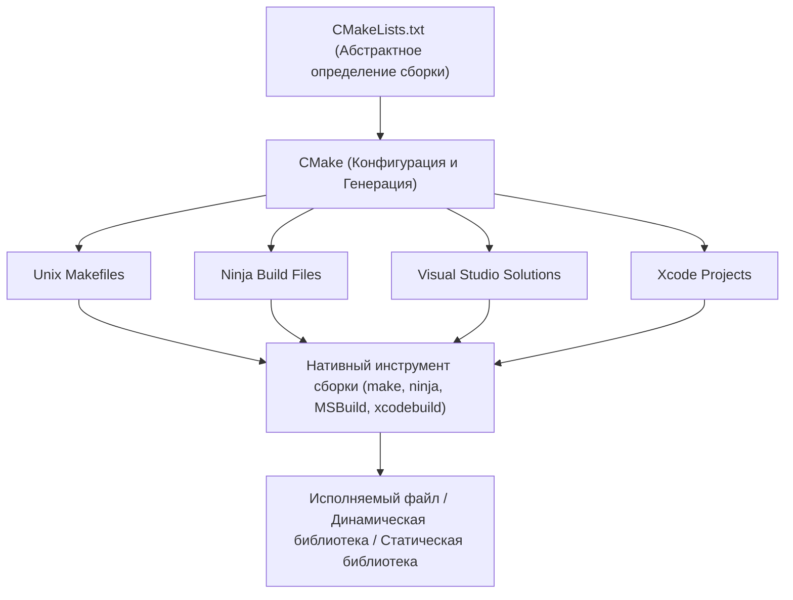
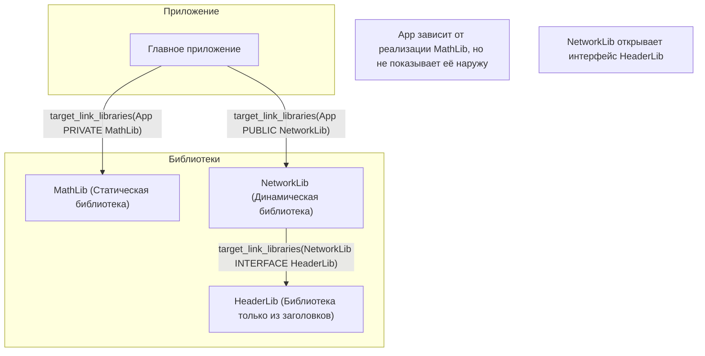
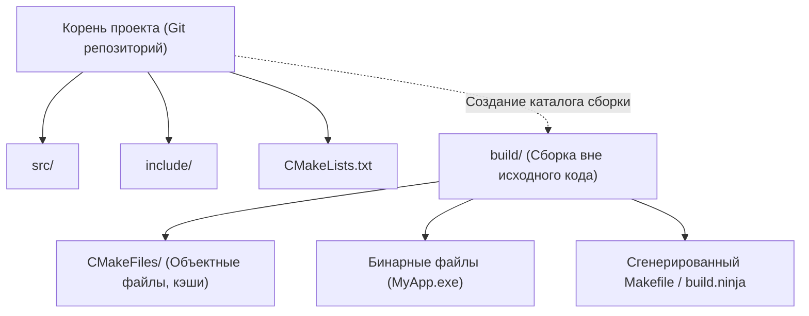

При разработке программного обеспечения на C++ выбор и настройка «системы сборки» долгие годы были проблемой для многих разработчиков. Поскольку в C++ нет официального стандартного менеджера пакетов или системы сборки, приходилось использовать различные компиляторы и инструменты сборки (MSVC, GCC, Clang, Make, Ninja и т. д.) в зависимости от платформы (Windows, Linux, macOS).

Однако сегодня **CMake** стал де-факто отраслевым стандартом, и при правильном его использовании можно элегантно настроить кроссплатформенную среду сборки из единого `CMakeLists.txt`.

В этой статье подробно и основательно, от базовых до продвинутых техник, рассматривается процесс настройки кроссплатформенной среды сборки C++ с использованием современного CMake (Modern CMake).

## 1. Что такое CMake? (Концепция мета-системы сборки)

CMake сам по себе не является инструментом, который напрямую компилирует исходный код. CMake — это «система, которая генерирует систему сборки», то есть **мета-система сборки (Meta-Build System)**.

Основная роль CMake заключается в чтении абстрактного конфигурационного файла (`CMakeLists.txt`), независимого от платформы и компилятора, и автоматической генерации нативных скриптов сборки, оптимальных для каждой среды (например, `Makefile` для Linux, файлы проектов `.sln` Visual Studio для Windows или быстрые `build.ninja`).

Следующая диаграмма иллюстрирует процесс генерации в CMake.



Таким образом, используя CMake в качестве промежуточного звена, разработчики могут управлять проектами C++ без необходимости учитывать мелкие различия в командах для каждой ОС.

## 2. Основы современного CMake: от переменных к целям

Синтаксис, начиная с CMake 3.0, называется «современным CMake» (Modern CMake), и его философия проектирования фундаментально отличается от более ранних версий (устаревшего CMake). В старом CMake преобладал подход с изменением глобальных переменных на уровне каталогов (например, с использованием `include_directories()` и `link_libraries()`), что часто приводило к серьезным побочным эффектам, когда настройки непреднамеренно распространялись на другие модули.

В современном CMake всё рассматривается как **Цели (Targets)** и **Свойства (Properties)**. Это похоже на связь между классами и переменными-членами в объектно-ориентированном программировании.

- **Цель (Target)**: Исполняемый файл (Executable) или библиотека (Library).
- **Свойство (Property)**: Исходные файлы, каталоги для включения (include directories), параметры компиляции, другие библиотеки для компоновки и прочее, необходимое для сборки этой цели.

Инкапсулируя (ограничивая) настройки только определенными целями, можно создать безопасную конфигурацию сборки, которая не сломается даже в крупномасштабных проектах.

### Минимальный `CMakeLists.txt`

Сначала давайте посмотрим на самый базовый `CMakeLists.txt`.

```cmake
# Указание минимально требуемой версии CMake
cmake_minimum_required(VERSION 3.20)

# Указание имени проекта и используемого языка
project(MyAwesomeApp VERSION 1.0.0 LANGUAGES CXX)

# Требование стандарта C++ (C++20)
set(CMAKE_CXX_STANDARD 20)
set(CMAKE_CXX_STANDARD_REQUIRED ON)
set(CMAKE_CXX_EXTENSIONS OFF) # Отключение специфичных для компилятора расширений

# Определение цели - исполняемого файла
add_executable(MyAwesomeApp main.cpp)
```

Всего несколькими строками завершена настройка портативной сборки исполняемого файла, требующего C++20 и с отключенными расширениями компилятора.

## 3. Зависимости и области видимости: PUBLIC / PRIVATE / INTERFACE

Самыми важными и сложными для освоения концепциями в современном CMake являются три модификатора доступа (области видимости): **`PUBLIC`, `PRIVATE`, `INTERFACE`**, которые используются в таких командах, как `target_include_directories` и `target_link_libraries`.

Они предназначены для управления тем, нужны ли свойства цели (пути включения или зависимые библиотеки) "только для сборки самой цели?" или "они также должны распространяться на другие цели, зависящие от этой?".

1. **`PRIVATE`**: Требуется только для сборки самой цели. **Не** распространяется на зависимые цели.
2. **`INTERFACE`**: Не требуется для сборки самой цели, но **распространяется** на зависимые цели (используется для библиотек, состоящих только из заголовочных файлов, и т. д.).
3. **`PUBLIC`**: Требуется для сборки самой цели, а также **распространяется** на зависимые цели (`PRIVATE` + `INTERFACE`).

Давайте визуализируем распространение зависимостей (распространение Usage Requirements) на следующей диаграмме.



### Конкретный пример использования областей видимости

Предположим, что некая библиотека `MyLib` использует `nlohmann/json` во внутренней реализации, но не включает `nlohmann/json` в свой публичный заголовочный файл `MyLib.hpp`. В этом случае стороне (приложению), использующей `MyLib`, не нужно знать о существовании библиотеки JSON.

```cmake
# Определение библиотеки
add_library(MyLib src/MyLib.cpp)

# Указание каталогов включения для собственного проекта
# Каталог include необходим тем, кто использует MyLib, поэтому делаем его PUBLIC
# Каталог src используется только в реализации MyLib, поэтому делаем его PRIVATE
target_include_directories(MyLib
    PUBLIC 
        $<BUILD_INTERFACE:${CMAKE_CURRENT_SOURCE_DIR}/include>
        $<INSTALL_INTERFACE:include>
    PRIVATE
        ${CMAKE_CURRENT_SOURCE_DIR}/src
)

# Библиотека json используется только во внутренней реализации, поэтому компонуем её как PRIVATE
target_link_libraries(MyLib PRIVATE nlohmann_json::nlohmann_json)
```

Напротив, если мы напишем `#include <nlohmann/json.hpp>` внутри `MyLib.hpp`, то стороне, использующей `MyLib`, также необходимо будет знать путь к заголовкам JSON, иначе возникнет ошибка компиляции, поэтому нужно компоновать её как `PUBLIC`. Правильно настраивая эту область видимости, можно сократить время сборки и предотвратить утечку ненужных зависимостей.

## 4. Сборка вне исходного кода (Out-of-source Build)

Лучшая практика, которую всегда следует соблюдать при использовании CMake, — это **сборка вне исходного кода (Out-of-source Build)**.
Это метод, при котором артефакты сборки (объектные и исполняемые файлы) вообще не выводятся в каталог, где находится исходный код (дерево исходников), а сборка выполняется в отдельном, выделенном каталоге (обычно `build/`).



Благодаря такой структуре, если вы хотите сбросить среду сборки, достаточно просто удалить каталог `build` целиком, а поскольку дерево исходного кода не загрязняется, управление через Git становится проще (достаточно добавить `build/` в `.gitignore`).

### Процедура выполнения сборки

В современном CMake можно выполнять сборку с помощью общих команд, не зависящих от ОС и инструментов сборки.

```bash
# 1. Конфигурация и генерация (создание каталога сборки и настройка)
cmake -S . -B build

# 2. Фактическая сборка (компиляция и компоновка)
cmake --build build --config Release

# (Опционально) Для многопоточной сборки используйте параметр -j
cmake --build build --config Release -j 8
```

Здесь `cmake -S . -B build` означает «установить текущий каталог (`.`) как каталог исходного кода, а `build` как каталог сборки».

## 5. Способы добавления сторонних библиотек

В разработке на C++ интеграция внешних библиотек (сторонних библиотек) всегда была сопряжена с трудностями. Однако в настоящее время стандартными являются следующие три подхода.

### 5.1. find_package (Поиск библиотек, установленных в системе)

Это самый традиционный метод, при котором выполняется поиск и компоновка библиотек, уже установленных в системе (например, OpenSSL, Zlib и т. д.).

```cmake
find_package(ZLIB REQUIRED)
if(ZLIB_FOUND)
    target_link_libraries(MyAwesomeApp PRIVATE ZLIB::ZLIB)
endif()
```

### 5.2. FetchContent (Загрузка исходного кода и встраивание)

Этот модуль был представлен в CMake 3.11 и стал значительно мощнее начиная с версии 3.14. Во время сборки он напрямую скачивает исходный код из внешнего Git-репозитория или по URL и собирает его вместе как часть проекта. Поскольку зависимости могут управляться централизованно, кроссплатформенная воспроизводимость становится чрезвычайно высокой.

Ниже приведен пример внедрения GoogleTest с помощью FetchContent.

```cmake
include(FetchContent)

FetchContent_Declare(
  googletest
  GIT_REPOSITORY https://github.com/google/googletest.git
  GIT_TAG        v1.14.0
)

# Включение библиотеки в проект
FetchContent_MakeAvailable(googletest)

# Создание исполняемого файла для тестов и компоновка
add_executable(MyTests test/main.cpp)
target_link_libraries(MyTests PRIVATE gtest_main)
```

### 5.3. Интеграция с vcpkg

Используя **vcpkg**, менеджер пакетов для C++, возглавляемый Microsoft, вы можете легко интегрировать тысячи библиотек. vcpkg разработан для бесшовной интеграции с CMake.

Просто указав файл тулчейна (toolchain file) vcpkg при запуске CMake, команда `find_package` автоматически начнет искать библиотеки внутри vcpkg.

```bash
cmake -S . -B build -DCMAKE_TOOLCHAIN_FILE=/path/to/vcpkg/scripts/buildsystems/vcpkg.cmake
```

Кроме того, разместив файл `vcpkg.json` (режим манифеста) в корне проекта, вы можете полностью автоматизировать управление версиями необходимых библиотек.

## 6. Флаги компилятора для кроссплатформенности

Чтобы сборка успешно проходила в любой среде — Windows (MSVC), Linux (GCC/Clang) и macOS (Apple Clang), необходимо правильно настроить специфичные для компилятора флаги.

Используя **Генераторные выражения (Generator Expressions)** CMake, вы можете декларативно описывать условные ветвления в стиле: «если компилятор MSVC, то этот флаг, иначе — другой». Генераторные выражения используют синтаксис `$<...>` и вычисляются на этапе генерации (Generate) системы сборки.

```cmake
# Пример включения максимального уровня предупреждений на всех платформах
target_compile_options(MyAwesomeApp PRIVATE
    # В случае MSVC
    $<$<CXX_COMPILER_ID:MSVC>:/W4 /WX>
    
    # В случае GCC или Clang
    $<$<OR:$<CXX_COMPILER_ID:GNU>,$<CXX_COMPILER_ID:Clang>,$<CXX_COMPILER_ID:AppleClang>>:-Wall -Wextra -Wpedantic -Werror>
)
```

Использование этого метода предотвращает ухудшение читаемости `CMakeLists.txt` из-за обилия условных ветвлений типа `if(MSVC)` и позволяет гибко настраивать параметры для каждой цели.

## 7. Настройка среды тестирования (CTest)

Внедрение автоматического тестирования является обязательным для обеспечения качества в кроссплатформенной среде. CMake стандартно поставляется со средством запуска тестов под названием **CTest**.

Процедура интеграции GoogleTest, внедренного ранее с помощью `FetchContent`, с CTest выглядит следующим образом:

```cmake
# Включение функции тестирования (записывается один раз в корневом CMakeLists.txt)
enable_testing()

add_executable(MyMathTests test/math_test.cpp)
target_link_libraries(MyMathTests PRIVATE gtest_main MyLib)

# Регистрация в качестве теста в CTest
include(GoogleTest)
gtest_discover_tests(MyMathTests)
```

После сборки просто выполните команду `ctest` в каталоге сборки, чтобы запустить все тесты и получить отчет о результатах.

```bash
cd build
ctest --output-on-failure -C Release
```

## 8. Теория систем сборки и математические модели

Давайте немного сместим фокус и рассмотрим эффективность систем сборки и параллельной компиляции в крупномасштабных проектах с использованием математической модели.

Сокращение времени сборки (времени компиляции) — вечная проблема в разработке на C++. Время сборки можно уменьшить, разделяя исходный код и выполняя компиляцию параллельно. Ускорение (Speedup) от такого распараллеливания моделируется **законом Амдала (Amdahl's Law)**.

Если доля программы, которую можно распараллелить, равна $P$, а доля части, которая должна выполняться последовательно (не поддающаяся распараллеливанию), равна $1-P$, при количестве используемых процессоров $N$, общий теоретический максимальный коэффициент ускорения $S(N)$ выражается следующей формулой:

$$ S(N) = \frac{1}{(1 - P) + \frac{P}{N}} $$

В процессе сборки C++ «компиляция из каждого `.cpp` файла в `.o` или `.obj`» независима и может быть распараллелена (доля $P$), в то время как «окончательный процесс связывания (компоновки) линкером» по существу выполняется последовательно (доля $1-P$).

Таким образом, независимо от того, сколько ядер процессора у вас есть ($N \to \infty$), пока существует узкое место в виде времени компоновки, максимальный коэффициент ускорения асимптотически приближается к следующей формуле:

$$ \lim_{N \to \infty} S(N) = \frac{1}{1 - P} $$

Эта формула показывает, что «простое увеличение количества ядер ЦП имеет свои ограничения в сокращении времени сборки». Наиболее эффективной стратегией ускорения сборки на практике является максимизация доли $P$ и уменьшение объектов перекомпиляции во время инкрементальной сборки путем правильного использования `PRIVATE` и `INTERFACE` в современном CMake и минимизации зависимостей заголовочных файлов (например, с использованием опережающих объявлений).

Кроме того, для сокращения времени компоновки важно переключиться со статических библиотек (Static Library) на разделяемые библиотеки / DLL (Shared Library) или использовать быстрые линкеры, такие как LLD или Mold.

В CMake вы можете легко указать линкер следующим образом:

```cmake
# Настройка использования линкера lld в среде Clang/GCC
if(UNIX AND NOT APPLE)
    target_link_options(MyAwesomeApp PRIVATE "-fuse-ld=lld")
endif()
```

## 9. Практический пример сложной структуры каталогов

В реальной разработке приложений структура каталогов состоит из множества объединенных модулей. Наконец, мы покажем идеальную структуру каталогов для проекта среднего размера и взаимосвязь между родительскими и дочерними `CMakeLists.txt`.

```text
ProjectRoot/
├── CMakeLists.txt (Корень: Определение всего проекта)
├── vcpkg.json     (Определение зависимых библиотек)
├── external/      (Внешние модули)
├── include/       (Публичные заголовки)
│   └── myapp/
├── src/           (Исходный код и внутренние определения сборки)
│   ├── CMakeLists.txt
│   ├── main.cpp
│   ├── math/
│   │   ├── CMakeLists.txt
│   │   ├── Vector3.hpp
│   │   └── Vector3.cpp
│   └── network/
│       ├── CMakeLists.txt
│       └── NetworkManager.cpp
└── tests/         (Тестовый код)
    ├── CMakeLists.txt
    └── math_test.cpp
```

Корневой `CMakeLists.txt` содержит только настройки среды и глобальные опции, а подкаталоги добавляются с помощью `add_subdirectory()`.

**Корневой `CMakeLists.txt`**:
```cmake
cmake_minimum_required(VERSION 3.20)
project(ComplexApp LANGUAGES CXX)

# Глобальные настройки
set(CMAKE_CXX_STANDARD 20)
set(CMAKE_CXX_STANDARD_REQUIRED ON)

# Включение тестирования
enable_testing()

# Добавление подкаталогов
add_subdirectory(src)
add_subdirectory(tests)
```

**`src/CMakeLists.txt`**:
```cmake
# Добавление каждого модуля
add_subdirectory(math)
add_subdirectory(network)

# Итоговый исполняемый файл
add_executable(ComplexApp main.cpp)

# Компоновка модулей
target_link_libraries(ComplexApp
    PRIVATE
        MathLib
        NetworkLib
)
```

Разделяя `CMakeLists.txt` по каталогам и определяя зависимости между целями таким образом, вы повышаете возможность повторного использования модулей и улучшаете параллелизм сборки. В этом и заключается суть «модульной среды сборки», продвигаемой современным CMake.

## 10. Заключение

Мы рассмотрели процедуру настройки кроссплатформенной среды сборки C++ с использованием CMake.
Давайте вспомним основные моменты:

1. **Понимание мета-систем сборки**: CMake — это инструмент, который генерирует скрипты сборки.
2. **Строгое следование современному CMake**: Не используйте переменные, инкапсулируйте настройки с помощью **целеориентированного (target-oriented)** подхода, используя `add_executable`, `target_link_libraries`, `target_include_directories` и т. д.
3. **Правильная настройка областей видимости**: Правильно используйте `PUBLIC`, `PRIVATE` и `INTERFACE` для управления распространением зависимостей.
4. **Строгое использование сборки вне исходного кода**: Выполняйте сборку внутри каталога `build/`, чтобы не загрязнять дерево исходного кода.
5. **Интеграция сторонних компонентов**: В полной мере используйте `FetchContent` и `vcpkg` для автоматизации разрешения зависимых библиотек.
6. **Использование генераторных выражений**: Интеллектуальное сглаживание различий в флагах компиляторов.
7. **Математический подход**: Учитывайте закон Амдала, уменьшайте зависимости для повышения эффективности параллельной компиляции.

Поначалу CMake может показаться сложным, но как только вы поймете концепцию целей и свойств, вы сможете поддерживать упорядоченную среду сборки, независимо от того, насколько сложным и огромным является проект на C++. Обязательно используйте эту статью в качестве справочника и попробуйте настроить среду разработки на C++, используя синтаксис современного CMake.
