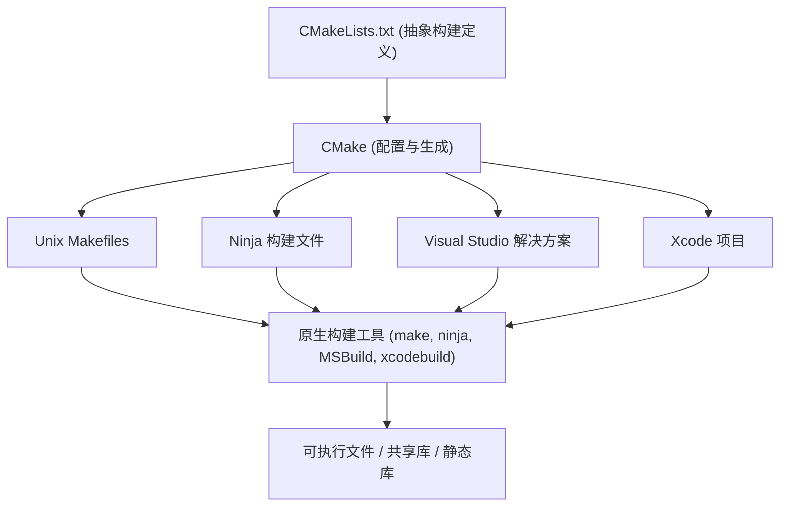
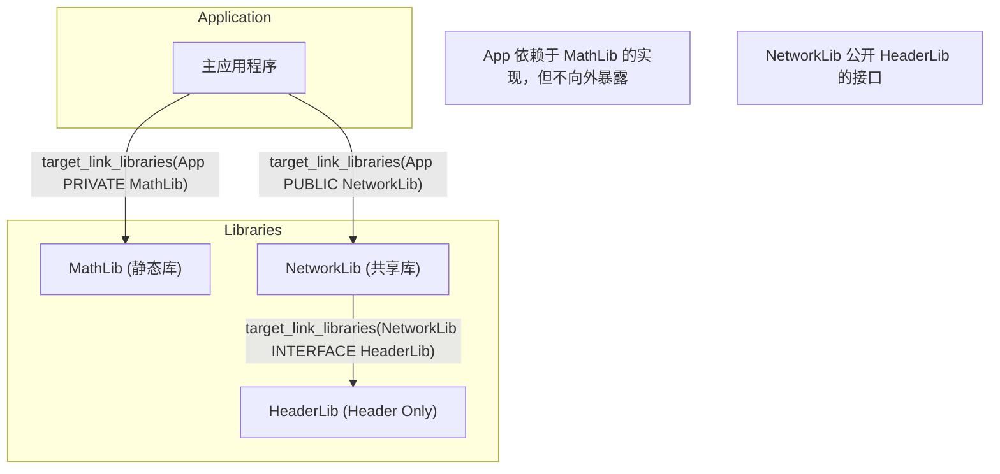
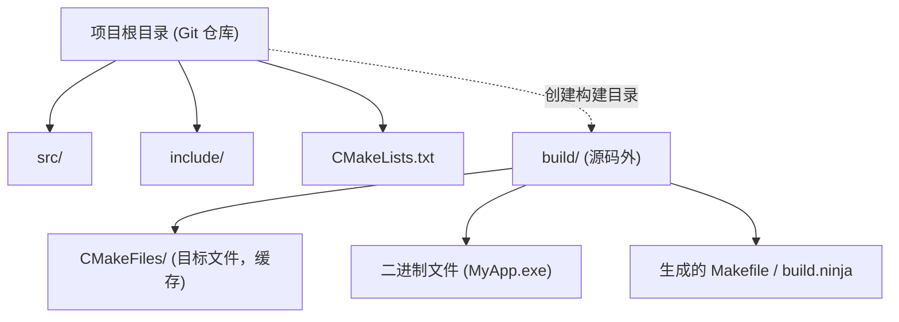

在 C++ 软件开发中，长久以来困扰许多开发者的一个问题就是“构建系统”的选择与搭建。由于 C++ 没有官方的标准包管理器和构建系统，因此需要根据不同平台（Windows、Linux、macOS）分别使用不同的编译器和构建工具（如 MSVC、GCC、Clang、Make、Ninja 等）。

然而，目前 **CMake** 已经成为事实上的行业标准。通过正确使用 CMake，我们可以仅凭单一的 `CMakeLists.txt` 优雅地构建出跨平台的编译环境。

本文将针对使用 CMake 搭建最新（现代 CMake）跨平台 C++ 编译环境的步骤，从基础到高级技巧，进行全面且详细的讲解。

## 1. CMake 是什么？（元构建系统的概念）

CMake 本身并不是直接编译源代码的工具。CMake 是一个“生成构建系统的系统”，即 **元构建系统 (Meta-Build System)**。

CMake 的主要作用是读取与平台和编译器无关的抽象配置文件（`CMakeLists.txt`），并自动生成最适合各自环境的原生构建脚本（例如：Linux 下的 `Makefile`、Windows 下的 Visual Studio `.sln` 项目文件，或者是高速的 `build.ninja`）。

下图展示了 CMake 的生成过程。



像这样，通过在中间引入 CMake，开发者就可以在无需关注各个操作系统之间细微命令差异的情况下，对 C++ 项目进行管理。

## 2. 现代 CMake 的基础：从变量到目标

CMake 3.0 之后的写法被称为“现代 CMake（Modern CMake）”，其设计理念与之前（传统 CMake）有着根本的不同。在传统的 CMake 中，主流做法是逐个目录地修改全局变量（例如使用 `include_directories()` 或 `link_libraries()`），但这往往会导致设置在无意中波及到其他模块，从而引发严重的副作用。

在现代 CMake 中，一切都作为 **目标 (Target)** 和 **属性 (Property)** 来处理。这类似于面向对象编程中类与成员变量的关系。

- **目标**: 可执行文件（Executable）或库（Library）。
- **属性**: 编译该目标所需的源文件、包含目录、编译选项、要链接的其他库等。

通过将设置仅封装（隔离）在特定的目标中，即使是大型项目也能实现安全且不会崩溃的构建定义。

### 极简的 `CMakeLists.txt`

首先，让我们来看一个最基础的 `CMakeLists.txt`。

```cmake
# 指定 CMake 的最低要求版本
cmake_minimum_required(VERSION 3.20)

# 指定项目名称和使用的语言
project(MyAwesomeApp VERSION 1.0.0 LANGUAGES CXX)

# 要求 C++ 标准（C++20）
set(CMAKE_CXX_STANDARD 20)
set(CMAKE_CXX_STANDARD_REQUIRED ON)
set(CMAKE_CXX_EXTENSIONS OFF) # 禁用编译器特有的扩展功能

# 定义可执行目标
add_executable(MyAwesomeApp main.cpp)
```

仅仅这几行代码，就完成了要求 C++20 且禁用编译器扩展的可移植执行文件的构建设置。

## 3. 依赖关系与作用域: PUBLIC / PRIVATE / INTERFACE

要掌握现代 CMake，最重要也最难理解的就是 `target_include_directories` 和 `target_link_libraries` 等命令中使用的 **`PUBLIC`, `PRIVATE`, `INTERFACE`** 这三个访问修饰符（作用域）的概念。

它们用于控制目标的属性（包含路径或依赖库）：“是否是自己构建所必需的？”以及“是否需要传递给依赖自己的其他目标？”。

1. **`PRIVATE`**: 仅在构建该目标自身时需要。**不会**传递给依赖它的目标。
2. **`INTERFACE`**: 构建该目标自身时不需要，但**会**传递给依赖它的目标的构建过程中（常用于 Header-only 库等）。
3. **`PUBLIC`**: 构建该目标自身时需要，并且**会**传递给依赖它的目标（`PRIVATE` + `INTERFACE`）。

通过下图，我们可以将依赖关系的传递（Usage Requirements 的传递）可视化。



### 作用域的具体使用示例

假设某库 `MyLib` 在内部实现中使用了 `nlohmann/json`，且在其公开的头文件 `MyLib.hpp` 中并没有包含 `nlohmann/json`。在这种情况下，使用 `MyLib` 的一方（应用程序）无需知道 JSON 库的存在。

```cmake
# 库的定义
add_library(MyLib src/MyLib.cpp)

# 指定本项目的包含目录
# include 目录对于使用 MyLib 的人来说也是必需的，因此设为 PUBLIC
# src 目录仅在 MyLib 的实现中使用，因此设为 PRIVATE
target_include_directories(MyLib
    PUBLIC 
        $<BUILD_INTERFACE:${CMAKE_CURRENT_SOURCE_DIR}/include>
        $<INSTALL_INTERFACE:include>
    PRIVATE
        ${CMAKE_CURRENT_SOURCE_DIR}/src
)

# json 库仅用于内部实现，因此以 PRIVATE 进行链接
target_link_libraries(MyLib PRIVATE nlohmann_json::nlohmann_json)
```

反之，如果在 `MyLib.hpp` 中写了 `#include <nlohmann/json.hpp>`，那么使用 `MyLib` 的一方如果不知道 JSON 的头文件路径就会发生编译错误，因此必须以 `PUBLIC` 进行链接。通过恰当地设置这种作用域，可以缩短编译时间并防止不必要的依赖泄漏。

## 4. 源码外构建 (Out-of-source Build)

在使用 CMake 时，务必遵守的最佳实践就是 **源码外构建 (Out-of-source Build)**。
这种方法是指完全不在存放源代码的目录（源码树）中输出任何构建产物（目标文件或可执行文件），而是将其分离到另一个专用目录（通常是 `build/`）中进行构建。



采用这种结构，当你想重置构建环境时，只需直接删除整个 `build` 目录即可；由于不会污染源码树，Git 管理也变得轻松（只需在 `.gitignore` 中添加 `build/` 即可）。

### 执行构建的步骤

在现代 CMake 中，可以使用不依赖于操作系统或构建工具的通用命令来执行构建。

```bash
# 1. 配置与生成（创建构建目录并进行配置）
cmake -S . -B build

# 2. 实际的构建（编译与链接）
cmake --build build --config Release

# (可选) 若要进行多线程构建，请使用 -j 选项
cmake --build build --config Release -j 8
```

这里的 `cmake -S . -B build` 的意思是“将当前目录（`.`）作为源码目录，并将 `build` 设为构建目录”。

## 5. 引入第三方库的方法

在 C++ 开发中，引入外部库（第三方库）一直以来门槛都很高。不过现在，以下三种方法已成为标准做法。

### 5.1. find_package (查找系统已安装的库)

这是最传统的方法，用于查找并链接系统中已经安装好的库（如 OpenSSL 或 Zlib 等）。

```cmake
find_package(ZLIB REQUIRED)
if(ZLIB_FOUND)
    target_link_libraries(MyAwesomeApp PRIVATE ZLIB::ZLIB)
endif()
```

### 5.2. FetchContent (从源码下载并集成)

这是 CMake 3.11 中引入，并在 3.14 之后变得非常强大的模块。在构建时，它会直接从外部的 Git 仓库或 URL 下载源码，并作为项目的一部分一起进行编译。由于能集中管理依赖关系，因此在跨平台上的可重复性极高。

以下是使用 FetchContent 引入 GoogleTest 的示例。

```cmake
include(FetchContent)

FetchContent_Declare(
  googletest
  GIT_REPOSITORY https://github.com/google/googletest.git
  GIT_TAG        v1.14.0
)

# 将库引入项目中
FetchContent_MakeAvailable(googletest)

# 创建并链接测试用执行文件
add_executable(MyTests test/main.cpp)
target_link_libraries(MyTests PRIVATE gtest_main)
```

### 5.3. 结合 vcpkg 使用

使用由微软主导的 C++ 包管理器 **vcpkg**，可以轻松引入成千上万的库。vcpkg 的设计初衷就是为了与 CMake 实现无缝集成。

在运行 CMake 时，只需指定 vcpkg 的工具链文件，`find_package` 就会自动在 vcpkg 内搜索库。

```bash
cmake -S . -B build -DCMAKE_TOOLCHAIN_FILE=/path/to/vcpkg/scripts/buildsystems/vcpkg.cmake
```

此外，通过在项目根目录放置 `vcpkg.json`（清单模式，Manifest mode），可以完全自动化所需库的版本管理。

## 6. 跨平台的编译器标志

为了在 Windows (MSVC)、Linux (GCC/Clang) 或是 macOS (Apple Clang) 任何环境中都能顺利编译，必须恰当地设置编译器特定的标志。

通过使用 CMake 的 **生成器表达式 (Generator Expressions)**，可以声明式地编写条件分支，例如“如果编译器是 MSVC 则用这个标志，否则用那个标志”。生成器表达式使用 `$<...>` 语法，在构建系统的生成阶段（Generate 阶段）进行计算评估。

```cmake
# 在所有平台上开启最高级别警告的示例
target_compile_options(MyAwesomeApp PRIVATE
    # 对于 MSVC
    $<$<CXX_COMPILER_ID:MSVC>:/W4 /WX>
    
    # 对于 GCC 或 Clang
    $<$<OR:$<CXX_COMPILER_ID:GNU>,$<CXX_COMPILER_ID:Clang>,$<CXX_COMPILER_ID:AppleClang>>:-Wall -Wextra -Wpedantic -Werror>
)
```

使用这种方法，可以避免因大量使用 `if(MSVC)` 类的条件分支而导致 `CMakeLists.txt` 难以阅读的问题，并能为每个目标提供灵活的设置。

## 7. 搭建测试环境 (CTest)

在跨平台环境中的质量保证方面，引入自动化测试是必不可少的。CMake 标准自带了一个名为 **CTest** 的测试运行器。

将前文提到的通过 `FetchContent` 引入的 GoogleTest 与 CTest 集成的步骤如下。

```cmake
# 启用测试功能（只需在根 CMakeLists.txt 中编写一次）
enable_testing()

add_executable(MyMathTests test/math_test.cpp)
target_link_libraries(MyMathTests PRIVATE gtest_main MyLib)

# 注册为 CTest 测试
include(GoogleTest)
gtest_discover_tests(MyMathTests)
```

构建完成后，只需在构建目录内执行 `ctest` 命令，即可运行所有测试并报告结果。

```bash
cd build
ctest --output-on-failure -C Release
```

## 8. 构建系统的理论与数学模型

在此我们稍微转换一下视角，使用数学模型来探讨大型项目中的构建系统与并行编译的效率问题。

缩短构建（编译）时间是 C++ 开发中永恒的课题。通过对源码进行拆分和并行编译，可以有效缩短构建时间。这种因并行化带来的速度提升（Speedup），可以通过 **阿姆达尔定律 (Amdahl's Law)** 来进行建模。

假设在程序中，可并行化的部分占比为 $P$，必须串行执行（不可并行化）的部分占比为 $1-P$，使用的处理器数量为 $N$，那么整体理论上的最大速度提升率 $S(N)$ 可由以下公式表示：

$$ S(N) = \frac{1}{(1 - P) + \frac{P}{N}} $$

在 C++ 的构建过程中，“从各个 `.cpp` 文件编译成 `.o` 或 `.obj`”的过程是独立且可并行的（即 $P$ 的部分），而“最终的链接器 (Linker) 合并处理”则基本上是串行执行的（即 $1-P$ 的部分）。

因此，无论准备了多少核心的 CPU（$N \to \infty$），只要链接时间这个瓶颈依然存在，最大速度提升率最终都会渐近于以下公式：

$$ \lim_{N \to \infty} S(N) = \frac{1}{1 - P} $$

这个公式启示我们：“单纯地增加 CPU 核心数对于缩短构建时间是有限度的”。在现代 CMake 中，恰当地区分使用 `PRIVATE` 和 `INTERFACE`，并尽量减少头文件的依赖关系（如善用前置声明等），从而增大 $P$ 的比例，减少增量构建时需要重新编译的对象，才是实际上最有效的构建加速策略。

另外，在缩短链接时间方面，从静态库（Static Library）切换为共享库 / DLL（Shared Library），或者采用 LLD / Mold 等高速链接器，也是非常重要的。

在 CMake 中，可以非常简单地指定链接器：

```cmake
# 在 Clang/GCC 环境下设置使用 lld 链接器
if(UNIX AND NOT APPLE)
    target_link_options(MyAwesomeApp PRIVATE "-fuse-ld=lld")
endif()
```

## 9. 复杂目录结构的实践案例

在实际的应用程序开发中，往往是由许多模块组合而成的目录结构。最后，我们将展示一个理想的中型项目的目录结构，以及父子 `CMakeLists.txt` 之间的关系。

```text
ProjectRoot/
├── CMakeLists.txt (根目录: 整个项目的定义)
├── vcpkg.json     (依赖库的定义)
├── external/      (外部模块)
├── include/       (公开头文件)
│   └── myapp/
├── src/           (源代码与内部构建定义)
│   ├── CMakeLists.txt
│   ├── main.cpp
│   ├── math/
│   │   ├── CMakeLists.txt
│   │   ├── Vector3.hpp
│   │   └── Vector3.cpp
│   └── network/
│       ├── CMakeLists.txt
│       └── NetworkManager.cpp
└── tests/         (测试代码)
    ├── CMakeLists.txt
    └── math_test.cpp
```

根目录下的 `CMakeLists.txt` 仅进行环境设置和全局选项定义，随后通过 `add_subdirectory()` 添加子目录。

**根目录 `CMakeLists.txt`**:
```cmake
cmake_minimum_required(VERSION 3.20)
project(ComplexApp LANGUAGES CXX)

# 全局设置
set(CMAKE_CXX_STANDARD 20)
set(CMAKE_CXX_STANDARD_REQUIRED ON)

# 启用测试
enable_testing()

# 添加子目录
add_subdirectory(src)
add_subdirectory(tests)
```

**`src/CMakeLists.txt`**:
```cmake
# 添加各个模块
add_subdirectory(math)
add_subdirectory(network)

# 最终的可执行文件
add_executable(ComplexApp main.cpp)

# 模块链接
target_link_libraries(ComplexApp
    PRIVATE
        MathLib
        NetworkLib
)
```

像这样按目录拆分 `CMakeLists.txt`，并以目标间依赖关系的形式进行定义，可以大幅提高模块的复用性，并提升构建的并行度。这正是现代 CMake 所倡导的“模块化构建环境”的精髓所在。

## 10. 总结

本文讲解了使用 CMake 搭建跨平台 C++ 编译环境的具体步骤。
最后回顾一下重点：

1. **理解元构建系统**: CMake 是一个生成构建脚本的工具。
2. **彻底贯彻现代 CMake**: 不使用全局变量，而是以 `add_executable`、`target_link_libraries`、`target_include_directories` 等**面向目标 (Target-oriented)** 的方式封装设置。
3. **恰当设置作用域**: 正确区分使用 `PUBLIC`、`PRIVATE` 和 `INTERFACE`，从而控制依赖关系的影响范围。
4. **坚决执行源码外构建**: 在 `build/` 目录内进行构建，保持源码树的整洁。
5. **第三方库整合**: 熟练使用 `FetchContent` 或 `vcpkg`，实现依赖库的自动解析。
6. **活用生成器表达式**: 巧妙地处理不同编译器的标志差异。
7. **数学理论支撑**: 意识到阿姆达尔定律的存在，通过减少依赖关系来提高并行编译的效率。

尽管 CMake 一开始可能会让人觉得晦涩难懂，但只要掌握了目标（Target）和属性（Property）的概念，无论多么复杂庞大的 C++ 项目，都能维持一个井然有序的构建环境。希望您能以本文为参考，使用最新现代 CMake 的写法，尝试搭建属于您的 C++ 开发环境。
