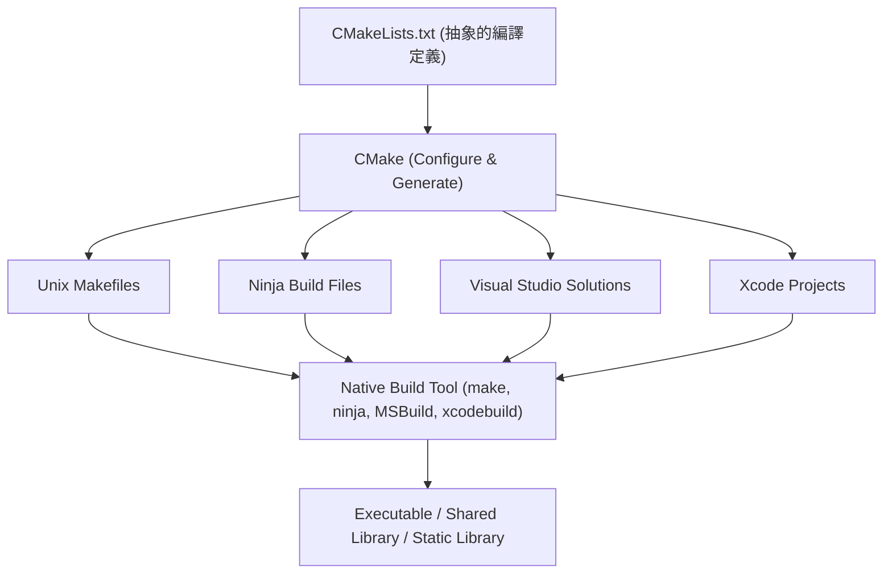
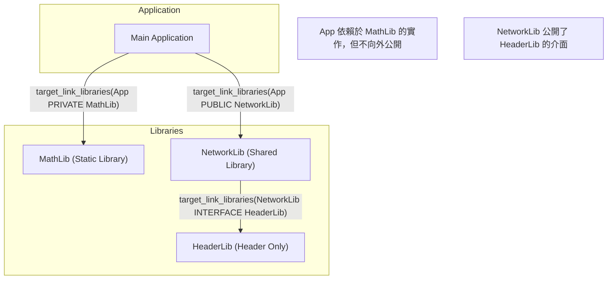
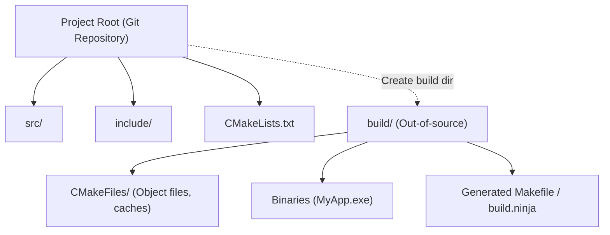

在C++軟體開發中，長久以來讓許多開發者感到頭痛的問題就是「編譯系統 (Build System)」的選擇與建構。由於C++沒有官方的標準套件管理員或編譯系統，因此必須針對不同的平台（Windows、Linux、macOS）使用不同的編譯器與編譯工具（如 MSVC、GCC、Clang、Make、Ninja 等）。

然而，現在 **CMake** 已經成為事實上的業界標準（De facto standard），只要正確運用CMake，就能透過單一的 `CMakeLists.txt` 優雅地建構出跨平台的編譯環境。

本文將針對使用CMake的最新（Modern CMake）跨平台C++編譯環境建構步驟，從基礎到進階技巧，進行徹底且詳細的解說。

## 1. CMake 是什麼？（中介編譯系統的概念）

CMake 本身並不是直接編譯原始碼的工具。CMake 是一個「產生編譯系統的系統」，也就是 **中介編譯系統 (Meta-Build System)**。

CMake 的主要角色是讀取不依賴於平台或編譯器的抽象設定檔（`CMakeLists.txt`），並自動產生最適合各環境的原生編譯腳本（例如：Linux 的 `Makefile`、Windows 的 Visual Studio `.sln` 專案檔，或是高速的 `build.ninja`）。

下圖呈現了 CMake 的產生流程。



透過像這樣將 CMake 夾在中間，開發者就能在管理 C++ 專案時，不需在意各個 OS 之間細微的指令差異。

## 2. Modern CMake 的基礎：從變數到目標

CMake 3.0 以後的寫法被稱為「Modern CMake」，其設計理念與之前的版本（Legacy CMake）有著根本上的差異。在 Legacy CMake 中，主流作法是以目錄為單位改寫全域變數（例如使用 `include_directories()` 或 `link_libraries()`），但這很容易引發設定意外波及其他模組的嚴重副作用。

在 Modern CMake 中，所有的東西都會被當作 **目標 (Target)** 與 **屬性 (Property)** 來處理。這類似於物件導向程式設計中類別與成員變數的關係。

- **目標 (Target)**: 執行檔（Executable）或函式庫（Library）。
- **屬性 (Property)**: 編譯該目標所需的原始碼檔案、包含目錄 (include directory)、編譯選項、連結的其他函式庫等。

透過將設定封裝（侷限）在特定目標內，即使是大型專案，也能實現不會崩潰的安全性編譯定義。

### 最小限度的 `CMakeLists.txt`

首先，讓我們來看看最基本的 `CMakeLists.txt`。

```cmake
# 指定 CMake 的最低要求版本
cmake_minimum_required(VERSION 3.20)

# 指定專案名稱與使用的語言
project(MyAwesomeApp VERSION 1.0.0 LANGUAGES CXX)

# 要求 C++ 標準規格 (C++20)
set(CMAKE_CXX_STANDARD 20)
set(CMAKE_CXX_STANDARD_REQUIRED ON)
set(CMAKE_CXX_EXTENSIONS OFF) # 停用編譯器專屬的擴充功能

# 定義執行檔目標
add_executable(MyAwesomeApp main.cpp)
```

只需這短短幾行，就能完成要求 C++20 且停用編譯器擴充的可攜式執行檔編譯設定。

## 3. 依賴關係與作用域: PUBLIC / PRIVATE / INTERFACE

要精通 Modern CMake，最重要且最難懂的就是 `target_include_directories` 或 `target_link_libraries` 等指令中所使用的 **`PUBLIC`、`PRIVATE`、`INTERFACE`** 這三個存取修飾詞（作用域）的概念。

這些修飾詞是用來控制目標的屬性（包含路徑或依賴函式庫）是否「僅為自身的編譯所需？」或是「是否要傳遞給依賴於自己的其他目標？」。

1. **`PRIVATE`**: 僅為該目標自身的編譯所需。**不會**傳遞給依賴它的目標。
2. **`INTERFACE`**: 該目標自身的編譯不需要，但**會**傳遞給依賴它的目標（用於 Header-only 函式庫等）。
3. **`PUBLIC`**: 該目標自身的編譯需要，且**會**傳遞給依賴它的目標（`PRIVATE` + `INTERFACE`）。

讓我們透過下圖來視覺化依賴關係的傳遞（Usage Requirements 的傳遞）。



### 作用域的具體使用範例

假設有一個函式庫 `MyLib`，它在內部實作中使用了 `nlohmann/json`，而在其公開的標頭檔 `MyLib.hpp` 中並沒有 include `nlohmann/json`。在這種情況下，使用 `MyLib` 的一方（應用程式）不需要知道 JSON 函式庫的存在。

```cmake
# 定義函式庫
add_library(MyLib src/MyLib.cpp)

# 指定專案自身的包含目錄
# include 目錄因為使用 MyLib 的人也需要，所以設為 PUBLIC
# src 目錄僅在 MyLib 的實作中使用，所以設為 PRIVATE
target_include_directories(MyLib
    PUBLIC 
        $<BUILD_INTERFACE:${CMAKE_CURRENT_SOURCE_DIR}/include>
        $<INSTALL_INTERFACE:include>
    PRIVATE
        ${CMAKE_CURRENT_SOURCE_DIR}/src
)

# json 函式庫僅於內部實作中使用，因此以 PRIVATE 連結
target_link_libraries(MyLib PRIVATE nlohmann_json::nlohmann_json)
```

反之，如果在 `MyLib.hpp` 中寫了 `#include <nlohmann/json.hpp>`，那麼使用 `MyLib` 的一方如果不知道 JSON 的標頭檔路徑就會發生編譯錯誤，因此必須以 `PUBLIC` 來連結。透過適當地設定此作用域，可以縮短編譯時間並防止不必要的依賴關係洩漏。

## 4. 原始碼外編譯 (Out-of-source Build)

在使用 CMake 時，務必遵守的最佳實踐就是 **原始碼外編譯 (Out-of-source Build)**。
這是一種將編譯產物（目的檔或執行檔）與放置原始碼的目錄（原始碼樹）完全分離，輸出到另一個專用目錄（通常為 `build/`）中進行編譯的手法。



採用這種架構後，如果想重置編譯環境，只需將整個 `build` 目錄刪除即可，而且因為不會弄髒原始碼樹，所以 Git 的管理也會變得非常容易（只需在 `.gitignore` 中加入 `build/` 即可）。

### 編譯執行步驟

在 Modern CMake 中，可以使用不依賴作業系統或編譯工具的共通指令來執行編譯。

```bash
# 1. 設置與產生（建立編譯目錄的同時進行設定）
cmake -S . -B build

# 2. 實際的編譯（編譯與連結）
cmake --build build --config Release

# (選用) 使用多執行緒編譯時加入 -j 選項
cmake --build build --config Release -j 8
```

這裡的 `cmake -S . -B build` 代表「將當前目錄（`.`）作為原始碼目錄，並將 `build` 設定為編譯目錄」。

## 5. 第三方函式庫的導入方法

在 C++ 開發中，導入外部函式庫（第三方函式庫）向來有很高的門檻。不過在現在，主要有以下三種標準的做法。

### 5.1. find_package (搜尋系統已安裝的函式庫)

這是最傳統的方法，用於尋找並連結系統中已安裝的函式庫（例如：OpenSSL 或 Zlib 等）。

```cmake
find_package(ZLIB REQUIRED)
if(ZLIB_FOUND)
    target_link_libraries(MyAwesomeApp PRIVATE ZLIB::ZLIB)
endif()
```

### 5.2. FetchContent (從原始碼下載並整合)

這是 CMake 3.11 導入，並在 3.14 之後變得非常強大的模組。它能在編譯時直接從外部的 Git 儲存庫或 URL 下載原始碼，並作為專案的一部分一起編譯。由於能集中管理依賴關係，在跨平台時的重現性極高。

以下是使用 FetchContent 導入 GoogleTest 的範例。

```cmake
include(FetchContent)

FetchContent_Declare(
  googletest
  GIT_REPOSITORY https://github.com/google/googletest.git
  GIT_TAG        v1.14.0
)

# 將函式庫引入專案中
FetchContent_MakeAvailable(googletest)

# 建立測試用的執行檔並連結
add_executable(MyTests test/main.cpp)
target_link_libraries(MyTests PRIVATE gtest_main)
```

### 5.3. 與 vcpkg 整合

只要使用微軟主導的 C++ 專用套件管理員 **vcpkg**，就能輕鬆導入數以千計的函式庫。vcpkg 的設計可與 CMake 無縫整合。

在執行 CMake 時，只需指定 vcpkg 的 Toolchain 檔案，`find_package` 就會自動去尋找 vcpkg 內的函式庫。

```bash
cmake -S . -B build -DCMAKE_TOOLCHAIN_FILE=/path/to/vcpkg/scripts/buildsystems/vcpkg.cmake
```

此外，只要將 `vcpkg.json`（清單模式）放置於專案根目錄，就能完全自動化管理所需函式庫的版本。

## 6. 跨平台的編譯器旗標 (Compiler Flags)

為了在 Windows (MSVC)、Linux (GCC/Clang)、macOS (Apple Clang) 任何環境下都能順利編譯，必須適當地設定各編譯器專屬的旗標。

透過使用 CMake 的 **產生器表達式 (Generator Expressions)**，就能以宣告式來描述「如果編譯器是 MSVC 就用這個旗標，否則就用那個旗標」這類的條件分支。產生器表達式使用 `$<...>` 語法，並在產生編譯系統時（Generate 階段）進行求值。

```cmake
# 在所有平台開啟最高等級警告的範例
target_compile_options(MyAwesomeApp PRIVATE
    # MSVC 的情況
    $<$<CXX_COMPILER_ID:MSVC>:/W4 /WX>
    
    # GCC 或 Clang 的情況
    $<$<OR:$<CXX_COMPILER_ID:GNU>,$<CXX_COMPILER_ID:Clang>,$<CXX_COMPILER_ID:AppleClang>>:-Wall -Wextra -Wpedantic -Werror>
)
```

使用這個方法，可以避免大量使用 `if(MSVC)` 之類的條件分支導致 `CMakeLists.txt` 變得難以閱讀，並能針對每個目標進行彈性的設定。

## 7. 測試環境的建構 (CTest)

為了確保跨平台環境下的品質，導入自動化測試是必須的。CMake 標準內建了一個名為 **CTest** 的測試執行器 (Test Runner)。

將前面用 `FetchContent` 導入的 GoogleTest 與 CTest 進行整合的步驟如下。

```cmake
# 啟用測試功能（只需在根目錄的 CMakeLists.txt 寫一次）
enable_testing()

add_executable(MyMathTests test/math_test.cpp)
target_link_libraries(MyMathTests PRIVATE gtest_main MyLib)

# 註冊為 CTest 的測試
include(GoogleTest)
gtest_discover_tests(MyMathTests)
```

編譯完成後，只要在編譯目錄內執行 `ctest` 指令，就會執行所有的測試並報告結果。

```bash
cd build
ctest --output-on-failure -C Release
```

## 8. 編譯系統的理論與數學模型

在這裡讓我們稍微轉換一下視角，使用數學模型來探討大型專案中編譯系統與平行編譯的效率。

縮短編譯時間（Compile Time）是 C++ 開發中永遠的課題。透過分割原始碼並進行平行編譯，能夠縮短編譯時間。這種因平行化而帶來的速度提升 (Speedup)，可以透過 **阿姆達爾定律 (Amdahl's Law)** 來建模。

假設程式中可平行化部分的比例為 $P$，必須循序執行（無法平行化）部分的比例為 $1-P$，使用的處理器數量為 $N$，那麼整體的理論最大速度提升率 $S(N)$ 可以用以下公式表示：

$$ S(N) = \frac{1}{(1 - P) + \frac{P}{N}} $$

在 C++ 的編譯過程中，「從各個 `.cpp` 檔編譯為 `.o` 或 `.obj`」是獨立且可平行化的（$P$ 的部分），但「最終由連結器 (Linker) 進行的結合處理」則基本上是循序執行的（$1-P$ 的部分）。

因此，無論準備了核心數多麼龐大的 CPU（$N \to \infty$），只要連結時間的瓶頸存在，最大的速度提升率就會漸近於以下公式：

$$ \lim_{N \to \infty} S(N) = \frac{1}{1 - P} $$

這個公式暗示了「單純增加 CPU 核心數對於縮短編譯時間是有極限的」。在 Modern CMake 中適當地劃分 `PRIVATE` 與 `INTERFACE`，並盡可能減少標頭檔的依賴關係（例如活用前置宣告等），藉此增大 $P$ 的比例，並減少增量編譯 (Incremental Build) 時需重新編譯的目標，這在實務上是最高效的編譯加速策略。

此外，為了縮短連結時間，將靜態函式庫 (Static Library) 切換為共享函式庫 / DLL (Shared Library)，或是採用 LLD / Mold 等高速連結器，也是非常重要的。

在 CMake 中，可以很簡單地指定連結器，如下所示：

```cmake
# 在 Clang/GCC 環境中設定使用 lld 連結器
if(UNIX AND NOT APPLE)
    target_link_options(MyAwesomeApp PRIVATE "-fuse-ld=lld")
endif()
```

## 9. 複雜目錄結構的實作範例

在實際的應用程式開發中，通常是由多個模組組合而成的目錄結構。最後，我們來展示理想中型專案的目錄結構，以及父子 `CMakeLists.txt` 之間的關係。

```text
ProjectRoot/
├── CMakeLists.txt (Root: 整個專案的定義)
├── vcpkg.json     (依賴函式庫的定義)
├── external/      (外部模組)
├── include/       (公開標頭檔)
│   └── myapp/
├── src/           (原始碼與內部編譯定義)
│   ├── CMakeLists.txt
│   ├── main.cpp
│   ├── math/
│   │   ├── CMakeLists.txt
│   │   ├── Vector3.hpp
│   │   └── Vector3.cpp
│   └── network/
│       ├── CMakeLists.txt
│       └── NetworkManager.cpp
└── tests/         (測試程式碼)
    ├── CMakeLists.txt
    └── math_test.cpp
```

根目錄的 `CMakeLists.txt` 只進行環境設定與整體的選項定義，並透過 `add_subdirectory()` 來加入子目錄。

**Root `CMakeLists.txt`**:
```cmake
cmake_minimum_required(VERSION 3.20)
project(ComplexApp LANGUAGES CXX)

# 全域設定
set(CMAKE_CXX_STANDARD 20)
set(CMAKE_CXX_STANDARD_REQUIRED ON)

# 啟用測試
enable_testing()

# 加入子目錄
add_subdirectory(src)
add_subdirectory(tests)
```

**`src/CMakeLists.txt`**:
```cmake
# 加入各個模組
add_subdirectory(math)
add_subdirectory(network)

# 最終的執行檔
add_executable(ComplexApp main.cpp)

# 連結模組
target_link_libraries(ComplexApp
    PRIVATE
        MathLib
        NetworkLib
)
```

像這樣按目錄分割 `CMakeLists.txt`，並定義目標之間的依賴關係，可以提高模組的重複使用性，並提升編譯的平行度。這正是 Modern CMake 所提倡的「模組化編譯環境」的精髓。

## 10. 總結

本文解說了使用 CMake 建構跨平台 C++ 編譯環境的步驟。
讓我們來回顧一下重點。

1. **理解中介編譯系統**: CMake 是產生編譯腳本的工具。
2. **貫徹 Modern CMake**: 不使用變數，而是以 `add_executable`、`target_link_libraries`、`target_include_directories` 等**目標導向**的方式來封裝設定。
3. **適當的作用域設定**: 正確使用 `PUBLIC`、`PRIVATE`、`INTERFACE`，控制依賴關係的波及範圍。
4. **貫徹原始碼外編譯**: 在 `build/` 目錄內進行編譯，不弄髒原始碼樹。
5. **第三方工具整合**: 善用 `FetchContent` 或 `vcpkg`，自動化解決依賴函式庫的問題。
6. **活用產生器表達式**: 聰明地吸收不同編譯器間的旗標差異。
7. **數學方法**: 意識到阿姆達爾定律，減少依賴關係以提升平行編譯的效率。

雖然一開始會覺得 CMake 很難懂，但只要掌握了目標與屬性的概念，無論是多麼複雜巨大的 C++ 專案，都能維持井然有序的編譯環境。請務必參考本文，用最新的 Modern CMake 寫法來建構您的 C++ 開發環境吧。
