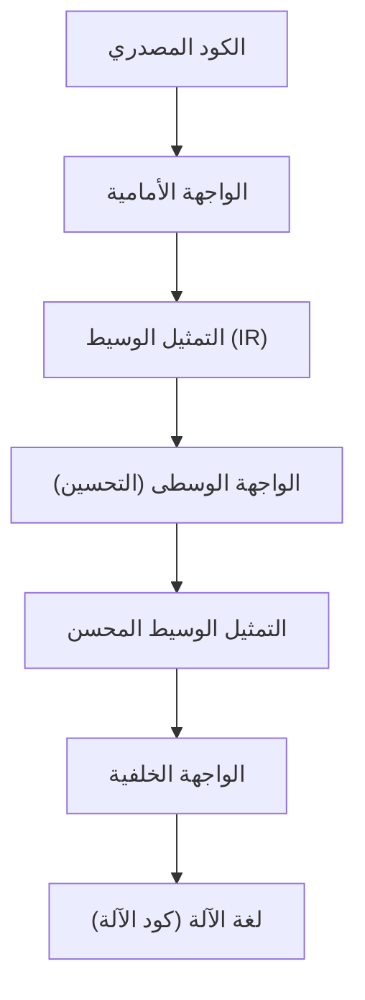
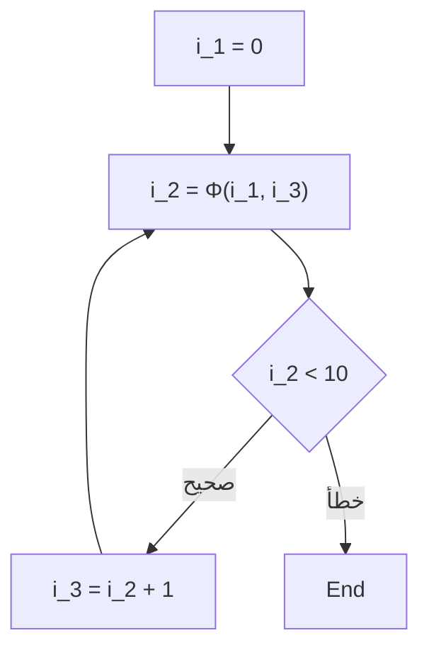

# تقنية تحسين المترجم: ما هو SSA (التعيين الفردي الثابت)

في تطوير البرمجيات، نستخدم لغات برمجة مختلفة كل يوم لكتابة التعليمات البرمجية. لغات مثل C++ أو Rust أو Go أو Java أو Swift توفر بناء جملة وتجريدات سهلة الفهم للبشر، مما يسمح لنا بالتعبير عن المنطق المعقد بشكل موجز. ومع ذلك، فإن ما يمكن لوحدة المعالجة المركزية (CPU) للكمبيوتر فهمه مباشرة هو فقط سلسلة من الأصفار والآحاد تسمى "لغة الآلة" (Machine Code). كيف يتحول الكود المصدري الجميل وسهل القراءة الذي كتبناه إلى لغة آلة يتم تنفيذها بسرعة وكفاءة؟ وراء ذلك يكمن وجود برنامج متطور ومعقد للغاية يسمى "المترجم" (Compiler).

في هذه المقالة، سنتعمق في تفاصيل "نموذج SSA (التعيين الفردي الثابت - Static Single Assignment)"، والذي يلعب الدور الأكثر أهمية ومركزية في البنية التحتية للمترجمات الحديثة (مثل LLVM و GCC) من بين تقنيات التحسين التي يمكن وصفها بـ "التعديلات السحرية" التي يقوم بها المترجم خلف الكواليس.

## البنية الأساسية للمترجم: الواجهة الأمامية والواجهة الخلفية

قبل الخوض في موضوع SSA، دعونا نراجع البنية المعمارية العامة للمترجم. لا يعد المترجم الحديث برنامجًا واحدًا ضخمًا، بل يمتلك بنية خط أنابيب (Pipeline) مقسمة إلى عدة مراحل مستقلة. هذه البنية تسهل دعم لغات برمجة مختلفة ومعماريات مختلفة لوحدة المعالجة المركزية.



### الواجهة الأمامية (Front-end)
الدور الرئيسي للواجهة الأمامية هو تحليل الكود المصدري المكتوب بلغة برمجة معينة، وتحويله إلى تمثيل عام يسهل التعامل معه داخل المترجم، مع الحفاظ على معنى البرنامج.
1. **التحليل المعجمي (Lexical Analysis)**: يقرأ سلسلة أحرف الكود المصدري ويقسمها إلى سلسلة من "الرموز" (Tokens) مثل الكلمات المفتاحية، والمعرفات، والعوامل.
2. **التحليل النحوي (Syntax Analysis)**: يتحقق مما إذا كانت سلسلة الرموز تتبع القواعد النحوية للغة، وينشئ بنية بيانات شجرية تسمى "شجرة الصياغة المجردة" (AST: Abstract Syntax Tree).
3. **التحليل الدلالي (Semantic Analysis)**: يقوم بفحص الأنواع والتحقق من نطاق المتغيرات، وما إلى ذلك، للتحقق من صحة معنى البرنامج.

بعد هذه العمليات، تُنشئ الواجهة الأمامية كودًا مستقلاً عن لغة أو جهاز معين يُسمى "التمثيل الوسيط" (IR: Intermediate Representation).

### الواجهة الوسطى (Middle-end) والتحسين
تستقبل الواجهة الوسطى الـ IR الناتج من الواجهة الأمامية وتطبق عليه العديد من "التحسينات" (Optimizations) لتحسين سرعة تنفيذ البرنامج وتقليل استهلاك الذاكرة. ليس من المبالغة القول إن هذه المرحلة تحدد أداء المترجم. **وفي تحسينات الواجهة الوسطى هذه، يعتبر "نموذج SSA" الذي سنشرحه هذه المرة هو الأساس المطلق.**

### الواجهة الخلفية (Back-end)
تستقبل الواجهة الخلفية الـ IR المحسن وتقوم بتوليد لغة الآلة الخاصة ببنية وحدة معالجة مركزية معينة (مثل x86، ARM، RISC-V). هنا يتم تخصيص المسجلات (Register Allocation)، وجدولة التعليمات (Instruction Scheduling)، وتحسين ثقب الباب (Peephole Optimization) المعتمد على الهدف.

## أهمية التمثيل الوسيط (IR)

لماذا لا يقوم المترجم بتوليد لغة الآلة مباشرة ويتكبد عناء المرور عبر التمثيل الوسيط (IR)؟ السبب الأكبر هو "التعميم" و"سهولة التحسين".

إذا لم يكن الـ IR موجودًا، فلدعم M من اللغات و N من المعماريات، سيتعين عليك كتابة $M \times N$ من المترجمات. ولكن من خلال التوسط بواسطة الـ IR، كل ما عليك فعله هو كتابة M واجهات أمامية و N واجهات خلفية ($M + N$)، مما يجعل دعم اللغات الجديدة أو وحدات المعالجة المركزية الجديدة أسهل بكثير. السبب الأكبر لانتشار LLVM بهذا الشكل هو وجود هذا التمثيل الوسيط القوي والعام المسمى LLVM IR.

## ما هو نموذج SSA (التعيين الفردي الثابت - Static Single Assignment)

أخيرًا، سنشرح موضوعنا الرئيسي، نموذج SSA.
SSA هو قيد أو تنسيق يتعلق بكيفية التعامل مع المتغيرات في التمثيل الوسيط للمترجم. كما يوحي الاسم "التعيين الفردي الثابت"، فإن القاعدة الأهم هي **"أن كل متغير يتم تعيينه (تعريفه) مرة واحدة فقط بشكل ثابت في نص البرنامج"**.

عندما نكتب الكود بلغات البرمجة العادية، فمن الطبيعي جدًا تعيين قيم لنفس المتغير عدة مرات.

```c
// مثال بلغة C
int x = 10;
x = x + 5;
x = x * 2;
```

في هذا الكود، يتم التعيين للمتغير `x` ثلاث مرات. ومع ذلك، عندما يقوم المترجم بإجراء التحسينات، فإن هذه الحالة التي يتم فيها إعادة كتابة قيمة نفس المتغير عدة مرات تجعل التحليل صعبًا للغاية. من أجل تتبع "ما هي القيمة التي يحملها المتغير `x` في وقت معين" و"أين تم حساب هذا الـ `x`" (تحليل تدفق البيانات)، يجب على المترجم إدارة حالات معقدة.

لذلك، في نموذج SSA، في كل مرة يتم فيها إعادة تعيين المتغير، يتم إعطاؤه "رقم إصدار" ويُعامل كمتغير منفصل. إذا قمنا بتحويل الكود أعلاه إلى نموذج SSA، فسيبدو كالتالي:

```text
// صورة التحويل إلى نموذج SSA
x_1 = 10
x_2 = x_1 + 5
x_3 = x_2 * 2
```

من خلال التحويل بهذه الطريقة، تكتسب جميع المتغيرات خاصية الثبات (Immutability) وهي أنها "يتم تعريفها مرة واحدة فقط ولن تتغير قيمتها بعد ذلك". نتيجة لذلك، يصبح من الواضح جدًا "أين يتم تعريف المتغير وأين يتم استخدامه (سلسلة التعريف والاستخدام Def-Use)"، مما يسرع ويبسط بشكل كبير تحليل تدفق البيانات في المترجم.

## تدفق التحكم ودالة Φ (فاي)

من السهل تحويل كود خطي إلى SSA، ولكن البرامج تحتوي على تدفقات تحكم مثل "التفرع الشرطي (جمل if)" و "الحلقات (جمل for/while)". عندما تشارك تدفقات التحكم هذه، لا يكون تحويل SSA واضحًا تمامًا.

```c
// كود C يحتوي على تفرع شرطي
int x = 0;
if (condition) {
    x = 10;
} else {
    x = 20;
}
int y = x + 5;
```

دعنا نحاول تحويل هذا الكود إلى SSA ببساطة عن طريق إضافة أرقام الإصدارات.

```text
// مثال على تحويل SSA فاشل
x_1 = 0
if (condition) {
    x_2 = 10
} else {
    x_3 = 20
}
y_1 = ??? + 5  // هل يجب استخدام x_2؟ أم يجب استخدام x_3؟
```

في نقطة التقاء التفرع الشرطي (Merge Point)، ستكون قيمة المتغير `x` هي `x_2` إذا مر عبر كتلة if، و `x_3` إذا مر عبر كتلة else. نظرًا لأن المترجم لا يمكنه معرفة المسار الذي سيتم اتخاذه في مرحلة التحليل الثابت، فلا يمكنه تحديد أي إصدار يجب استخدامه عند الإشارة إلى `x` بعد نقطة الالتقاء.

لحل هذه المشكلة، تم تقديم دالة سحرية تسمى **دالة Φ (فاي)**.

توضع دالة Φ في نقاط التقاء تدفق التحكم ولها دور في اختيار الإصدار المناسب من المتغير اعتمادًا على "المسار الذي وصل منه البرنامج". باستخدام دالة Φ، يمكننا تحويل الكود السابق إلى تنسيق SSA الصحيح كالتالي:

```text
// تحويل SSA الصحيح باستخدام دالة Φ
x_1 = 0
if (condition) {
    x_2 = 10
} else {
    x_3 = 20
}
// نقطة الالتقاء
x_4 = Φ(x_2, x_3)
y_1 = x_4 + 5
```

هنا `x_4 = Φ(x_2, x_3)` تمثل عملية وهمية تعني: "إذا أتيت من خلال كتلة if فقم بتعيين قيمة `x_2` إلى `x_4`، وإذا أتيت من خلال كتلة else فقم بتعيين قيمة `x_3` إلى `x_4`".
يتيح ذلك للكود بعد نقطة الالتقاء أن يشير دائمًا إلى إصدار فريد (هنا `x_4`)، مما يتيح التعبير عن أي تدفق تحكم مع الحفاظ على قاعدة SSA الصارمة بأن "يتم التعيين مرة واحدة فقط".

### دالة Φ في الحلقات

في حالة بنية الحلقة (التكرار)، يصبح الوضع أكثر تعقيدًا. وذلك لأن قيمة المتغير يمكن أن تستقبل كلاً من "القيمة الأولية من خارج" الحلقة و "القيمة المحدثة من التكرار السابق" للحلقة.

```c
// كود يحتوي على حلقة
int i = 0;
while (i < 10) {
    i = i + 1;
}
```

عند تحويل هذا إلى SSA، تصبح بداية الحلقة (جزء تقييم شرط while) نقطة التقاء.

```text
// تحويل الحلقة إلى SSA
i_1 = 0
LoopHeader:
    i_2 = Φ(i_1, i_3)  // i_1 من خارج الحلقة، i_3 من أسفل الحلقة
    if (i_2 >= 10) goto End
    i_3 = i_2 + 1
    goto LoopHeader
End:
```

هنا، يتم وضع دالة Φ عند مدخل الحلقة. عند الدخول الأول يتم اختيار `i_1` (0)، وعند الدوران حول الحلقة يتم اختيار `i_3`، وبالتالي يتم وضع متغير الحلقة الذي يتغير ديناميكيًا ببراعة في تمثيل SSA الثابت.



## تقنيات التحسين القوية التي يقدمها SSA

مع إدخال نموذج SSA في المترجمات، أصبحت العديد من خوارزميات التحسين التي كانت معقدة ومكلفة حسابيًا بشكل مدهش يمكن إجراؤها ببساطة وسرعة. سنقدم هنا بعض التحسينات التمثيلية التي تفترض وجود SSA.

### 1. نشر الثوابت (Constant Propagation) وطي الثوابت (Constant Folding)

هذا هو تحسين حيث يتم استبدال الإشارة إلى متغير بشكل مباشر بثابت إذا كانت قيمة المتغير محددة بشكل ثابت قبل التنفيذ. نظرًا لأن المتغيرات في نموذج SSA يتم تعريفها مرة واحدة فقط، فمن السهل للغاية تحديد "ما إذا كان المتغير ثابتًا أم لا".

```text
// قبل التحسين
a_1 = 10
b_1 = 20
c_1 = a_1 + b_1

// نشر الثوابت بواسطة SSA
// a_1 و b_1 دائمًا ثوابت، لذا يمكن تعويضها مباشرة في حساب c_1
c_1 = 10 + 20

// بالإضافة إلى طي الثوابت
c_1 = 30
```
بمجرد تتبع الروابط من التعريف إلى الاستخدام (Def-Use)، من الممكن نشر الثوابت في سلسلة عبر الكود بأكمله.

### 2. إزالة الكود الميت (Dead Code Elimination : DCE)

هذا هو تحسين يقوم بإزالة الكود غير الضروري (الكود الميت) الذي لا يؤثر على نتيجة تنفيذ البرنامج على الإطلاق. في تنسيق SSA، يمكن حذف التعليمات التي تُعرّف "متغير لا تستخدمه أي تعليمة (متغير له 0 أماكن استخدام)" دون قيد أو شرط ما لم تكن هناك آثار جانبية (Side effects).

```text
x_1 = 10
y_1 = 20  // y_1 لن يستخدم أبداً بعد ذلك
z_1 = x_1 + 5
return z_1
```
مع SSA، يستغرق الأمر لحظة للتحقق "هل يوجد مكان يُستخدم فيه `y_1`؟" (فقط تحقق مما إذا كانت قائمة الاستخدام Use فارغة). إذا لم يتم استخدامه، يتم حذف السطر `y_1 = 20` على الفور.

### 3. إزالة التعبيرات الفرعية المشتركة (Common Subexpression Elimination : CSE) وترقيم القيم (Value Numbering)

هذا تحسين يلغي الحسابات غير الضرورية عن طريق العثور على الأماكن التي يتم فيها إجراء نفس الحسابات عدة مرات وإعادة استخدام نتيجة الحساب الأول. باستخدام خوارزمية تعتمد على SSA تسمى "ترقيم القيم العالمي (Global Value Numbering : GVN)"، يمكنك اكتشاف الحسابات الزائدة المعقدة التي تمتد عبر الكود بأكمله.

```text
// قبل التحويل
x_1 = a_1 + b_1
y_1 = a_1 + b_1

// بعد التحسين بواسطة GVN
x_1 = a_1 + b_1
y_1 = x_1  // نفس الحساب لذا نعيد استخدام النتيجة
```

### 4. نشر النسخ (Copy Propagation)

عندما يكون هناك نسخة بسيطة لقيمة مثل `x = y`، يتم استبدال كل الاستخدامات اللاحقة لـ `x` بـ `y`، ويتم حذف عملية النسخ غير الضرورية. في SSA، يمكن استبدال ذلك بسهولة بمجرد تتبع سلسلة Def-Use.

## تطبيق SSA في LLVM وأمثلة ملموسة

إن LLVM، وهي البنية التحتية الرائدة للمترجمات الحديثة، قد تم بناء الواجهة الوسطى بأكملها استنادًا إلى تنسيق SSA. يأخذ LLVM IR (التمثيل الوسيط) نفسه شكل لغة تجميع ذات كتابة قوية (Strongly typed) وتنسيق SSA صارم.

على سبيل المثال، دعونا نقوم بتجميع دالة بسيطة بلغة C إلى LLVM IR وننظر إلى دالة Φ الفعلية.

**كود C:**
```c
int max(int a, int b) {
    if (a > b) {
        return a;
    } else {
        return b;
    }
}
```

**LLVM IR (تمثيل الكود الزائف):**
```llvm
define i32 @max(i32 %a, i32 %b) {
entry:
  %cmp = icmp sgt i32 %a, %b
  br i1 %cmp, label %if.then, label %if.else

if.then:
  br label %return

if.else:
  br label %return

return:
  %retval.0 = phi i32 [ %a, %if.then ], [ %b, %if.else ]
  ret i32 %retval.0
}
```

بالنظر إلى LLVM IR أعلاه، يمكنك رؤية أن تعليمة `phi` تُستخدم بوضوح في كتلة `return`.
`%retval.0 = phi i32 [ %a, %if.then ], [ %b, %if.else ]`
هذا يُعبر مباشرة على مستوى LLVM IR عن: "قم بتعيين `%a` إلى `%retval.0` إذا كان الانتقال من كتلة `%if.then`، وقم بتعيين `%b` إذا كان الانتقال من كتلة `%if.else`".

يطبق LLVM وحدات تحسين متعددة تسمى "Pass" واحدة تلو الأخرى على IR تنسيق SSA هذا. العشرات أو المئات من تصاريح (Passes) التحسين مثل Mem2Reg (تمرير لترقية الوصول للذاكرة لمتغيرات SSA في المسجلات)، InstCombine (دمج التعليمات)، GVN (ترقيم القيم العالمي)، و ADCE (إزالة الكود الميت العدواني)، تعمل معًا فوق هذا الأساس القوي لـ SSA لتنتج في النهاية كود الآلة ذو سرعة التنفيذ المذهلة التي نراها.

## عيوب SSA وتفكيكه في الواجهة الخلفية

نموذج SSA يبدو قادرًا على كل شيء، ولكن هناك مشكلة واحدة كبيرة. وهي أن **الأجهزة الفعلية (وحدة المعالجة المركزية) لا تعمل بتنسيق SSA**.
عدد المسجلات (eax، rax، إلخ) في وحدة المعالجة المركزية الفعلية محدود، وهي تستمر في الحساب عن طريق إعادة استخدام (إعادة تعيين) نفس المسجل عدة مرات. أيضًا، لا توجد تعليمة سحرية مقابلة لـ "دالة Φ" في وحدة المعالجة المركزية.

لذلك، يجب على الواجهة الخلفية للمترجم، قبل توليد لغة الآلة وبعد الانتهاء من جميع التحسينات، أن "تدمر تنسيق SSA (De-SSA)".

على وجه التحديد، تقوم بإزالة دالة Φ واستبدالها بتعليمات نسخ عادية (مثل `MOV`).
على سبيل المثال، إذا كان هناك دالة `x_4 = Φ(x_2, x_3)`، لمسحها، يتم إدراج تعليمة نسخ `x_4 = x_2` في نهاية كتلة if، ويتم إدراج تعليمة نسخ `x_4 = x_3` في نهاية كتلة else.

```text
// تدمير SSA والتحويل إلى تعليمات نسخ
if (condition) {
    x_2 = 10
    x_4 = x_2  // نسخ كبديل لدالة Φ
} else {
    x_3 = 20
    x_4 = x_3  // نسخ كبديل لدالة Φ
}
y_1 = x_4 + 5
```

بعد ذلك، باستخدام خوارزمية معقدة (مثل خوارزمية تلوين الرسم البياني) تسمى "تخصيص المسجلات (Register Allocation)"، يتم تعيين العدد اللانهائي من متغيرات SSA الافتراضية (`x_1`, `x_2`, `x_3` ...) إلى عدد محدود (مثلاً 16) من المسجلات المادية. يتم تعيين المتغيرات التي لا تتداخل فترات بقائها (الفترة التي يُستخدم فيها المتغير) لمشاركة نفس المسجل المادي، وفي النهاية يتم اكتمال كود الآلة الفعال الذي يمكن لوحدة المعالجة المركزية الفعلية تنفيذه.

## الخلاصة

في هذه المقالة، شرحنا نموذج SSA (التعيين الفردي الثابت)، والذي يمثل قلب تحسين المترجم.

*   **خط أنابيب المترجم**: ينقسم إلى واجهة أمامية، واجهة وسطى، وواجهة خلفية، وتتصل معًا بمركزية الـ IR.
*   **المبدأ الأساسي لـ SSA**: كل المتغيرات يتم تعريفها مرة واحدة فقط في نص البرنامج.
*   **دالة Φ (فاي)**: في نقاط التقاء تدفق التحكم، يتم اختيار إصدار المتغير المناسب بناءً على المسار.
*   **فوائد التحسين**: عمليات التحسين التي تستفيد من تحليل تدفق البيانات مثل طي الثوابت، إزالة الكود الميت، وإزالة التعبيرات الفرعية المشتركة تصبح أسهل وأسرع بشكل كبير.
*   **الجسر إلى الواقع**: في مرحلة توليد لغة الآلة النهائية، يتم تدمير SSA ويتم التخصيص للمسجلات المادية.

إن الكود الذي نكتبه كل يوم بشكل عرضي يتم تفكيكه داخل "الصندوق السحري" المسمى المترجم، إلى تمثيل رسومي ورياضي جميل يُعرف بـ SSA، وبعد التخلص من كل ما هو غير ضروري بشكل شامل، يتم إعادة بنائه مرة أخرى إلى لغة آلة قوية لوحدة المعالجة المركزية.
فهم هذه الآليات التي تعمل خلف الكواليس لا يمنحك فقط تلميحات لكتابة كود واعٍ بالأداء، بل يجعلك تشعر مجددًا بعمق وإثارة هندسة البرمجيات.
