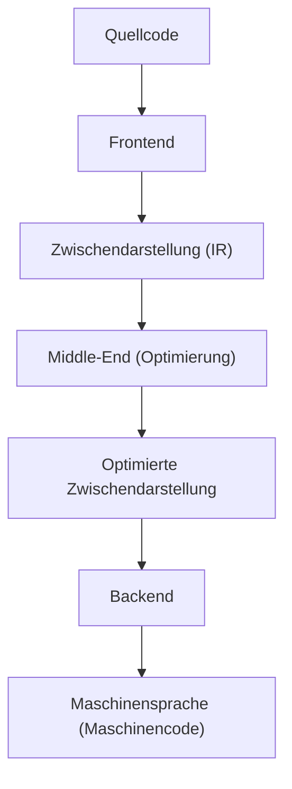
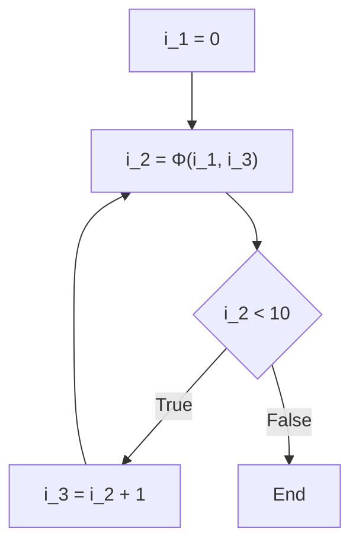

# Compiler-Optimierungstechniken: Was ist SSA (Static Single Assignment)?

In der Softwareentwicklung schreiben wir jeden Tag Code in verschiedenen Programmiersprachen. Ob C++, Rust, Go, Java oder Swift – diese Sprachen bieten für Menschen leicht verständliche Syntax und Abstraktionen, die es ermöglichen, komplexe Logik prägnant auszudrücken. Was die CPU (Central Processing Unit) eines Computers jedoch direkt verstehen kann, ist nur eine Abfolge von Nullen und Einsen, die als "Maschinensprache (Maschinencode)" bezeichnet wird. Wie wird der schöne, menschenlesbare Quellcode, den wir schreiben, in schnellen und effizient ausführbaren Maschinencode umgewandelt? Dahinter steckt eine extrem fortschrittliche und komplexe Software namens "Compiler".

In diesem Artikel werden wir sehr tief und detailliert auf die "SSA-Form (Static Single Assignment)" eingehen. Sie spielt die wichtigste und zentralste Rolle in der modernen Compiler-Infrastruktur (wie LLVM und GCC) unter all den Optimierungstechniken, die man als "radikalen Umbau" bezeichnen könnte, den der Compiler im Hintergrund durchführt.

## Grundstruktur eines Compilers: Frontend und Backend

Bevor wir in das Thema SSA eintauchen, lassen Sie uns zunächst die Gesamtarchitektur eines Compilers wiederholen. Moderne Compiler sind keine einzelnen riesigen Programme, sondern haben eine Pipeline-Struktur, die in mehrere unabhängige Phasen unterteilt ist. Diese Struktur erleichtert die Unterstützung verschiedener Programmiersprachen und unterschiedlicher CPU-Architekturen.



### Frontend

Die Hauptaufgabe des Frontends besteht darin, den in einer bestimmten Programmiersprache geschriebenen Quellcode zu analysieren und ihn in eine generische Darstellung umzuwandeln, die innerhalb des Compilers leicht zu handhaben ist, während die Bedeutung des Programms erhalten bleibt.
1. **Lexikalische Analyse (Lexical Analysis)**: Liest die Zeichenfolge des Quellcodes und teilt sie in eine Sequenz von "Token" wie Schlüsselwörter, Bezeichner und Operatoren auf.
2. **Syntaktische Analyse (Syntax Analysis)**: Überprüft, ob die Token-Sequenz den grammatikalischen Regeln der Sprache entspricht, und erstellt eine baumartige Datenstruktur, die "Abstrakter Syntaxbaum (AST: Abstract Syntax Tree)" genannt wird.
3. **Semantische Analyse (Semantic Analysis)**: Führt Typprüfungen und die Überprüfung von Variablen-Gültigkeitsbereichen (Scopes) durch, um zu validieren, dass die Bedeutung des Programms korrekt ist.

Durch diese Prozesse generiert das Frontend Code, der unabhängig von einer bestimmten Sprache oder Hardware ist und als "Zwischendarstellung (IR: Intermediate Representation)" bezeichnet wird.

### Middle-End und Optimierung

Das Middle-End erhält die vom Frontend ausgegebene IR und wendet verschiedene "Optimierungen" an, um die Ausführungsgeschwindigkeit des Programms zu verbessern und die Speichernutzung zu reduzieren. Man kann ohne Übertreibung sagen, dass diese Phase die Leistung des Compilers bestimmt. Und **bei dieser Optimierung im Middle-End ist die absolute Grundlage die "SSA-Form", die wir dieses Mal erklären werden.**

### Backend

Das Backend nimmt die optimierte IR und generiert Maschinensprache für eine bestimmte Ziel-CPU-Architektur (wie x86, ARM, RISC-V usw.). Hier finden Registerzuweisung, Instruction Scheduling und zielabhängige Peephole-Optimierungen statt.

## Die Bedeutung der Zwischendarstellung (IR)

Warum generiert ein Compiler nicht direkt Maschinensprache, sondern macht sich die Mühe, eine Zwischendarstellung (IR) zu verwenden? Der Hauptgrund dafür liegt in der "Standardisierung" und der "Leichtigkeit der Optimierung".

Wenn es keine IR gäbe, müssten wir $M \times N$ Compiler schreiben, um M Sprachen und N Architekturen zu unterstützen. Durch die Einführung von IR müssen wir jedoch nur M Frontends und N Backends schreiben ($M + N$), was die Unterstützung neuer Sprachen und neuer CPUs drastisch vereinfacht. Der Hauptgrund, warum LLVM so weit verbreitet ist, liegt in der Existenz dieser mächtigen und vielseitigen Zwischendarstellung namens LLVM IR.

## Was ist die SSA-Form (Static Single Assignment)?

Kommen wir nun zum Hauptthema, der SSA-Form.
SSA ist eine Einschränkung oder Form in Bezug darauf, wie Variablen in der Zwischendarstellung eines Compilers behandelt werden. Wie der Name "Static Single Assignment" (statische Einzelzuweisung) andeutet, lautet die wichtigste Regel: **"Jeder Variablen wird im Programmtext statisch nur ein einziges Mal ein Wert zugewiesen (sie wird nur einmal definiert)."**

Wenn wir Code in normalen Programmiersprachen schreiben, ist es völlig normal, derselben Variablen mehrmals Werte zuzuweisen.

```c
// Beispiel in C
int x = 10;
x = x + 5;
x = x * 2;
```

In diesem Code wird der Variablen `x` dreimal ein Wert zugewiesen. Wenn der Compiler jedoch Optimierungen durchführt, macht es dieser Zustand, in dem der Wert derselben Variablen mehrfach überschrieben wird, die Analyse sehr schwierig. Um zu verfolgen, "welchen Wert die Variable `x` zu einem bestimmten Zeitpunkt hat" oder "wo der Wert für dieses `x` berechnet wurde" (Datenflussanalyse), muss der Compiler einen komplexen Zustand verwalten.

Daher wird in der SSA-Form bei jeder erneuten Zuweisung an eine Variable eine "Versionsnummer" angehängt und sie wird als separate Variable behandelt. Wenn der obige Code in die SSA-Form konvertiert wird, sieht er wie folgt aus:

```text
// Konzept der Konvertierung in die SSA-Form
x_1 = 10
x_2 = x_1 + 5
x_3 = x_2 * 2
```

Durch diese Konvertierung erhalten alle Variablen die Eigenschaft der Unveränderlichkeit (Immutability), dass sie "nur einmal definiert werden und ihr Wert sich danach nie mehr ändert". Dadurch wird auf einen Blick ersichtlich, "wo eine Variable definiert ist und wo sie verwendet wird (Def-Use-Kette)", was die Datenflussanalyse des Compilers drastisch beschleunigt und vereinfacht.

## Kontrollfluss und die Φ (Phi)-Funktion

Die SSA-Konvertierung von geradlinigem Code ist einfach, aber Programme haben einen "Kontrollfluss" wie "Bedingte Verzweigungen (if-Anweisungen)" und "Schleifen (for/while-Anweisungen)". Sobald diese Kontrollflüsse im Spiel sind, ist die SSA-Konvertierung nicht mehr so unkompliziert.

```c
// C-Code mit bedingter Verzweigung
int x = 0;
if (condition) {
    x = 10;
} else {
    x = 20;
}
int y = x + 5;
```

Versuchen wir einfach, diesen Code durch einfache SSA-Versionierung zu konvertieren.

```text
// Beispiel für eine fehlgeschlagene SSA-Konvertierung
x_1 = 0
if (condition) {
    x_2 = 10
} else {
    x_3 = 20
}
y_1 = ??? + 5  // Sollte x_2 oder x_3 verwendet werden?
```

Am Zusammenführungspunkt (Merge Point) der bedingten Verzweigung ist der Wert der Variablen `x` entweder `x_2` (wenn der if-Block durchlaufen wurde) oder `x_3` (wenn der else-Block durchlaufen wurde). Da der Compiler während der statischen Analysephase nicht weiß, welcher Pfad genommen wird, kann er nicht entscheiden, welche Version er verwenden soll, wenn er auf `x` nach dem Zusammenführungspunkt verweist.

Um dieses Problem zu lösen, wurde die **Φ (Phi)-Funktion**, eine magische Funktion, eingeführt.

Die Φ-Funktion wird an Zusammenführungspunkten des Kontrollflusses platziert und hat die Rolle, die entsprechende Version der Variablen auszuwählen, abhängig davon, "über welchen Pfad das Programm angekommen ist". Wenn wir den vorherigen Code mithilfe der Φ-Funktion in eine korrekte SSA-Form konvertieren, sieht er so aus:

```text
// Korrekte SSA-Konvertierung mit Φ-Funktion
x_1 = 0
if (condition) {
    x_2 = 10
} else {
    x_3 = 20
}
// Zusammenführungspunkt
x_4 = Φ(x_2, x_3)
y_1 = x_4 + 5
```

Hier stellt `x_4 = Φ(x_2, x_3)` eine Pseudo-Operation dar, die besagt: "Wenn du aus dem if-Block kommst, weise `x_4` den Wert von `x_2` zu; wenn du aus dem else-Block kommst, weise `x_4` den Wert von `x_3` zu."
Dadurch kann der Code nach dem Zusammenführungspunkt immer auf eine eindeutige Version (hier `x_4`) verweisen, wodurch jeder Kontrollfluss dargestellt werden kann und gleichzeitig die strenge SSA-Regel, dass "nur einmal zugewiesen wird", eingehalten wird.

### Φ-Funktionen in Schleifen

Bei Schleifenstrukturen (Iterationen) wird die Situation noch komplexer. Das liegt daran, dass der Wert der Variablen sowohl einen "Initialwert von außerhalb der Schleife" als auch einen "aktualisierten Wert aus der vorherigen Iteration der Schleife" erhalten kann.

```c
// Code mit einer Schleife
int i = 0;
while (i < 10) {
    i = i + 1;
}
```

Wenn dies in SSA konvertiert wird, wird der Anfang der Schleife (der Teil zur Überprüfung der while-Bedingung) zum Zusammenführungspunkt.

```text
// SSA-Konvertierung einer Schleife
i_1 = 0
LoopHeader:
    i_2 = Φ(i_1, i_3)  // i_1 kommt von außerhalb der Schleife, i_3 von weiter unten in der Schleife
    if (i_2 >= 10) goto End
    i_3 = i_2 + 1
    goto LoopHeader
End:
```

Hier ist am Eingang der Schleife eine Φ-Funktion platziert. Beim ersten Betreten wird `i_1` (0) gewählt, und wenn die Schleife iteriert hat, wird `i_3` gewählt. Dadurch wird die sich dynamisch ändernde Schleifenvariable wunderbar in eine statische SSA-Darstellung umgewandelt.



## Mächtige Optimierungstechniken, die durch SSA ermöglicht werden

Durch die Einführung der SSA-Form in Compilern wurden viele Optimierungsalgorithmen, die früher komplex und rechenintensiv waren, erstaunlich einfach und schnell ausführbar. Hier stellen wir einige repräsentative Optimierungen vor, die auf SSA basieren.

### 1. Konstantenpropagation (Constant Propagation) und Konstantenfaltung (Constant Folding)

Diese Optimierung ersetzt Verweise auf eine Variable direkt durch eine Konstante, wenn der Wert der Variablen bereits statisch vor der Ausführung feststeht. In der SSA-Form wird eine Variable nur einmal definiert, was es extrem einfach macht zu bestimmen, "ob eine Variable eine Konstante ist".

```text
// Vor der Optimierung
a_1 = 10
b_1 = 20
c_1 = a_1 + b_1

// Konstantenpropagation durch SSA
// Da a_1 und b_1 immer Konstanten sind, können wir sie direkt in die Berechnung von c_1 einsetzen
c_1 = 10 + 20

// Weitere Konstantenfaltung
c_1 = 30
```
Indem man einfach den Links von der Definition zur Verwendung (Def-Use) folgt, ist es möglich, Konstanten in einer Kettenreaktion über die gesamte Codebasis zu propagieren.

### 2. Eliminierung toten Codes (Dead Code Elimination: DCE)

Dies ist eine Optimierung, die unnötigen Code (toten Code) löscht, der absolut keinen Einfluss auf das Ausführungsergebnis des Programms hat. In der SSA-Form können Anweisungen, die "Variablen definieren, die von keiner Anweisung verwendet werden (Variablen mit 0 Verwendungsstellen)", bedingungslos gelöscht werden, solange sie keine Nebenwirkungen haben.

```text
x_1 = 10
y_1 = 20  // y_1 wird danach nie verwendet
z_1 = x_1 + 5
return z_1
```
Mit SSA dauert es nur einen Augenblick zu überprüfen, "ob es Stellen gibt, die y_1 verwenden" (man muss nur prüfen, ob die Use-Liste leer ist). Wenn es nicht verwendet wird, wird die Zeile `y_1 = 20` sofort gelöscht.

### 3. Eliminierung gemeinsamer Teilausdrücke (Common Subexpression Elimination: CSE) und Value Numbering

Dies ist eine Optimierung, die unnötige Berechnungen einspart, indem sie Stellen findet, an denen dieselbe Berechnung mehrmals durchgeführt wird, und das erste Berechnungsergebnis wiederverwendet. Durch die Verwendung eines Algorithmus namens "Global Value Numbering (GVN)", der auf der SSA-Form basiert, können komplexe redundante Berechnungen erkannt werden, die sich über den gesamten Code erstrecken.

```text
// Vor der Konvertierung
x_1 = a_1 + b_1
y_1 = a_1 + b_1

// Nach der Optimierung durch GVN
x_1 = a_1 + b_1
y_1 = x_1  // Da es dieselbe Berechnung ist, wird das Ergebnis wiederverwendet
```

### 4. Kopienpropagation (Copy Propagation)

Wenn es ein einfaches Kopieren eines Wertes wie `x = y` gibt, werden alle nachfolgenden Verwendungen von `x` durch `y` ersetzt, und die nutzlose Kopieroperation wird gelöscht. In SSA lässt sich dies ebenfalls durch einfaches Verfolgen der Def-Use-Kette leicht ersetzen.

## Implementierung und konkrete Beispiele von SSA in LLVM

Bei LLVM, der heutzutage führenden Compiler-Infrastruktur, ist das gesamte Middle-End auf der SSA-Form aufgebaut. Die LLVM IR (Intermediate Representation) selbst hat eine Form ähnlich einer Assemblersprache mit starker Typisierung und strikter SSA-Form.

Lassen Sie uns zum Beispiel eine einfache C-Sprachfunktion in LLVM IR kompilieren und uns die eigentliche Φ-Funktion ansehen.

**C-Sprachcode:**
```c
int max(int a, int b) {
    if (a > b) {
        return a;
    } else {
        return b;
    }
}
```

**LLVM IR (Pseudocode-ähnliche Darstellung):**
```llvm
define i32 @max(i32 %a, i32 %b) {
entry:
  %cmp = icmp sgt i32 %a, %b
  br i1 %cmp, label %if.then, label %if.else

if.then:
  br label %return

if.else:
  br label %return

return:
  %retval.0 = phi i32 [ %a, %if.then ], [ %b, %if.else ]
  ret i32 %retval.0
}
```

Wenn Sie sich die LLVM IR oben ansehen, können Sie sehen, dass die `phi`-Anweisung im `return`-Block explizit verwendet wird.
`%retval.0 = phi i32 [ %a, %if.then ], [ %b, %if.else ]`
Dies drückt direkt auf LLVM IR-Ebene aus: "Weise `%retval.0` `%a` zu, wenn der Übergang vom Block `%if.then` kam, und `%b`, wenn er vom Block `%if.else` kam."

LLVM wendet auf diese SSA-förmige IR nacheinander eine große Anzahl von Optimierungsmodulen an, die als "Passes" bezeichnet werden. Dutzende bis Hunderte von Optimierungs-Passes wie Mem2Reg (ein Pass, der Speicherzugriffe auf SSA-Variablen in Registern hochstuft), InstCombine (Anweisungszusammenführung), GVN (Global Value Numbering) und ADCE (Aggressive Dead Code Elimination) arbeiten auf diesem soliden Fundament von SSA zusammen und produzieren letztendlich den Maschinencode mit erstaunlicher Ausführungsgeschwindigkeit, den wir sehen.

## Nachteile von SSA und Dekonstruktion im Backend

Die SSA-Form, die so allmächtig erscheint, hat jedoch ein großes Problem. Das ist die Tatsache, dass **tatsächliche Hardware (CPUs) nicht in der SSA-Form arbeitet**.
Die Anzahl der tatsächlichen CPU-Register (eax, rax usw.) ist begrenzt, und Berechnungen werden vorangetrieben, indem dieselben Register wiederholt verwendet (neu zugewiesen) werden. Darüber hinaus gibt es keine magischen Anweisungen in einer CPU, die einer "Φ-Funktion" entsprechen.

Daher muss das Backend des Compilers "die SSA-Form zerstören (De-SSA)", kurz bevor es nach Abschluss aller Optimierungen Maschinensprache generiert.

Konkret entfernt es die Φ-Funktionen und ersetzt sie durch normale Kopieranweisungen (wie `MOV`).
Wenn es beispielsweise eine Φ-Funktion `x_4 = Φ(x_2, x_3)` gibt, um diese zu eliminieren, fügt es eine Kopieranweisung `x_4 = x_2` am Ende des if-Blocks und eine Kopieranweisung `x_4 = x_3` am Ende des else-Blocks ein.

```text
// SSA zerstören und in Kopieranweisungen umwandeln
if (condition) {
    x_2 = 10
    x_4 = x_2  // Kopie statt Φ-Funktion
} else {
    x_3 = 20
    x_4 = x_3  // Kopie statt Φ-Funktion
}
y_1 = x_4 + 5
```

Danach ordnet es die unendlichen virtuellen SSA-Variablen (`x_1`, `x_2`, `x_3` ...) einer begrenzten Anzahl (z. B. 16) von physischen Registern zu, indem es einen komplexen Algorithmus namens "Registerzuweisung (Register Allocation)" (wie Graph-Färbungsalgorithmen) verwendet. Variablen, deren Lebensdauer (der Zeitraum, in dem die Variable verwendet wird) sich nicht überschneidet, werden so zugewiesen, dass sie sich dasselbe physische Register teilen, und schließlich wird ein effizienter Maschinencode fertiggestellt, der von der tatsächlichen CPU ausgeführt werden kann.

## Fazit

In diesem Artikel haben wir die SSA-Form (Static Single Assignment) erklärt, die das Herzstück der Compiler-Optimierung bildet.

*   **Compiler-Pipeline**: Sie ist in Frontend, Middle-End und Backend unterteilt, die zusammenarbeiten, wobei die IR im Mittelpunkt steht.
*   **Grundprinzip von SSA**: Alle Variablen werden im Programmtext nur einmal definiert.
*   **Φ (Phi)-Funktion**: Sie wird an den Zusammenführungspunkten des Kontrollflusses verwendet, um die Variablenversion basierend auf dem genommenen Pfad auszuwählen.
*   **Vorteile der Optimierung**: Optimierungen, die die Datenflussanalyse verwenden, wie Konstantenfaltung, Eliminierung toten Codes und Eliminierung gemeinsamer Teilausdrücke, werden drastisch einfacher und schneller.
*   **Die Brücke zur Realität**: In der finalen Phase der Maschinensprache-Generierung wird die SSA-Form zerstört und physischen Registern zugewiesen.

Der Code, den wir normalerweise beiläufig schreiben, wird im "magischen Kasten" namens Compiler einmal in eine schöne mathematische und graphentheoretische Darstellung namens SSA zerlegt, von jeglichem Überschuss befreit und dann für die CPU wieder zu robuster Maschinensprache zusammengesetzt.
Das Verständnis dieser Mechanismen hinter den Kulissen gibt uns nicht nur Hinweise darauf, wie wir leistungsorientierteren Code schreiben können, sondern lässt uns auch die Tiefe und Faszination des Software Engineerings aufs Neue schätzen.
