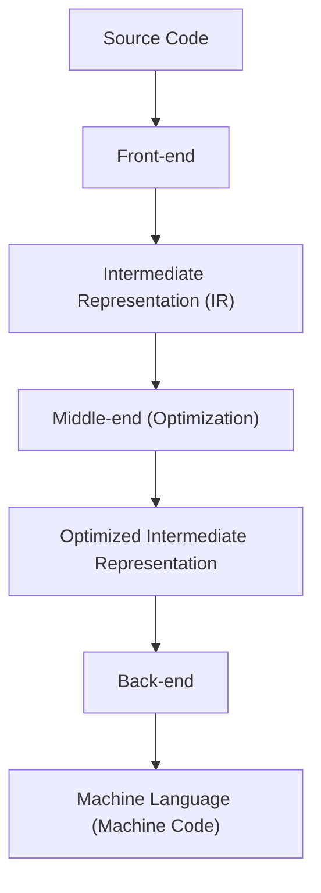
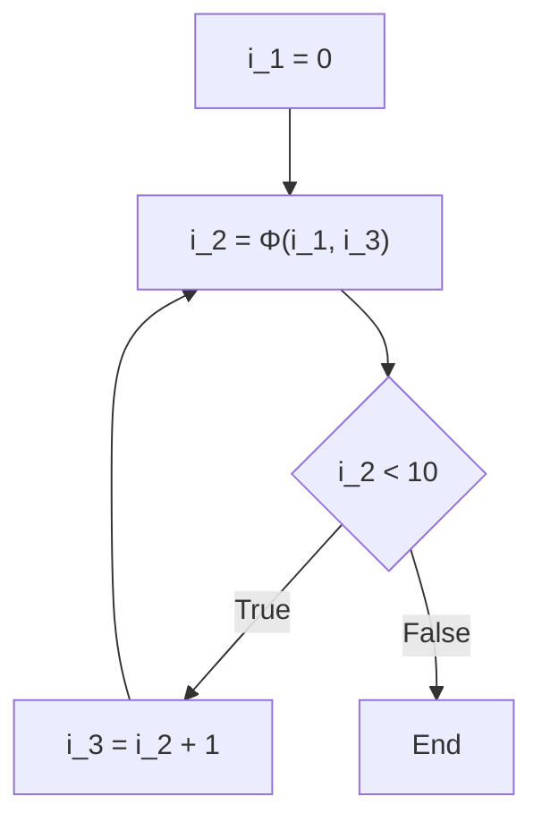

# Compiler Optimization Techniques: What is SSA (Static Single Assignment)?

In software development, we write code every day using various programming languages. Languages such as C++, Rust, Go, Java, or Swift provide syntax and abstractions that are easy for humans to understand, allowing complex logic to be expressed concisely. However, what the computer's CPU (Central Processing Unit) can directly understand is only a sequence of 0s and 1s called "machine language" (machine code). How does the beautiful, human-readable source code we write get converted into machine language that executes quickly and efficiently? Behind this lies the existence of extremely advanced and complex software known as a "compiler."

In this article, we will delve very deeply and in detail into the "SSA (Static Single Assignment) form," which plays the most important and central role in modern compiler infrastructures (such as LLVM and GCC) among the optimization techniques that can be called "drastic transformations" performed behind the scenes by compilers.

## Basic Structure of a Compiler: Front-end and Back-end

Before getting into the topic of SSA, let's first review the overall architecture of a compiler. Modern compilers are not a single giant program, but have a pipeline structure divided into several independent phases. This structure makes it easy to support different programming languages and different CPU architectures.



### Front-end
The main role of the front-end is to parse the source code written in a specific programming language and convert it into a general-purpose representation that is easy to handle within the compiler, while maintaining the meaning of the program.
1. **Lexical Analysis**: Reads the string of source code and splits it into a sequence of "tokens" such as keywords, identifiers, and operators.
2. **Syntax Analysis**: Checks if the sequence of tokens follows the grammatical rules of the language and creates a tree-structured data called an "Abstract Syntax Tree (AST)."
3. **Semantic Analysis**: Performs type checking, verifies variable scopes, etc., to validate that the meaning of the program is correct.

Through these processes, the front-end generates code called "Intermediate Representation (IR)," which is independent of specific languages or hardware.

### Middle-end and Optimization
The role of the middle-end is to receive the IR output by the front-end and apply various "optimizations" to improve the execution speed of the program and reduce memory usage. It is no exaggeration to say that this phase determines the performance of the compiler. And **in this middle-end optimization, the absolute foundation is the "SSA form" explained this time.**

### Back-end
The back-end receives the optimized IR and generates machine language for a specific target CPU architecture (x86, ARM, RISC-V, etc.). Register allocation, instruction scheduling, and target-dependent peephole optimization are performed here.

## Importance of Intermediate Representation (IR)

Why does a compiler not generate machine language directly, but go out of its way to pass through an Intermediate Representation (IR)? The biggest reasons are "standardization" and "ease of optimization."

If there were no IR, to support M languages and N architectures, we would need to write $M \times N$ compilers. However, by using IR, we only need to write M front-ends and N back-ends ($M + N$), making it dramatically easier to support new languages and new CPUs. The biggest reason LLVM has become so widespread is the existence of this powerful and versatile intermediate representation known as LLVM IR.

## What is SSA (Static Single Assignment) Form?

Now for the main topic, let's explain the SSA form.
SSA is a constraint or form regarding how variables are handled in the intermediate representation of a compiler. As the name "Static Single Assignment" suggests, the biggest rule is **"each variable is assigned (defined) statically only once in the program text."**

When we write code in a normal programming language, it is quite natural to assign values to the same variable multiple times.

```c
// C language example
int x = 10;
x = x + 5;
x = x * 2;
```

In this code, assignment to the variable `x` is performed three times. However, when the compiler performs optimization, a state where the value of the same variable is rewritten many times like this makes analysis very difficult. The compiler must manage complex states to track (data-flow analysis) "what value does the variable `x` hold at a certain point" and "where was the value of this `x` calculated."

Therefore, in the SSA form, every time a variable is reassigned, it is given a "version number" and treated as a separate variable. Converting the above code to SSA form would look like this:

```text
// Image of conversion to SSA form
x_1 = 10
x_2 = x_1 + 5
x_3 = x_2 * 2
```

By transforming it like this, all variables acquire "Immutability", meaning "defined only once, and the value does not change after that." As a result, "where a variable is defined and where it is used (Def-Use chain)" becomes obvious at a glance, and the compiler's data-flow analysis is dramatically sped up and simplified.

## Control Flow and the Φ (Phi) Function

Converting linear code to SSA is easy, but programs have "control flow" such as "conditional branches (if statements)" and "loops (for/while statements)." When these control flows are involved, SSA conversion is not straightforward.

```c
// C code including a conditional branch
int x = 0;
if (condition) {
    x = 10;
} else {
    x = 20;
}
int y = x + 5;
```

Let's try converting this code simply by versioning it for SSA.

```text
// Example of failing SSA conversion
x_1 = 0
if (condition) {
    x_2 = 10
} else {
    x_3 = 20
}
y_1 = ??? + 5  // Should I use x_2? Or x_3?
```

At the merge point of the conditional branch, the value of the variable `x` will be `x_2` if it went through the if block, and `x_3` if it went through the else block. Because the compiler does not know which path will be taken during the static analysis stage, it cannot determine which version to use when referencing `x` after the merge point.

To solve this problem, a magical function called the **Φ (Phi) function** was introduced.

The Φ function is placed at the merge point of the control flow and has the role of selecting the appropriate version of the variable depending on "which path the program arrived from." Converting the previous code into the correct SSA form using the Φ function looks like this:

```text
// Correct SSA conversion using the Φ function
x_1 = 0
if (condition) {
    x_2 = 10
} else {
    x_3 = 20
}
// Merge point
x_4 = Φ(x_2, x_3)
y_1 = x_4 + 5
```

Here, `x_4 = Φ(x_2, x_3)` represents a pseudo-operation that says, "If we came through the if block, assign the value of `x_2` to `x_4`, and if we came through the else block, assign the value of `x_3` to `x_4`."
This allows the code after the merge point to always reference a unique version (here, `x_4`), making it possible to express any control flow while adhering to the strict SSA rule of "assigned only once."

### Φ Functions in Loops

In the case of loop (repetition) structures, the situation becomes even more complex. This is because a variable's value can receive both an "initial value from outside" the loop and an "updated value from the previous iteration" of the loop.

```c
// Code including a loop
int i = 0;
while (i < 10) {
    i = i + 1;
}
```

When this is converted to SSA, the top of the loop (the condition evaluation part of the while) becomes the merge point.

```text
// SSA conversion of a loop
i_1 = 0
LoopHeader:
    i_2 = Φ(i_1, i_3)  // i_1 is from outside the loop, i_3 is from the bottom of the loop
    if (i_2 >= 10) goto End
    i_3 = i_2 + 1
    goto LoopHeader
End:
```

Here, a Φ function is placed at the entrance of the loop. The first time it enters, `i_1` (0) is selected, and when it loops around, `i_3` is selected, successfully mapping a dynamically changing loop variable into a static SSA representation.



## Powerful Optimization Techniques Brought by SSA

With the introduction of the SSA form into compilers, many optimization algorithms that were once complex and computationally expensive can now be executed surprisingly simply and quickly. Here are some typical optimizations that assume SSA.

### 1. Constant Propagation and Constant Folding

This is an optimization that replaces references to a variable directly with a constant if the variable's value is statically determined before execution. In SSA form, since a variable is defined only once, determining "whether a certain variable is a constant" is extremely easy.

```text
// Before optimization
a_1 = 10
b_1 = 20
c_1 = a_1 + b_1

// Constant propagation with SSA
// Since a_1 and b_1 are always constants, they can be directly substituted into the calculation of c_1
c_1 = 10 + 20

// Further constant folding
c_1 = 30
```
By simply tracing the links from definition to use (Def-Use), it is possible to propagate constants in a chain reaction throughout the entire codebase.

### 2. Dead Code Elimination (DCE)

This is an optimization that removes unnecessary code (dead code) that does not affect the execution result of the program at all. In SSA form, an instruction defining a variable "that is not used by any instruction (a variable with 0 uses)" can be unconditionally deleted as long as it has no side effects.

```text
x_1 = 10
y_1 = 20  // y_1 is never used again after this
z_1 = x_1 + 5
return z_1
```
With SSA, it takes only an instant to check "is there a place where `y_1` is used?" (just check if the Use list is empty). If it is not used, the line `y_1 = 20` is immediately deleted.

### 3. Common Subexpression Elimination (CSE) and Value Numbering

This is an optimization that finds places where the same calculation is performed multiple times and eliminates wasteful operations by reusing the result of the first calculation. By using an algorithm called "Global Value Numbering (GVN)" based on the SSA form, it is possible to detect complex redundant calculations spanning the entire code.

```text
// Before conversion
x_1 = a_1 + b_1
y_1 = a_1 + b_1

// After optimization by GVN
x_1 = a_1 + b_1
y_1 = x_1  // Reuse the result because it is the same calculation
```

### 4. Copy Propagation

If there is a simple value copy like `x = y`, all subsequent uses of `x` are replaced with `y`, and the wasteful copy operation is removed. In SSA, this can also be easily replaced just by tracing the Def-Use chain.

## Implementation and Examples of SSA in LLVM

LLVM, a representative modern compiler infrastructure, has its entire middle-end built on the SSA form. The LLVM IR (Intermediate Representation) itself has an assembly language-like form with strong typing and strict SSA form.

For example, let's compile a simple C language function into LLVM IR and look at the actual Φ function.

**C language code:**
```c
int max(int a, int b) {
    if (a > b) {
        return a;
    } else {
        return b;
    }
}
```

**LLVM IR (Pseudo-code representation):**
```llvm
define i32 @max(i32 %a, i32 %b) {
entry:
  %cmp = icmp sgt i32 %a, %b
  br i1 %cmp, label %if.then, label %if.else

if.then:
  br label %return

if.else:
  br label %return

return:
  %retval.0 = phi i32 [ %a, %if.then ], [ %b, %if.else ]
  ret i32 %retval.0
}
```

Looking at the LLVM IR above, we can see that the `phi` instruction is clearly used in the `return` block.
`%retval.0 = phi i32 [ %a, %if.then ], [ %b, %if.else ]`
This directly expresses at the LLVM IR level, "Assign `%a` to `%retval.0` if transitioning from the `%if.then` block, and `%b` if transitioning from the `%if.else` block."

LLVM continuously applies numerous optimization modules called "Passes" to this SSA-form IR. Dozens to hundreds of optimization passes—such as Mem2Reg (a pass that promotes memory accesses to SSA variables on registers), InstCombine (instruction combining), GVN (Global Value Numbering), and ADCE (Aggressive Dead Code Elimination)—work cooperatively on this solid foundation of SSA, ultimately producing machine code with the astonishing execution speed we see.

## Disadvantages of SSA and Deconstruction in the Back-end

Although the SSA form seems omnipotent like this, it has one major problem. That is, **actual hardware (CPUs) do not operate in SSA form.**
The number of registers (eax, rax, etc.) in an actual CPU is finite, and calculations proceed by reusing (reassigning) the same registers over and over again. Also, there are no magical instructions equivalent to the "Φ function" in a CPU.

Therefore, the back-end of the compiler must "deconstruct the SSA form (De-SSA)" right before generating machine language after all optimizations are finished.

Specifically, it performs the task of removing Φ functions and replacing them with normal copy instructions (like `MOV`).
For example, if there is a Φ function `x_4 = Φ(x_2, x_3)`, to eliminate it, a copy instruction `x_4 = x_2` is inserted at the end of the if block, and a copy instruction `x_4 = x_3` is inserted at the end of the else block.

```text
// Deconstruct SSA and convert to copy instructions
if (condition) {
    x_2 = 10
    x_4 = x_2  // Copy replacing the Φ function
} else {
    x_3 = 20
    x_4 = x_3  // Copy replacing the Φ function
}
y_1 = x_4 + 5
```

After that, a complex algorithm (such as a graph coloring algorithm) called "Register Allocation" is used to map an infinite number of virtual SSA variables (`x_1`, `x_2`, `x_3`...) to a limited number (e.g., 16) of physical registers. Variables whose live ranges (the period during which a variable is used) do not overlap are allocated to share the same physical register, ultimately completing efficient machine code that can be executed by the actual CPU.

## Summary

In this article, we explained the SSA (Static Single Assignment) form, which is the heart of compiler optimization.

*   **Compiler Pipeline**: Divided into front-end, middle-end, and back-end, collaborating around IR.
*   **Basic Principle of SSA**: Every variable is defined only once in the program text.
*   **Φ (Phi) Function**: Selects the version of a variable depending on the path at control flow merge points.
*   **Benefits of Optimization**: Optimizations using data-flow analysis, such as constant folding, dead code elimination, and common subexpression elimination, become dramatically simpler and faster.
*   **Bridging to Reality**: In the final machine language generation phase, SSA is deconstructed, and allocation to physical registers is performed.

The code we casually write every day is disassembled into a beautiful mathematical and graph-theoretical representation called SSA inside the "magic box" of a compiler. After thoroughly stripping away inefficiencies, it is reconstructed again into rugged machine language for the CPU.
Understanding these behind-the-scenes mechanisms will not only give you hints for writing more performance-conscious code but also remind you of the depth and fascination of software engineering.
