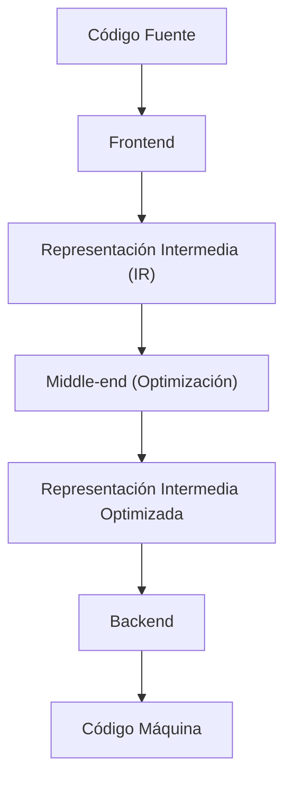
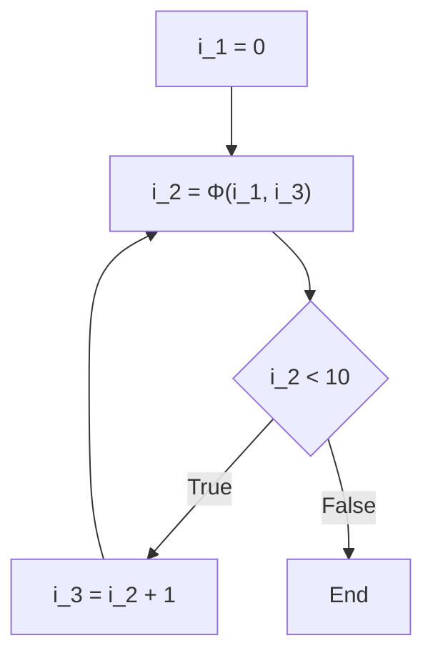

# Tecnología de optimización de compiladores: Qué es SSA (Asignación Única Estática)

En el desarrollo de software, escribimos código todos los días usando varios lenguajes de programación. Lenguajes como C++, Rust, Go, Java o Swift proporcionan sintaxis y abstracciones fáciles de entender para los humanos, lo que nos permite expresar lógicas complejas de manera concisa. Sin embargo, lo único que la CPU (Unidad Central de Procesamiento) de una computadora puede entender directamente es una secuencia de 0s y 1s llamada "código máquina" (o lenguaje máquina). ¿Cómo es que el hermoso y legible código fuente que escribimos se transforma en un código máquina que se ejecuta de manera rápida y eficiente? Detrás de esto se encuentra una pieza de software extremadamente avanzada y compleja llamada "compilador".

En este artículo, profundizaremos en la forma "Mágica" de optimización que realizan los compiladores en segundo plano, enfocándonos especialmente en la forma "SSA (Static Single Assignment: Asignación Única Estática)". Esta técnica juega el papel más importante y central en las infraestructuras de compiladores modernos (como LLVM y GCC), y la explicaremos de forma profunda y detallada.

## Estructura básica de un compilador: Frontend y Backend

Antes de entrar en el tema de SSA, repasemos la arquitectura general de un compilador. Un compilador moderno no es un programa único y gigante, sino que tiene una estructura de pipeline dividida en varias fases independientes. Esta estructura facilita el soporte para diferentes lenguajes de programación y diferentes arquitecturas de CPU.



### Frontend
El papel principal del frontend es analizar el código fuente escrito en un lenguaje de programación específico y convertirlo en una representación de propósito general que sea fácil de manejar internamente por el compilador, mientras se mantiene el significado del programa.
1. **Análisis Léxico (Lexical Analysis)**: Lee la cadena de caracteres del código fuente y la divide en una secuencia de "tokens", como palabras clave, identificadores y operadores.
2. **Análisis Sintáctico (Syntax Analysis)**: Verifica si la secuencia de tokens sigue las reglas gramaticales del lenguaje y crea una estructura de datos en forma de árbol llamada "Árbol de Sintaxis Abstracta (AST: Abstract Syntax Tree)".
3. **Análisis Semántico (Semantic Analysis)**: Verifica que el significado del programa sea correcto realizando comprobaciones de tipos y comprobando el alcance de las variables.

A través de estos procesos, el frontend genera una "Representación Intermedia (IR: Intermediate Representation)", un código que no depende de un lenguaje o hardware específico.

### Middle-end y Optimización
El rol del middle-end es recibir el IR generado por el frontend y aplicar diversas "optimizaciones" para mejorar la velocidad de ejecución del programa o reducir el uso de memoria. No es exagerado decir que esta fase determina el rendimiento del compilador. Y **en esta optimización del middle-end, la forma "SSA" que explicaremos en esta ocasión es la base fundamental absoluta.**

### Backend
El backend toma el IR optimizado y genera el código máquina para una arquitectura de CPU objetivo específica (x86, ARM, RISC-V, etc.). Aquí es donde se realizan la asignación de registros, la programación de instrucciones y la optimización de mirilla (peephole optimization) dependiente del objetivo.

## La importancia de la Representación Intermedia (IR)

¿Por qué los compiladores no generan directamente el código máquina y en su lugar pasan por la molestia de usar una Representación Intermedia (IR)? La mayor razón de esto radica en la "estandarización" y la "facilidad de optimización".

Si no existiera un IR, para soportar M lenguajes y N arquitecturas, sería necesario escribir $M \times N$ compiladores. Sin embargo, al mediar a través de un IR, solo es necesario escribir M frontends y N backends ($M + N$), lo que facilita drásticamente el soporte para nuevos lenguajes y nuevas CPUs. La principal razón por la que LLVM se ha vuelto tan popular se debe a la existencia de esta poderosa y versátil representación intermedia llamada LLVM IR.

## ¿Qué es la forma SSA (Static Single Assignment: Asignación Única Estática)?

Finalmente llegamos al tema principal, la forma SSA.
SSA es una restricción o formato sobre cómo se manejan las variables en la representación intermedia del compilador. Como sugiere el nombre "Static Single Assignment" (Asignación Única Estática), la regla más importante es que **"a cada variable se le asigna (define) un valor estáticamente solo una vez en el texto del programa"**.

Cuando escribimos código en lenguajes de programación regulares, es muy común asignar un valor a la misma variable varias veces.

```c
// Ejemplo en lenguaje C
int x = 10;
x = x + 5;
x = x * 2;
```

En este código, se realizan 3 asignaciones a la variable `x`. Sin embargo, cuando el compilador realiza optimizaciones, el estado en el que el valor de la misma variable se reescribe varias veces dificulta mucho el análisis. Para rastrear (análisis de flujo de datos) "qué valor tiene la variable `x` en un punto dado" o "dónde se calculó este `x`", el compilador debe gestionar un estado complejo.

Por lo tanto, en la forma SSA, cada vez que se reasigna a una variable, se le adjunta un "número de versión" y se trata como variables separadas. Si convertimos el código anterior a la forma SSA, se vería de la siguiente manera:

```text
// Imagen de la conversión a la forma SSA
x_1 = 10
x_2 = x_1 + 5
x_3 = x_2 * 2
```

Al convertirlo de esta manera, todas las variables adquieren la inmutabilidad de ser "definidas solo una vez y luego su valor no cambia". Esto hace que quede claro de un vistazo "dónde se define y dónde se usa una variable (cadena Def-Use)", lo que acelera y simplifica drásticamente el análisis de flujo de datos del compilador.

## Flujo de control y funciones Φ (Phi)

La conversión SSA de un código lineal es simple, pero los programas contienen flujos de control como "bifurcaciones condicionales (instrucciones if)" y "bucles (instrucciones for/while)". Cuando estos flujos de control están involucrados, la conversión SSA ya no es tan directa.

```c
// Código C que incluye una bifurcación condicional
int x = 0;
if (condition) {
    x = 10;
} else {
    x = 20;
}
int y = x + 5;
```

Intentemos convertir este código a SSA utilizando un simple versionado.

```text
// Ejemplo de una conversión SSA fallida
x_1 = 0
if (condition) {
    x_2 = 10
} else {
    x_3 = 20
}
y_1 = ??? + 5  // ¿Se debería usar x_2? ¿Se debería usar x_3?
```

En el punto de convergencia (merge point) de la bifurcación condicional, el valor de la variable `x` será `x_2` si pasó por el bloque if, y `x_3` si pasó por el bloque else. Dado que el compilador no sabe qué camino tomará en la fase de análisis estático, no puede determinar qué versión usar cuando hace referencia a `x` después del punto de convergencia.

Para resolver este problema, se introdujo una función mágica llamada **función Φ (Phi)**.

La función Φ se coloca en los puntos de convergencia del flujo de control y tiene la responsabilidad de seleccionar la versión adecuada de la variable según "la ruta por la que llegó el programa". Si convertimos el código anterior al formato SSA correcto utilizando la función Φ, se vería así:

```text
// Conversión SSA correcta utilizando la función Φ
x_1 = 0
if (condition) {
    x_2 = 10
} else {
    x_3 = 20
}
// Punto de convergencia
x_4 = Φ(x_2, x_3)
y_1 = x_4 + 5
```

Aquí, `x_4 = Φ(x_2, x_3)` representa una pseudo-operación que dice: "Si llegaste por el bloque if, asigna el valor de `x_2` a `x_4`, y si llegaste por el bloque else, asigna el valor de `x_3` a `x_4`".
Como resultado, el código después del punto de convergencia siempre puede referirse a una versión única (en este caso `x_4`), lo que permite representar cualquier flujo de control manteniendo la estricta regla de SSA de "se asigna solo una vez".

### Funciones Φ en los bucles

En el caso de las estructuras de bucle (repetición), la situación se vuelve aún más compleja. Esto se debe a que el valor de una variable puede recibir tanto un "valor inicial desde fuera" del bucle como un "valor actualizado de la iteración anterior" del bucle.

```c
// Código que incluye un bucle
int i = 0;
while (i < 10) {
    i = i + 1;
}
```

Al convertir esto a SSA, el inicio del bucle (la parte de la condición del while) se convierte en el punto de convergencia.

```text
// Conversión SSA de un bucle
i_1 = 0
LoopHeader:
    i_2 = Φ(i_1, i_3)  // i_1 viene de fuera del bucle, i_3 de la parte inferior del bucle
    if (i_2 >= 10) goto End
    i_3 = i_2 + 1
    goto LoopHeader
End:
```

Aquí, la función Φ se coloca en la entrada del bucle. En la primera entrada, se selecciona `i_1` (0), y al dar la vuelta al bucle, se selecciona `i_3`, logrando así mapear brillantemente una variable de bucle que cambia dinámicamente en una representación estática de SSA.



## Poderosas técnicas de optimización proporcionadas por SSA

Con la introducción de la forma SSA en los compiladores, muchos algoritmos de optimización que solían ser complejos y computacionalmente costosos ahora se pueden ejecutar de forma sorprendentemente simple y rápida. A continuación, presentaremos algunas de las optimizaciones típicas que asumen el uso de SSA.

### 1. Propagación de Constantes (Constant Propagation) y Plegado de Constantes (Constant Folding)

Si el valor de una variable se determina estáticamente antes de la ejecución, esta optimización reemplaza la referencia a esa variable directamente con la constante. Dado que las variables se definen solo una vez en el formato SSA, es extremadamente fácil determinar si "una variable es una constante".

```text
// Antes de la optimización
a_1 = 10
b_1 = 20
c_1 = a_1 + b_1

// Propagación de constantes mediante SSA
// Como a_1 y b_1 siempre son constantes, se pueden sustituir directamente en el cálculo de c_1
c_1 = 10 + 20

// Luego, el plegado de constantes
c_1 = 30
```
Simplemente rastreando los enlaces de definición a uso (Def-Use), es posible propagar constantes en cadena a través de toda la base de código.

### 2. Eliminación de Código Muerto (Dead Code Elimination : DCE)

Es una optimización que elimina el código innecesario (código muerto) que no afecta en absoluto el resultado de la ejecución del programa. En la forma SSA, las instrucciones que definen variables que "no son usadas por ninguna instrucción (variables con 0 lugares de uso)" pueden eliminarse incondicionalmente siempre que no tengan efectos secundarios.

```text
x_1 = 10
y_1 = 20  // y_1 nunca se usará después
z_1 = x_1 + 5
return z_1
```
Con SSA, es instantáneo comprobar si "¿hay algún lugar donde se use y_1?" (solo hay que verificar si la lista Use está vacía). Si no se usa, la línea `y_1 = 20` se elimina inmediatamente.

### 3. Eliminación de Subexpresiones Comunes (Common Subexpression Elimination : CSE) y Numeración de Valores (Value Numbering)

Es una optimización que encuentra lugares donde se realiza el mismo cálculo varias veces y omite cálculos inútiles reutilizando el resultado del primer cálculo. Mediante el uso de un algoritmo llamado "Numeración Global de Valores (Global Value Numbering : GVN)", basado en la forma SSA, se pueden detectar cálculos redundantes complejos que abarcan todo el código.

```text
// Antes de la conversión
x_1 = a_1 + b_1
y_1 = a_1 + b_1

// Después de la optimización con GVN
x_1 = a_1 + b_1
y_1 = x_1  // Como es el mismo cálculo, se reutiliza el resultado
```

### 4. Propagación de Copias (Copy Propagation)

Si hay una simple copia de valor como `x = y`, todos los usos subsiguientes de `x` se reemplazan por `y`, y se elimina la operación de copia innecesaria. En SSA, esto también se puede reemplazar fácilmente con solo rastrear la cadena Def-Use.

## Implementación de SSA en LLVM y ejemplos concretos

LLVM, la principal infraestructura de compiladores modernos, tiene todo su middle-end construido sobre la forma SSA. El propio LLVM IR (Representación Intermedia) toma la forma de un lenguaje ensamblador con un tipado fuerte y un formato SSA estricto.

Por ejemplo, compilemos una función simple en C a LLVM IR para ver la función Φ real en acción.

**Código C:**
```c
int max(int a, int b) {
    if (a > b) {
        return a;
    } else {
        return b;
    }
}
```

**LLVM IR (Representación en pseudocódigo):**
```llvm
define i32 @max(i32 %a, i32 %b) {
entry:
  %cmp = icmp sgt i32 %a, %b
  br i1 %cmp, label %if.then, label %if.else

if.then:
  br label %return

if.else:
  br label %return

return:
  %retval.0 = phi i32 [ %a, %if.then ], [ %b, %if.else ]
  ret i32 %retval.0
}
```

Mirando el LLVM IR anterior, podemos ver que la instrucción `phi` se usa claramente en el bloque `return`.
`%retval.0 = phi i32 [ %a, %if.then ], [ %b, %if.else ]`
Esto expresa directamente a nivel de LLVM IR que "si vienes del bloque `%if.then`, asigna `%a`, y si vienes del bloque `%if.else`, asigna `%b` a `%retval.0`".

LLVM aplica sucesivamente numerosos módulos de optimización llamados "Passes" a este IR en forma de SSA. Desde Mem2Reg (un pase para promover accesos a memoria a variables SSA en registros), InstCombine (combinación de instrucciones), GVN (Numeración Global de Valores), hasta ADCE (Eliminación Agresiva de Código Muerto), decenas o cientos de pases de optimización trabajan en conjunto sobre esta sólida base de SSA, produciendo en última instancia el código máquina que logra las increíbles velocidades de ejecución que vemos.

## Las desventajas de SSA y la deconstrucción en el Backend

Aunque la forma SSA parece omnipotente de esta manera, tiene un problema importante. Y es que **el hardware real (CPU) no se ejecuta en formato SSA**.
El número de registros de la CPU real (eax, rax, etc.) es finito, y el mismo registro se reutiliza (reasigna) muchas veces para avanzar con los cálculos. Además, la CPU no tiene una instrucción mágica equivalente a la "función Φ".

Por lo tanto, el backend del compilador debe "destruir la forma SSA (De-SSA)" justo antes de generar el código máquina, después de que se hayan completado todas las optimizaciones.

Específicamente, elimina las funciones Φ y las reemplaza con instrucciones de copia normales (como `MOV`).
Por ejemplo, si hay una función Φ `x_4 = Φ(x_2, x_3)`, para eliminar esto, se inserta una instrucción de copia `x_4 = x_2` al final del bloque if, y una instrucción de copia `x_4 = x_3` al final del bloque else.

```text
// Destruir SSA y convertir a instrucciones de copia
if (condition) {
    x_2 = 10
    x_4 = x_2  // Copia en lugar de la función Φ
} else {
    x_3 = 20
    x_4 = x_3  // Copia en lugar de la función Φ
}
y_1 = x_4 + 5
```

Después de esto, usando un algoritmo complejo llamado "Asignación de Registros (Register Allocation)" (como el algoritmo de coloración de grafos), asigna el número infinito de variables SSA virtuales (`x_1`, `x_2`, `x_3` ...) a un número limitado de registros físicos (por ejemplo, 16). Las variables cuyos intervalos de vida (el período durante el cual se usa la variable) no se superponen se asignan de modo que compartan el mismo registro físico, y finalmente se completa un código máquina eficiente que la CPU real puede ejecutar.

## Resumen

En este artículo, explicamos la forma SSA (Asignación Única Estática), que es el corazón de la optimización de los compiladores.

*   **El pipeline del compilador**: Se divide en frontend, middle-end y backend, operando en torno al IR.
*   **Principios básicos de SSA**: Todas las variables se definen solo una vez en el texto del programa.
*   **La función Φ (Phi)**: En los puntos de convergencia del flujo de control, selecciona la versión de la variable según la ruta.
*   **Beneficios de la optimización**: El plegado de constantes, la eliminación de código muerto y la eliminación de subexpresiones comunes se vuelven dramáticamente más simples y rápidos usando el análisis de flujo de datos.
*   **El puente hacia la realidad**: En la fase final de generación de código máquina, se destruye SSA y se realiza la asignación a registros físicos.

El código que escribimos casualmente a diario se deconstruye una vez en una hermosa representación matemática y de teoría de grafos llamada SSA dentro de la "caja mágica" del compilador. Después de que se ha eliminado completamente todo lo innecesario, se reconstruye de nuevo en el lenguaje máquina rústico para la CPU.
Entender estos mecanismos detrás de escena no solo nos da pistas para escribir código con mayor conciencia del rendimiento, sino que también nos hará sentir la profundidad y fascinación de la ingeniería de software una vez más.
