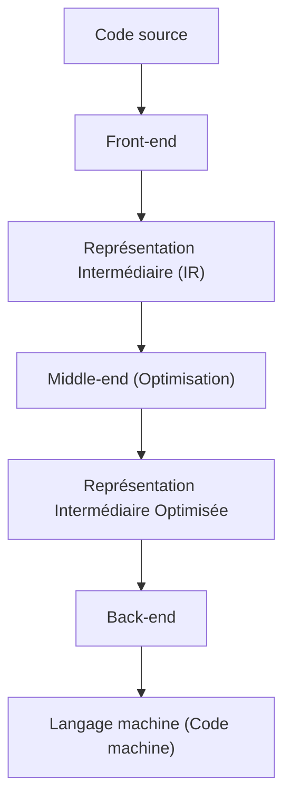
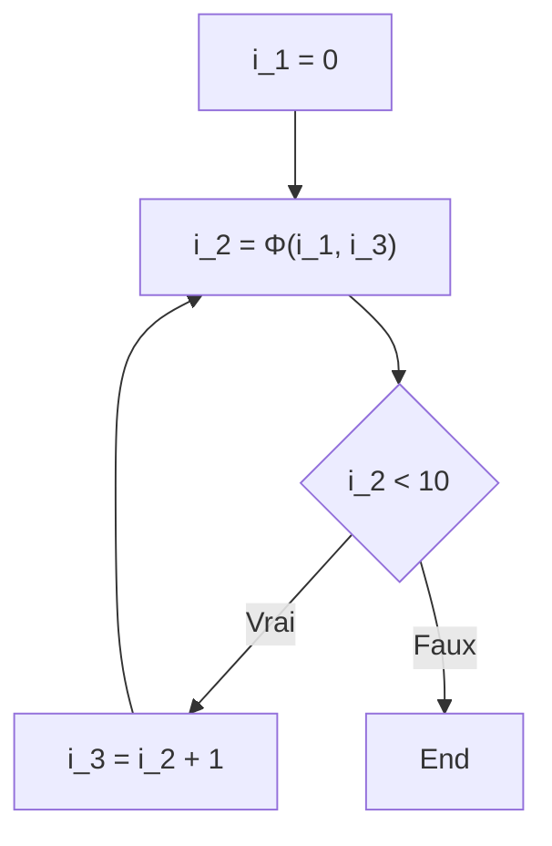

# Techniques d'optimisation de compilateur : Qu'est-ce que la SSA (Assignation Unique Statique) ?

En développement logiciel, nous écrivons quotidiennement du code en utilisant divers langages de programmation. C++, Rust, Go, Java, ou Swift, etc., ces langages offrent une syntaxe et une abstraction faciles à comprendre pour les humains, permettant d'exprimer de manière concise une logique complexe. Cependant, ce que le CPU (Unité Centrale de Traitement) d'un ordinateur peut comprendre directement n'est qu'une suite de 0 et de 1 appelée "langage machine" (code machine). Comment notre beau code source, lisible pour les humains, est-il transformé en un langage machine exécuté rapidement et efficacement ? Derrière cela se trouve l'existence d'un logiciel extrêmement avancé et complexe appelé "compilateur".

Dans cet article, nous allons explorer très en profondeur et en détail la "forme SSA (Static Single Assignment : Assignation Unique Statique)", qui joue le rôle le plus important et central dans les infrastructures de compilateurs modernes (telles que LLVM et GCC), parmi les techniques d'optimisation que l'on pourrait qualifier de "transformation radicale" opérées en coulisses par le compilateur.

## Structure de base d'un compilateur : Front-end et Back-end

Avant d'aborder le sujet de la SSA, passons d'abord en revue l'architecture globale d'un compilateur. Les compilateurs modernes ne sont pas de gigantesques programmes uniques, mais possèdent une structure en pipeline divisée en plusieurs phases indépendantes. Cette structure facilite la prise en charge de différents langages de programmation et de différentes architectures de CPU.



### Front-end

Le rôle principal du front-end est d'analyser le code source écrit dans un langage de programmation spécifique et de le convertir en une représentation générique facile à manipuler au sein du compilateur, tout en conservant la signification du programme.
1. **Analyse lexicale (Lexical Analysis)** : Lit la chaîne de caractères du code source et la divise en une séquence de "jetons" (Tokens) tels que des mots-clés, des identifiants, des opérateurs, etc.
2. **Analyse syntaxique (Syntax Analysis)** : Vérifie si la séquence de jetons suit les règles grammaticales du langage et crée des données structurées en arbre appelées "Arbre de Syntaxe Abstraite" (AST : Abstract Syntax Tree).
3. **Analyse sémantique (Semantic Analysis)** : Effectue la vérification des types et confirme la portée des variables pour valider que la signification du programme est correcte.

Grâce à ces traitements, le front-end génère un code indépendant de tout langage ou matériel spécifique, appelé "Représentation Intermédiaire" (IR : Intermediate Representation).

### Middle-end et Optimisation

Le rôle du middle-end est de recevoir l'IR générée par le front-end et d'appliquer diverses "optimisations" pour améliorer la vitesse d'exécution du programme ou réduire l'utilisation de la mémoire. Il n'est pas exagéré de dire que cette phase détermine les performances du compilateur. Et **dans cette optimisation au niveau du middle-end, la "forme SSA", que nous allons expliquer, constitue une base absolue.**

### Back-end

Le back-end reçoit l'IR optimisée et génère le langage machine pour une architecture de CPU cible spécifique (x86, ARM, RISC-V, etc.). C'est ici que s'effectuent l'allocation des registres, l'ordonnancement des instructions et l'optimisation par peephole (judas) dépendante de la cible.

## L'importance de la Représentation Intermédiaire (IR)

Pourquoi le compilateur ne génère-t-il pas directement le langage machine, en prenant la peine de passer par une Représentation Intermédiaire (IR) ? La raison principale réside dans "l'uniformisation" et la "facilité d'optimisation".

Si l'IR n'existait pas, pour prendre en charge M langages et N architectures, il faudrait écrire $M \times N$ compilateurs. Cependant, en passant par l'IR, il suffit d'écrire M front-ends et N back-ends ($M + N$), ce qui simplifie considérablement l'adaptation à de nouveaux langages ou de nouveaux CPU. La raison principale de la diffusion massive de LLVM réside dans l'existence de cette représentation intermédiaire puissante et générique qu'est l'IR LLVM.

## Qu'est-ce que la forme SSA (Static Single Assignment : Assignation Unique Statique) ?

Nous abordons enfin le sujet principal : la forme SSA.
La SSA désigne une contrainte, ou un format, concernant la manière de traiter les variables dans la représentation intermédiaire d'un compilateur. Comme son nom "Static Single Assignment" l'indique, la règle d'or est que **"chaque variable n'est assignée (définie) qu'une seule fois statiquement dans le texte du programme"**.

Lorsque nous écrivons du code dans des langages de programmation habituels, il est tout à fait naturel d'assigner plusieurs fois des valeurs à la même variable.

```c
// Exemple en C
int x = 10;
x = x + 5;
x = x * 2;
```

Dans ce code, la variable `x` subit trois assignations. Cependant, lorsque le compilateur effectue des optimisations, cet état où la valeur de la même variable est écrasée à plusieurs reprises rend l'analyse très difficile. Pour suivre (analyse de flux de données) "quelle valeur possède la variable `x` à un instant donné" ou "où cette valeur de `x` a-t-elle été calculée", le compilateur doit gérer des états complexes.

Par conséquent, dans la forme SSA, chaque fois qu'une variable est réassignée, on lui attribue un "numéro de version" et on la traite comme une variable distincte. Si l'on convertit le code ci-dessus en forme SSA, cela donne ce qui suit :

```text
// Image de la conversion en forme SSA
x_1 = 10
x_2 = x_1 + 5
x_3 = x_2 * 2
```

En effectuant cette conversion, toutes les variables acquièrent l'immuabilité (Immutability), c'est-à-dire qu'elles sont "définies une seule fois et leur valeur ne change plus par la suite". Grâce à cela, "où une variable est définie et où elle est utilisée (chaîne Def-Use)" devient évident au premier coup d'œil, ce qui accélère et simplifie considérablement l'analyse de flux de données du compilateur.

## Flux de contrôle et Fonction Φ (Phi)

La conversion en SSA d'un code linéaire est simple, mais les programmes comportent des flux de contrôle tels que des "branchements conditionnels (instructions if)" ou des "boucles (instructions for/while)". Lorsque ces flux de contrôle sont impliqués, la conversion en SSA n'est pas si simple.

```c
// Code C incluant un branchement conditionnel
int x = 0;
if (condition) {
    x = 10;
} else {
    x = 20;
}
int y = x + 5;
```

Essayons de convertir ce code simplement en appliquant le versionnage SSA tel quel.

```text
// Exemple d'une conversion SSA qui échoue
x_1 = 0
if (condition) {
    x_2 = 10
} else {
    x_3 = 20
}
y_1 = ??? + 5  // Devrions-nous utiliser x_2 ? Ou x_3 ?
```

Au point de convergence (point de fusion) du branchement conditionnel, la valeur de la variable `x` sera `x_2` si l'on est passé par le bloc if, et `x_3` si l'on est passé par le bloc else. Le compilateur ne sachant pas quel chemin sera emprunté lors de la phase d'analyse statique, il ne peut pas déterminer quelle version utiliser lors de la référence à `x` après le point de convergence.

Pour résoudre ce problème, on a introduit une fonction magique appelée **Fonction Φ (Phi)**.

La fonction Φ est placée au point de convergence du flux de contrôle et a pour rôle de sélectionner la version appropriée de la variable en fonction du "chemin par lequel le programme y est parvenu". Si l'on convertit le code précédent en une forme SSA correcte en utilisant la fonction Φ, cela donne ce qui suit :

```text
// Conversion SSA correcte utilisant la fonction Φ
x_1 = 0
if (condition) {
    x_2 = 10
} else {
    x_3 = 20
}
// Point de convergence
x_4 = Φ(x_2, x_3)
y_1 = x_4 + 5
```

Ici, `x_4 = Φ(x_2, x_3)` représente une opération pseudo indiquant "si l'on est passé par le bloc if, assigner la valeur de `x_2` à `x_4`, et si l'on est passé par le bloc else, assigner la valeur de `x_3` à `x_4`".
Grâce à cela, le code après le point de convergence peut toujours faire référence à une version unique (ici `x_4`), ce qui permet d'exprimer n'importe quel flux de contrôle tout en respectant la règle stricte de la SSA qui dicte de "n'être assigné qu'une seule fois".

### La fonction Φ dans les boucles

Dans le cas des structures de boucles (répétitions), la situation se complique encore. En effet, la valeur de la variable peut recevoir à la fois la "valeur initiale provenant de l'extérieur" de la boucle et la "valeur mise à jour provenant de l'itération précédente" de la boucle.

```c
// Code incluant une boucle
int i = 0;
while (i < 10) {
    i = i + 1;
}
```

Si on convertit cela en SSA, le début de la boucle (la partie d'évaluation de la condition du while) devient le point de convergence.

```text
// Conversion SSA de la boucle
i_1 = 0
LoopHeader:
    i_2 = Φ(i_1, i_3)  // i_1 vient de l'extérieur de la boucle, i_3 vient du bas de la boucle
    if (i_2 >= 10) goto End
    i_3 = i_2 + 1
    goto LoopHeader
End:
```

Ici, une fonction Φ est placée à l'entrée de la boucle. Lors de la première entrée, `i_1` (0) est choisi, et lors du parcours de la boucle, `i_3` est choisi, traduisant ainsi brillamment une variable de boucle dont la valeur change dynamiquement en une expression SSA statique.



## Les puissantes techniques d'optimisation apportées par la SSA

Grâce à l'introduction de la forme SSA dans les compilateurs, de nombreux algorithmes d'optimisation, autrefois complexes et coûteux en calcul, peuvent désormais être exécutés de manière étonnamment simple et rapide. Nous présentons ici quelques optimisations représentatives basées sur la SSA.

### 1. Propagation de constantes (Constant Propagation) et Pliage de constantes (Constant Folding)

Il s'agit d'une optimisation qui remplace directement la référence d'une variable par une constante si la valeur de la variable est statiquement déterminée avant l'exécution. Étant donné que la définition d'une variable est unique dans la forme SSA, il est extrêmement facile de déterminer "si une variable est une constante ou non".

```text
// Avant optimisation
a_1 = 10
b_1 = 20
c_1 = a_1 + b_1

// Propagation de constantes via SSA
// a_1 et b_1 étant toujours des constantes, ils peuvent être substitués directement dans le calcul de c_1
c_1 = 10 + 20

// Pliage de constantes en plus
c_1 = 30
```
Il est possible de propager les constantes en cascade dans toute la base de code, simplement en suivant les liens de la définition vers l'utilisation (Def-Use).

### 2. Élimination du code mort (Dead Code Elimination : DCE)

Il s'agit d'une optimisation qui supprime le code inutile (code mort) n'ayant absolument aucune influence sur le résultat de l'exécution du programme. Dans la forme SSA, une instruction définissant une "variable qui n'est utilisée par aucune instruction (variable ayant 0 point d'utilisation)" peut être supprimée inconditionnellement, tant qu'il n'y a pas d'effets de bord.

```text
x_1 = 10
y_1 = 20  // y_1 ne sera plus jamais utilisé par la suite
z_1 = x_1 + 5
return z_1
```
Avec la SSA, vérifier s'il "existe un endroit où y_1 est utilisé" est instantané (il suffit de vérifier si la liste d'utilisations, "Use list", est vide). Si elle n'est pas utilisée, la ligne `y_1 = 20` est immédiatement supprimée.

### 3. Élimination des sous-expressions communes (Common Subexpression Elimination : CSE) et Numérotation des valeurs (Value Numbering)

Il s'agit d'une optimisation qui trouve les endroits où le même calcul est effectué plusieurs fois et élimine les opérations inutiles en réutilisant le résultat du premier calcul. En utilisant un algorithme appelé "Numérotation Globale des Valeurs (Global Value Numbering : GVN)" basé sur la forme SSA, il est possible de détecter des calculs redondants complexes s'étendant sur l'ensemble du code.

```text
// Avant conversion
x_1 = a_1 + b_1
y_1 = a_1 + b_1

// Après optimisation via GVN
x_1 = a_1 + b_1
y_1 = x_1  // Même calcul, on réutilise le résultat
```

### 4. Propagation de copie (Copy Propagation)

S'il existe une simple copie de valeur telle que `x = y`, on remplace toutes les utilisations ultérieures de `x` par `y`, éliminant ainsi les opérations de copie inutiles. Avec la SSA, cela peut également être facilement remplacé en suivant la chaîne Def-Use.

## Implémentation de la SSA dans LLVM et exemples concrets

LLVM, une infrastructure de compilateur de premier plan aujourd'hui, a l'ensemble de son middle-end construit sur la base de la forme SSA. L'IR (Représentation Intermédiaire) de LLVM elle-même ressemble à un langage d'assemblage avec un typage fort et une forme SSA stricte.

Par exemple, compilons une fonction simple en C en IR LLVM et regardons la fonction Φ réelle.

**Code C :**
```c
int max(int a, int b) {
    if (a > b) {
        return a;
    } else {
        return b;
    }
}
```

**IR LLVM (Expression en pseudo-code) :**
```llvm
define i32 @max(i32 %a, i32 %b) {
entry:
  %cmp = icmp sgt i32 %a, %b
  br i1 %cmp, label %if.then, label %if.else

if.then:
  br label %return

if.else:
  br label %return

return:
  %retval.0 = phi i32 [ %a, %if.then ], [ %b, %if.else ]
  ret i32 %retval.0
}
```

En regardant l'IR LLVM ci-dessus, on peut voir que l'instruction `phi` est clairement utilisée dans le bloc `return`.
`%retval.0 = phi i32 [ %a, %if.then ], [ %b, %if.else ]`
Cela exprime directement au niveau de l'IR LLVM que "si la transition provient du bloc `%if.then`, assigner `%a` à `%retval.0`, et si la transition provient du bloc `%if.else`, assigner `%b` à `%retval.0`".

LLVM applique successivement une multitude de modules d'optimisation appelés "Passes" sur cette IR sous forme SSA. Des dizaines à des centaines de passes d'optimisation telles que Mem2Reg (passe pour promouvoir les accès mémoire vers des variables SSA sur les registres), InstCombine (combinaison d'instructions), GVN (Numérotation Globale des Valeurs) ou ADCE (Élimination Agressive du Code Mort) fonctionnent en synergie sur cette base solide qu'est la SSA, pour finalement générer le code machine d'une vitesse d'exécution stupéfiante que nous pouvons observer.

## Les inconvénients de la SSA et sa déconstruction dans le back-end

Bien que la forme SSA paraisse si polyvalente, elle présente un problème majeur : **le matériel réel (CPU) ne fonctionne pas en forme SSA**.
Le nombre de registres du CPU réel (eax, rax, etc.) est fini, et le calcul progresse en réutilisant (réassignant) plusieurs fois le même registre. De plus, il n'existe pas d'instruction magique équivalente à la "fonction Φ" dans le CPU.

Par conséquent, le back-end du compilateur doit "détruire la forme SSA (De-SSA)" juste avant de générer le code machine, une fois toutes les optimisations terminées.

Concrètement, il effectue le travail de supprimer les fonctions Φ et de les remplacer par des instructions de copie normales (telles que `MOV`).
Par exemple, s'il y a une fonction Φ comme `x_4 = Φ(x_2, x_3)`, pour l'éliminer, on insère une instruction de copie `x_4 = x_2` à la fin du bloc if, et une instruction de copie `x_4 = x_3` à la fin du bloc else.

```text
// Destruction de la SSA et conversion en instructions de copie
if (condition) {
    x_2 = 10
    x_4 = x_2  // Copie remplaçant la fonction Φ
} else {
    x_3 = 20
    x_4 = x_3  // Copie remplaçant la fonction Φ
}
y_1 = x_4 + 5
```

Ensuite, en utilisant un algorithme complexe appelé "Allocation de registres" (Register Allocation) (comme l'algorithme de coloration de graphe), il mappe le nombre infini de variables SSA virtuelles (`x_1`, `x_2`, `x_3` ...) vers un nombre limité de registres physiques (par exemple 16). Les variables dont les intervalles de durée de vie (la période pendant laquelle la variable est utilisée) ne se chevauchent pas se voient attribuer le même registre physique, ce qui permet finalement de finaliser un code machine efficace exécutable par le CPU réel.

## Résumé

Dans cet article, nous avons expliqué la forme SSA (Assignation Unique Statique), le cœur de l'optimisation des compilateurs.

*   **Pipeline du compilateur** : Divisé en front-end, middle-end et back-end, collaborant autour de l'IR.
*   **Principe de base de la SSA** : Toutes les variables ne sont définies qu'une seule fois dans le texte du programme.
*   **Fonction Φ (Phi)** : Au point de convergence des flux de contrôle, sélectionne la version de la variable en fonction du chemin.
*   **Bénéfices de l'optimisation** : Rend les optimisations utilisant l'analyse de flux de données, telles que le pliage de constantes, l'élimination du code mort et l'élimination des sous-expressions communes, radicalement plus faciles et rapides.
*   **Passerelle vers la réalité** : Dans la phase finale de génération du code machine, la SSA est détruite et l'allocation aux registres physiques est effectuée.

Le code que nous écrivons habituellement sans y penser est, au sein de cette "boîte magique" qu'est le compilateur, décomposé une première fois en une belle expression mathématique et issue de la théorie des graphes qu'est la SSA. Après avoir été impitoyablement dépouillé de tout superflu, il est à nouveau reconstruit en un langage machine brut pour le CPU.
Comprendre un tel mécanisme sous-jacent nous donne non seulement des indices pour écrire un code plus soucieux des performances, mais nous permet également de ressentir à nouveau la profondeur et la fascination de l'ingénierie logicielle.
