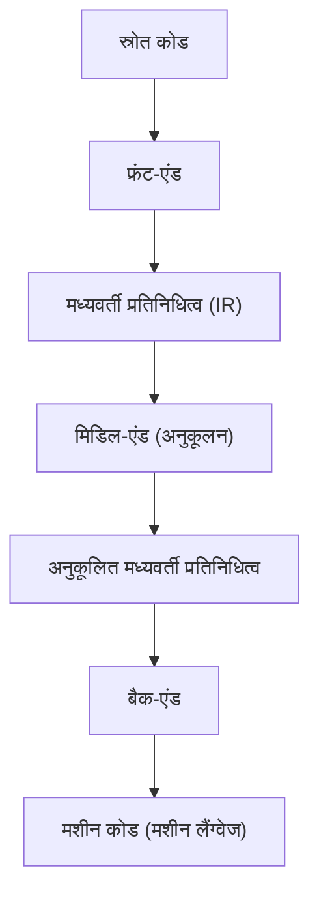
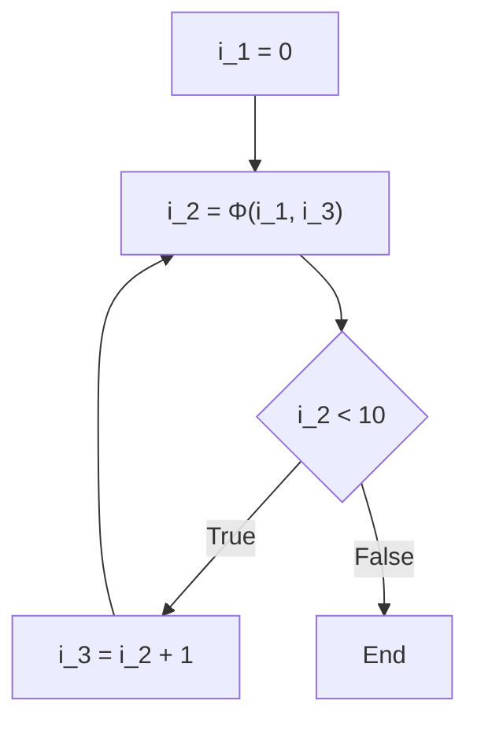

# कंपाइलर अनुकूलन तकनीक: SSA (स्थैतिक एकल असाइनमेंट) क्या है

सॉफ़्टवेयर विकास में, हम हर दिन विभिन्न प्रोग्रामिंग भाषाओं का उपयोग करके कोड लिखते हैं। C++, Rust, Go, Java, या Swift जैसी भाषाएं मनुष्यों के लिए समझने में आसान सिंटैक्स और एब्स्ट्रैक्शन प्रदान करती हैं, जिससे जटिल लॉजिक को संक्षेप में व्यक्त करना संभव हो जाता है। हालाँकि, कंप्यूटर का CPU (सेंट्रल प्रोसेसिंग यूनिट) केवल "मशीन कोड" नामक 0 और 1 के अनुक्रमों को सीधे समझ सकता है। हमारे द्वारा लिखा गया सुंदर, मानव-पठनीय स्रोत कोड कैसे मशीन कोड में बदल जाता है जो उच्च गति और दक्षता पर निष्पादित होता है? इसके पीछे "कंपाइलर" नामक एक अत्यधिक उन्नत और जटिल सॉफ़्टवेयर का अस्तित्व है।

इस लेख में, हम "SSA (Static Single Assignment: स्थैतिक एकल असाइनमेंट) फॉर्म" के बारे में बहुत गहराई और विस्तार से जानेंगे, जो आधुनिक कंपाइलर इन्फ्रास्ट्रक्चर (जैसे LLVM और GCC) में सबसे महत्वपूर्ण और केंद्रीय भूमिका निभाता है, उन अनुकूलन तकनीकों के बीच जिन्हें कंपाइलर पर्दे के पीछे "जादुई संशोधन" के रूप में करता है।

## कंपाइलर की मूल संरचना: फ्रंट-एंड और बैक-एंड

SSA विषय में जाने से पहले, आइए पहले कंपाइलर के समग्र आर्किटेक्चर की समीक्षा करें। आधुनिक कंपाइलर एकल विशाल प्रोग्राम नहीं हैं, बल्कि एक पाइपलाइन संरचना है जो कई स्वतंत्र चरणों में विभाजित है। यह संरचना विभिन्न प्रोग्रामिंग भाषाओं और विभिन्न CPU आर्किटेक्चर का समर्थन करना आसान बनाती है।



### फ्रंट-एंड (Front-end)
फ्रंट-एंड की मुख्य भूमिका एक विशिष्ट प्रोग्रामिंग भाषा में लिखे गए स्रोत कोड का विश्लेषण करना और प्रोग्राम के अर्थ को बनाए रखते हुए इसे एक सामान्य-उद्देश्यीय प्रतिनिधित्व में बदलना है जिसे कंपाइलर के अंदर संभालना आसान है।
1. **लेक्सिकल एनालिसिस (Lexical Analysis)**: स्रोत कोड की स्ट्रिंग पढ़ता है और इसे कीवर्ड, आइडेंटिफायर, ऑपरेटर आदि के "टोकन (Token)" के अनुक्रम में विभाजित करता है।
2. **सिंटैक्स एनालिसिस (Syntax Analysis)**: जाँचता है कि टोकन का अनुक्रम भाषा के व्याकरणिक नियमों का पालन करता है या नहीं, और "एब्स्ट्रैक्ट सिंटैक्स ट्री (AST: Abstract Syntax Tree)" नामक ट्री-संरचित डेटा बनाता है।
3. **सिमेंटिक एनालिसिस (Semantic Analysis)**: प्रकार की जाँच (टाइप चेकिंग) और चर (वेरिएबल) के स्कोप का सत्यापन करता है, ताकि यह सुनिश्चित हो सके कि प्रोग्राम का अर्थ सही है।

इन प्रक्रियाओं के माध्यम से, फ्रंट-एंड "मध्यवर्ती प्रतिनिधित्व (IR: Intermediate Representation)" नामक कोड उत्पन्न करता है, जो किसी विशिष्ट भाषा या हार्डवेयर पर निर्भर नहीं करता है।

### मिडिल-एंड (Middle-end) और अनुकूलन
मिडिल-एंड की भूमिका फ्रंट-एंड द्वारा आउटपुट किए गए IR को प्राप्त करना और प्रोग्राम की निष्पादन गति को सुधारने और मेमोरी उपयोग को कम करने के लिए विभिन्न "अनुकूलन" लागू करना है। यह कहना कोई अतिशयोक्ति नहीं होगी कि यह चरण कंपाइलर के प्रदर्शन को निर्धारित करता है। और, **इस मिडिल-एंड अनुकूलन में, पूर्ण आधार वह "SSA फॉर्म" है जिसे हम इस बार समझाएंगे।**

### बैक-एंड (Back-end)
बैक-एंड अनुकूलित IR प्राप्त करता है और विशिष्ट लक्षित CPU आर्किटेक्चर (x86, ARM, RISC-V, आदि) के लिए मशीन कोड उत्पन्न करता है। यहां, रजिस्टर आवंटन, निर्देश शेड्यूलिंग (इंस्ट्रक्शन शेड्यूलिंग), और लक्ष्य-निर्भर पीपहोल (peephole) अनुकूलन किए जाते हैं।

## मध्यवर्ती प्रतिनिधित्व (IR) का महत्व

कंपाइलर सीधे मशीन कोड उत्पन्न क्यों नहीं करता, और इसके बजाय मध्यवर्ती प्रतिनिधित्व (IR) से गुजरने की परेशानी क्यों उठाता है? इसका सबसे बड़ा कारण "सामान्यीकरण" और "अनुकूलन में आसानी" है।

यदि कोई IR नहीं होता, तो M भाषाओं और N आर्किटेक्चर का समर्थन करने के लिए, हमें $M \times N$ कंपाइलर लिखने की आवश्यकता होती। हालाँकि, IR के माध्यम से, हमें केवल M फ्रंट-एंड और N बैक-एंड ($M + N$) लिखने की आवश्यकता है, जिससे नई भाषाओं और नए CPU का समर्थन करना नाटकीय रूप से आसान हो जाता है। LLVM इतना लोकप्रिय होने का सबसे बड़ा कारण इस शक्तिशाली और बहुमुखी मध्यवर्ती प्रतिनिधित्व, LLVM IR का अस्तित्व है।

## SSA (Static Single Assignment: स्थैतिक एकल असाइनमेंट) फॉर्म क्या है

अब, हम मुख्य विषय, SSA फॉर्म की व्याख्या करेंगे।
SSA कंपाइलर के मध्यवर्ती प्रतिनिधित्व में चर (वेरिएबल्स) को संभालने के प्रतिबंधों या इसके फॉर्म को संदर्भित करता है। जैसा कि "Static Single Assignment" नाम से पता चलता है, सबसे बड़ा नियम यह है कि **"प्रत्येक चर को प्रोग्राम टेक्स्ट में केवल एक बार स्थैतिक रूप से असाइन (परिभाषित) किया जाता है।"**

जब हम किसी सामान्य प्रोग्रामिंग भाषा में कोड लिखते हैं, तो एक ही चर को कई बार मान निर्दिष्ट करना बहुत आम है।

```c
// C भाषा का उदाहरण
int x = 10;
x = x + 5;
x = x * 2;
```

इस कोड में, चर `x` को 3 बार असाइनमेंट किया गया है। हालाँकि, जब कंपाइलर अनुकूलन करता है, तो ऐसी स्थिति जहां एक ही चर का मान कई बार फिर से लिखा जाता है, विश्लेषण को बहुत कठिन बना देता है। "किसी निश्चित बिंदु पर चर `x` का क्या मान है?" और "इस `x` की गणना कहाँ की गई थी?" को ट्रैक करने के लिए (डेटा फ्लो एनालिसिस), कंपाइलर को जटिल स्थितियों का प्रबंधन करना पड़ता है।

इसलिए, SSA फॉर्म में, हर बार जब किसी चर को फिर से असाइन किया जाता है, तो उसे एक "संस्करण संख्या (वर्जन नंबर)" दिया जाता है और एक अलग चर के रूप में माना जाता है। जब उपरोक्त कोड को SSA फॉर्म में परिवर्तित किया जाता है, तो यह इस प्रकार दिखता है:

```text
// SSA फॉर्म में रूपांतरण की छवि
x_1 = 10
x_2 = x_1 + 5
x_3 = x_2 * 2
```

इस तरह से परिवर्तित करके, सभी चर "अपरिवर्तनीयता (Immutability)" प्राप्त करते हैं कि "वे केवल एक बार परिभाषित होते हैं, और उसके बाद मान नहीं बदलता है।" इसके परिणामस्वरूप, "चर कहाँ परिभाषित है और कहाँ उपयोग किया गया है (Def-Use चेन)" स्पष्ट हो जाता है, और कंपाइलर का डेटा फ्लो विश्लेषण नाटकीय रूप से तेज और सरल हो जाता है।

## कंट्रोल फ्लो और Φ (फाई) फंक्शन

रैखिक कोड का SSA रूपांतरण आसान है, लेकिन प्रोग्राम में "सशर्त ब्रांचिंग (if स्टेटमेंट)" और "लूप (for/while स्टेटमेंट)" जैसे कंट्रोल फ्लो होते हैं। जब ये कंट्रोल फ्लो शामिल होते हैं, तो SSA रूपांतरण सीधा नहीं होता है।

```c
// सशर्त ब्रांचिंग सहित C कोड
int x = 0;
if (condition) {
    x = 10;
} else {
    x = 20;
}
int y = x + 5;
```

आइए इसे केवल SSA संस्करण (वर्जनिंग) के साथ सीधे परिवर्तित करने का प्रयास करें।

```text
// विफल होने वाले SSA रूपांतरण का उदाहरण
x_1 = 0
if (condition) {
    x_2 = 10
} else {
    x_3 = 20
}
y_1 = ??? + 5  // x_2 का उपयोग करें? या x_3 का उपयोग करें?
```

सशर्त ब्रांचिंग के विलय बिंदु (मर्ज पॉइंट) पर, चर `x` का मान `x_2` होगा यदि यह if ब्लॉक से होकर गुजरता है, और `x_3` यदि यह else ब्लॉक से होकर गुजरता है। चूँकि कंपाइलर को यह नहीं पता होता है कि स्थैतिक विश्लेषण चरण के दौरान कौन सा पथ लिया जाएगा, इसलिए वह यह तय नहीं कर सकता कि विलय बिंदु के बाद `x` को संदर्भित करते समय किस संस्करण का उपयोग किया जाए।

इस समस्या को हल करने के लिए, **Φ (फाई) फंक्शन** नामक एक जादुई फ़ंक्शन पेश किया गया था।

Φ फ़ंक्शन को कंट्रोल फ्लो के विलय बिंदु पर रखा जाता है और "प्रोग्राम किस पथ से पहुँचा" के आधार पर चर के उचित संस्करण का चयन करने की भूमिका निभाता है। Φ फ़ंक्शन का उपयोग करके पिछले कोड को सही SSA रूप में परिवर्तित करने पर, यह इस प्रकार दिखता है:

```text
// Φ फ़ंक्शन का उपयोग करके सही SSA रूपांतरण
x_1 = 0
if (condition) {
    x_2 = 10
} else {
    x_3 = 20
}
// विलय बिंदु
x_4 = Φ(x_2, x_3)
y_1 = x_4 + 5
```

यहाँ `x_4 = Φ(x_2, x_3)` एक छद्म-ऑपरेशन (pseudo-operation) का प्रतिनिधित्व करता है जो कहता है: "यदि आप if ब्लॉक से आए हैं, तो `x_4` को `x_2` का मान असाइन करें, और यदि आप else ब्लॉक से आए हैं, तो `x_4` को `x_3` का मान असाइन करें।"
यह विलय बिंदु के बाद के कोड को हमेशा एक अद्वितीय संस्करण (यहाँ `x_4`) का संदर्भ लेने की अनुमति देता है, जिससे SSA के सख्त नियम "केवल एक बार असाइन किया गया" को ध्यान में रखते हुए किसी भी कंट्रोल फ्लो को व्यक्त करना संभव हो जाता है।

### लूप में Φ फंक्शन

लूप (पुनरावृत्ति) संरचनाओं के मामले में, स्थिति और भी जटिल हो जाती है। ऐसा इसलिए है क्योंकि एक चर का मान लूप के "बाहर से प्रारंभिक मान" और लूप के "पिछले पुनरावृत्ति से अद्यतन मान" दोनों प्राप्त कर सकता है।

```c
// लूप सहित कोड
int i = 0;
while (i < 10) {
    i = i + 1;
}
```

जब इसे SSA में परिवर्तित किया जाता है, तो लूप की शुरुआत (while का स्थिति निर्णय भाग) विलय बिंदु बन जाती है।

```text
// लूप का SSA रूपांतरण
i_1 = 0
LoopHeader:
    i_2 = Φ(i_1, i_3)  // i_1 लूप के बाहर से है, i_3 लूप के नीचे से है
    if (i_2 >= 10) goto End
    i_3 = i_2 + 1
    goto LoopHeader
End:
```

यहाँ, लूप के प्रवेश द्वार पर एक Φ फ़ंक्शन रखा गया है। पहली प्रविष्टि पर `i_1` (0) चुना जाता है, और जब लूप के चारों ओर जाता है तो `i_3` चुना जाता है, इस प्रकार गतिशील रूप से बदलने वाले लूप चर को स्थैतिक SSA प्रतिनिधित्व में खूबसूरती से परिवर्तित किया जाता है।



## SSA द्वारा लायी गई शक्तिशाली अनुकूलन तकनीकें

कंपाइलर में SSA फॉर्म की शुरुआत के साथ, कई अनुकूलन एल्गोरिदम जो पहले जटिल और कम्प्यूटेशनल रूप से महंगे थे, आश्चर्यजनक रूप से सरल और निष्पादित करने में तेज़ हो गए। यहाँ, हम SSA के आधार पर कुछ विशिष्ट अनुकूलनों का परिचय देंगे।

### 1. निरंतर प्रसार (Constant Propagation) और निरंतर फोल्डिंग (Constant Folding)

यह एक अनुकूलन है जो सीधे एक चर के संदर्भ को स्थिरांक (constant) से बदल देता है यदि चर का मान निष्पादन से पहले स्थैतिक रूप से निर्धारित किया जाता है। चूंकि SSA फॉर्म में चरों को केवल एक बार परिभाषित किया जाता है, इसलिए यह निर्धारित करना बहुत आसान है कि "कोई चर स्थिरांक है या नहीं।"

```text
// अनुकूलन से पहले
a_1 = 10
b_1 = 20
c_1 = a_1 + b_1

// SSA के साथ निरंतर प्रसार
// चूंकि a_1 और b_1 हमेशा स्थिरांक होते हैं, उन्हें सीधे c_1 की गणना में प्रतिस्थापित किया जा सकता है
c_1 = 10 + 20

// आगे निरंतर फोल्डिंग
c_1 = 30
```
परिभाषा से उपयोग (Def-Use) के लिंक का पालन करके, पूरे कोडबेस में निरंतर रूप से स्थिरांक को प्रसारित करना संभव है।

### 2. डेड कोड एलिमिनेशन (Dead Code Elimination : DCE)

यह एक अनुकूलन है जो अनावश्यक कोड (डेड कोड) को हटा देता है जिसका प्रोग्राम के निष्पादन परिणामों पर कोई प्रभाव नहीं पड़ता है। SSA फॉर्म में, निर्देश जो "उन चरों को परिभाषित करते हैं जिनका उपयोग किसी निर्देश द्वारा नहीं किया जाता है (0 उपयोग वाले चर)" बिना किसी शर्त के हटा दिए जा सकते हैं जब तक कि उनके कोई दुष्प्रभाव न हों।

```text
x_1 = 10
y_1 = 20  // y_1 का उपयोग बाद में कभी नहीं किया जाता है
z_1 = x_1 + 5
return z_1
```
यदि यह SSA है, तो यह जाँचना तात्कालिक है कि "क्या कोई ऐसा स्थान है जहाँ y_1 का उपयोग किया जाता है?" (बस जाँचें कि क्या उपयोग सूची खाली है)। यदि इसका उपयोग नहीं किया जाता है, तो पंक्ति `y_1 = 20` तुरंत हटा दी जाती है।

### 3. सामान्य उप-अभिव्यक्ति उन्मूलन (Common Subexpression Elimination : CSE) और मान क्रमांकन (Value Numbering)

यह एक अनुकूलन है जो उन स्थानों को ढूंढता है जहां एक ही गणना कई बार की जाती है, और अनावश्यक गणनाओं को सहेजने के लिए पहली गणना के परिणाम का पुन: उपयोग करता है। SSA फॉर्म पर आधारित "ग्लोबल वैल्यू नंबरिंग (Global Value Numbering : GVN)" नामक एल्गोरिदम का उपयोग करके, पूरे कोड में फैली जटिल निरर्थक गणनाओं का पता लगाया जा सकता है।

```text
// रूपांतरण से पहले
x_1 = a_1 + b_1
y_1 = a_1 + b_1

// GVN के साथ अनुकूलन के बाद
x_1 = a_1 + b_1
y_1 = x_1  // एक ही गणना, इसलिए परिणाम का पुन: उपयोग करें
```

### 4. कॉपी प्रसार (Copy Propagation)

यदि `x = y` जैसी कोई सरल मूल्य प्रतिलिपि है, तो यह `x` के बाद के सभी उपयोगों को `y` से बदल देता है, जिससे अनावश्यक प्रतिलिपि संचालन समाप्त हो जाता है। SSA में, इसे Def-Use श्रृंखला का पालन करके आसानी से बदला जा सकता है।

## LLVM में SSA कार्यान्वयन और विशिष्ट उदाहरण

LLVM, आधुनिक युग के लिए एक प्रतिनिधि कंपाइलर इन्फ्रास्ट्रक्चर, का संपूर्ण मिडिल-एंड SSA फॉर्म के आधार पर बनाया गया है। LLVM IR (मध्यवर्ती प्रतिनिधित्व) स्वयं एक असेंबली भाषा जैसा दिखता है जिसमें मजबूत टाइपिंग और सख्त SSA फॉर्म है।

उदाहरण के लिए, आइए एक सरल C फ़ंक्शन को LLVM IR में संकलित करें और वास्तविक Φ फ़ंक्शन को देखें।

**C भाषा कोड:**
```c
int max(int a, int b) {
    if (a > b) {
        return a;
    } else {
        return b;
    }
}
```

**LLVM IR (छद्म-कोड अभिव्यक्ति):**
```llvm
define i32 @max(i32 %a, i32 %b) {
entry:
  %cmp = icmp sgt i32 %a, %b
  br i1 %cmp, label %if.then, label %if.else

if.then:
  br label %return

if.else:
  br label %return

return:
  %retval.0 = phi i32 [ %a, %if.then ], [ %b, %if.else ]
  ret i32 %retval.0
}
```

उपरोक्त LLVM IR को देखते हुए, आप देख सकते हैं कि `phi` निर्देश का स्पष्ट रूप से `return` ब्लॉक में उपयोग किया जाता है।
`%retval.0 = phi i32 [ %a, %if.then ], [ %b, %if.else ]`
यह LLVM IR के स्तर पर सीधे व्यक्त करता है, "यदि आप `%if.then` ब्लॉक से आए हैं, तो `%retval.0` को `%a` असाइन करें, और यदि आप `%if.else` ब्लॉक से आए हैं, तो `%b` असाइन करें।"

LLVM इस SSA-स्वरूपित IR पर एक के बाद एक कई अनुकूलन मॉड्यूल लागू करता है जिन्हें "पास (Pass)" कहा जाता है। Mem2Reg (मेमोरी एक्सेस को रजिस्टरों पर SSA चर में बढ़ावा देना), InstCombine (निर्देश संयोजन), GVN (ग्लोबल वैल्यू नंबरिंग), और ADCE (एग्रेसिव डेड कोड एलिमिनेशन) जैसे दर्जनों से लेकर सैकड़ों अनुकूलन पास इस मजबूत SSA आधार पर एक साथ काम करते हैं, अंततः उस आश्चर्यजनक रूप से तेज़ मशीन कोड का उत्पादन करते हैं जिसे हम देखते हैं।

## SSA के नुकसान और बैक-एंड में डीकंस्ट्रक्शन

SSA फॉर्म, जो इस तरह सर्वशक्तिमान प्रतीत होता है, में एक बड़ी समस्या है। वह यह है कि **वास्तविक हार्डवेयर (CPU) SSA फॉर्म में काम नहीं करता है।**
वास्तविक CPU में रजिस्टरों की संख्या (eax, rax, आदि) सीमित है, और गणना के साथ आगे बढ़ने के लिए एक ही रजिस्टर का कई बार पुन: उपयोग (पुनः असाइन) किया जाता है। साथ ही, CPU में "Φ फ़ंक्शन" के बराबर कोई जादुई निर्देश नहीं है।

इसलिए, कंपाइलर के बैक-एंड को सभी अनुकूलन समाप्त होने के बाद और मशीन कोड उत्पन्न होने से ठीक पहले "SSA फॉर्म को नष्ट (De-SSA)" करना होगा।

विशेष रूप से, यह Φ फ़ंक्शन को हटाता है और उन्हें सामान्य कॉपी निर्देशों (जैसे `MOV`) से बदल देता है।
उदाहरण के लिए, यदि एक Φ फ़ंक्शन `x_4 = Φ(x_2, x_3)` है, तो इसे मिटाने के लिए, if ब्लॉक के अंत में एक कॉपी निर्देश `x_4 = x_2` डाला जाता है, और else ब्लॉक के अंत में एक कॉपी निर्देश `x_4 = x_3` डाला जाता है।

```text
// SSA को नष्ट करें और कॉपी निर्देशों में कनवर्ट करें
if (condition) {
    x_2 = 10
    x_4 = x_2  // Φ फ़ंक्शन के बजाय कॉपी करें
} else {
    x_3 = 20
    x_4 = x_3  // Φ फ़ंक्शन के बजाय कॉपी करें
}
y_1 = x_4 + 5
```

उसके बाद, एक जटिल एल्गोरिदम (जैसे ग्राफ कलरिंग एल्गोरिदम) जिसे "रजिस्टर एलोकेशन (Register Allocation)" कहा जाता है, का उपयोग करके असीमित संख्या में वर्चुअल SSA वेरिएबल्स (`x_1`, `x_2`, `x_3` ...) को सीमित संख्या में (उदाहरण के लिए 16) भौतिक रजिस्टरों में मैप किया जाता है। ओवरलैप नहीं होने वाले जीवनकाल (वह अवधि जिसके दौरान चर का उपयोग किया जाता है) वाले चरों को एक ही भौतिक रजिस्टर को साझा करने के लिए आवंटित किया जाता है, और अंततः एक कुशल मशीन कोड पूरा हो जाता है जिसे वास्तविक CPU निष्पादित कर सकता है।

## सारांश

इस लेख में, हमने SSA (स्टैटिक सिंगल असाइनमेंट) फॉर्म की व्याख्या की, जो कंपाइलर अनुकूलन का हृदय है।

*   **कंपाइलर पाइपलाइन**: इसे फ्रंट-एंड, मिडिल-एंड और बैक-एंड में विभाजित किया गया है, और ये IR के आसपास सहयोग करते हैं।
*   **SSA के मूल सिद्धांत**: सभी चर प्रोग्राम टेक्स्ट पर केवल एक बार परिभाषित होते हैं।
*   **Φ (फाई) फ़ंक्शन**: कंट्रोल फ्लो के विलय बिंदु पर, पथ के अनुसार चर का संस्करण चुना जाता है।
*   **अनुकूलन के लाभ**: डेटा प्रवाह विश्लेषण का उपयोग करने वाले अनुकूलन, जैसे निरंतर फोल्डिंग, डेड कोड एलिमिनेशन, और सामान्य उप-अभिव्यक्ति उन्मूलन, नाटकीय रूप से आसान और तेज़ हो जाते हैं।
*   **वास्तविकता से जोड़ना**: अंतिम मशीन कोड जनरेशन चरण में, SSA को नष्ट कर दिया जाता है और भौतिक रजिस्टरों को आवंटित किया जाता है।

वह कोड जिसे हम लापरवाही से लिखते हैं, कंपाइलर नामक "जादुई बक्से" के अंदर एक बार SSA नामक एक सुंदर गणितीय/ग्राफ-सैद्धांतिक प्रतिनिधित्व में नष्ट कर दिया जाता है, पूरी तरह से कचरे से मुक्त कर दिया जाता है, और फिर से CPU के लिए एक असभ्य मशीन कोड में फिर से बनाया जाता है।
पर्दे के पीछे इस तरह के तंत्र को समझना न केवल अधिक प्रदर्शन-जागरूक कोड लिखने का संकेत होगा, बल्कि हमें सॉफ्टवेयर इंजीनियरिंग की गहराई और मज़ा भी महसूस कराएगा।
