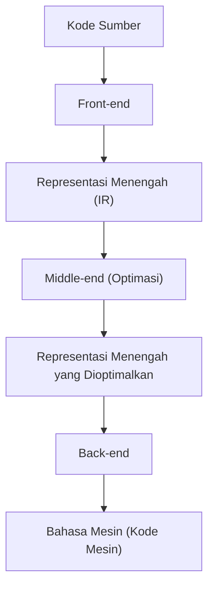
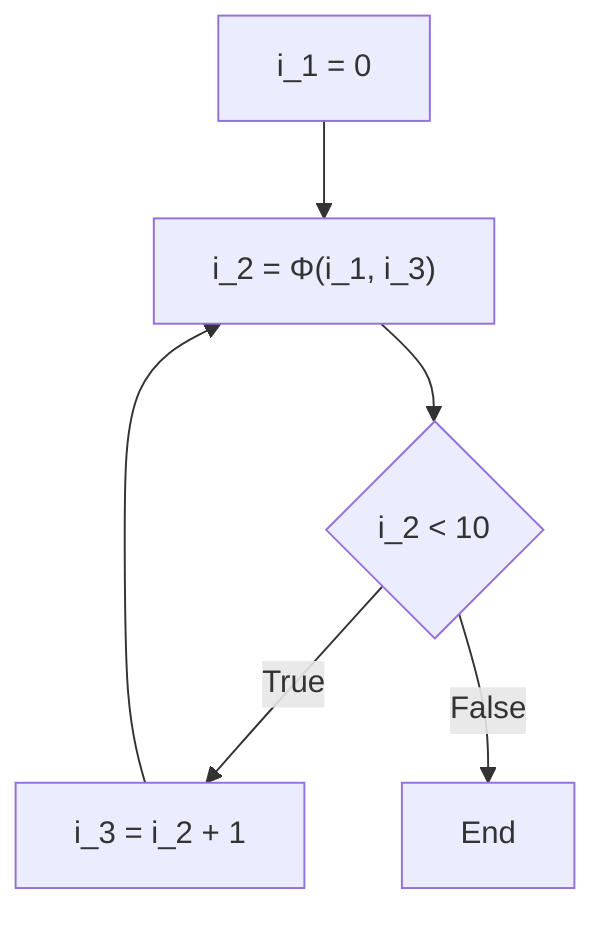

# Teknologi Optimasi Kompilator: Apa itu SSA (Penugasan Tunggal Statis)

Dalam pengembangan perangkat lunak, kita sehari-hari menulis kode menggunakan berbagai bahasa pemrograman. C++, Rust, Go, Java, atau Swift, bahasa-bahasa ini menyediakan sintaksis dan abstraksi yang mudah dipahami oleh manusia, memungkinkan kita untuk mengekspresikan logika yang kompleks secara ringkas. Namun, CPU (Central Processing Unit) komputer hanya dapat memahami secara langsung rentetan 0 dan 1 yang disebut "bahasa mesin" (kode mesin). Bagaimana kode sumber yang kita tulis dengan indah dan mudah dibaca oleh manusia diubah menjadi bahasa mesin yang dapat dieksekusi dengan cepat dan efisien? Di balik itu, ada perangkat lunak yang sangat canggih dan kompleks yang disebut "kompilator".

Dalam artikel ini, dari sekian banyak teknik optimasi—yang bisa dibilang "modifikasi ajaib"—yang dilakukan kompilator di balik layar, kita akan membahas bentuk "SSA (Static Single Assignment)" yang memainkan peran paling penting dan sentral dalam fondasi kompilator modern (seperti LLVM dan GCC). Kita akan menggalinya dengan sangat dalam dan mendetail.

## Struktur Dasar Kompilator: Front-end dan Back-end

Sebelum masuk ke topik SSA, mari kita tinjau kembali arsitektur kompilator secara keseluruhan. Kompilator modern bukanlah program tunggal yang raksasa, melainkan memiliki struktur pipeline yang terbagi menjadi beberapa fase independen. Struktur ini memudahkan dukungan untuk berbagai bahasa pemrograman dan arsitektur CPU yang berbeda.



### Front-end
Peran utama front-end adalah menganalisis kode sumber yang ditulis dalam bahasa pemrograman tertentu dan mengubahnya menjadi representasi serbaguna yang mudah ditangani di dalam kompilator, dengan tetap mempertahankan makna dari program tersebut.
1. **Analisis Leksikal (Lexical Analysis)**: Membaca string kode sumber dan membaginya menjadi urutan "token" seperti kata kunci, pengidentifikasi, dan operator.
2. **Analisis Sintaksis (Syntax Analysis)**: Memeriksa apakah urutan token mematuhi aturan tata bahasa dari bahasa tersebut, dan membuat data struktur pohon yang disebut "Pohon Sintaksis Abstrak (AST: Abstract Syntax Tree)".
3. **Analisis Semantik (Semantic Analysis)**: Melakukan pengecekan tipe dan memeriksa cakupan variabel untuk memverifikasi kebenaran makna program.

Melalui proses-proses ini, front-end menghasilkan kode yang tidak bergantung pada bahasa atau perangkat keras tertentu, yang disebut "Representasi Menengah (IR: Intermediate Representation)".

### Middle-end dan Optimasi
Middle-end bertugas menerima IR yang dihasilkan oleh front-end dan menerapkan berbagai "optimasi" untuk meningkatkan kecepatan eksekusi program dan mengurangi penggunaan memori. Tidak berlebihan untuk mengatakan bahwa fase inilah yang menentukan performa kompilator. Dan, **dalam optimasi di middle-end ini, fondasi absolutnya adalah "bentuk SSA" yang akan kita bahas kali ini.**

### Back-end
Back-end menerima IR yang telah dioptimalkan dan menghasilkan bahasa mesin untuk arsitektur CPU target tertentu (seperti x86, ARM, RISC-V, dll.). Di sini, dilakukan alokasi register, penjadwalan instruksi, dan optimasi peephole yang bergantung pada target.

## Pentingnya Representasi Menengah (IR)

Mengapa kompilator tidak menghasilkan bahasa mesin secara langsung, dan repot-repot melalui representasi menengah (IR)? Alasan utamanya terletak pada "standardisasi" dan "kemudahan optimasi".

Jika IR tidak ada, untuk mendukung M bahasa dan N arsitektur, kita harus menulis $M \times N$ kompilator. Namun, melalui IR, kita hanya perlu menulis M front-end dan N back-end ($M + N$), sehingga dukungan untuk bahasa baru atau CPU baru menjadi sangat mudah. Alasan utama mengapa LLVM begitu populer adalah keberadaan representasi menengah yang kuat dan serbaguna bernama LLVM IR ini.

## Apa itu Bentuk SSA (Static Single Assignment)?

Sekarang kita masuk ke topik utama, yaitu bentuk SSA.
SSA adalah batasan atau bentuk penanganan variabel dalam representasi menengah kompilator. Sesuai dengan namanya, "Static Single Assignment" (Penugasan Tunggal Statis), aturan utamanya adalah **"setiap variabel hanya diberikan (didefinisikan) nilai satu kali secara statis di dalam teks program"**.

Ketika kita menulis kode dalam bahasa pemrograman biasa, memberikan nilai ke variabel yang sama berulang kali adalah hal yang sangat lumrah.

```c
// Contoh dalam bahasa C
int x = 10;
x = x + 5;
x = x * 2;
```

Dalam kode ini, penugasan dilakukan tiga kali pada variabel `x`. Namun, ketika kompilator melakukan optimasi, kondisi di mana nilai variabel yang sama ditimpa berulang kali akan sangat menyulitkan analisis. Untuk melacak (analisis aliran data) "pada titik tertentu, nilai apa yang dimiliki variabel `x`" dan "dari mana nilai `x` ini dihitung", kompilator harus mengelola status yang kompleks.

Oleh karena itu, dalam bentuk SSA, setiap kali variabel diberi nilai ulang, variabel tersebut diberi "nomor versi" dan diperlakukan sebagai variabel yang berbeda. Jika kode di atas diubah ke dalam bentuk SSA, akan menjadi seperti ini:

```text
// Ilustrasi konversi ke bentuk SSA
x_1 = 10
x_2 = x_1 + 5
x_3 = x_2 * 2
```

Dengan melakukan konversi seperti ini, semua variabel mendapatkan sifat kekekalan (Immutability), yaitu "hanya didefinisikan satu kali, dan nilainya tidak akan berubah setelah itu". Akibatnya, "di mana variabel didefinisikan dan di mana ia digunakan (rantai Def-Use)" menjadi sangat jelas, sehingga analisis aliran data kompilator menjadi jauh lebih cepat dan sederhana.

## Aliran Kontrol dan Fungsi Φ (Phi)

Konversi SSA untuk kode linier memang mudah, namun program memiliki aliran kontrol seperti "percabangan kondisional (pernyataan if)" dan "perulangan (pernyataan for/while)". Saat aliran kontrol ini terlibat, konversi SSA tidaklah semudah kelihatannya.

```c
// Kode C yang berisi percabangan kondisional
int x = 0;
if (condition) {
    x = 10;
} else {
    x = 20;
}
int y = x + 5;
```

Mari kita coba mengonversi kode ini ke bentuk SSA hanya dengan memberikan nomor versi.

```text
// Contoh konversi SSA yang gagal
x_1 = 0
if (condition) {
    x_2 = 10
} else {
    x_3 = 20
}
y_1 = ??? + 5  // Haruskah kita menggunakan x_2? Atau x_3?
```

Pada titik penggabungan (merge point) dari percabangan kondisional, nilai variabel `x` akan menjadi `x_2` jika melalui blok if, dan menjadi `x_3` jika melalui blok else. Karena kompilator pada tahap analisis statis tidak mengetahui jalur mana yang akan diambil, ia tidak dapat memutuskan versi mana yang harus digunakan saat merujuk ke `x` setelah titik penggabungan.

Untuk menyelesaikan masalah ini, diperkenalkanlah fungsi ajaib bernama **Fungsi Φ (Phi)**.

Fungsi Φ ditempatkan pada titik penggabungan aliran kontrol, dan bertugas memilih versi variabel yang tepat berdasarkan "dari jalur mana program tersebut tiba". Jika kita mengonversi kode sebelumnya ke dalam bentuk SSA yang benar menggunakan fungsi Φ, hasilnya akan seperti ini:

```text
// Konversi SSA yang benar menggunakan fungsi Φ
x_1 = 0
if (condition) {
    x_2 = 10
} else {
    x_3 = 20
}
// Titik penggabungan
x_4 = Φ(x_2, x_3)
y_1 = x_4 + 5
```

Di sini, `x_4 = Φ(x_2, x_3)` mewakili operasi semu yang berarti "jika tiba melalui blok if, masukkan nilai `x_2` ke `x_4`, dan jika tiba melalui blok else, masukkan nilai `x_3` ke `x_4`".
Dengan ini, kode setelah titik penggabungan dapat selalu merujuk ke satu versi yang unik (dalam hal ini `x_4`), dan memungkinkan kita untuk mengekspresikan segala jenis aliran kontrol sambil mematuhi aturan ketat SSA yaitu "hanya ditugaskan satu kali".

### Fungsi Φ dalam Perulangan (Loop)

Untuk struktur perulangan (loop), situasinya menjadi lebih kompleks. Ini karena nilai variabel dapat menerima baik "nilai awal dari luar perulangan" maupun "nilai pembaruan dari iterasi perulangan sebelumnya".

```c
// Kode yang berisi perulangan
int i = 0;
while (i < 10) {
    i = i + 1;
}
```

Jika ini dikonversi ke SSA, bagian awal perulangan (bagian evaluasi kondisi while) menjadi titik penggabungan.

```text
// Konversi SSA pada perulangan
i_1 = 0
LoopHeader:
    i_2 = Φ(i_1, i_3)  // i_1 dari luar perulangan, i_3 dari akhir perulangan
    if (i_2 >= 10) goto End
    i_3 = i_2 + 1
    goto LoopHeader
End:
```

Di sini, fungsi Φ ditempatkan di pintu masuk perulangan. Saat pertama kali masuk, `i_1` (0) dipilih, dan saat mengulang kembali, `i_3` dipilih, dengan rapi memetakan variabel perulangan yang nilainya berubah secara dinamis ke dalam representasi SSA yang statis.



## Teknik Optimasi Kuat yang Dibawa oleh SSA

Dengan diperkenalkannya bentuk SSA pada kompilator, banyak algoritma optimasi yang sebelumnya rumit dan mahal komputasinya kini dapat dijalankan dengan luar biasa sederhana dan cepat. Berikut adalah beberapa optimasi representatif yang didasarkan pada SSA.

### 1. Propagasi Konstanta (Constant Propagation) dan Pelipatan Konstanta (Constant Folding)

Ini adalah optimasi yang mengganti referensi variabel secara langsung dengan konstanta jika nilai variabel tersebut sudah dapat ditentukan secara statis sebelum dieksekusi. Karena variabel hanya didefinisikan satu kali dalam bentuk SSA, penentuan "apakah suatu variabel merupakan konstanta" sangatlah mudah.

```text
// Sebelum optimasi
a_1 = 10
b_1 = 20
c_1 = a_1 + b_1

// Propagasi konstanta menggunakan SSA
// Karena a_1 dan b_1 selalu konstan, mereka dapat dimasukkan langsung ke perhitungan c_1
c_1 = 10 + 20

// Dilanjutkan dengan pelipatan konstanta
c_1 = 30
```
Hanya dengan menelusuri tautan dari definisi ke penggunaan (Def-Use), konstanta dapat dipropagasikan secara berantai ke seluruh basis kode.

### 2. Penghapusan Kode Mati (Dead Code Elimination : DCE)

Ini adalah optimasi yang menghapus kode tidak berguna (kode mati) yang sama sekali tidak memengaruhi hasil eksekusi program. Dalam bentuk SSA, instruksi yang mendefinisikan "variabel yang tidak pernah digunakan oleh instruksi apa pun (variabel dengan jumlah penggunaan 0)" dapat dihapus tanpa syarat selama tidak memiliki efek samping.

```text
x_1 = 10
y_1 = 20  // y_1 tidak pernah digunakan setelah ini
z_1 = x_1 + 5
return z_1
```
Dengan SSA, mencari tahu "apakah ada tempat di mana `y_1` digunakan?" bisa dilakukan dalam sekejap (hanya dengan memeriksa apakah daftar Use kosong). Jika tidak digunakan, baris `y_1 = 20` akan langsung dihapus.

### 3. Penghapusan Subekspresi Umum (Common Subexpression Elimination : CSE) dan Penomoran Nilai (Value Numbering)

Ini adalah optimasi yang mendeteksi bagian kode yang melakukan perhitungan yang sama berulang kali, dan menggunakan kembali hasil perhitungan pertama untuk menghemat operasi komputasi yang tidak perlu. Dengan menggunakan algoritma yang disebut "Penomoran Nilai Global (Global Value Numbering : GVN)" yang berbasis bentuk SSA, komputasi redundan kompleks yang membentang di seluruh kode dapat terdeteksi.

```text
// Sebelum konversi
x_1 = a_1 + b_1
y_1 = a_1 + b_1

// Setelah optimasi oleh GVN
x_1 = a_1 + b_1
y_1 = x_1  // Karena perhitungan sama, hasilnya digunakan kembali
```

### 4. Propagasi Salinan (Copy Propagation)

Jika ada penyalinan nilai sederhana seperti `x = y`, seluruh penggunaan `x` selanjutnya digantikan oleh `y`, sehingga operasi penyalinan yang tidak perlu dapat dihapus. Dalam SSA, ini juga dapat diganti dengan mudah hanya dengan menelusuri rantai Def-Use.

## Implementasi SSA dan Contoh Konkret dalam LLVM

LLVM, yang merupakan fondasi kompilator perwakilan era modern, memiliki middle-end yang sepenuhnya dibangun berdasarkan bentuk SSA. LLVM IR (Representasi Menengah) itu sendiri memiliki bentuk mirip bahasa rakitan (assembly) dengan pengetikan yang kuat (strong typing) dan format SSA yang ketat.

Sebagai contoh, mari kita kompilasi fungsi sederhana dalam bahasa C ke LLVM IR dan melihat fungsi Φ yang sebenarnya.

**Kode Bahasa C:**
```c
int max(int a, int b) {
    if (a > b) {
        return a;
    } else {
        return b;
    }
}
```

**LLVM IR (Representasi Pseudo-kode):**
```llvm
define i32 @max(i32 %a, i32 %b) {
entry:
  %cmp = icmp sgt i32 %a, %b
  br i1 %cmp, label %if.then, label %if.else

if.then:
  br label %return

if.else:
  br label %return

return:
  %retval.0 = phi i32 [ %a, %if.then ], [ %b, %if.else ]
  ret i32 %retval.0
}
```

Melihat LLVM IR di atas, kita dapat melihat dengan jelas bahwa instruksi `phi` digunakan di dalam blok `return`.
`%retval.0 = phi i32 [ %a, %if.then ], [ %b, %if.else ]`
Hal ini secara langsung mengekspresikan pada level LLVM IR bahwa, "jika beralih dari blok `%if.then`, tetapkan `%a` ke `%retval.0`, dan jika beralih dari blok `%if.else`, tetapkan `%b` ke `%retval.0`".

LLVM secara bertahap menerapkan sejumlah modul optimasi yang disebut "Pass" (pas) pada IR berbentuk SSA ini. Dari Mem2Reg (pas yang mempromosikan akses memori ke variabel SSA pada register), InstCombine (penggabungan instruksi), GVN (Penomoran Nilai Global), ADCE (Penghapusan Kode Mati Agresif), dan puluhan hingga ratusan pas optimasi lainnya, semuanya bekerja sama di atas fondasi kuat bernama SSA ini, untuk akhirnya menghasilkan kode mesin dengan kecepatan eksekusi menakjubkan yang kita saksikan saat ini.

## Kekurangan SSA dan Dekonstruksi di Back-end

Meskipun bentuk SSA terlihat sangat mahakuasa, ada satu masalah besar. Yaitu, **perangkat keras (CPU) yang sebenarnya tidak beroperasi dalam bentuk SSA**.
Jumlah register pada CPU fisik (seperti eax, rax, dll.) terbatas, sehingga CPU terus menggunakan kembali (menugaskan ulang) register yang sama untuk melanjutkan perhitungan. Selain itu, pada CPU tidak ada instruksi ajaib yang setara dengan "Fungsi Φ".

Oleh karena itu, back-end kompilator harus "menghancurkan bentuk SSA (De-SSA)" tepat sebelum menyelesaikan semua optimasi dan menghasilkan bahasa mesin.

Secara spesifik, proses ini melibatkan penghapusan fungsi Φ dan menggantinya dengan instruksi penyalinan biasa (seperti `MOV`).
Sebagai contoh, jika terdapat fungsi Φ seperti `x_4 = Φ(x_2, x_3)`, untuk menghapusnya, kompilator akan menyisipkan instruksi salinan `x_4 = x_2` di akhir blok if, dan instruksi salinan `x_4 = x_3` di akhir blok else.

```text
// Menghancurkan SSA dan mengubahnya menjadi instruksi penyalinan
if (condition) {
    x_2 = 10
    x_4 = x_2  // Salinan sebagai pengganti fungsi Φ
} else {
    x_3 = 20
    x_4 = x_3  // Salinan sebagai pengganti fungsi Φ
}
y_1 = x_4 + 5
```

Setelah itu, kompilator menggunakan algoritma kompleks yang disebut "Alokasi Register (Register Allocation)" (seperti algoritma pewarnaan graf/graph coloring) untuk memetakan variabel SSA virtual yang tak terbatas (`x_1`, `x_2`, `x_3` ...) ke dalam jumlah register fisik yang terbatas (misalnya 16 buah). Variabel yang masa hidupnya (rentang penggunaannya) tidak tumpang tindih akan dialokasikan untuk berbagi register fisik yang sama, sehingga pada akhirnya terciptalah kode mesin efisien yang benar-benar dapat dieksekusi oleh CPU.

## Kesimpulan

Dalam artikel ini, kita telah membahas bentuk SSA (Penugasan Tunggal Statis) yang merupakan jantung dari optimasi kompilator.

*   **Pipeline Kompilator**: Terbagi menjadi front-end, middle-end, dan back-end, yang bekerja sama dengan IR sebagai pusatnya.
*   **Prinsip Dasar SSA**: Semua variabel hanya didefinisikan 1 kali secara statis di dalam teks program.
*   **Fungsi Φ (Phi)**: Berada pada titik penggabungan aliran kontrol, dan memilih versi variabel yang sesuai berdasarkan jalurnya.
*   **Manfaat Optimasi**: Optimasi yang menggunakan analisis aliran data, seperti pelipatan konstanta, penghapusan kode mati, dan penghapusan subekspresi umum, menjadi jauh lebih mudah dan cepat.
*   **Jembatan dengan Realitas**: Pada fase akhir pembuatan bahasa mesin, SSA dihancurkan dan dialokasikan ke register fisik.

Kode yang biasa kita tulis dengan santai setiap hari ternyata dibongkar di dalam "kotak ajaib" bernama kompilator menjadi representasi SSA yang indah secara matematis dan teoretis graf. Setelah semua inefisiensi dihilangkan secara menyeluruh, kode tersebut dirakit kembali menjadi bahasa mesin yang kaku untuk CPU.
Memahami mekanisme di balik layar seperti ini tidak hanya memberikan petunjuk untuk menulis kode dengan performa yang lebih baik, tetapi juga akan membuat kita kembali menyadari kedalaman dan daya tarik dari rekayasa perangkat lunak.
