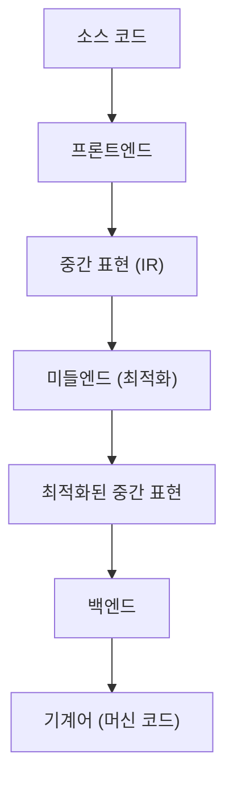
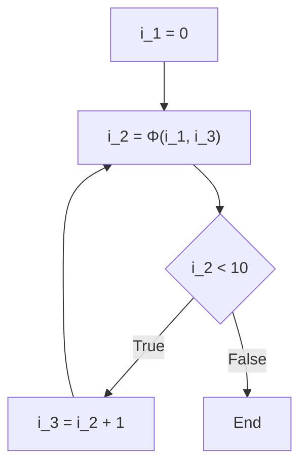

# 컴파일러 최적화 기술: SSA(정적 단일 할당)란?

소프트웨어 개발에 있어서, 우리는 매일 다양한 프로그래밍 언어를 사용하여 코드를 작성합니다. C++, Rust, Go, Java, 혹은 Swift 등, 이러한 언어들은 인간이 이해하기 쉬운 구문과 추상화를 제공하며, 복잡한 로직을 간결하게 표현할 수 있게 해줍니다. 하지만, 컴퓨터의 CPU(중앙 처리 장치)가 직접 이해할 수 있는 것은 "기계어(머신 코드)"라고 불리는 0과 1의 나열뿐입니다. 우리가 작성한 아름답고 인간이 읽기 쉬운 소스 코드가 어떻게 빠르고 효율적으로 실행되는 기계어로 변환되는 것일까요? 그 이면에는 "컴파일러"라는 매우 고도로 복잡한 소프트웨어의 존재가 있습니다.

이 글에서는 컴파일러가 이면에서 수행하는 "마개조"라고도 할 수 있는 최적화 기술 중에서도, 현대 컴파일러 기반(LLVM이나 GCC 등)에서 가장 중요하고 핵심적인 역할을 하는 "SSA(Static Single Assignment: 정적 단일 할당) 형식"에 대해 매우 깊고 상세하게 파헤쳐 설명합니다.

## 컴파일러의 기본 구조: 프론트엔드와 백엔드

SSA에 대해 다루기 전에, 먼저 컴파일러의 전체적인 아키텍처에 대해 복습해 둡시다. 현대 컴파일러는 단일의 거대한 프로그램이 아니라, 여러 독립적인 단계로 분할된 파이프라인 구조를 가지고 있습니다. 이 구조를 통해 다양한 프로그래밍 언어나 다양한 CPU 아키텍처에 대응하기 쉬워집니다.



### 프론트엔드 (Front-end)
프론트엔드의 주요 역할은 특정 프로그래밍 언어로 작성된 소스 코드를 분석하고, 프로그램의 의미를 유지한 채 컴파일러 내부에서 다루기 쉬운 범용적인 표현으로 변환하는 것입니다.
1. **어휘 분석 (Lexical Analysis)**: 소스 코드의 문자열을 읽어 들여 키워드, 식별자, 연산자 등의 "토큰 (Token)"의 열로 분할합니다.
2. **구문 분석 (Syntax Analysis)**: 토큰의 열이 언어의 문법 규칙을 따르고 있는지 확인하고, "추상 구문 트리 (AST: Abstract Syntax Tree)"라고 불리는 트리 구조의 데이터를 생성합니다.
3. **의미 분석 (Semantic Analysis)**: 타입 체크나 변수의 스코프 확인 등을 수행하여 프로그램의 의미가 올바른지 검증합니다.

이러한 과정을 거쳐 프론트엔드는 "중간 표현 (IR: Intermediate Representation)"이라고 불리는 특정 언어나 하드웨어에 종속되지 않는 코드를 생성합니다.

### 미들엔드 (Middle-end)와 최적화
프론트엔드가 출력한 IR을 받아들여 프로그램의 실행 속도를 향상시키거나 메모리 사용량을 줄이기 위한 다양한 "최적화"를 적용하는 것이 미들엔드의 역할입니다. 이 단계가 컴파일러의 성능을 결정짓는다고 해도 과언이 아닙니다. 그리고 **이 미들엔드에서의 최적화에 있어 절대적인 기반이 되는 것이 이번에 설명할 "SSA 형식"인 것입니다.**

### 백엔드 (Back-end)
백엔드는 최적화된 IR을 받아들여 타겟이 되는 특정 CPU 아키텍처(x86, ARM, RISC-V 등)를 위한 기계어를 생성합니다. 여기에서는 레지스터 할당, 명령어 스케줄링, 타겟 종속 피프홀(peephole) 최적화 등이 이루어집니다.

## 중간 표현 (IR)의 중요성

왜 컴파일러는 직접 기계어를 생성하지 않고 굳이 중간 표현(IR)을 거치는 것일까요? 그 가장 큰 이유는 "공통화"와 "최적화의 용이성"에 있습니다.

만약 IR이 존재하지 않는다면, M개의 언어와 N개의 아키텍처를 지원하기 위해 $M \times N$개의 컴파일러를 작성해야 합니다. 하지만 IR을 거침으로써 M개의 프론트엔드와 N개의 백엔드만 작성하면 되며($M + N$), 새로운 언어나 새로운 CPU에 대한 대응이 극적으로 쉬워집니다. LLVM이 이토록 널리 보급된 가장 큰 이유는 이 LLVM IR이라는 강력하고 범용적인 중간 표현이 존재하기 때문입니다.

## SSA (Static Single Assignment: 정적 단일 할당) 형식이란

드디어 본론인 SSA 형식에 대해 설명하겠습니다.
SSA란 컴파일러의 중간 표현에서 변수를 다루는 방법에 관한 제약, 혹은 그 형식을 말합니다. "Static Single Assignment"라는 이름 그대로, 가장 큰 규칙은 **"각 변수는 프로그램 텍스트 상에서 정적으로 한 번만 할당(정의)된다"**는 것입니다.

우리가 일반적인 프로그래밍 언어로 코드를 작성할 때, 같은 변수에 여러 번 값을 할당하는 것은 매우 당연한 일입니다.

```c
// C 언어의 예
int x = 10;
x = x + 5;
x = x * 2;
```

이 코드에서는 변수 `x`에 대해 3번의 할당이 이루어지고 있습니다. 하지만 컴파일러가 최적화를 수행할 때, 이처럼 같은 변수의 값이 여러 번 덮어씌워지는 상태는 분석을 매우 어렵게 만듭니다. "어떤 시점에 변수 `x`가 어떤 값을 가지고 있는지", "이 `x`는 어디서 계산된 값인지"를 추적(데이터 흐름 분석)하기 위해 컴파일러는 복잡한 상태를 관리해야만 합니다.

그래서 SSA 형식에서는 변수가 재할당될 때마다 거기에 "버전 번호"를 붙여 서로 다른 변수로 취급합니다. 위 코드를 SSA 형식으로 변환하면 다음과 같이 됩니다.

```text
// SSA 형식으로의 변환 이미지
x_1 = 10
x_2 = x_1 + 5
x_3 = x_2 * 2
```

이렇게 변환함으로써 모든 변수는 "한 번만 정의되며, 그 이후에는 값이 변하지 않는다"는 불변성(Immutability)을 획득합니다. 이를 통해 "변수가 어디서 정의되고, 어디서 사용되는가 (Def-Use 체인)"가 한눈에 분명해지며, 컴파일러의 데이터 흐름 분석이 극적으로 고속화 및 단순화되는 것입니다.

## 제어 흐름과 Φ(파이) 함수

직선적인 코드의 SSA 변환은 간단하지만, 프로그램에는 "조건 분기 (if문)"나 "루프 (for/while문)"와 같은 제어 흐름이 존재합니다. 이러한 제어 흐름이 얽히면 SSA 변환은 만만치 않게 됩니다.

```c
// 조건 분기가 포함된 C 코드
int x = 0;
if (condition) {
    x = 10;
} else {
    x = 20;
}
int y = x + 5;
```

이 코드를 그대로 단순하게 SSA의 버전 지정으로 변환해 보겠습니다.

```text
// 실패하는 SSA 변환의 예
x_1 = 0
if (condition) {
    x_2 = 10
} else {
    x_3 = 20
}
y_1 = ??? + 5  // x_2를 써야 할까? x_3을 써야 할까?
```

조건 분기의 합류점(Merge Point)에서 변수 `x`의 값은 if 블록을 거쳐왔다면 `x_2`, else 블록을 거쳐왔다면 `x_3`이 됩니다. 컴파일러는 정적인 분석 단계에서는 어느 경로를 따를지 알 수 없기 때문에, 합류점 이후에 `x`를 참조할 때 어떤 버전을 사용해야 할지 결정할 수 없습니다.

이 문제를 해결하기 위해 도입된 것이 **Φ(파이) 함수**라는 마법의 함수입니다.

Φ 함수는 제어 흐름의 합류점에 배치되어, "프로그램이 어느 경로에서 도달했는가"에 따라 적절한 변수의 버전을 선택하는 역할을 합니다. Φ 함수를 사용하여 앞서 본 코드를 올바른 SSA 형식으로 변환하면 다음과 같이 됩니다.

```text
// Φ 함수를 사용한 올바른 SSA 변환
x_1 = 0
if (condition) {
    x_2 = 10
} else {
    x_3 = 20
}
// 합류점
x_4 = Φ(x_2, x_3)
y_1 = x_4 + 5
```

여기서 `x_4 = Φ(x_2, x_3)`은 "만약 if 블록을 거쳐왔다면 `x_4`에 `x_2`의 값을 할당하고, else 블록을 거쳐왔다면 `x_4`에 `x_3`의 값을 할당한다"라는 의사적인 연산을 나타냅니다.
이를 통해 합류점 이후의 코드는 항상 고유한 버전(여기서는 `x_4`)을 참조할 수 있게 되며, "한 번만 할당된다"는 SSA의 엄격한 규칙을 지키면서도 모든 제어 흐름을 표현하는 것이 가능해집니다.

### 루프에서의 Φ 함수

루프(반복) 구조의 경우, 상황은 더욱 복잡해집니다. 왜냐하면 변수의 값은 루프의 "외부에서의 초기값"과 루프의 "이전 이터레이션(반복)에서의 갱신값"을 모두 받을 가능성이 있기 때문입니다.

```c
// 루프가 포함된 코드
int i = 0;
while (i < 10) {
    i = i + 1;
}
```

이것을 SSA로 변환하면 루프의 시작 부분(while의 조건 판정 부분)이 합류점이 됩니다.

```text
// 루프의 SSA 변환
i_1 = 0
LoopHeader:
    i_2 = Φ(i_1, i_3)  // i_1은 루프 외부에서, i_3은 루프 하단에서
    if (i_2 >= 10) goto End
    i_3 = i_2 + 1
    goto LoopHeader
End:
```

여기서는 루프의 진입점에 Φ 함수가 위치해 있습니다. 처음 진입할 때는 `i_1` (0)이 선택되고, 루프를 돌고 왔을 때는 `i_3`가 선택됨으로써, 동적으로 값이 변하는 루프 변수를 훌륭하게 정적인 SSA 표현으로 이끌어내고 있습니다.



## SSA가 가져온 강력한 최적화 기술

SSA 형식이 컴파일러에 도입되면서, 과거에는 복잡하고 계산 비용이 높았던 많은 최적화 알고리즘을 놀라울 정도로 간단하고 빠르게 실행할 수 있게 되었습니다. 여기서는 SSA를 전제로 한 대표적인 최적화 기법 몇 가지를 소개합니다.

### 1. 상수 전파 (Constant Propagation)와 상수 폴딩 (Constant Folding)

변수의 값이 실행 전에 정적으로 확정되어 있는 경우, 그 변수의 참조를 직접 상수로 대체하는 최적화입니다. SSA 형식에서는 변수의 정의가 단 한 번뿐이기 때문에, "어떤 변수가 상수인지 여부"를 판별하기가 매우 쉽습니다.

```text
// 최적화 전
a_1 = 10
b_1 = 20
c_1 = a_1 + b_1

// SSA에 의한 상수 전파
// a_1과 b_1은 항상 상수이므로, c_1의 계산에 직접 대입할 수 있다
c_1 = 10 + 20

// 나아가 상수 폴딩 적용
c_1 = 30
```
정의(Def)에서 사용(Use)으로 이어지는 링크를 따라가기만 하면, 코드 베이스 전체에 연쇄적으로 상수를 전파시키는 것이 가능합니다.

### 2. 데드 코드 제거 (Dead Code Elimination: DCE)

프로그램의 실행 결과에 전혀 영향을 주지 않는 불필요한 코드(죽은 코드)를 삭제하는 최적화입니다. SSA 형식에서는 "어떤 명령어에서도 사용되지 않는 변수(사용 횟수가 0인 변수)"를 정의하고 있는 명령어는 부작용(side effect)이 없는 한 무조건 삭제할 수 있습니다.

```text
x_1 = 10
y_1 = 20  // y_1은 그 이후 한 번도 사용되지 않는다
z_1 = x_1 + 5
return z_1
```
SSA라면 "y_1을 사용하고 있는 곳이 있는가?"를 조사하는 것은 순식간입니다 (Use 리스트가 비어있는지만 확인하면 됨). 사용되지 않는다면 `y_1 = 20`이라는 줄은 즉시 삭제됩니다.

### 3. 공통 부분식 제거 (Common Subexpression Elimination: CSE)와 값 번호 매기기 (Value Numbering)

같은 계산을 여러 번 수행하고 있는 곳을 찾아내어 첫 번째 계산 결과를 재사용함으로써 낭비되는 연산을 줄이는 최적화입니다. SSA 형식을 기반으로 한 "글로벌 값 번호 매기기 (Global Value Numbering: GVN)"라는 알고리즘을 사용함으로써 코드 전체에 걸친 복잡한 중복 계산을 찾아낼 수 있습니다.

```text
// 변환 전
x_1 = a_1 + b_1
y_1 = a_1 + b_1

// GVN에 의한 최적화 후
x_1 = a_1 + b_1
y_1 = x_1  // 같은 계산이므로 결과를 재사용
```

### 4. 복사 전파 (Copy Propagation)

`x = y`와 같은 단순한 값의 복사가 있는 경우, 그 이후의 `x` 사용을 모두 `y`로 대체하고 불필요한 복사 연산을 삭제합니다. SSA에서는 이 역시 Def-Use 체인을 따라가기만 하면 쉽게 대체 가능합니다.

## LLVM에서의 SSA 구현과 구체적인 예

현대를 대표하는 컴파일러 기반인 LLVM은 그 미들엔드 전체가 SSA 형식에 기반하여 구축되어 있습니다. LLVM IR(중간 표현) 자체가 강한 타입 지정과 엄격한 SSA 형식을 갖춘 어셈블리어와 같은 형태를 취하고 있습니다.

예를 들어, C 언어의 간단한 함수를 LLVM IR로 컴파일하여 실제 Φ 함수를 살펴보겠습니다.

**C 언어 코드:**
```c
int max(int a, int b) {
    if (a > b) {
        return a;
    } else {
        return b;
    }
}
```

**LLVM IR (의사 코드적 표현):**
```llvm
define i32 @max(i32 %a, i32 %b) {
entry:
  %cmp = icmp sgt i32 %a, %b
  br i1 %cmp, label %if.then, label %if.else

if.then:
  br label %return

if.else:
  br label %return

return:
  %retval.0 = phi i32 [ %a, %if.then ], [ %b, %if.else ]
  ret i32 %retval.0
}
```

위의 LLVM IR을 보면, `return` 블록에서 `phi` 명령어가 명확하게 사용되고 있음을 알 수 있습니다.
`%retval.0 = phi i32 [ %a, %if.then ], [ %b, %if.else ]`
이것은 "만약 `%if.then` 블록에서 넘어왔다면 `%a`를, `%if.else` 블록에서 넘어왔다면 `%b`를 `%retval.0`에 할당한다"는 것을 LLVM IR 레벨에서 직접 표현하고 있습니다.

LLVM은 이 SSA 형식의 IR에 대해 "Pass(패스)"라고 불리는 다수의 최적화 모듈을 차례차례 적용해 나갑니다. Mem2Reg (메모리 접근을 레지스터 상의 SSA 변수로 승격하는 패스), InstCombine (명령어 결합), GVN (글로벌 값 번호 매기기), ADCE (적극적 데드 코드 제거) 등, 수십에서 수백 개의 최적화 패스가 이 SSA라는 견고한 기반 위에서 협동하여 동작하며, 마침내 우리가 보게 되는 놀라운 실행 속도를 자랑하는 머신 코드를 만들어 내는 것입니다.

## SSA의 단점과 백엔드에서의 해체

이렇듯 만능으로 보이는 SSA 형식이지만, 한 가지 큰 문제가 있습니다. 그것은 **실제 하드웨어(CPU)는 SSA 형식으로 동작하지 않는다**는 것입니다.
실제 CPU의 레지스터(eax, rax 등)의 수는 유한하며, 같은 레지스터를 여러 번 재사용(재할당)하여 계산을 진행합니다. 또한 CPU에는 "Φ 함수"에 해당하는 마법의 명령어는 존재하지 않습니다.

따라서 컴파일러의 백엔드는 최적화가 모두 끝나고 기계어를 생성하기 직전에 "SSA 형식을 파괴(De-SSA)"해야만 합니다.

구체적으로는 Φ 함수를 제거하고 일반적인 복사 명령어(`MOV` 등)로 대체하는 작업을 수행합니다.
예를 들어 `x_4 = Φ(x_2, x_3)`라는 Φ 함수가 있을 경우, 이를 없애기 위해 if 블록의 마지막에 `x_4 = x_2`라는 복사 명령어를 삽입하고, else 블록의 마지막에 `x_4 = x_3`이라는 복사 명령어를 삽입합니다.

```text
// SSA를 파괴하고 복사 명령어로 변환
if (condition) {
    x_2 = 10
    x_4 = x_2  // Φ 함수를 대신하는 복사
} else {
    x_3 = 20
    x_4 = x_3  // Φ 함수를 대신하는 복사
}
y_1 = x_4 + 5
```

이후 "레지스터 할당 (Register Allocation)"이라는 복잡한 알고리즘(그래프 컬러링 알고리즘 등)을 사용하여, 무한하게 존재하는 가상적인 SSA 변수(`x_1`, `x_2`, `x_3` ...)를 제한된 개수(예를 들어 16개)의 물리 레지스터에 매핑해 나갑니다. 라이브 레인지(생존 구간, 변수가 사용되는 기간)가 겹치지 않는 변수는 같은 물리 레지스터를 공유하도록 할당되며, 최종적으로 실제 CPU가 실행할 수 있는 효율적인 머신 코드가 완성됩니다.

## 정리

이 글에서는 컴파일러 최적화의 심장부인 SSA(정적 단일 할당) 형식에 대해 설명했습니다.

*   **컴파일러의 파이프라인**: 프론트엔드, 미들엔드, 백엔드로 나뉘며 IR을 중심으로 연계된다.
*   **SSA의 기본 원칙**: 모든 변수는 프로그램 텍스트 상에서 1번만 정의된다.
*   **Φ(파이) 함수**: 제어 흐름의 합류점에서 경로에 따른 변수의 버전을 선택한다.
*   **최적화의 혜택**: 상수 폴딩, 데드 코드 제거, 공통 부분식 제거 등, 데이터 흐름 분석을 이용하는 최적화가 극적으로 쉽고 빨라진다.
*   **현실과의 연결 다리**: 최종적인 기계어 생성 단계에서는 SSA가 파괴되고 물리 레지스터로의 할당이 이루어진다.

우리가 평소에 무심코 작성하는 코드는 컴파일러라는 "마법의 상자" 안에서 한 번 SSA라는 아름다운 수학적, 그래프 이론적 표현으로 해체되고 철저하게 군더더기를 깎아낸 뒤, 다시 CPU를 위한 투박한 기계어로 재구축되고 있습니다.
이러한 이면의 원리를 이해하는 것은 더욱 성능을 의식한 코드를 작성하기 위한 힌트가 될 뿐만 아니라, 소프트웨어 엔지니어링의 깊이와 재미를 새삼 느끼게 해 줄 것입니다.
