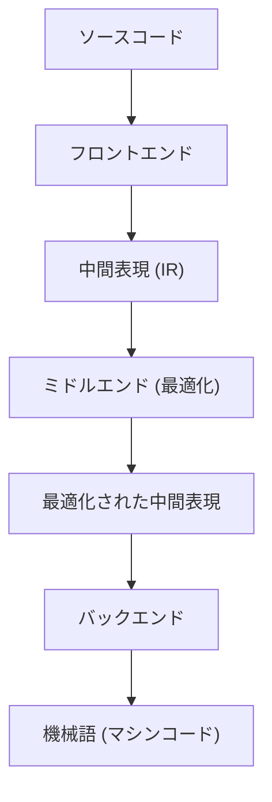
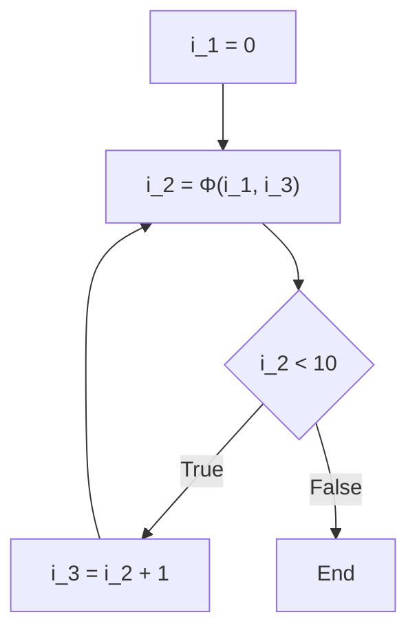

# コンパイラ最適化技術：SSA（静的単一代入）とは

ソフトウェア開発において、私たちは日々様々なプログラミング言語を用いてコードを記述しています。C++、Rust、Go、Java、あるいはSwiftなど、これらの言語は人間に理解しやすい構文や抽象化を提供し、複雑なロジックを簡潔に表現することを可能にします。しかし、コンピュータのCPU（中央演算処理装置）が直接理解できるのは「機械語（マシンコード）」と呼ばれる0と1の羅列だけです。私たちが書いた美しく、人間にとって読みやすいソースコードが、どのようにして高速かつ効率的に実行される機械語へと変換されるのでしょうか。その背後には、「コンパイラ」という極めて高度で複雑なソフトウェアの存在があります。

この記事では、コンパイラが裏側で行っている「魔改造」とも言える最適化技術の中でも、現代のコンパイラ基盤（LLVMやGCCなど）において最も重要かつ中心的な役割を果たしている「SSA（Static Single Assignment：静的単一代入）形式」について、非常に深く、詳細に掘り下げて解説します。

## コンパイラの基本構造：フロントエンドとバックエンド

SSAの話題に入る前に、まずはコンパイラの全体的なアーキテクチャについておさらいしておきましょう。現代のコンパイラは、単一の巨大なプログラムではなく、いくつかの独立したフェーズに分割されたパイプライン構造を持っています。この構造により、異なるプログラミング言語や異なるCPUアーキテクチャへの対応が容易になっています。



### フロントエンド（Front-end）
フロントエンドの主な役割は、特定のプログラミング言語で書かれたソースコードを解析し、プログラムの意味を維持したまま、コンパイラ内部で扱いやすい汎用的な表現に変換することです。
1. **字句解析（Lexical Analysis）**: ソースコードの文字列を読み込み、キーワード、識別子、演算子などの「トークン（Token）」の列に分割します。
2. **構文解析（Syntax Analysis）**: トークンの列が言語の文法規則に従っているかを確認し、「抽象構文木（AST：Abstract Syntax Tree）」と呼ばれる木構造のデータを作成します。
3. **意味解析（Semantic Analysis）**: 型チェックや変数のスコープの確認などを行い、プログラムの意味が正しいかを検証します。

これらの処理を経て、フロントエンドは「中間表現（IR：Intermediate Representation）」と呼ばれる、特定の言語やハードウェアに依存しないコードを生成します。

### ミドルエンド（Middle-end）と最適化
フロントエンドが出力したIRを受け取り、プログラムの実行速度を向上させたり、メモリ使用量を削減したりするための様々な「最適化」を施すのがミドルエンドの役割です。このフェーズがコンパイラの性能を決定づけると言っても過言ではありません。そして、**このミドルエンドでの最適化において、絶対的な基盤となるのが今回解説する「SSA形式」なのです。**

### バックエンド（Back-end）
バックエンドは、最適化されたIRを受け取り、ターゲットとなる特定のCPUアーキテクチャ（x86, ARM, RISC-Vなど）向けの機械語を生成します。ここでは、レジスタ割り付け、命令スケジューリング、ターゲット依存のピープホール最適化などが行われます。

## 中間表現（IR）の重要性

なぜコンパイラは直接機械語を生成せず、わざわざ中間表現（IR）を経由するのでしょうか。その最大の理由は「共通化」と「最適化のしやすさ」にあります。

もしIRが存在しない場合、M個の言語とN個のアーキテクチャに対応するためには、$M \times N$ 個のコンパイラを書く必要があります。しかしIRを介することで、M個のフロントエンドとN個のバックエンドを書くだけで済み（$M + N$）、新しい言語や新しいCPUへの対応が劇的に簡単になります。LLVMがこれほどまでに普及した最大の理由は、このLLVM IRという強力で汎用的な中間表現の存在にあります。

## SSA（Static Single Assignment：静的単一代入）形式とは

いよいよ本題のSSA形式について解説します。
SSAとは、コンパイラの中間表現における変数の扱い方に関する制約、あるいはその形式のことです。「Static Single Assignment」という名前の通り、最大のルールは**「各変数はプログラムテキスト上で静的に一度しか代入（定義）されない」**ということです。

私たちが通常のプログラミング言語でコードを書くとき、同じ変数に何度も値を代入するのはごく当たり前のことです。

```c
// C言語の例
int x = 10;
x = x + 5;
x = x * 2;
```

このコードでは、変数 `x` に対して3回の代入が行われています。しかし、コンパイラが最適化を行う際、このように同じ変数の値が何度も書き換わる状態は、非常に解析を困難にします。「ある時点で変数 `x` がどの値を持っているのか」「この `x` はどこで計算された値なのか」を追跡（データフロー解析）するために、コンパイラは複雑な状態を管理しなければなりません。

そこで、SSA形式では、変数が再代入されるたびに、それに「バージョン番号」を付けて別々の変数として扱います。上記のコードをSSA形式に変換すると、以下のようになります。

```text
// SSA形式への変換イメージ
x_1 = 10
x_2 = x_1 + 5
x_3 = x_2 * 2
```

このように変換することで、すべての変数は「一度だけ定義され、その後は値が変わらない」という不変性（Immutability）を獲得します。これにより、「変数がどこで定義され、どこで使用されているか（Def-Use連鎖）」が一目瞭然となり、コンパイラのデータフロー解析が劇的に高速化・簡略化されるのです。

## 制御フローとΦ（ファイ）関数

直線的なコードのSSA変換は簡単ですが、プログラムには「条件分岐（if文）」や「ループ（for/while文）」といった制御フローが存在します。これらの制御フローが絡むと、SSAの変換は一筋縄ではいきません。

```c
// 条件分岐を含むCコード
int x = 0;
if (condition) {
    x = 10;
} else {
    x = 20;
}
int y = x + 5;
```

このコードをそのまま単純にSSAのバージョン付けで変換してみましょう。

```text
// 失敗するSSA変換の例
x_1 = 0
if (condition) {
    x_2 = 10
} else {
    x_3 = 20
}
y_1 = ??? + 5  // x_2を使うべきか？ x_3を使うべきか？
```

条件分岐の合流点（マージポイント）において、変数 `x` の値は、ifブロックを通ってきたなら `x_2`、elseブロックを通ってきたなら `x_3` になります。コンパイラは静的な解析段階ではどちらのパスをたどるか分からないため、合流点以降で `x` を参照する際、どちらのバージョンを使えばいいのか決定できません。

この問題を解決するために導入されたのが、**Φ（ファイ）関数**という魔法の関数です。

Φ関数は、制御フローの合流点に配置され、「プログラムがどの経路から到達したか」に応じて、適切な変数のバージョンを選択する役割を持ちます。Φ関数を使って先ほどのコードを正しいSSA形式に変換すると、以下のようになります。

```text
// Φ関数を使った正しいSSA変換
x_1 = 0
if (condition) {
    x_2 = 10
} else {
    x_3 = 20
}
// 合流点
x_4 = Φ(x_2, x_3)
y_1 = x_4 + 5
```

ここで `x_4 = Φ(x_2, x_3)` は、「もしifブロックを通ってきたなら `x_4` に `x_2` の値を代入し、もしelseブロックを通ってきたなら `x_4` に `x_3` の値を代入する」という擬似的な演算を表します。
これにより、合流点以降のコードは常に一意のバージョン（ここでは `x_4`）を参照できるようになり、「一度しか代入されない」というSSAの厳格なルールを守りつつ、あらゆる制御フローを表現することが可能になります。

### ループにおけるΦ関数

ループ（繰り返し）構造の場合、状況はさらに複雑になります。なぜなら、変数の値はループの「外側からの初期値」と、ループの「前回のイテレーションからの更新値」の両方を受け取る可能性があるからです。

```c
// ループを含むコード
int i = 0;
while (i < 10) {
    i = i + 1;
}
```

これをSSAに変換すると、ループの先頭（whileの条件判定部分）が合流点となります。

```text
// ループのSSA変換
i_1 = 0
LoopHeader:
    i_2 = Φ(i_1, i_3)  // i_1はループ外から、i_3はループ下部から
    if (i_2 >= 10) goto End
    i_3 = i_2 + 1
    goto LoopHeader
End:
```

ここでは、ループの入り口にΦ関数が置かれています。最初の突入時は `i_1` (0) が選ばれ、ループを回ってきた時は `i_3` が選ばれることで、動的に値が変化するループ変数を見事に静的なSSA表現へと落とし込んでいます。



## SSAがもたらす強力な最適化技術

SSA形式がコンパイラに導入されたことで、かつては複雑で計算コストが高かった多くの最適化アルゴリズムが、驚くほどシンプルに、そして高速に実行できるようになりました。ここでは、SSAを前提とした代表的な最適化をいくつか紹介します。

### 1. 定数伝播（Constant Propagation）と定数畳み込み（Constant Folding）

変数の値が実行前に静的に確定している場合、その変数の参照を直接定数に置き換える最適化です。SSA形式では変数の定義が一度きりであるため、「ある変数が定数かどうか」の判定が極めて容易です。

```text
// 最適化前
a_1 = 10
b_1 = 20
c_1 = a_1 + b_1

// SSAによる定数伝播
// a_1とb_1は常に定数なので、c_1の計算に直接代入できる
c_1 = 10 + 20

// さらに定数畳み込み
c_1 = 30
```
定義から使用（Def-Use）へのリンクをたどるだけで、コードベース全体へ連鎖的に定数を伝播させることが可能です。

### 2. デッドコード削除（Dead Code Elimination : DCE）

プログラムの実行結果に全く影響を与えない、不要なコード（死んだコード）を削除する最適化です。SSA形式においては、「どの命令からも使用されていない変数（使用箇所が0の変数）」を定義している命令は、副作用がない限り無条件で削除できます。

```text
x_1 = 10
y_1 = 20  // y_1はその後一度も使われない
z_1 = x_1 + 5
return z_1
```
SSAであれば、「y_1を使用している場所があるか？」を調べるのは一瞬です（Useリストが空かどうか確認するだけ）。使われていなければ、`y_1 = 20` の行は即座に削除されます。

### 3. 共通部分式削除（Common Subexpression Elimination : CSE）と値番号付け（Value Numbering）

同じ計算を複数回行っている箇所を見つけ出し、最初の計算結果を再利用することで無駄な演算を省く最適化です。SSA形式を基盤とした「グローバル値番号付け（Global Value Numbering : GVN）」というアルゴリズムを使うことで、コード全体にまたがる複雑な冗長計算を検出できます。

```text
// 変換前
x_1 = a_1 + b_1
y_1 = a_1 + b_1

// GVNによる最適化後
x_1 = a_1 + b_1
y_1 = x_1  // 同じ計算なので結果を再利用
```

### 4. コピー伝播（Copy Propagation）

`x = y` のような単なる値のコピーがある場合、以降の `x` の使用をすべて `y` に置き換え、無駄なコピー操作を削除します。SSAでは、これもDef-Use連鎖をたどるだけで簡単に置換可能です。

## LLVMにおけるSSAの実装と具体例

現代を代表するコンパイラ基盤であるLLVMは、そのミドルエンド全体がSSA形式に基づいて構築されています。LLVM IR（中間表現）自体が、強い型付けと厳格なSSA形式を持つアセンブリ言語のような形をしています。

例えば、C言語の簡単な関数をLLVM IRにコンパイルして、実際のΦ関数を見てみましょう。

**C言語コード:**
```c
int max(int a, int b) {
    if (a > b) {
        return a;
    } else {
        return b;
    }
}
```

**LLVM IR (擬似コード的表現):**
```llvm
define i32 @max(i32 %a, i32 %b) {
entry:
  %cmp = icmp sgt i32 %a, %b
  br i1 %cmp, label %if.then, label %if.else

if.then:
  br label %return

if.else:
  br label %return

return:
  %retval.0 = phi i32 [ %a, %if.then ], [ %b, %if.else ]
  ret i32 %retval.0
}
```

上記のLLVM IRを見ると、`return` ブロックにおいて `phi` 命令が明確に使われていることが分かります。
`%retval.0 = phi i32 [ %a, %if.then ], [ %b, %if.else ]`
これは、「もし `%if.then` ブロックから遷移してきた場合は `%a` を、`%if.else` ブロックから遷移してきた場合は `%b` を `%retval.0` に代入する」ということをLLVM IRのレベルで直接表現しています。

LLVMは、このSSA形式のIRに対して、「Pass（パス）」と呼ばれる多数の最適化モジュールを次々と適用していきます。Mem2Reg（メモリアクセスをレジスタ上のSSA変数に昇格するパス）、InstCombine（命令結合）、GVN（グローバル値番号付け）、ADCE（アグレッシブデッドコード削除）など、数十から数百の最適化パスが、このSSAという強固な基盤の上で協調して動作し、最終的に私たちが目にする驚異的な実行速度を誇るマシンコードを生み出しているのです。

## SSAのデメリットとバックエンドでの脱構築

このように万能に見えるSSA形式ですが、一つ大きな問題があります。それは、**実際のハードウェア（CPU）はSSA形式で動いていない**ということです。
実際のCPUのレジスタ（eax, raxなど）の数は有限であり、何度も同じレジスタを再利用（再代入）して計算を進めます。また、CPUには「Φ関数」に相当する魔法の命令は存在しません。

したがって、コンパイラのバックエンドは、最適化がすべて終わって機械語を生成する直前に、「SSA形式を破壊（De-SSA）」しなければなりません。

具体的には、Φ関数を取り除き、通常のコピー命令（`MOV`など）に置き換える作業を行います。
例えば `x_4 = Φ(x_2, x_3)` というΦ関数がある場合、これを消去するために、ifブロックの末尾に `x_4 = x_2` というコピー命令を挿入し、elseブロックの末尾に `x_4 = x_3` というコピー命令を挿入します。

```text
// SSAを破壊してコピー命令に変換
if (condition) {
    x_2 = 10
    x_4 = x_2  // Φ関数の代わりのコピー
} else {
    x_3 = 20
    x_4 = x_3  // Φ関数の代わりのコピー
}
y_1 = x_4 + 5
```

その後、「レジスタ割り付け（Register Allocation）」という複雑なアルゴリズム（グラフ彩色アルゴリズムなど）を用いて、無限にある仮想的なSSA変数（`x_1`, `x_2`, `x_3` ...）を、限られた数（例えば16個）の物理レジスタにマッピングしていきます。生存区間（変数が使われる期間）が重ならない変数は、同じ物理レジスタを共有するように割り当てられ、最終的に実際のCPUが実行できる効率的なマシンコードが完成します。

## まとめ

本記事では、コンパイラ最適化の心臓部であるSSA（静的単一代入）形式について解説しました。

*   **コンパイラのパイプライン**: フロントエンド、ミドルエンド、バックエンドに分かれ、IRを中心に連携する。
*   **SSAの基本原則**: 全ての変数はプログラムテキスト上で1度しか定義されない。
*   **Φ（ファイ）関数**: 制御フローの合流点で、経路に応じた変数のバージョンを選択する。
*   **最適化の恩恵**: 定数畳み込み、デッドコード削除、共通部分式削除など、データフロー解析を利用する最適化が劇的に簡単・高速になる。
*   **現実との橋渡し**: 最終的な機械語生成フェーズでは、SSAは破壊され、物理レジスタへの割り付けが行われる。

私たちが普段何気なく書いているコードは、コンパイラという「魔法の箱」の中で、一度SSAという美しい数学的・グラフ理論的な表現へと解体され、徹底的に無駄を削ぎ落とされた後、再びCPUのための無骨な機械語へと再構築されています。
このような裏側の仕組みを理解することは、よりパフォーマンスを意識したコードを書くためのヒントになるだけでなく、ソフトウェアエンジニアリングの奥深さと面白さを改めて感じさせてくれることでしょう。
