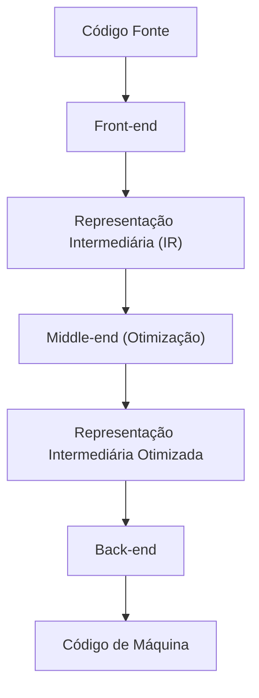
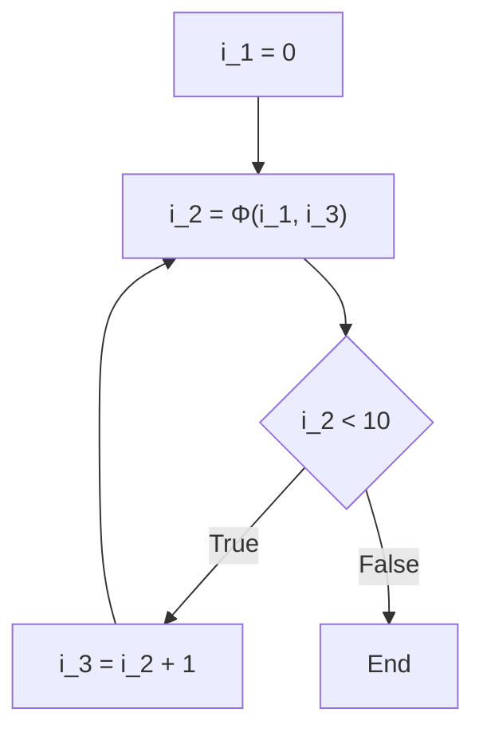

# Tecnologia de Otimização de Compiladores: O que é SSA (Atribuição Única Estática)

No desenvolvimento de software, usamos diariamente várias linguagens de programação para escrever código. Linguagens como C++, Rust, Go, Java ou Swift nos fornecem sintaxe e abstrações que são fáceis de entender para os humanos, permitindo que a lógica complexa seja expressa de forma concisa. No entanto, o que a CPU (Unidade Central de Processamento) do computador consegue entender diretamente é apenas uma sequência de 0s e 1s chamada "código de máquina" (ou linguagem de máquina). Como o código-fonte bonito e legível que escrevemos é convertido em um código de máquina que é executado de forma rápida e eficiente? Por trás disso, existe um software extremamente avançado e complexo chamado "compilador".

Neste artigo, aprofundaremos e explicaremos detalhadamente a forma "SSA (Static Single Assignment: Atribuição Única Estática)", que desempenha o papel mais importante e central na infraestrutura de compiladores modernos (como LLVM e GCC) entre as tecnologias de otimização, que podem ser chamadas de "transformações mágicas" que o compilador realiza nos bastidores.

## Estrutura Básica de um Compilador: Front-end e Back-end

Antes de entrar no tópico de SSA, vamos revisar a arquitetura geral de um compilador. Os compiladores modernos não são um único programa gigantesco, mas têm uma estrutura de pipeline dividida em várias fases independentes. Essa estrutura facilita o suporte a diferentes linguagens de programação e diferentes arquiteturas de CPU.



### Front-end
O principal papel do front-end é analisar o código-fonte escrito em uma linguagem de programação específica e convertê-lo em uma representação de uso geral que seja fácil de manusear dentro do compilador, mantendo o significado do programa.
1. **Análise Léxica (Lexical Analysis)**: Lê a string de caracteres do código-fonte e a divide em uma sequência de "tokens", como palavras-chave, identificadores e operadores.
2. **Análise Sintática (Syntax Analysis)**: Verifica se a sequência de tokens segue as regras gramaticais da linguagem e cria uma estrutura de dados em forma de árvore chamada "Árvore Sintática Abstrata (AST: Abstract Syntax Tree)".
3. **Análise Semântica (Semantic Analysis)**: Verifica se o significado do programa está correto, realizando verificação de tipos e confirmando o escopo de variáveis, etc.

Através desses processos, o front-end gera um código chamado "Representação Intermediária (IR: Intermediate Representation)", que é independente de linguagem ou hardware específico.

### Middle-end e Otimização
O papel do middle-end é receber o IR emitido pelo front-end e aplicar várias "otimizações" para melhorar a velocidade de execução do programa e reduzir o uso de memória. Não é exagero dizer que esta fase determina o desempenho do compilador. E, **nesta otimização no middle-end, a base absoluta é a forma "SSA" que explicaremos desta vez.**

### Back-end
O back-end recebe o IR otimizado e gera código de máquina para a arquitetura de CPU específica de destino (x86, ARM, RISC-V, etc.). Aqui são realizadas a alocação de registradores, o escalonamento de instruções e otimizações peephole dependentes do alvo.

## A Importância da Representação Intermediária (IR)

Por que o compilador não gera código de máquina diretamente, mas passa pelo trabalho de usar uma Representação Intermediária (IR)? As maiores razões para isso são a "padronização" e a "facilidade de otimização".

Se o IR não existisse, para suportar M linguagens e N arquiteturas, seria necessário escrever $M \times N$ compiladores. No entanto, por meio do IR, você só precisa escrever M front-ends e N back-ends ($M + N$), o que torna dramaticamente mais fácil suportar novas linguagens ou novas CPUs. A principal razão pela qual o LLVM se tornou tão difundido é a existência dessa representação intermediária poderosa e versátil, o LLVM IR.

## O que é a forma SSA (Static Single Assignment: Atribuição Única Estática)

Agora explicaremos o tópico principal, a forma SSA.
SSA é uma restrição ou formato relacionado ao tratamento de variáveis na representação intermediária do compilador. Como o nome "Static Single Assignment" sugere, a regra mais importante é que **"cada variável é atribuída (definida) estaticamente apenas uma vez no texto do programa"**.

Quando escrevemos código em uma linguagem de programação normal, é muito comum atribuir valores repetidamente à mesma variável.

```c
// Exemplo em linguagem C
int x = 10;
x = x + 5;
x = x * 2;
```

Neste código, a variável `x` recebe atribuições 3 vezes. No entanto, quando o compilador realiza otimizações, esse estado em que o valor da mesma variável é reescrito várias vezes torna a análise extremamente difícil. O compilador deve gerenciar um estado complexo para rastrear (análise de fluxo de dados) "que valor a variável `x` tem em um determinado ponto" ou "onde o valor desse `x` foi calculado".

Portanto, na forma SSA, cada vez que uma variável é reatribuída, ela recebe um "número de versão" e é tratada como uma variável separada. A conversão do código acima para a forma SSA seria semelhante a isto:

```text
// Imagem da conversão para a forma SSA
x_1 = 10
x_2 = x_1 + 5
x_3 = x_2 * 2
```

Ao converter dessa forma, todas as variáveis adquirem imutabilidade (Immutability), ou seja, "são definidas apenas uma vez e seus valores não mudam depois disso". Com isso, fica claro à primeira vista "onde uma variável é definida e onde é usada (Corrente Def-Use)", o que torna a análise de fluxo de dados do compilador drasticamente mais rápida e simplificada.

## Fluxo de Controle e a Função Φ (Phi)

A conversão SSA para código linear é fácil, mas os programas contêm fluxos de controle como "ramificações condicionais (instruções if)" e "loops (instruções for/while)". Quando esses fluxos de controle estão envolvidos, a conversão SSA não é tão simples.

```c
// Código C contendo ramificação condicional
int x = 0;
if (condition) {
    x = 10;
} else {
    x = 20;
}
int y = x + 5;
```

Vamos tentar converter esse código simplesmente usando versionamento SSA.

```text
// Exemplo de conversão SSA que falha
x_1 = 0
if (condition) {
    x_2 = 10
} else {
    x_3 = 20
}
y_1 = ??? + 5  // Deve usar x_2? Ou deve usar x_3?
```

No ponto de junção (merge point) da ramificação condicional, o valor da variável `x` será `x_2` se tiver passado pelo bloco if, e será `x_3` se tiver passado pelo bloco else. Como o compilador não sabe qual caminho será seguido durante a fase de análise estática, ele não pode decidir qual versão usar ao referenciar `x` após o ponto de junção.

Para resolver este problema, foi introduzida uma função mágica chamada **função Φ (Phi)**.

A função Φ é colocada nos pontos de junção do fluxo de controle e tem a função de selecionar a versão apropriada da variável dependendo de "por qual caminho o programa chegou". A conversão do código anterior para a forma SSA correta usando a função Φ fica assim:

```text
// Conversão SSA correta usando a função Φ
x_1 = 0
if (condition) {
    x_2 = 10
} else {
    x_3 = 20
}
// Ponto de junção
x_4 = Φ(x_2, x_3)
y_1 = x_4 + 5
```

Aqui, `x_4 = Φ(x_2, x_3)` representa uma pseudo-operação que diz: "se você veio pelo bloco if, atribua o valor de `x_2` a `x_4`; se você veio pelo bloco else, atribua o valor de `x_3` a `x_4`".
Como resultado, o código após o ponto de junção sempre pode referenciar uma versão única (aqui `x_4`), tornando possível expressar qualquer fluxo de controle enquanto se adere à regra estrita do SSA de que variáveis são "atribuídas apenas uma vez".

### Função Φ em Loops

No caso de estruturas de repetição (loops), a situação se torna ainda mais complexa. Isso porque o valor de uma variável pode receber tanto um "valor inicial de fora do loop" quanto um "valor atualizado da iteração anterior do loop".

```c
// Código contendo um loop
int i = 0;
while (i < 10) {
    i = i + 1;
}
```

Quando isso é convertido para SSA, o topo do loop (a parte da avaliação da condição do while) se torna um ponto de junção.

```text
// Conversão de um loop para SSA
i_1 = 0
LoopHeader:
    i_2 = Φ(i_1, i_3)  // i_1 vem de fora do loop, i_3 vem da parte inferior do loop
    if (i_2 >= 10) goto End
    i_3 = i_2 + 1
    goto LoopHeader
End:
```

Aqui, uma função Φ é colocada na entrada do loop. Na primeira entrada, `i_1` (0) é selecionado e, ao iterar no loop, `i_3` é selecionado, reduzindo perfeitamente a variável de loop dinamicamente mutável a uma representação SSA estática.



## Poderosas Tecnologias de Otimização Trazidas pelo SSA

A introdução da forma SSA nos compiladores permitiu que muitos algoritmos de otimização, antes complexos e caros computacionalmente, fossem executados de forma surpreendentemente simples e rápida. Aqui estão algumas otimizações representativas baseadas em SSA.

### 1. Propagação de Constantes (Constant Propagation) e Dobramento de Constantes (Constant Folding)

Esta é uma otimização que substitui diretamente a referência de uma variável por uma constante, se o valor da variável for conhecido estaticamente antes da execução. Na forma SSA, a definição de uma variável ocorre apenas uma vez, o que torna extremamente fácil determinar se "uma determinada variável é uma constante".

```text
// Antes da otimização
a_1 = 10
b_1 = 20
c_1 = a_1 + b_1

// Propagação de constantes com SSA
// Como a_1 e b_1 são sempre constantes, podem ser substituídas diretamente no cálculo de c_1
c_1 = 10 + 20

// Em seguida, o dobramento de constantes
c_1 = 30
```
Basta seguir os links da definição para o uso (Def-Use) e é possível propagar constantes em cadeia por toda a base de código.

### 2. Eliminação de Código Morto (Dead Code Elimination : DCE)

Esta otimização remove código desnecessário (código morto) que não afeta em nada o resultado da execução do programa. Na forma SSA, uma instrução que define uma "variável que não é usada por nenhuma instrução (variável com zero pontos de uso)" pode ser removida incondicionalmente, desde que não tenha efeitos colaterais.

```text
x_1 = 10
y_1 = 20  // y_1 nunca é usado posteriormente
z_1 = x_1 + 5
return z_1
```
Com o SSA, leva apenas um instante para descobrir se "há algum lugar usando `y_1`?" (basta verificar se a lista de usos está vazia). Se não estiver sendo usado, a linha `y_1 = 20` é removida imediatamente.

### 3. Eliminação de Subexpressões Comuns (Common Subexpression Elimination : CSE) e Numeração de Valores (Value Numbering)

Esta é uma otimização que encontra locais onde o mesmo cálculo é realizado várias vezes e elimina o cálculo redundante reutilizando o resultado do primeiro cálculo. Usando um algoritmo chamado "Numeração Global de Valores (Global Value Numbering : GVN)" baseado na forma SSA, cálculos redundantes e complexos que abrangem todo o código podem ser detectados.

```text
// Antes da conversão
x_1 = a_1 + b_1
y_1 = a_1 + b_1

// Após otimização com GVN
x_1 = a_1 + b_1
y_1 = x_1  // O mesmo cálculo, então o resultado é reutilizado
```

### 4. Propagação de Cópias (Copy Propagation)

Se houver uma simples cópia de valor como `x = y`, todos os usos subsequentes de `x` são substituídos por `y`, e a operação de cópia inútil é removida. No SSA, isso também pode ser facilmente substituído apenas seguindo as correntes Def-Use.

## Implementação do SSA e Exemplos Concretos no LLVM

No LLVM, a infraestrutura de compiladores representativa da era moderna, todo o seu middle-end é construído com base na forma SSA. O próprio LLVM IR (Representação Intermediária) assume a forma de uma linguagem de montagem fortemente tipada com uma forma SSA rigorosa.

Por exemplo, vamos compilar uma função simples em C para LLVM IR e observar a função Φ real.

**Código C:**
```c
int max(int a, int b) {
    if (a > b) {
        return a;
    } else {
        return b;
    }
}
```

**LLVM IR (Representação semelhante a pseudocódigo):**
```llvm
define i32 @max(i32 %a, i32 %b) {
entry:
  %cmp = icmp sgt i32 %a, %b
  br i1 %cmp, label %if.then, label %if.else

if.then:
  br label %return

if.else:
  br label %return

return:
  %retval.0 = phi i32 [ %a, %if.then ], [ %b, %if.else ]
  ret i32 %retval.0
}
```

Ao olhar para o LLVM IR acima, podemos ver claramente que a instrução `phi` é usada no bloco `return`.
`%retval.0 = phi i32 [ %a, %if.then ], [ %b, %if.else ]`
Isso expressa diretamente no nível do LLVM IR que: "se a transição veio do bloco `%if.then`, atribua `%a` a `%retval.0`; se a transição veio do bloco `%if.else`, atribua `%b` a `%retval.0`".

O LLVM aplica sucessivamente a este IR em forma SSA uma infinidade de módulos de otimização chamados "Passes". Dezenas a centenas de passes de otimização, como Mem2Reg (passe que promove acesso à memória a variáveis SSA em registradores), InstCombine (combinação de instruções), GVN (numeração global de valores) e ADCE (eliminação agressiva de código morto), funcionam cooperativamente nessa base sólida do SSA e acabam por produzir código de máquina que se orgulha da impressionante velocidade de execução que vemos.

## Desvantagens do SSA e Desconstrução no Back-end

A forma SSA parece onipotente, mas tem um grande problema: **o hardware (CPU) real não opera na forma SSA**.
O número de registradores reais da CPU (eax, rax, etc.) é finito, e os cálculos prosseguem reutilizando (reatribuindo) o mesmo registrador repetidas vezes. Além disso, a CPU não possui instruções mágicas equivalentes à "função Φ".

Portanto, o back-end do compilador deve "destruir a forma SSA (De-SSA)" logo antes de gerar o código de máquina, após todas as otimizações estarem concluídas.

Especificamente, isso é feito removendo as funções Φ e substituindo-as por instruções normais de cópia (como `MOV`).
Por exemplo, se houver uma função Φ como `x_4 = Φ(x_2, x_3)`, para eliminá-la, uma instrução de cópia `x_4 = x_2` é inserida no final do bloco if, e uma instrução de cópia `x_4 = x_3` é inserida no final do bloco else.

```text
// SSA destruído e convertido em instruções de cópia
if (condition) {
    x_2 = 10
    x_4 = x_2  // Cópia em vez da função Φ
} else {
    x_3 = 20
    x_4 = x_3  // Cópia em vez da função Φ
}
y_1 = x_4 + 5
```

Posteriormente, um algoritmo complexo chamado "Alocação de Registradores (Register Allocation)" (como algoritmos de coloração de grafos) é usado para mapear as infinitas variáveis SSA virtuais (`x_1`, `x_2`, `x_3` ...) em um número limitado de registradores físicos (por exemplo, 16). Variáveis cujos intervalos de vida (o período durante o qual a variável é usada) não se sobrepõem recebem os mesmos registradores físicos, e finalmente um código de máquina eficiente que pode ser executado pela CPU real é concluído.

## Conclusão

Neste artigo, explicamos a forma SSA (Atribuição Única Estática), que é o coração da otimização de compiladores.

*   **Pipeline do Compilador**: Dividido em front-end, middle-end e back-end, trabalhando juntos centrados no IR.
*   **Princípio Básico do SSA**: Todas as variáveis são definidas apenas uma vez no texto do programa.
*   **Função Φ (Phi)**: Nos pontos de junção do fluxo de controle, ela seleciona a versão da variável dependendo do caminho.
*   **Benefícios da Otimização**: Otimizações que usam a análise de fluxo de dados, como dobramento de constantes, eliminação de código morto e eliminação de subexpressões comuns, tornam-se dramaticamente mais fáceis e rápidas.
*   **Ponte para a Realidade**: Na fase final de geração de código de máquina, o SSA é destruído e a alocação em registradores físicos é realizada.

O código que normalmente escrevemos de forma casual é, dentro da "caixa mágica" chamada compilador, desmontado uma vez em uma bela representação baseada na matemática e na teoria dos grafos chamada SSA. Depois de eliminar completamente o desperdício, é reconstruído em código de máquina robusto para a CPU.
Compreender essas engrenagens nos bastidores não fornecerá apenas dicas para escrever códigos mais conscientes sobre desempenho, mas também fará com que você sinta novamente a profundidade e a fascinação da engenharia de software.
