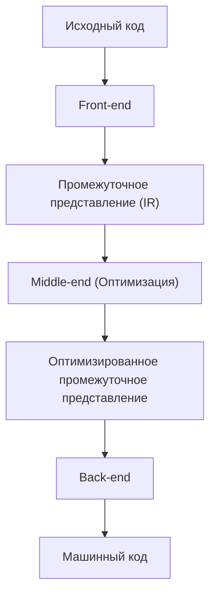
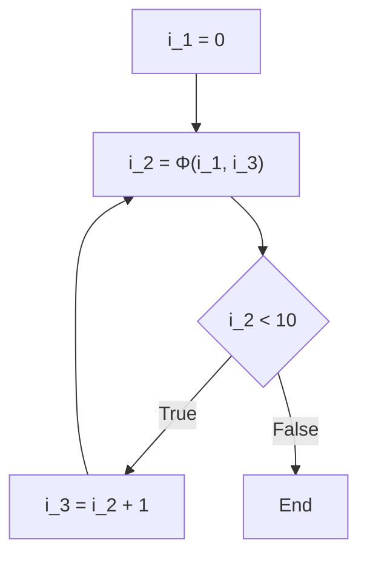

# Технологии оптимизации компилятора: Что такое SSA (Static Single Assignment)

В разработке программного обеспечения мы ежедневно пишем код, используя различные языки программирования. Такие языки, как C++, Rust, Go, Java или Swift, предоставляют синтаксис и абстракции, понятные человеку, позволяя лаконично выражать сложную логику. Однако процессор компьютера (CPU) напрямую понимает только последовательность нулей и единиц, называемую «машинным кодом». Как же красивый, легко читаемый исходный код, который мы пишем, превращается в машинный код, выполняющийся быстро и эффективно? За этим стоит исключительно сложное и высокотехнологичное программное обеспечение, называемое «компилятором».

В этой статье мы глубоко и подробно рассмотрим форму «SSA (Static Single Assignment: статическое единственное присваивание)», которая играет самую важную и центральную роль в современных инфраструктурах компиляторов (таких как LLVM и GCC), среди всех технологий оптимизации, которые компилятор выполняет «за кулисами», и которые можно назвать «магическим преобразованием».

## Базовая структура компилятора: Front-end и Back-end

Прежде чем перейти к SSA, давайте сначала вспомним общую архитектуру компилятора. Современные компиляторы представляют собой не единую гигантскую программу, а имеют конвейерную (pipeline) структуру, разделенную на несколько независимых фаз. Эта структура облегчает поддержку различных языков программирования и различных архитектур процессоров.



### Front-end (Фронтенд)
Основная роль фронтенда заключается в анализе исходного кода, написанного на определенном языке программирования, и его преобразовании в универсальное представление, с которым легко работать внутри компилятора, при этом сохраняя смысл программы.
1. **Лексический анализ (Lexical Analysis)**: Считывает строку исходного кода и разбивает ее на последовательность «токенов (Token)», таких как ключевые слова, идентификаторы и операторы.
2. **Синтаксический анализ (Syntax Analysis)**: Проверяет, соответствует ли последовательность токенов грамматическим правилам языка, и создает древовидную структуру данных, называемую «абстрактным синтаксическим деревом (AST: Abstract Syntax Tree)».
3. **Семантический анализ (Semantic Analysis)**: Выполняет проверку типов, проверку области видимости переменных и т.д., чтобы убедиться, что смысл программы корректен.

Пройдя через эти процессы, фронтенд генерирует код, не зависящий от конкретного языка или оборудования, который называется «промежуточным представлением (IR: Intermediate Representation)».

### Middle-end (Миддленд) и оптимизация
Роль миддленда заключается в получении IR, выданного фронтендом, и применении различных «оптимизаций» для повышения скорости выполнения программы или сокращения использования памяти. Не будет преувеличением сказать, что эта фаза определяет производительность компилятора. И **в этой оптимизации в миддленде абсолютной основой является форма «SSA», которую мы будем обсуждать в этот раз.**

### Back-end (Бэкенд)
Бэкенд получает оптимизированное IR и генерирует машинный код для целевой архитектуры процессора (x86, ARM, RISC-V и т.д.). Здесь происходит распределение регистров, планирование инструкций, оптимизация "замочной скважины" (peephole optimization), зависящая от целевой платформы, и т.д.

## Важность промежуточного представления (IR)

Почему компиляторы не генерируют машинный код напрямую, а намеренно проходят через промежуточное представление (IR)? Самая главная причина кроется в «унификации» и «простоте оптимизации».

Если бы IR не существовало, для поддержки M языков и N архитектур потребовалось бы написать $M \times N$ компиляторов. Однако благодаря использованию IR достаточно написать M фронтендов и N бэкендов ($M + N$), что кардинально упрощает поддержку новых языков и новых процессоров. Основная причина, по которой LLVM стал таким популярным, заключается в существовании этого мощного и универсального промежуточного представления, называемого LLVM IR.

## Что такое форма SSA (Static Single Assignment: статическое единственное присваивание)

Наконец, мы переходим к главной теме: форме SSA.
SSA — это ограничение на то, как обрабатываются переменные в промежуточном представлении компилятора, или форма этого представления. Как следует из названия «Static Single Assignment», главным правилом является то, что **«каждой переменной статически присваивается значение (определяется) только один раз в тексте программы»**.

Когда мы пишем код на обычном языке программирования, многократное присваивание значений одной и той же переменной является совершенно нормальным явлением.

```c
// Пример на языке C
int x = 10;
x = x + 5;
x = x * 2;
```

В этом коде переменной `x` значение присваивается 3 раза. Однако, когда компилятор выполняет оптимизацию, такое состояние, при котором значение одной и той же переменной многократно перезаписывается, сильно затрудняет анализ. Чтобы отследить, «какое значение имеет переменная `x` в определенный момент времени» и «где было вычислено это значение `x`» (анализ потока данных), компилятору приходится управлять сложным состоянием.

Поэтому в форме SSA каждый раз, когда переменной присваивается новое значение, ей присваивается «номер версии», и она обрабатывается как отдельная переменная. Если преобразовать приведенный выше код в форму SSA, получится следующее:

```text
// Имитация преобразования в форму SSA
x_1 = 10
x_2 = x_1 + 5
x_3 = x_2 * 2
```

Благодаря такому преобразованию все переменные приобретают свойство неизменяемости (Immutability): «они определяются только один раз, и после этого их значение не меняется». Благодаря этому становится сразу видно, «где переменная определяется и где она используется (цепочка Def-Use)», что радикально ускоряет и упрощает анализ потока данных в компиляторе.

## Поток управления и функция Φ (Фи)

Преобразование линейного кода в SSA простое, но в программах существуют элементы потока управления, такие как «условные ветвления (операторы if)» и «циклы (операторы for/while)». Когда в дело вступает этот поток управления, преобразование в SSA становится не таким простым.

```c
// C-код, содержащий условное ветвление
int x = 0;
if (condition) {
    x = 10;
} else {
    x = 20;
}
int y = x + 5;
```

Давайте просто попробуем преобразовать этот код, присвоив переменным версии SSA.

```text
// Пример неудачного преобразования в SSA
x_1 = 0
if (condition) {
    x_2 = 10
} else {
    x_3 = 20
}
y_1 = ??? + 5  // Следует ли использовать x_2? Или x_3?
```

В точке слияния (merge point) условного ветвления значение переменной `x` будет `x_2`, если выполнение прошло через блок if, и `x_3`, если через блок else. Поскольку на этапе статического анализа компилятор не знает, по какому пути пойдет выполнение, он не может решить, какую версию использовать при обращении к `x` после точки слияния.

Для решения этой проблемы была введена магическая функция — **функция Φ (Фи)**.

Функция Φ размещается в точке слияния потока управления и играет роль выбора правильной версии переменной в зависимости от того, «по какому пути программа пришла» в эту точку. Если мы используем функцию Φ для правильного преобразования предыдущего кода в форму SSA, получится следующее:

```text
// Правильное преобразование в SSA с использованием функции Φ
x_1 = 0
if (condition) {
    x_2 = 10
} else {
    x_3 = 20
}
// Точка слияния
x_4 = Φ(x_2, x_3)
y_1 = x_4 + 5
```

Здесь `x_4 = Φ(x_2, x_3)` представляет собой псевдооперацию, которая означает: «если мы пришли из блока if, присвоить `x_4` значение `x_2`; если из блока else, присвоить `x_4` значение `x_3`».
Благодаря этому код после точки слияния всегда может ссылаться на уникальную версию (в данном случае `x_4`), что позволяет выразить любой поток управления, соблюдая при этом строгое правило SSA — «присваивается только один раз».

### Функция Φ в циклах

В случае циклических структур ситуация становится еще сложнее. Это связано с тем, что значение переменной может получать как «начальное значение снаружи» цикла, так и «обновленное значение из предыдущей итерации» цикла.

```c
// Код, содержащий цикл
int i = 0;
while (i < 10) {
    i = i + 1;
}
```

При преобразовании этого кода в SSA начало цикла (часть оценки условия while) становится точкой слияния.

```text
// Преобразование цикла в SSA
i_1 = 0
LoopHeader:
    i_2 = Φ(i_1, i_3)  // i_1 приходит снаружи цикла, i_3 — из нижней части цикла
    if (i_2 >= 10) goto End
    i_3 = i_2 + 1
    goto LoopHeader
End:
```

Здесь функция Φ помещена на входе в цикл. При первом входе выбирается `i_1` (0), а при прохождении цикла выбирается `i_3`, что блестяще отображает динамически меняющуюся переменную цикла в статическое представление SSA.



## Мощные технологии оптимизации, обеспечиваемые SSA

С внедрением формы SSA в компиляторы, многие алгоритмы оптимизации, которые когда-то были сложными и требовали больших вычислительных затрат, стали выполняться удивительно просто и быстро. Здесь мы представим несколько типичных оптимизаций, основанных на SSA.

### 1. Распространение констант (Constant Propagation) и свертка констант (Constant Folding)

Это оптимизация, при которой, если значение переменной статически определено перед выполнением, ссылки на эту переменную напрямую заменяются на константу. Поскольку в форме SSA переменная определяется только один раз, определить, «является ли переменная константой», чрезвычайно просто.

```text
// До оптимизации
a_1 = 10
b_1 = 20
c_1 = a_1 + b_1

// Распространение констант с помощью SSA
// Поскольку a_1 и b_1 всегда являются константами, их можно напрямую подставить в вычисление c_1
c_1 = 10 + 20

// Дальнейшая свертка констант
c_1 = 30
```
Просто прослеживая связи от определения к использованию (Def-Use), можно каскадно распространять константы по всей кодовой базе.

### 2. Удаление мертвого кода (Dead Code Elimination : DCE)

Оптимизация, которая удаляет ненужный код (мертвый код), который никак не влияет на результат выполнения программы. В форме SSA инструкции, определяющие «переменные, которые не используются ни одной другой инструкцией (переменные с 0 местами использования)», могут быть удалены безусловно, если они не имеют побочных эффектов.

```text
x_1 = 10
y_1 = 20  // y_1 больше никогда не используется
z_1 = x_1 + 5
return z_1
```
С SSA узнать, «используется ли где-нибудь `y_1`?», можно за мгновение (нужно просто проверить, пуст ли список Use). Если она не используется, строка `y_1 = 20` немедленно удаляется.

### 3. Удаление общих подвыражений (Common Subexpression Elimination : CSE) и нумерация значений (Value Numbering)

Эта оптимизация находит места, где одно и то же вычисление выполняется несколько раз, и устраняет ненужные операции путем повторного использования результата первого вычисления. Используя алгоритм, называемый «Глобальная нумерация значений (Global Value Numbering : GVN)», основанный на форме SSA, можно обнаружить сложные избыточные вычисления, разбросанные по всему коду.

```text
// До преобразования
x_1 = a_1 + b_1
y_1 = a_1 + b_1

// После оптимизации с помощью GVN
x_1 = a_1 + b_1
y_1 = x_1  // Так как это то же самое вычисление, результат используется повторно
```

### 4. Распространение копий (Copy Propagation)

Если есть простое копирование значения, например `x = y`, все последующие использования `x` заменяются на `y`, и ненужная операция копирования удаляется. В SSA это также легко заменить простым отслеживанием цепочки Def-Use.

## Реализация SSA в LLVM и конкретные примеры

LLVM, представляющий собой современную инфраструктуру компиляторов, имеет миддленд, полностью построенный на основе формы SSA. Сам LLVM IR (промежуточное представление) выглядит как язык ассемблера со строгой типизацией и строгой формой SSA.

Например, давайте скомпилируем простую функцию на языке C в LLVM IR и посмотрим на реальную функцию Φ.

**Код на C:**
```c
int max(int a, int b) {
    if (a > b) {
        return a;
    } else {
        return b;
    }
}
```

**LLVM IR (в виде псевдокода):**
```llvm
define i32 @max(i32 %a, i32 %b) {
entry:
  %cmp = icmp sgt i32 %a, %b
  br i1 %cmp, label %if.then, label %if.else

if.then:
  br label %return

if.else:
  br label %return

return:
  %retval.0 = phi i32 [ %a, %if.then ], [ %b, %if.else ]
  ret i32 %retval.0
}
```

Глядя на приведенный выше LLVM IR, видно, что инструкция `phi` явно используется в блоке `return`.
`%retval.0 = phi i32 [ %a, %if.then ], [ %b, %if.else ]`
Это напрямую на уровне LLVM IR выражает: «если переход осуществлен из блока `%if.then`, присвоить `%a` переменной `%retval.0`; если переход осуществлен из блока `%if.else`, присвоить `%b`».

К этому IR в форме SSA LLVM последовательно применяет множество модулей оптимизации, называемых «проходами (Pass)». Десятки и сотни проходов оптимизации, таких как Mem2Reg (проход, повышающий доступ к памяти до переменных SSA в регистрах), InstCombine (объединение инструкций), GVN (глобальная нумерация значений) и ADCE (агрессивное удаление мертвого кода), работают согласованно на этом прочном фундаменте SSA, в конечном итоге создавая машинный код, который мы видим и который может похвастаться потрясающей скоростью выполнения.

## Недостатки SSA и деконструкция в бэкенде

Хотя форма SSA кажется такой универсальной, у нее есть одна большая проблема. Заключается она в том, что **реальное аппаратное обеспечение (CPU) не работает в формате SSA**.
Количество регистров реального процессора (eax, rax и т.д.) конечно, и он продвигается в вычислениях путем многократного использования (повторного присваивания) одних и тех же регистров. Кроме того, в процессорах нет магических инструкций, эквивалентных «функции Φ».

Следовательно, бэкенд компилятора должен «разрушить форму SSA (De-SSA)» непосредственно перед генерацией машинного кода после завершения всех оптимизаций.

В частности, выполняется работа по удалению функции Φ и замене ее на обычные инструкции копирования (такие как `MOV`).
Например, если есть функция Φ `x_4 = Φ(x_2, x_3)`, для ее удаления в конец блока if вставляется инструкция копирования `x_4 = x_2`, а в конец блока else — инструкция копирования `x_4 = x_3`.

```text
// Разрушение SSA и преобразование в инструкции копирования
if (condition) {
    x_2 = 10
    x_4 = x_2  // Копирование вместо функции Φ
} else {
    x_3 = 20
    x_4 = x_3  // Копирование вместо функции Φ
}
y_1 = x_4 + 5
```

После этого используется сложный алгоритм, называемый «распределением регистров (Register Allocation)» (например, алгоритм раскраски графов), для сопоставления бесконечного множества виртуальных переменных SSA (`x_1`, `x_2`, `x_3` ...) с ограниченным числом (например, 16) физических регистров. Переменные, диапазоны жизни которых (периоды, в течение которых переменные используются) не пересекаются, назначаются так, чтобы разделять один и тот же физический регистр, и в конечном итоге завершается создание эффективного машинного кода, который может быть выполнен реальным процессором.

## Заключение

В этой статье мы рассмотрели форму SSA (статическое единственное присваивание), которая является сердцем оптимизации компилятора.

*   **Конвейер компилятора**: Разделен на фронтенд, миддленд и бэкенд, которые работают вместе на основе IR.
*   **Базовый принцип SSA**: Каждая переменная определяется только один раз в тексте программы.
*   **Функция Φ (Фи)**: В точке слияния потоков управления выбирает версию переменной в зависимости от пути.
*   **Преимущества оптимизации**: Оптимизации с использованием анализа потока данных, такие как свертка констант, удаление мертвого кода и удаление общих подвыражений, становятся радикально проще и быстрее.
*   **Связь с реальностью**: На финальной стадии генерации машинного кода SSA разрушается, и происходит распределение по физическим регистрам.

Код, который мы обычно пишем не задумываясь, в «магическом ящике» под названием компилятор однажды разбирается в красивое математическое и теоретико-графовое представление SSA, тщательно очищается от всех излишеств, а затем снова перестраивается в суровый машинный код для процессора.
Понимание таких скрытых механизмов не только дает подсказки для написания кода с большей заботой о производительности, но и заставляет нас заново ощутить глубину и увлекательность программной инженерии.
