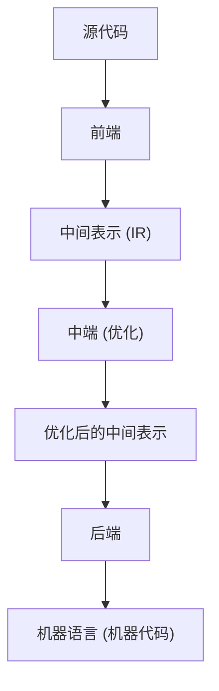
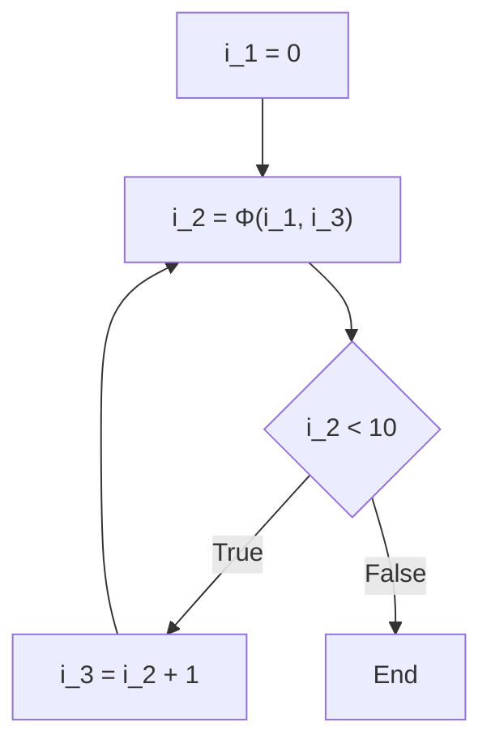

# 编译器优化技术：什么是SSA（静态单赋值）

在软件开发中，我们每天都使用各种编程语言来编写代码。C++、Rust、Go、Java 或者 Swift 等，这些语言提供了人类易于理解的语法和抽象，使我们能够简洁地表达复杂的逻辑。然而，计算机的CPU（中央处理器）能够直接理解的只有由0和1组成的“机器语言（机器代码）”。我们编写的优美且人类易读的源代码，是如何被转换为高速且高效执行的机器语言的呢？在这背后，存在着被称为“编译器”的极其高级且复杂的软件。

在本文中，我们将深入、详细地探讨编译器在后台进行的堪称“魔改”的优化技术中，在现代编译器基础架构（如LLVM和GCC）里扮演着最重要、最核心角色的“SSA（Static Single Assignment：静态单赋值）形式”。

## 编译器的基本结构：前端与后端

在进入SSA的话题之前，让我们先回顾一下编译器的整体架构。现代编译器并不是一个单一的巨大程序，而是拥有被划分为几个独立阶段的流水线结构。这种结构使得应对不同的编程语言或不同的CPU架构变得更加容易。



### 前端（Front-end）
前端的主要作用是解析用特定编程语言编写的源代码，并在保持程序语义不变的情况下，将其转换为编译器内部易于处理的通用表示。
1. **词法分析（Lexical Analysis）**: 读取源代码的字符串，并将其分割为关键字、标识符、运算符等“标记（Token）”序列。
2. **语法分析（Syntax Analysis）**: 检查标记序列是否符合语言的语法规则，并创建被称为“抽象语法树（AST：Abstract Syntax Tree）”的树状数据结构。
3. **语义分析（Semantic Analysis）**: 进行类型检查和变量作用域确认等，验证程序的语义是否正确。

经过这些处理，前端会生成被称为“中间表示（IR：Intermediate Representation）”的、不依赖于特定语言或硬件的代码。

### 中端（Middle-end）与优化
接收前端输出的IR，并为了提高程序的执行速度、减少内存使用量而进行各种“优化”，这就是中端的作用。毫不夸张地说，这个阶段决定了编译器的性能。而且，**在中端的优化中，作为绝对基础的就是我们这次要讲解的“SSA形式”。**

### 后端（Back-end）
后端接收优化后的IR，并生成面向特定目标CPU架构（如x86, ARM, RISC-V等）的机器语言。在这里，会进行寄存器分配、指令调度以及依赖于目标的窥孔优化等。

## 中间表示（IR）的重要性

为什么编译器不直接生成机器语言，而是要特意经过中间表示（IR）呢？其最大的原因在于“通用化”和“易于优化”。

如果不存在IR，为了支持M种语言和N种架构，我们需要编写 $M \times N$ 个编译器。但是通过引入IR，我们只需要编写M个前端和N个后端（$M + N$），支持新语言或新CPU就变得极其简单。LLVM之所以能如此普及，最大的原因就在于存在LLVM IR这种强大且通用的中间表示。

## 什么是SSA（Static Single Assignment：静态单赋值）形式

终于要讲解正题的SSA形式了。
SSA是关于编译器中间表示中变量处理方式的约束，或者说是一种形式。正如“Static Single Assignment”这个名字所示，其最大的规则是**“每个变量在程序文本中静态地只被赋值（定义）一次”**。

当我们使用普通的编程语言编写代码时，对同一个变量多次赋值是理所当然的事情。

```c
// C语言示例
int x = 10;
x = x + 5;
x = x * 2;
```

在这段代码中，变量 `x` 被赋值了3次。然而，当编译器进行优化时，像这样同一个变量的值被多次重写的状态，会使分析变得非常困难。为了追踪“在某个时间点变量 `x` 拥有什么值”、“这个 `x` 是在哪里计算出的值”（数据流分析），编译器必须管理复杂的状态。

因此，在SSA形式中，每次变量被重新赋值时，都会给它加上一个“版本号”，并将其作为不同的变量来处理。将上述代码转换为SSA形式后，如下所示。

```text
// 转换为SSA形式的示意图
x_1 = 10
x_2 = x_1 + 5
x_3 = x_2 * 2
```

通过这种转换，所有的变量都获得了“只被定义一次，之后值不再改变”的不可变性（Immutability）。由此，“变量在哪里被定义、在哪里被使用（Def-Use链）”变得一目了然，编译器的数据流分析也因此得到了极大的加速和简化。

## 控制流与Φ（Phi）函数

直线代码的SSA转换很简单，但是程序中存在“条件分支（if语句）”和“循环（for/while语句）”等控制流。一旦涉及这些控制流，SSA的转换就不那么简单了。

```c
// 包含条件分支的C代码
int x = 0;
if (condition) {
    x = 10;
} else {
    x = 20;
}
int y = x + 5;
```

让我们尝试直接用SSA的版本控制来简单地转换这段代码。

```text
// 失败的SSA转换示例
x_1 = 0
if (condition) {
    x_2 = 10
} else {
    x_3 = 20
}
y_1 = ??? + 5  // 应该使用 x_2 还是 x_3 ？
```

在条件分支的汇合点（Merge Point），变量 `x` 的值如果经过了if块就是 `x_2`，如果经过了else块就是 `x_3`。由于编译器在静态分析阶段不知道会走哪条路径，因此在汇合点之后引用 `x` 时，无法决定该使用哪个版本。

为了解决这个问题而引入的，就是被称为**Φ（Phi）函数**的魔法函数。

Φ函数被放置在控制流的汇合点，其作用是根据“程序是从哪条路径到达的”，来选择合适的变量版本。使用Φ函数将刚才的代码正确转换为SSA形式后，如下所示。

```text
// 使用Φ函数的正确SSA转换
x_1 = 0
if (condition) {
    x_2 = 10
} else {
    x_3 = 20
}
// 汇合点
x_4 = Φ(x_2, x_3)
y_1 = x_4 + 5
```

这里的 `x_4 = Φ(x_2, x_3)` 表示一种伪运算：“如果是经过if块过来的，就将 `x_2` 的值赋给 `x_4`；如果是经过else块过来的，就将 `x_3` 的值赋给 `x_4`”。
这样一来，汇合点之后的代码就始终能够引用唯一的一个版本（这里是 `x_4`），在遵守“只被赋值一次”这一SSA严格规则的同时，也能够表达任何控制流。

### 循环中的Φ函数

在循环（重复）结构的情况下，情况会变得更加复杂。因为变量的值有可能同时接收来自循环“外部的初始值”和来自循环“上一次迭代的更新值”。

```c
// 包含循环的代码
int i = 0;
while (i < 10) {
    i = i + 1;
}
```

将其转换为SSA时，循环的开头（while的条件判断部分）将成为汇合点。

```text
// 循环的SSA转换
i_1 = 0
LoopHeader:
    i_2 = Φ(i_1, i_3)  // i_1来自循环外，i_3来自循环底部
    if (i_2 >= 10) goto End
    i_3 = i_2 + 1
    goto LoopHeader
End:
```

在这里，循环的入口处放置了Φ函数。第一次进入时选择 `i_1` (0)，在循环体内旋转回来时选择 `i_3`，从而巧妙地将动态变化的循环变量转化为了静态的SSA表示。



## SSA带来的强大优化技术

通过将SSA形式引入编译器，过去许多复杂且计算成本高昂的优化算法，现在都能以惊人的简洁度和速度执行。这里介绍几个以SSA为前提的代表性优化。

### 1. 常量传播（Constant Propagation）与常量折叠（Constant Folding）

当变量的值在执行前就能静态确定时，直接用常量替换该变量的引用的优化。由于SSA形式中变量只被定义一次，因此判断“某个变量是否为常量”变得极其容易。

```text
// 优化前
a_1 = 10
b_1 = 20
c_1 = a_1 + b_1

// 使用SSA的常量传播
// a_1和b_1始终是常量，因此可以直接代入c_1的计算中
c_1 = 10 + 20

// 进一步进行常量折叠
c_1 = 30
```
只需追踪从定义到使用（Def-Use）的链接，就能在整个代码库中连锁地传播常量。

### 2. 死代码消除（Dead Code Elimination : DCE）

删除对程序执行结果完全没有影响的、无用代码（死代码）的优化。在SSA形式中，只要没有副作用，定义了“没有被任何指令使用的变量（使用次数为0的变量）”的指令就可以被无条件删除。

```text
x_1 = 10
y_1 = 20  // y_1之后再也没有被使用过
z_1 = x_1 + 5
return z_1
```
如果是SSA，检查“是否有使用y_1的地方？”只需一瞬间（只需确认Use列表是否为空）。如果没有被使用，`y_1 = 20` 这一行会被立即删除。

### 3. 公共子表达式消除（Common Subexpression Elimination : CSE）与值编号（Value Numbering）

找出多次进行相同计算的地方，通过重用第一次计算的结果来省去多余运算的优化。通过使用基于SSA形式的“全局值编号（Global Value Numbering : GVN）”算法，可以检测出跨越整个代码的复杂冗余计算。

```text
// 转换前
x_1 = a_1 + b_1
y_1 = a_1 + b_1

// 经过GVN优化后
x_1 = a_1 + b_1
y_1 = x_1  // 计算相同，因此重用结果
```

### 4. 复制传播（Copy Propagation）

当存在像 `x = y` 这样单纯的值复制时，将后续所有对 `x` 的使用都替换为 `y`，并删除多余的复制操作。在SSA中，这也是只需追踪Def-Use链即可轻松替换的。

## LLVM中SSA的实现与具体示例

代表着现代编译器基础架构的LLVM，其整个中端都是基于SSA形式构建的。LLVM IR（中间表示）本身就具有类似于强类型和严格SSA形式的汇编语言的形式。

例如，让我们将一个简单的C语言函数编译为LLVM IR，并观察实际的Φ函数。

**C语言代码:**
```c
int max(int a, int b) {
    if (a > b) {
        return a;
    } else {
        return b;
    }
}
```

**LLVM IR (伪代码表示):**
```llvm
define i32 @max(i32 %a, i32 %b) {
entry:
  %cmp = icmp sgt i32 %a, %b
  br i1 %cmp, label %if.then, label %if.else

if.then:
  br label %return

if.else:
  br label %return

return:
  %retval.0 = phi i32 [ %a, %if.then ], [ %b, %if.else ]
  ret i32 %retval.0
}
```

观察上面的LLVM IR，可以清楚地看到在 `return` 块中使用了 `phi` 指令。
`%retval.0 = phi i32 [ %a, %if.then ], [ %b, %if.else ]`
这在LLVM IR的层面上直接表达了：“如果是从 `%if.then` 块转移过来的，就将 `%a` 赋给 `%retval.0`；如果是从 `%if.else` 块转移过来的，就将 `%b` 赋给 `%retval.0`”。

LLVM会对这种SSA形式的IR依次应用被称为“Pass（趟/遍）”的众多优化模块。Mem2Reg（将内存访问提升为寄存器上的SSA变量的Pass）、InstCombine（指令合并）、GVN（全局值编号）、ADCE（激进的死代码消除）等，几十到几百个优化Pass在这个坚固的SSA基础上协同工作，最终生成了我们所看到的拥有惊人执行速度的机器代码。

## SSA的缺点与在后端中的解构

看起来如此万能的SSA形式，却存在一个大问题。那就是，**实际的硬件（CPU）并不是以SSA形式运行的**。
实际CPU中的寄存器（如eax、rax等）数量是有限的，会多次重用（重新赋值）相同的寄存器来推进计算。此外，CPU中也不存在相当于“Φ函数”的魔法指令。

因此，编译器的后端在所有优化完成、即将生成机器语言之前，必须“破坏SSA形式（De-SSA）”。

具体来说，就是进行移除Φ函数，将其替换为普通的复制指令（如 `MOV` 等）的操作。
例如，如果存在 `x_4 = Φ(x_2, x_3)` 这样的Φ函数，为了消除它，会在if块的末尾插入 `x_4 = x_2` 这样的复制指令，并在else块的末尾插入 `x_4 = x_3` 这样的复制指令。

```text
// 破坏SSA并转换为复制指令
if (condition) {
    x_2 = 10
    x_4 = x_2  // 替代Φ函数的复制
} else {
    x_3 = 20
    x_4 = x_3  // 替代Φ函数的复制
}
y_1 = x_4 + 5
```

之后，利用被称为“寄存器分配（Register Allocation）”的复杂算法（如图着色算法等），将无限多的虚拟SSA变量（`x_1`, `x_2`, `x_3` ...）映射到数量有限（例如16个）的物理寄存器上。生存区间（变量被使用的期间）不重叠的变量会被分配共享相同的物理寄存器，最终完成实际CPU能够执行的高效机器代码。

## 总结

本文讲解了编译器优化的核心——SSA（静态单赋值）形式。

*   **编译器的流水线**: 分为前端、中端、后端，以IR为中心进行协作。
*   **SSA的基本原则**: 所有变量在程序文本中只被定义1次。
*   **Φ（Phi）函数**: 在控制流的汇合点，根据路径选择变量的版本。
*   **优化的益处**: 常量折叠、死代码消除、公共子表达式消除等利用数据流分析的优化变得极其简单和快速。
*   **与现实的桥梁**: 在最终的机器语言生成阶段，SSA被破坏，并进行物理寄存器的分配。

我们平时不经意间编写的代码，在编译器这个“魔法箱”中，被一度解构为SSA这种优美的数学和图论表示，在彻底削减掉无用之处后，又再次被重构为CPU所需的生硬的机器语言。
理解了这样背后的机制，不仅能成为编写更注重性能的代码的提示，还能让人再次感受到软件工程的深度和趣味。
