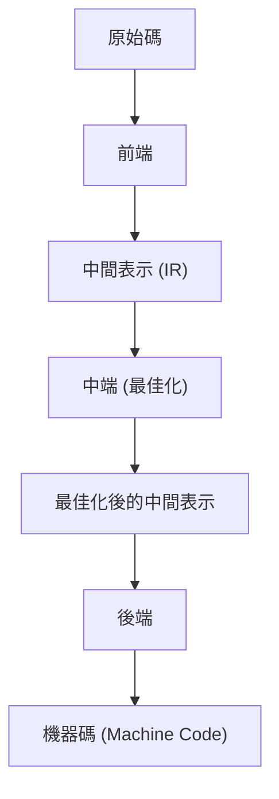
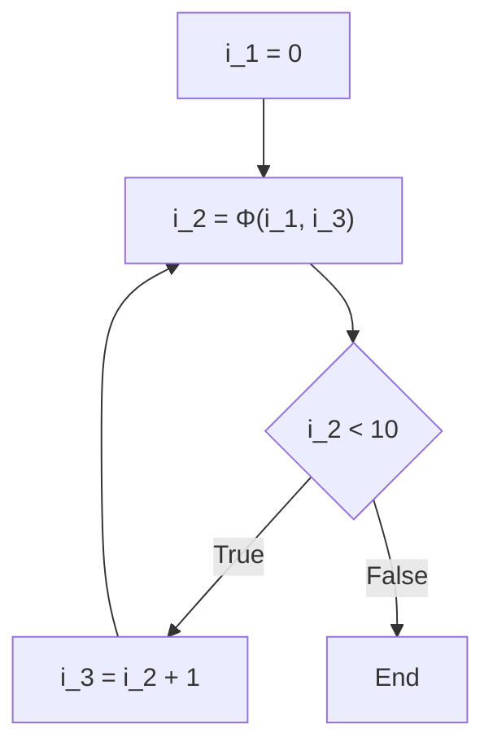

# 編譯器最佳化技術：什麼是 SSA（靜態單賦值）

在軟體開發中，我們每天使用各種程式語言來撰寫程式碼。C++、Rust、Go、Java 或是 Swift 等，這些語言提供了人類容易理解的語法與抽象化，使我們能夠簡潔地表達複雜的邏輯。然而，電腦的 CPU（中央處理器）能夠直接理解的，只有被稱為「機器碼（Machine Code）」的 0 與 1 序列。我們所寫出優美且易讀的原始碼，是如何轉換成能高速且有效率執行的機器碼呢？其背後，存在著被稱為「編譯器」的極度先進且複雜的軟體。

在本文中，我們將針對編譯器在幕後進行的堪稱「魔改」的最佳化技術中，於現代編譯器基礎架構（如 LLVM 或 GCC）裡扮演最重要且核心角色的「SSA（Static Single Assignment：靜態單賦值）形式」，進行非常深入且詳細的解說。

## 編譯器的基本結構：前端與後端

在進入 SSA 的話題之前，讓我們先來複習一下編譯器的整體架構。現代的編譯器並非單一的龐大程式，而是具有分割成數個獨立階段的管線（Pipeline）結構。透過這樣的結構，能夠更容易地支援不同的程式語言與不同的 CPU 架構。



### 前端（Front-end）
前端的主要作用，是解析以特定程式語言撰寫的原始碼，在維持程式意義的同時，將其轉換為在編譯器內部易於處理的通用表示形式。
1. **詞法分析（Lexical Analysis）**: 讀取原始碼的字串，並將其分割為關鍵字、識別字、運算子等「標記（Token）」序列。
2. **語法分析（Syntax Analysis）**: 確認標記序列是否符合語言的文法規則，並建立被稱為「抽象語法樹（AST：Abstract Syntax Tree）」的樹狀結構資料。
3. **語意分析（Semantic Analysis）**: 進行型別檢查與變數作用域（Scope）的確認等，驗證程式的意義是否正確。

經過這些處理後，前端會產生被稱為「中間表示（IR：Intermediate Representation）」的程式碼，這種程式碼不依賴於特定的語言或硬體。

### 中端（Middle-end）與最佳化
中端的作用是接收前端輸出的 IR，並為了提升程式的執行速度或減少記憶體使用量，施加各種「最佳化」。說這個階段決定了編譯器的效能也毫不為過。而**在這個中端的最佳化中，做為絕對基礎的，正是這次要解說的「SSA 形式」。**

### 後端（Back-end）
後端接收最佳化後的 IR，並產生針對特定目標 CPU 架構（x86、ARM、RISC-V 等）的機器碼。在這裡，會進行暫存器配置（Register Allocation）、指令排程（Instruction Scheduling）、以及依賴於目標架構的窺孔最佳化（Peephole Optimization）等。

## 中間表示（IR）的重要性

為什麼編譯器不直接產生機器碼，而要特地經過中間表示（IR）呢？其最大的理由在於「共通化」與「易於最佳化」。

如果沒有 IR，為了支援 M 種語言與 N 種架構，我們需要編寫 $M \times N$ 個編譯器。但是透過引入 IR，只需要編寫 M 個前端與 N 個後端（$M + N$），就能戲劇性地簡化對新語言或新 CPU 的支援。LLVM 之所以能如此普及，最大的原因就在於 LLVM IR 這個強大且通用的中間表示的存在。

## 什麼是 SSA（Static Single Assignment：靜態單賦值）形式

終於要來解說本篇主題的 SSA 形式了。
SSA 是關於在編譯器中間表示中如何處理變數的限制，或稱其為一種形式。正如「Static Single Assignment」這個名稱所示，最大的規則就是**「每個變數在程式文本上，靜態地只會被賦值（定義）一次」**。

當我們使用一般的程式語言撰寫程式碼時，對同一個變數進行多次賦值是理所當然的事。

```c
// C 語言的例子
int x = 10;
x = x + 5;
x = x * 2;
```

在這個程式碼中，對變數 `x` 進行了 3 次賦值。然而，當編譯器進行最佳化時，這種同一個變數的值被多次覆寫的狀態，會讓分析變得非常困難。為了追蹤「在某個時間點變數 `x` 持有什麼值」以及「這個 `x` 是在哪裡計算出來的值」（資料流分析），編譯器必須管理複雜的狀態。

因此，在 SSA 形式中，每當變數被重新賦值時，就會為它加上「版本號碼」，將其視為不同的變數來處理。將上述程式碼轉換為 SSA 形式後，會變成如下所示。

```text
// 轉換為 SSA 形式的示意
x_1 = 10
x_2 = x_1 + 5
x_3 = x_2 * 2
```

透過這樣的轉換，所有的變數都獲得了「只被定義一次，之後值就不會改變」的不變性（Immutability）。藉此，「變數在哪裡被定義，在哪裡被使用（Def-Use 連鎖）」變得一目了然，編譯器的資料流分析也因此獲得了戲劇性的加速與簡化。

## 控制流與 Φ（Phi）函數

直線型程式碼的 SSA 轉換很簡單，但程式中存在著「條件分支（if 述句）」與「迴圈（for/while 述句）」等控制流。當牽涉到這些控制流時，SSA 的轉換就不是那麼容易了。

```c
// 包含條件分支的 C 程式碼
int x = 0;
if (condition) {
    x = 10;
} else {
    x = 20;
}
int y = x + 5;
```

讓我們試著將這個程式碼單純地加上 SSA 版本號碼來進行轉換。

```text
// 失敗的 SSA 轉換範例
x_1 = 0
if (condition) {
    x_2 = 10
} else {
    x_3 = 20
}
y_1 = ??? + 5  // 該使用 x_2？還是 x_3？
```

在條件分支的匯合點（Merge Point），變數 `x` 的值，如果是通過 if 區塊過來的就會是 `x_2`，如果是通過 else 區塊過來的就會是 `x_3`。因為編譯器在靜態分析階段不知道會走哪條路徑，所以在匯合點之後要參考 `x` 時，無法決定該使用哪一個版本。

為了解決這個問題而引入的，就是名為 **Φ（Phi）函數** 的魔法函數。

Φ 函數被配置在控制流的匯合點，具有根據「程式是從哪條路徑到達的」，來選擇適當變數版本的作用。使用 Φ 函數將剛才的程式碼轉換為正確的 SSA 形式後，會變成如下所示。

```text
// 使用 Φ 函數的正確 SSA 轉換
x_1 = 0
if (condition) {
    x_2 = 10
} else {
    x_3 = 20
}
// 匯合點
x_4 = Φ(x_2, x_3)
y_1 = x_4 + 5
```

這裡的 `x_4 = Φ(x_2, x_3)` 代表著一種虛擬運算：「如果是通過 if 區塊過來的，就將 `x_2` 的值賦給 `x_4`；如果是通過 else 區塊過來的，就將 `x_3` 的值賦給 `x_4`」。
如此一來，匯合點之後的程式碼就能夠總是參考到唯一的一個版本（在此為 `x_4`），在遵守「只被賦值一次」這個 SSA 嚴格規則的同時，也能夠表達所有的控制流。

### 迴圈中的 Φ 函數

在迴圈（重複）結構的情況下，情況會變得更加複雜。因為變數的值，可能會接收來自迴圈「外部的初始值」，以及迴圈「上一次迭代的更新值」這兩者。

```c
// 包含迴圈的程式碼
int i = 0;
while (i < 10) {
    i = i + 1;
}
```

將其轉換為 SSA 後，迴圈的開頭（while 的條件判斷部分）就會成為匯合點。

```text
// 迴圈的 SSA 轉換
i_1 = 0
LoopHeader:
    i_2 = Φ(i_1, i_3)  // i_1 來自迴圈外，i_3 來自迴圈下部
    if (i_2 >= 10) goto End
    i_3 = i_2 + 1
    goto LoopHeader
End:
```

在這裡，迴圈的入口處被放置了 Φ 函數。第一次進入時會選擇 `i_1` (0)，而在迴圈繞回來時會選擇 `i_3`，如此一來就完美地將動態變化值的迴圈變數，落實到了靜態的 SSA 表示中。



## SSA 帶來的強大最佳化技術

因為編譯器引入了 SSA 形式，過去許多複雜且計算成本高昂的最佳化演算法，都變得能以令人驚訝的簡單且高速的方式執行。在這裡，我們介紹幾個以 SSA 為前提的代表性最佳化。

### 1. 常數傳播（Constant Propagation）與常數摺疊（Constant Folding）

這是在變數的值於執行前就已經靜態確定的情況下，將對該變數的參考直接替換為常數的最佳化。因為在 SSA 形式中變數只被定義一次，所以要判斷「某個變數是否為常數」極度容易。

```text
// 最佳化前
a_1 = 10
b_1 = 20
c_1 = a_1 + b_1

// 透過 SSA 進行的常數傳播
// a_1 與 b_1 總是常數，因此可以直接代入 c_1 的計算中
c_1 = 10 + 20

// 進一步進行常數摺疊
c_1 = 30
```
只需沿著定義到使用（Def-Use）的連結，就能夠將常數連鎖地傳播到整個程式碼庫中。

### 2. 死碼消除（Dead Code Elimination : DCE）

這是刪除對程式執行結果完全沒有影響、不必要程式碼（死碼）的最佳化。在 SSA 形式中，只要是定義了「沒有被任何指令使用的變數（使用次數為 0 的變數）」的指令，只要沒有副作用，就可以無條件刪除。

```text
x_1 = 10
y_1 = 20  // y_1 之後一次也沒被使用過
z_1 = x_1 + 5
return z_1
```
只要是 SSA，要檢查「是否有地方使用了 y_1？」只要一瞬間（只需確認 Use 列表是否為空）。如果沒有被使用，`y_1 = 20` 這一行就會立刻被刪除。

### 3. 共同子表達式消除（Common Subexpression Elimination : CSE）與值編號（Value Numbering）

這是找出進行多次相同計算的地方，並透過重複使用第一次的計算結果來省去多餘運算的最佳化。透過使用以 SSA 形式為基礎的「全域值編號（Global Value Numbering : GVN）」演算法，可以偵測出跨越整個程式碼的複雜冗餘計算。

```text
// 轉換前
x_1 = a_1 + b_1
y_1 = a_1 + b_1

// 透過 GVN 最佳化後
x_1 = a_1 + b_1
y_1 = x_1  // 因為是相同的計算，所以重複使用結果
```

### 4. 複製傳播（Copy Propagation）

如果存在單純的值複製，例如 `x = y`，就會將之後所有使用 `x` 的地方替換為 `y`，並刪除無用的複製操作。在 SSA 中，這也能透過沿著 Def-Use 連鎖來輕鬆完成替換。

## LLVM 中的 SSA 實作與具體範例

作為現代代表性編譯器基礎架構的 LLVM，其整個中端都是基於 SSA 形式建構的。LLVM IR（中間表示）本身，就具有強型別與嚴格 SSA 形式、類似於組合語言的形式。

例如，讓我們將一個簡單的 C 語言函數編譯成 LLVM IR，來看看實際的 Φ 函數。

**C 語言程式碼:**
```c
int max(int a, int b) {
    if (a > b) {
        return a;
    } else {
        return b;
    }
}
```

**LLVM IR (虛擬碼般的表示):**
```llvm
define i32 @max(i32 %a, i32 %b) {
entry:
  %cmp = icmp sgt i32 %a, %b
  br i1 %cmp, label %if.then, label %if.else

if.then:
  br label %return

if.else:
  br label %return

return:
  %retval.0 = phi i32 [ %a, %if.then ], [ %b, %if.else ]
  ret i32 %retval.0
}
```

觀察上述的 LLVM IR，可以發現在 `return` 區塊中明確地使用了 `phi` 指令。
`%retval.0 = phi i32 [ %a, %if.then ], [ %b, %if.else ]`
這在 LLVM IR 的層級直接表達了：「如果從 `%if.then` 區塊轉移過來，就將 `%a` 代入 `%retval.0`；如果從 `%if.else` 區塊轉移過來，就將 `%b` 代入 `%retval.0`」。

LLVM 會對這個 SSA 形式的 IR，陸續套用大量被稱為「Pass（通行）」的最佳化模組。Mem2Reg（將記憶體存取提升為暫存器上的 SSA 變數的 Pass）、InstCombine（指令結合）、GVN（全域值編號）、ADCE（積極的死碼消除）等，數十到數百個最佳化 Pass 會在這個名為 SSA 的堅固基礎上協同運作，最終產出我們所看到、具有驚人執行速度的機器碼。

## SSA 的缺點與在後端的解構

雖然 SSA 形式看起來如此萬能，但它有一個很大的問題。那就是，**實際的硬體（CPU）並不是以 SSA 形式運作的**。
實際的 CPU 暫存器（eax、rax 等）數量是有限的，會多次重複使用（重新賦值）同一個暫存器來推進計算。此外，CPU 中也不存在相當於「Φ 函數」的魔法指令。

因此，編譯器的後端在所有最佳化結束、即將產生機器碼之前，必須「破壞 SSA 形式（De-SSA）」。

具體來說，會進行移除 Φ 函數，並將其替換為一般複製指令（如 `MOV`）的作業。
例如，當存在 `x_4 = Φ(x_2, x_3)` 這樣的 Φ 函數時，為了消除它，會在 if 區塊的末尾插入 `x_4 = x_2` 的複製指令，並在 else 區塊的末尾插入 `x_4 = x_3` 的複製指令。

```text
// 破壞 SSA 並轉換為複製指令
if (condition) {
    x_2 = 10
    x_4 = x_2  // 替代 Φ 函數的複製
} else {
    x_3 = 20
    x_4 = x_3  // 替代 Φ 函數的複製
}
y_1 = x_4 + 5
```

之後，會使用被稱為「暫存器配置（Register Allocation）」的複雜演算法（如圖著色演算法等），將無限多個虛擬的 SSA 變數（`x_1`, `x_2`, `x_3` ...），對應到數量有限（例如 16 個）的實體暫存器上。生存區間（變數被使用的期間）沒有重疊的變數，會被分配共用同一個實體暫存器，最終完成實際 CPU 能夠執行的有效率機器碼。

## 總結

本文中，我們解說了編譯器最佳化的核心：SSA（靜態單賦值）形式。

*   **編譯器的管線**：分為前端、中端與後端，並以 IR 為中心進行協作。
*   **SSA 的基本原則**：所有變數在程式文本上只被定義 1 次。
*   **Φ（Phi）函數**：在控制流的匯合點，根據路徑選擇變數的版本。
*   **最佳化的好處**：使得常數摺疊、死碼消除、共同子表達式消除等，利用資料流分析的最佳化變得戲劇性地簡單且高速。
*   **與現實的接軌**：在最終的機器碼產生階段，SSA 會被破壞，並進行對實體暫存器的配置。

我們平時不經意撰寫的程式碼，在名為編譯器的「魔法盒」中，會先被解構為 SSA 這種優美的數學與圖論表示形式，在徹底削去無用之處後，再次被重新建構為供 CPU 使用的粗獷機器碼。
了解這樣背後的機制，不僅能成為撰寫更注重效能的程式碼的提示，也必定能讓我們再次感受到軟體工程的深奧與有趣之處。
