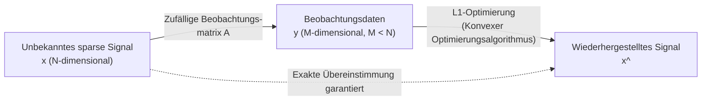

# Was ist Compressed Sensing?

Einer der revolutionärsten Paradigmenwechsel in der modernen Datenwissenschaft und Signalverarbeitung ist das "Compressed Sensing" (oder Compressive Sensing). Früher folgten wir beim Einlesen analoger Signale wie Audio, Bilder oder elektromagnetischer Wellen in Computer als digitale Daten dem absoluten Gesetz des "Nyquist-Shannon-Abtasttheorems". Compressed Sensing stellt jedoch diesen gesunden Menschenverstand auf den Kopf und liefert eine erstaunliche mathematische Garantie: "Wenn ein Signal eine bestimmte Bedingung (Sparsity bzw. Dünnbesetztheit) erfüllt, kann das ursprüngliche Signal aus weitaus weniger Beobachtungsdaten vollständig wiederhergestellt werden, als es das Abtasttheorem erfordert."

In diesem Artikel werden wir von den Grundlagen des Abtasttheorems ausgehen und die mathematische Definition der Dünnbesetztheit, die Relaxation auf das $L_1$-Optimierungsproblem und den Kern der theoretischen Durchbrüche von Emmanuel Candès, Terence Tao und anderen mit mathematischen Formeln tiefgehend erklären. Darüber hinaus decken wir Anwendungsfälle wie die Beschleunigung von MRT und die Konstruktion von Bildern schwarzer Löcher sowie spezifischen Implementierungscode mit Python ab, um das Gesamtbild des Compressed Sensing aufzuzeigen.

## 1. Das Nyquist-Shannon-Abtasttheorem und seine Grenzen

### Grundlagen des Abtasttheorems
In der Mitte des 20. Jahrhunderts wurde das "Abtasttheorem" in den Grundlagen der Informationstheorie verankert, die von Claude Shannon und Harry Nyquist etabliert wurde. Dieses Theorem definiert die Bedingungen für die Umwandlung eines kontinuierlichen analogen Signals in ein diskretes digitales Signal wie folgt:

> **Nyquist-Shannon-Abtasttheorem**
> Um ein Signal, dessen Bandbreite auf $f_{\max}$ begrenzt ist, vollständig zu rekonstruieren, muss das Signal mit einer Abtastfrequenz (Nyquist-Rate) von mindestens $2f_{\max}$ abgetastet werden.

Zum Beispiel liegt die obere Grenze des menschlichen Hörbereichs bei etwa 20 kHz. Daher wird auf einer Musik-CD mit mehr als dem Doppelten, nämlich 44,1 kHz, abgetastet. Mathematisch ausgedrückt: Wenn ein kontinuierliches Signal $x(t)$ eine Fourier-Transformation $X(f)$ hat und $X(f) = 0$ für $|f| > f_{\max}$ gilt, kann $x(t)$ mit der folgenden Interpolationsformel unter Verwendung der Sinc-Funktion vollständig wiederhergestellt werden:

$$ x(t) = \sum_{n=-\infty}^{\infty} x\left(\frac{n}{2f_{\max}}\right) \operatorname{sinc}\left(2f_{\max}t - n\right) $$

### Datenexplosion und die Grenzen des Theorems
Das Abtasttheorem ist äußerst mächtig und bildet den Grundstein der modernen digitalen Kommunikation. Mit dem technologischen Fortschritt ist jedoch die Menge an Informationen, die von Sensoren erfasst werden, explosionsartig gestiegen. Bei hochauflösenden medizinischen Bildern (MRT und CT), Radioteleskop-Arrays in der Astronomie und Ultrabreitband-Radarsystemen wird die Menge der zu beobachtenden Daten viel zu groß, wenn die Abtastung gemäß der Nyquist-Rate erfolgt.

Infolgedessen treten die folgenden Probleme auf:
1. **Erhöhte Scanzeit**: Bei der MRT beispielsweise dauert das Sammeln der Daten lange und stellt eine körperliche Belastung für den Patienten dar.
2. **Hardware-Einschränkungen**: Die Herstellung von A/D-Wandlern zur Abtastung extrem hochfrequenter Signale wird technisch schwierig oder extrem teuer.
3. **Druck auf Datenspeicherung und Kommunikation**: Die Kosten für die Speicherung und Übertragung riesiger Mengen an abgetasteten Daten explodieren.

Das bisherige Paradigma lautete: "In großen Mengen abtasten und dann mit Software (wie JPEG oder MP3) komprimieren, um unnötige Daten zu verwerfen." Es stellt sich jedoch die Frage: "Wenn wir sie am Ende ohnehin wegwerfen, können wir dann nicht von Anfang an nur die notwendigen Informationen direkt erfassen (messen)?" Compressed Sensing hat dies möglich gemacht.

## 2. Mathematische Definition von Sparsity (Dünnbesetztheit)

Die absolute Bedingung dafür, dass Compressed Sensing funktioniert, ist **Sparsity (Dünnbesetztheit)**. Sparsity bezieht sich auf die Eigenschaft, dass "wenn ein Signal mit einer geeigneten Basis (Darstellungsmethode) transformiert wird, die meisten seiner Komponenten null (oder Werte sehr nahe an null) werden".

### Formulierung des Sparse-Vektors
Betrachten wir ein diskretes Signal (Vektor) $\mathbf{x} \in \mathbb{R}^N$ der Länge $N$. Angenommen, dieses Signal kann mithilfe einer orthogonalen Basismatrix $\mathbf{\Psi} \in \mathbb{R}^{N \times N}$ (z. B. Fourier-Transformationsmatrix oder Wavelet-Transformationsmatrix) wie folgt dargestellt werden:

$$ \mathbf{x} = \mathbf{\Psi} \mathbf{s} $$

Hierbei ist $\mathbf{s} \in \mathbb{R}^N$ der Koeffizientenvektor auf der Basis $\mathbf{\Psi}$.
Wenn die Anzahl der von null verschiedenen Elemente in diesem Vektor $\mathbf{s}$ genau $K$ beträgt (mit $K \ll N$), sagt man, dass $\mathbf{x}$ **$K$-sparse (dünnbesetzt mit K Elementen)** ist. Mathematisch wird dies unter Verwendung der $L_0$-Norm (einer Funktion, die die Anzahl der von null verschiedenen Elemente zählt) wie folgt definiert:

$$ \|\mathbf{s}\|_0 = K $$

### Sparsity in der realen Welt
Erstaunlicherweise sind viele Signale, die in der Natur vorkommen, bei Wahl einer geeigneten Basis sparse.
- **Bilder**: Natürliche Bilder sind im Pixelraum nicht sparse, aber nach einer Wavelet-Transformation oder diskreten Kosinustransformation (DCT) nähern sich die meisten hochfrequenten Komponenten null an und werden sparse (dies ist das Prinzip der JPEG-Komprimierung).
- **Audio**: Audiosignale sind im Zeitbereich kontinuierlich, weisen aber im Frequenzbereich (nach der Fourier-Transformation) nur einige wenige dominierende Frequenzkomponenten (Grundfrequenz und Obertöne) mit großen Werten auf.

Compressed Sensing ist eine Technologie, die diese "dem Signal innewohnende Redundanz" nutzt, um bereits in der Abtastphase eine Datenkomprimierung durchzuführen.

## 3. Formulierung von Compressed Sensing und der Beobachtungsmatrix

Unter der Annahme, dass das Signal sparse ist, wie stellen wir das Signal aus wenigen Daten wieder her?
Angenommen, wir führen $M$ lineare Beobachtungen an einem unbekannten Signal $\mathbf{x} \in \mathbb{R}^N$ durch ($M < N$). Der Beobachtungsprozess wird unter Verwendung einer Beobachtungsmatrix $\mathbf{\Phi} \in \mathbb{R}^{M \times N}$ wie folgt ausgedrückt:

$$ \mathbf{y} = \mathbf{\Phi} \mathbf{x} = \mathbf{\Phi} \mathbf{\Psi} \mathbf{s} = \mathbf{A} \mathbf{s} $$

Hierbei ist:
- $\mathbf{y} \in \mathbb{R}^M$: Beobachtungsdatenvektor
- $\mathbf{A} = \mathbf{\Phi} \mathbf{\Psi} \in \mathbb{R}^{M \times N}$: Sensing-Matrix

Unser Ziel ist es, aus den gegebenen Beobachtungsdaten $\mathbf{y}$ und der Matrix $\mathbf{A}$ den unbekannten Koeffizientenvektor $\mathbf{s}$ (und letztendlich $\mathbf{x}$) wiederherzustellen.

### Das Problem unterbestimmter Systeme
Hier stoßen wir jedoch auf eine mathematische Hürde. Da $M < N$ (es gibt mehr Unbekannte als Gleichungen), wird dieses lineare Gleichungssystem $\mathbf{y} = \mathbf{A} \mathbf{s}$ zu einem **unterbestimmten System (underdetermined system)**, das unendlich viele Lösungen hat. Es ist unmöglich, mit normaler linearer Algebra eine eindeutige Lösung zu finden.

Hier nutzen wir das Vorwissen: "$\mathbf{s}$ ist sparse (die Anzahl der nicht-null Komponenten ist extrem gering)". Wenn wir unter den unendlich vielen Lösungskandidaten die sparseste Lösung (diejenige mit den wenigsten nicht-null Komponenten) finden, ist die Wahrscheinlichkeit hoch, dass dies das wahre Signal ist. Als Optimierungsproblem formuliert, sieht dies wie folgt aus:

$$ (P_0) \quad \min_{\mathbf{s} \in \mathbb{R}^N} \|\mathbf{s}\|_0 \quad \text{subject to} \quad \mathbf{y} = \mathbf{A} \mathbf{s} $$

### Schwierigkeit der $L_0$-Optimierung
Idealerweise müssten wir nur das obige Problem $(P_0)$ lösen, aber mathematisch ist bekannt, dass das Minimierungsproblem für $\|\mathbf{s}\|_0$ **NP-schwer (NP-hard)** ist. Es ist erforderlich, alle Kombinationen von nicht-null Komponenten durchzuprobieren (brute force), und wenn die Dimension $N$ groß wird, würde selbst mit modernen Supercomputern mehr Zeit benötigt als das Alter des Universums.

## 4. Relaxation auf das $L_1$-Optimierungsproblem: Der Durchbruch von Candès und Tao

Der Grund, warum Compressed Sensing als praktische Technologie so explosiv populär wurde, liegt darin, dass ein erstaunlicher mathematischer Beweis erbracht wurde: Wenn dieses unlösbare $L_0$-Optimierungsproblem durch ein berechenbares **$L_1$-Optimierungsproblem** ersetzt wird, kann unter bestimmten Bedingungen **exakt dieselbe richtige Antwort** erreicht werden.

Zwischen 2004 und 2006 legten Emmanuel Candès, Terence Tao, David Donoho und andere das starke Fundament für diese Theorie.

### $L_1$-Norm-Minimierung
Anstelle der $L_0$-Norm verwenden wir die $L_1$-Norm, die der Summe der Absolutwerte jedes Elements des Vektors entspricht.

$$ \|\mathbf{s}\|_1 = \sum_{i=1}^N |s_i| $$

Dadurch wird das Problem wie folgt relaxiert (relaxation):

$$ (P_1) \quad \min_{\mathbf{s} \in \mathbb{R}^N} \|\mathbf{s}\|_1 \quad \text{subject to} \quad \mathbf{y} = \mathbf{A} \mathbf{s} $$

Das $L_1$-Minimierungsproblem ist eine Art konvexes Optimierungsproblem, und eine exakte Lösung kann in polynomieller Zeit unter Verwendung bestehender hocheffizienter Algorithmen wie der linearen Programmierung (Linear Programming) berechnet werden.

### Warum $L_1$? (Geometrische Intuition)
Warum die $L_1$-Norm anstelle der $L_2$-Norm (Methode der kleinsten Quadrate)? Dies lässt sich geometrisch verstehen.
Die Nebenbedingung $\mathbf{y} = \mathbf{A}\mathbf{s}$ bildet eine Hyperebene in einem hochdimensionalen Raum. Die Minimierung der Norm entspricht der Operation, eine Konturfläche (Kugel) um den Ursprung aufzublasen und den ersten Punkt zu finden, der diese Hyperebene berührt.

- **$L_2$-Kugel ($\|\mathbf{s}\|_2 \le R$)**: Die Form ist eine glatte Kugel. Der Berührungspunkt mit der Hyperebene ist in den meisten Fällen ein Punkt, der von allen Koordinatenachsen entfernt ist. Das Ergebnis ist ein "dichter (dense)" Vektor, dessen Elemente alle ungleich null sind.
- **$L_1$-Kugel ($\|\mathbf{s}\|_1 \le R$)**: Die Form ist ein Polyeder (Raute, Oktaeder usw.) und hat viele "Ecken (Vertices)". Diese Ecken liegen auf den Koordinatenachsen. Wenn die Hyperebene dagegen gedrückt wird, berührt sie mit hoher Wahrscheinlichkeit an einer dieser "Ecken". Ein Berühren an einer Ecke bedeutet, dass die Werte der anderen Koordinatenachsen null werden, was zu einer sparsamen Lösung führt.

### RIP (Restricted Isometry Property: Eingeschränkte Isometrieeigenschaft)
Candès und Tao führten das Konzept der **RIP (Restricted Isometry Property)** als hinreichende Bedingung dafür ein, dass die $L_1$-Minimierung mit der $L_0$-Minimierung übereinstimmt.
Eine Sensing-Matrix $\mathbf{A}$ erfüllt RIP der Ordnung $K$, wenn es eine kleine Konstante $\delta_K \in (0,1)$ gibt, so dass die folgende Ungleichung für jeden $K$-sparse Vektor $\mathbf{s}$ gilt:

$$ (1 - \delta_K) \|\mathbf{s}\|_2^2 \le \|\mathbf{A}\mathbf{s}\|_2^2 \le (1 + \delta_K) \|\mathbf{s}\|_2^2 $$

Intuitiv ist dies die Eigenschaft: "Die Matrix $\mathbf{A}$ erhält (fast) die Länge jedes sparse Vektors." Candès und Tao bewiesen auf brillante Weise, dass, wenn $\mathbf{A}$ bestimmte RIP-Bedingungen erfüllt, die Lösung von $(P_1)$ in Abwesenheit von Rauschen exakt mit der Lösung von $(P_0)$ übereinstimmt.

Aus praktischer Sicht wurde ferner gezeigt, dass bei Verwendung einer **Zufallsmatrix (einer Matrix von Zufallszahlen, die einer Gauß- oder Bernoulli-Verteilung folgen)** als Beobachtungsmatrix $\mathbf{\Phi}$ die RIP mit hoher Wahrscheinlichkeit erfüllt ist. Mit anderen Worten: "Zufälliges Beobachten" wird zur effizientesten und universellsten Abtaststrategie beim Compressed Sensing.

Es ist bewiesen worden, dass die erforderliche Anzahl von Beobachtungen $M$ im Verhältnis zur Signallänge $N$ und dem Sparsity-Grad $K$ mit der folgenden Größenordnung ausreicht:

$$ M \ge C \cdot K \log\left(\frac{N}{K}\right) $$
($C$ ist eine Konstante)

Das bedeutet, dass im Vergleich zu den $N$ Beobachtungen, die das Abtasttheorem erfordert, weitaus weniger (abhängig von $K$) ausreichen.

## 5. Anwendungsbeispiele von Compressed Sensing

Die Theorie des Compressed Sensing hat in allen Bereichen der Informationstechnik und Physik für Revolutionen gesorgt.

### 1. Beschleunigung von MRT (Magnetresonanztomographie)
Eines der erfolgreichsten kommerziellen Anwendungsbeispiele ist die MRT. MRT nutzt starke Magnetfelder, um Querschnittsbilder des menschlichen Körpers zu erhalten. Die Erfassung von Daten (Daten im Frequenzbereich, sogenannter k-Raum) ist jedoch physikalisch begrenzt und zeitaufwändig.
Bei pädiatrischen Patienten oder der Bildgebung sich bewegender Organe wie dem Herzen ist es schwierig, über längere Zeit still zu halten. Durch die Anwendung von Compressed Sensing auf MRT wurde der abgetastete k-Raum zufällig ausgedünnt und die Scanzeit erfolgreich auf einen Bruchteil der konventionellen Zeit reduziert. Heute verkaufen große Medizingerätehersteller wie Siemens und GE MRT-Geräte, die standardmäßig mit Compressed Sensing-Technologie ausgestattet sind.

### 2. Bildgebung von schwarzen Löchern (Event Horizon Telescope)
Im Jahr 2019 gelang es dem internationalen Forschungsteam "Event Horizon Telescope (EHT)", das erste Bild eines Schwarzen-Loch-Schattens in der Geschichte der Menschheit aufzunehmen. Um ein virtuelles Teleskop von der Größe der Erde aufzubauen, wurden die Daten von weltweit verstreuten Radioteleskopen integriert (Very Long Baseline Interferometry: VLBI). Da jedoch die Platzierung der Teleskope auf der Erde begrenzt ist, gab es riesige "Lücken (fehlende Daten)" in den Beobachtungsdaten.
Um das Bild des schwarzen Lochs aus diesen lückenhaften Daten wiederherzustellen, wurde ein Algorithmus namens CHIRP (Continuous High-resolution Image Reconstruction using Patch priors) entwickelt. Auch dies ist eine Anwendung von Compressed Sensing, die die Sparsity und das strukturelle Vorwissen von Bildern des Universums nutzt.

### 3. Einzelpixelkamera (Single-Pixel Camera)
Ein Forschungsteam an der Rice University hat eine Kamera entwickelt, die nur über ein einziges lichtempfindliches Element (Pixel) verfügt.
Mithilfe eines DMD (Digital Micromirror Device) wird das Licht des Objekts in zufälligen Mustern reflektiert und die Summe mit einem einzigen Sensor gemessen. Durch tausendfache Wiederholung dieses Vorgangs wird ein Bild mit Millionen von Pixeln rekonstruiert. Diese Technologie ist äußerst nützlich für die Bildgebung in Wellenlängenbereichen wie Infrarot- und Terahertzwellen, in denen die Herstellung von Multipixel-Sensoren extrem teuer ist.

## 6. Beispiel für die Implementierung von Compressed Sensing mit Python

Da allein die Theorie schwer zu begreifen sein kann, lassen Sie uns mit Python eine Simulation von Compressed Sensing durchführen.
Hier generieren wir ein eindimensionales sparse Signal und verwenden die $L_1$-Optimierung, um das ursprüngliche Signal aus einer kleinen Anzahl zufälliger Beobachtungen wiederherzustellen. Für die Optimierung verwenden wir die Bibliothek `cvxpy`.

### Installation erforderlicher Bibliotheken
```bash
pip install numpy matplotlib cvxpy
```

### Implementierungscode

```python
import numpy as np
import matplotlib.pyplot as plt
import cvxpy as cp

# Festlegen des Random Seeds
np.random.seed(42)

# --- 1. Problemstellung ---
N = 1000  # Dimension des Signals (Anzahl der ursprünglich abzutastenden Punkte)
K = 50    # Sparsity (Anzahl der Elemente ungleich null)
M = 250   # Anzahl der Beobachtungen (nur 25% von N)

# --- 2. Generierung des echten sparse Signals ---
# Wahres Signal x_true erstellen (Anfangswerte sind alle null)
x_true = np.zeros(N)
# Zufällig K Indizes auswählen und Nicht-Null-Werte setzen (Gauß-Verteilung)
nonzero_indices = np.random.choice(N, K, replace=False)
x_true[nonzero_indices] = np.random.randn(K)

# --- 3. Simulation des Beobachtungsprozesses ---
# Zufällige Gaußsche Beobachtungsmatrix A (M x N) generieren
A = np.random.randn(M, N)
# Spaltenweise normalisieren (Norm auf 1 setzen)
A = A / np.linalg.norm(A, axis=0)

# Beobachtungsdaten y = A * x_true
y = A @ x_true

# --- 4. Signalwiederherstellung durch Compressed Sensing (L1-Optimierung) ---
# Optimierungsproblem mit cvxpy definieren
x_reconstruct = cp.Variable(N)
# Zielfunktion: Minimierung der L1-Norm
objective = cp.Minimize(cp.norm(x_reconstruct, 1))
# Nebenbedingungen: y = A * x (Übereinstimmung mit Beobachtungsdaten)
constraints = [A @ x_reconstruct == y]

# Problem definieren und lösen
prob = cp.Problem(objective, constraints)
print("Führe Optimierungsberechnung aus...")
prob.solve(solver=cp.ECOS)

# Wiederhergestelltes Signal
x_rec = x_reconstruct.value

# --- 5. Visualisierung der Ergebnisse ---
plt.figure(figsize=(12, 6))

plt.subplot(2, 1, 1)
plt.plot(x_true, label='True Signal', alpha=0.7)
plt.title(f'Original Sparse Signal (N={N}, K={K})')
plt.legend()
plt.grid(True)

plt.subplot(2, 1, 2)
plt.plot(x_rec, color='red', label='Reconstructed Signal', alpha=0.7)
plt.title(f'Reconstructed via L1 Minimization (M={M} measurements)')
plt.legend()
plt.grid(True)

plt.tight_layout()
plt.show()

# Überprüfung der Genauigkeit der Wiederherstellung
error = np.linalg.norm(x_true - x_rec)
print(f"Wiederherstellungsfehler (L2 norm): {error:.6e}")
```

### Code-Erklärung
1. **Signalgenerierung**: Wir erstellen einen sparse Vektor `x_true`, in dem von den Dimensionen $N=1000$ nur $K=50$ Positionen Werte haben (der Rest ist null).
2. **Beobachtung**: Dem Abtasttheorem folgend wären 1000 Messungen erforderlich, aber hier verwenden wir eine zufällige Beobachtungsmatrix `A` für nur $M=250$ (25%) Messungen, um die Daten `y` zu erhalten.
3. **Wiederherstellung**: Mit nur den Beobachtungsdaten `y` und der Matrix `A` als Input verwenden wir `cvxpy`, um das $\mathbf{x}$ mit der kleinsten $L_1$-Norm zu finden, das $\mathbf{y} = \mathbf{A}\mathbf{x}$ erfüllt.
4. **Ergebnisse**: Nach Abschluss der Berechnung ist der Wiederherstellungsfehler ein extrem kleiner Wert von `1e-9` oder weniger, was bestätigt, dass das wahre Signal aus nur 25% der Beobachtungsdaten **exakt (Exact)** wiederhergestellt wurde.



## 7. Zusammenfassung und Zukunftsperspektiven

Compressed Sensing hat das Paradigma in der Geschichte der Signalverarbeitung grundlegend verändert. Der Ansatz, "von Anfang an nur so viel intelligent zu messen, wie nötig ist", anstatt "in großen Mengen zu messen und es dann wegzuwerfen", wird durch eine profunde mathematische Theorie (konvexe Optimierung, Zufallsmatrixtheorie, hochdimensionale Geometrie) gestützt.

Gegenwärtig wird aktiv an der Kombination von Deep Learning und Compressed Sensing geforscht. Anstelle traditioneller $L_1$-Optimierungsalgorithmen wird der Ansatz, neuronale Netze zu verwenden, um inverse Probleme schneller und genauer zu lösen (Deep Unfolding / Algorithm Unrolling), zum Mainstream. Dies ermöglicht es, das Design der Beobachtungsmatrix selbst datengesteuert zu lernen, und treibt Anwendungen wie die weitere Beschleunigung von MRT und die rauschtolerante Bildrekonstruktion voran.

Die mathematische Magie des Compressed Sensing, aus wenigen Informationen das Ganze präzise zu erkennen, wird uns weiterhin neue "Augen" in allen Bereichen wie autonomem Fahren, IoT-Sensornetzwerken und Weltraumerkundung bieten, in denen die Datenexplosion eine Herausforderung darstellt.
