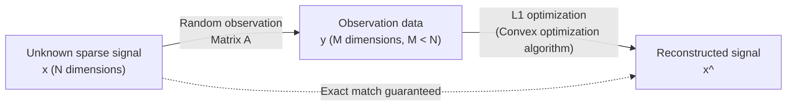

# What is Compressed Sensing?

In modern data science and signal processing, one of the most revolutionary paradigm shifts is "Compressed Sensing" (or Compressive Sensing). Traditionally, when capturing analog signals such as audio, images, or electromagnetic waves into a computer as digital data, we followed the absolute rule of the "Nyquist-Shannon sampling theorem." However, compressed sensing overturns this common sense, providing an astonishing mathematical guarantee: "If a signal satisfies a certain condition (sparsity), the original signal can be perfectly reconstructed from far fewer observational data than what the sampling theorem requires."

This article starts from the basics of the sampling theorem and deeply explains the mathematical definition of sparsity, relaxation to the $L_1$ optimization problem, and the core of the theoretical breakthroughs by Emmanuel Candès, Terence Tao, and others, accompanied by mathematical formulas. Furthermore, it covers application examples such as accelerating MRI and constructing black hole images, as well as specific implementation code using Python, revealing the full picture of compressed sensing.

## 1. The Nyquist-Shannon Sampling Theorem and Its Limits

### Basics of the Sampling Theorem
In the mid-20th century, the "sampling theorem" was established at the foundation of information theory by Claude Shannon and Harry Nyquist. This theorem defines the condition for converting a continuous analog signal into a discrete digital signal as follows:

> **Nyquist-Shannon Sampling Theorem**
> To perfectly reconstruct a signal whose bandwidth is band-limited to $f_{\max}$, the signal must be sampled at a sampling frequency of at least $2f_{\max}$ (the Nyquist rate).

For example, the upper limit of the audible range for human ears is about 20 kHz. Therefore, on a music CD, sampling is performed at 44.1 kHz, which is more than twice that frequency. Expressed in mathematical formulas, if a continuous signal $x(t)$ has a Fourier transform $X(f)$ and $X(f) = 0$ for $|f| > f_{\max}$, $x(t)$ can be perfectly reconstructed by the following interpolation formula using the sinc function.

$$ x(t) = \sum_{n=-\infty}^{\infty} x\left(\frac{n}{2f_{\max}}\right) \operatorname{sinc}\left(2f_{\max}t - n\right) $$

### Data Explosion and Limits of the Theorem
The sampling theorem is extremely powerful and forms the cornerstone of modern digital communication. However, with the advancement of technology, the amount of information captured by sensors has exploded. In high-resolution medical imaging (MRI and CT), astronomical radio telescope arrays, ultra-wideband radar systems, etc., if sampling is performed according to the Nyquist rate, the amount of data to be observed becomes overwhelmingly massive.

As a result, problems such as the following arise:
1. **Increase in scan time**: In MRI, for example, it takes a long time to collect data, imposing a physical burden on patients.
2. **Hardware limitations**: Manufacturing A/D converters to sample ultra-high-frequency signals becomes technically difficult or extremely expensive.
3. **Pressure on data storage and communication**: The costs to store and transmit massive amounts of sampled data skyrocket.

The traditional paradigm was "sample massively, then compress via software (like JPEG or MP3) and discard unnecessary data." However, the question arises: "If we are going to discard it in the end, can't we just directly sense (acquire) only the necessary information from the start?" Compressed sensing is what made this possible.

## 2. Mathematical Definition of Sparsity

The absolute condition for compressed sensing to work is **sparsity**. Sparsity refers to the property that "when a signal is transformed using an appropriate basis (representation method), most of its components become zero (or very close to zero)."

### Formulation of Sparse Vectors
Consider a discrete signal (vector) $\mathbf{x} \in \mathbb{R}^N$ of length $N$. Assume this signal can be expressed using an orthogonal basis matrix $\mathbf{\Psi} \in \mathbb{R}^{N \times N}$ (e.g., Fourier transform matrix or wavelet transform matrix) as follows:

$$ \mathbf{x} = \mathbf{\Psi} \mathbf{s} $$

Here, $\mathbf{s} \in \mathbb{R}^N$ is the coefficient vector on the basis $\mathbf{\Psi}$.
If the number of non-zero elements in this vector $\mathbf{s}$ is $K$ ($K \ll N$), $\mathbf{x}$ is said to be **$K$-sparse**. Mathematically, it is defined using the $L_0$ norm (a function that counts the number of non-zero elements) as follows:

$$ \|\mathbf{s}\|_0 = K $$

### Sparsity in the Real World
Surprisingly, many signals existing in the natural world become sparse by choosing an appropriate basis.
- **Images**: Natural images are not sparse in the pixel space, but when subjected to a wavelet transform or discrete cosine transform (DCT), most high-frequency components approach zero and become sparse (this is the principle of JPEG compression).
- **Audio**: Audio signals are continuous in the time domain, but in the frequency domain (after Fourier transform), only a few major frequency components (fundamental frequency and overtones) have large values.

Compressed sensing is a technology that leverages this "inherent redundancy in signals" to perform data compression simultaneously at the sampling stage.

## 3. Formulation of Compressed Sensing and the Observation Matrix

Assuming the signal is sparse, how do we reconstruct the signal from a small amount of data?
Suppose we perform $M$ linear observations on an unknown signal $\mathbf{x} \in \mathbb{R}^N$ ($M < N$). The observation process is represented using an observation matrix $\mathbf{\Phi} \in \mathbb{R}^{M \times N}$ as follows:

$$ \mathbf{y} = \mathbf{\Phi} \mathbf{x} = \mathbf{\Phi} \mathbf{\Psi} \mathbf{s} = \mathbf{A} \mathbf{s} $$

Here,
- $\mathbf{y} \in \mathbb{R}^M$: Observation data vector
- $\mathbf{A} = \mathbf{\Phi} \mathbf{\Psi} \in \mathbb{R}^{M \times N}$: Sensing matrix

Our goal is to reconstruct the unknown coefficient vector $\mathbf{s}$ (and ultimately $\mathbf{x}$) from the given observation data $\mathbf{y}$ and matrix $\mathbf{A}$.

### The Problem of Underdetermined Systems
However, we face a mathematical wall here. Since $M < N$ (there are more unknowns than equations), this system of linear equations $\mathbf{y} = \mathbf{A} \mathbf{s}$ becomes an **underdetermined system**, and there are infinitely many solutions. In ordinary linear algebra, it is impossible to find a unique solution.

Here, we utilize the prior knowledge that "$\mathbf{s}$ is sparse (has very few non-zero components)." If we search for the sparsest solution (the one with the fewest non-zero components) among the infinitely many candidate solutions, it should have a high probability of being the true signal. Formulated as an optimization problem, this is as follows:

$$ (P_0) \quad \min_{\mathbf{s} \in \mathbb{R}^N} \|\mathbf{s}\|_0 \quad \text{subject to} \quad \mathbf{y} = \mathbf{A} \mathbf{s} $$

### The Difficulty of $L_0$ Optimization
Ideally, solving the above $(P_0)$ problem would suffice, but mathematically, the minimization problem of $\|\mathbf{s}\|_0$ is known to be **NP-hard**. It requires a brute-force search of all combinations of non-zero components, and as the dimension $N$ increases, it would take longer than the lifespan of the universe even with modern supercomputers.

## 4. Relaxation to the $L_1$ Optimization Problem: The Candès and Tao Breakthrough

The reason compressed sensing explosively spread as a practical technology is that a staggering mathematical proof was provided: even if this unsolvable $L_0$ optimization problem is replaced by a computable **$L_1$ optimization problem**, one can arrive at **exactly the same correct answer** under certain conditions.

Between 2004 and 2006, Emmanuel Candès, Terence Tao, and David Donoho built the strong foundation for this theory.

### $L_1$ Norm Minimization
Instead of the $L_0$ norm, we use the $L_1$ norm, which is the sum of the absolute values of each element in the vector.

$$ \|\mathbf{s}\|_1 = \sum_{i=1}^N |s_i| $$

This relaxes the problem as follows:

$$ (P_1) \quad \min_{\mathbf{s} \in \mathbb{R}^N} \|\mathbf{s}\|_1 \quad \text{subject to} \quad \mathbf{y} = \mathbf{A} \mathbf{s} $$

The $L_1$ minimization problem is a type of convex optimization problem, and the exact solution can be calculated in polynomial time using existing highly efficient algorithms such as Linear Programming.

### Why $L_1$? (Geometric Intuition)
Why the $L_1$ norm instead of the $L_2$ norm (least squares method)? This can be understood geometrically.
The constraint condition $\mathbf{y} = \mathbf{A}\mathbf{s}$ forms a hyperplane in a high-dimensional space. Norm minimization corresponds to inflating an iso-surface (ball) centered at the origin and finding the point where it first touches this hyperplane.

- **$L_2$ ball ($\|\mathbf{s}\|_2 \le R$)**: Its shape is a smooth sphere. The point touching the hyperplane will, in most cases, be away from all coordinate axes, and the resulting solution will be a "dense" vector with all non-zero elements.
- **$L_1$ ball ($\|\mathbf{s}\|_1 \le R$)**: Its shape is a polyhedron (rhombus, octahedron, etc.) and has many "corners (vertices)." These corners are located on the coordinate axes. When pressed against the hyperplane, it touches at these "corners" with a high probability. Touching at a corner means the values on other coordinate axes become zero, resulting in a sparse solution.

### RIP (Restricted Isometry Property)
Candès and Tao introduced the concept of **RIP (Restricted Isometry Property)** as a sufficient condition for $L_1$ minimization to match $L_0$ minimization.
A sensing matrix $\mathbf{A}$ satisfies RIP of order $K$ if there exists a small constant $\delta_K \in (0,1)$ such that for any $K$-sparse vector $\mathbf{s}$, the following inequality holds:

$$ (1 - \delta_K) \|\mathbf{s}\|_2^2 \le \|\mathbf{A}\mathbf{s}\|_2^2 \le (1 + \delta_K) \|\mathbf{s}\|_2^2 $$

Intuitively, this is the property that "the matrix $\mathbf{A}$ (almost) preserves the length of any sparse vector without changing it." Candès and Tao brilliantly proved that if $\mathbf{A}$ satisfies a specific RIP condition, the solution of $(P_1)$ perfectly matches the solution of $(P_0)$ under noise-free conditions.

Furthermore, from a practical perspective, it was shown that if a **random matrix (a random number matrix following a Gaussian or Bernoulli distribution)** is used as the observation matrix $\mathbf{\Phi}$, it satisfies RIP with high probability. In other words, "observing randomly" becomes the most efficient and universal sampling strategy in compressed sensing.

It has been proven that the required number of observations $M$ is sufficient on the following order with respect to the signal length $N$ and sparsity level $K$:

$$ M \ge C \cdot K \log\left(\frac{N}{K}\right) $$
($C$ is a constant)

This means that a far smaller number of observations (depending on $K$) is sufficient compared to the $N$ observations required by the sampling theorem.

## 5. Application Examples of Compressed Sensing

The theory of compressed sensing has brought revolutions to all fields of information engineering and physics.

### 1. Acceleration of MRI (Magnetic Resonance Imaging)
One of the most successful commercial applications is MRI. MRI uses strong magnetic fields to acquire cross-sectional images of the human body, but there is a physical limit to the collection of data (frequency domain data called k-space), which takes time.
For pediatric patients or moving organs like the heart, it is difficult to remain still for a long time. By applying compressed sensing to MRI, it randomly thins out the k-space data to be sampled, succeeding in reducing the scan time to a fraction of the conventional time. Currently, major medical equipment manufacturers like Siemens and GE sell MRIs with compressed sensing technology as a standard feature.

### 2. Imaging Black Holes (Event Horizon Telescope)
In 2019, the international research team "Event Horizon Telescope (EHT)" succeeded in taking the first image of a black hole shadow in human history. To build an Earth-sized giant virtual telescope, they integrated data from radio telescopes scattered around the world (Very Long Baseline Interferometry: VLBI). However, there is a limit to the placement of telescopes on Earth, and there were massive "gaps (missing data)" in the observation data.
To reconstruct the black hole image from this sparse data, an algorithm called CHIRP (Continuous High-resolution Image Reconstruction using Patch priors) was developed. This can also be considered an application of compressed sensing, utilizing the structural prior knowledge and sparsity of cosmic images.

### 3. Single-Pixel Camera
A research team at Rice University developed a camera that has only one light-receiving element (pixel).
Using a DMD (Digital Micromirror Device), it reflects the light from the object in random patterns and measures the sum with a single sensor. By repeating this thousands of times, it reconstructs an image of millions of pixels. This technology is extremely useful for imaging in wavelength bands where manufacturing multi-pixel sensors is extremely expensive, such as infrared and terahertz waves.

## 6. Implementation Example of Compressed Sensing in Python

Since it's hard to get a real feel from theory alone, let's actually run a compressed sensing simulation using Python.
Here, we generate a 1-dimensional sparse signal and reconstruct the original signal from a small number of random observations using $L_1$ optimization. We will use the `cvxpy` library for optimization.

### Installing the Necessary Libraries
```bash
pip install numpy matplotlib cvxpy
```

### Implementation Code

```python
import numpy as np
import matplotlib.pyplot as plt
import cvxpy as cp

# Fix random seed
np.random.seed(42)

# --- 1. Problem Setup ---
N = 1000  # Dimension of the signal (number of samples originally required)
K = 50    # Sparsity (number of non-zero elements)
M = 250   # Number of observations (only 25% of N)

# --- 2. Generation of the True Sparse Signal ---
# Create true signal x_true (initial values are all zero)
x_true = np.zeros(N)
# Randomly select K indices and set non-zero values (Gaussian distribution)
nonzero_indices = np.random.choice(N, K, replace=False)
x_true[nonzero_indices] = np.random.randn(K)

# --- 3. Simulation of the Observation Process ---
# Generate a random Gaussian observation matrix A (M x N)
A = np.random.randn(M, N)
# Normalize per column (make norm 1)
A = A / np.linalg.norm(A, axis=0)

# Observation data y = A * x_true
y = A @ x_true

# --- 4. Signal Reconstruction via Compressed Sensing (L1 Optimization) ---
# Define optimization problem using cvxpy
x_reconstruct = cp.Variable(N)
# Objective function: minimize L1 norm
objective = cp.Minimize(cp.norm(x_reconstruct, 1))
# Constraints: y = A * x (match observation data)
constraints = [A @ x_reconstruct == y]

# Define and solve the problem
prob = cp.Problem(objective, constraints)
print("Running optimization calculation...")
prob.solve(solver=cp.ECOS)

# Reconstructed signal
x_rec = x_reconstruct.value

# --- 5. Visualization of Results ---
plt.figure(figsize=(12, 6))

plt.subplot(2, 1, 1)
plt.plot(x_true, label='True Signal', alpha=0.7)
plt.title(f'Original Sparse Signal (N={N}, K={K})')
plt.legend()
plt.grid(True)

plt.subplot(2, 1, 2)
plt.plot(x_rec, color='red', label='Reconstructed Signal', alpha=0.7)
plt.title(f'Reconstructed via L1 Minimization (M={M} measurements)')
plt.legend()
plt.grid(True)

plt.tight_layout()
plt.show()

# Verify reconstruction accuracy
error = np.linalg.norm(x_true - x_rec)
print(f"Reconstruction Error (L2 norm): {error:.6e}")
```

### Code Explanation
1. **Signal Generation**: Out of dimension $N=1000$, we create a sparse vector `x_true` where only $K=50$ places have values (the rest are zero).
2. **Observation**: According to the sampling theorem, 1000 measurements would be required, but here we obtain data `y` using only a random observation matrix `A` for $M=250$ times (25%).
3. **Reconstruction**: Taking only the observation data `y` and matrix `A` as inputs, we use `cvxpy` to find the "$\mathbf{x}$ with the smallest $L_1$ norm that satisfies $\mathbf{y} = \mathbf{A}\mathbf{x}$".
4. **Results**: When the calculation is completed, the reconstruction error is extremely small (below `1e-9`), confirming that the true signal is **exactly reconstructed** from only 25% of the observation data.



## 7. Conclusion and Future Prospects

Compressed sensing was something that fundamentally changed the paradigm in the history of signal processing. The approach of "intelligently measuring only what is necessary from the start" rather than "measuring a lot and then discarding" is supported by deep mathematical theories (convex optimization, [random matrix theory](/en/p/random-matrix-theory/), high-dimensional geometry).

Currently, research combining deep learning and compressed sensing is actively underway. Instead of traditional $L_1$ optimization algorithms, approaches that use neural networks to solve inverse problems faster and more accurately (Deep Unfolding / Algorithm Unrolling) are becoming mainstream. This allows the design of observation matrices themselves to be learned in a data-driven manner, advancing applications such as further acceleration of MRI and noise-resistant image reconstruction.

The mathematical magic of compressed sensing, seeing the whole accurately from sparse information, will continue to provide us with new "eyes" in all fields where data explosion is a challenge, such as autonomous driving, IoT sensor networks, and space exploration.
