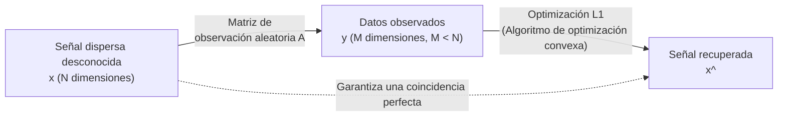

# ¿Qué es el Compressed Sensing (Muestreo Compresivo)?

Uno de los cambios de paradigma más revolucionarios en la ciencia de datos moderna y el procesamiento de señales es el "Compressed Sensing" (o Compressive Sensing). Tradicionalmente, cuando convertimos señales analógicas, como audio, imágenes y ondas electromagnéticas, en datos digitales para un ordenador, hemos seguido una regla absoluta: el "Teorema de muestreo de Nyquist-Shannon". Sin embargo, el Compressed Sensing anula este sentido común y ofrece una sorprendente garantía matemática: "Si una señal cumple cierta condición (esparcidad), la señal original puede recuperarse completamente a partir de una cantidad de datos observados mucho menor a la que exige el teorema de muestreo".

En este artículo, comenzaremos con los fundamentos del teorema de muestreo y explicaremos en profundidad, con fórmulas, la definición matemática de la esparcidad, la relajación al problema de optimización $L_1$ y el núcleo del avance teórico de Emmanuel Candès, Terence Tao y otros. Además, cubriremos casos de aplicación como la aceleración de resonancias magnéticas (MRI) y la reconstrucción de imágenes de agujeros negros, junto con un código de implementación específico utilizando Python, para revelar el panorama completo del Compressed Sensing.

## 1. El teorema de muestreo de Nyquist-Shannon y sus limitaciones

### Fundamentos del teorema de muestreo
A mediados del siglo XX, el "Teorema de muestreo" se estableció como la base de la teoría de la información por Claude Shannon y Harry Nyquist. Este teorema define las condiciones para convertir una señal analógica continua en una señal digital discreta de la siguiente manera:

> **Teorema de muestreo de Nyquist-Shannon**
> Para reconstruir completamente una señal limitada a un ancho de banda de $f_{\max}$, la señal debe ser muestreada a una frecuencia de muestreo (tasa de Nyquist) de al menos $2f_{\max}$.

Por ejemplo, el límite superior del rango audible para el oído humano es de unos 20 kHz. Por lo tanto, en los CD de audio, el muestreo se realiza a más del doble, es decir, a 44,1 kHz. Expresado matemáticamente, si una señal continua $x(t)$ tiene una transformada de Fourier $X(f)$ y $X(f) = 0$ para $|f| > f_{\max}$, $x(t)$ se puede recuperar completamente usando la siguiente fórmula de interpolación con la función sinc:

$$ x(t) = \sum_{n=-\infty}^{\infty} x\left(\frac{n}{2f_{\max}}\right) \operatorname{sinc}\left(2f_{\max}t - n\right) $$

### La explosión de datos y los límites del teorema
El teorema de muestreo es extremadamente poderoso y sirve como la piedra angular de las comunicaciones digitales modernas. Sin embargo, con el avance de la tecnología, la cantidad de información capturada por los sensores ha explotado. En imágenes médicas de alta resolución (MRI o CT), matrices de radiotelescopios en astronomía y sistemas de radar de banda ultra ancha, muestrear de acuerdo con la tasa de Nyquist resulta en una cantidad masiva y prohibitiva de datos a observar.

Como resultado, surgen los siguientes problemas:
1. **Aumento del tiempo de escaneo**: Por ejemplo, en una resonancia magnética (MRI), se necesita mucho tiempo para recopilar datos, imponiendo una carga física al paciente.
2. **Limitaciones de hardware**: Fabricar convertidores A/D para muestrear señales de ultra alta frecuencia se vuelve técnicamente difícil o extremadamente caro.
3. **Presión sobre el almacenamiento de datos y las comunicaciones**: El costo de almacenar y transmitir cantidades masivas de datos muestreados se dispara.

El paradigma tradicional era "muestrear masivamente y luego comprimir por software (como JPEG o MP3) para descartar los datos innecesarios". Sin embargo, surge la pregunta: "Si finalmente vamos a descartar datos, ¿no podemos detectar (adquirir) directamente solo la información necesaria desde el principio?". Lo que hizo esto posible es el Compressed Sensing.

## 2. Definición matemática de la esparcidad (Sparsity)

La condición absoluta para que el Compressed Sensing funcione es la **esparcidad (Sparsity)**. La esparcidad se refiere a la propiedad de que "cuando una señal se transforma usando una base (método de representación) adecuada, la mayoría de sus componentes se vuelven cero (o valores muy cercanos a cero)".

### Formulación de un vector disperso
Consideremos una señal discreta (vector) de longitud $N$, $\mathbf{x} \in \mathbb{R}^N$. Supongamos que esta señal se puede expresar de la siguiente manera usando una matriz base ortogonal $\mathbf{\Psi} \in \mathbb{R}^{N \times N}$ (por ejemplo, una matriz de transformada de Fourier o de ondículas):

$$ \mathbf{x} = \mathbf{\Psi} \mathbf{s} $$

Aquí, $\mathbf{s} \in \mathbb{R}^N$ es el vector de coeficientes en la base $\mathbf{\Psi}$.
Cuando el número de elementos distintos de cero en este vector $\mathbf{s}$ es $K$ ($K \ll N$), se dice que $\mathbf{x}$ es **$K$-disperso ($K$-sparse)**. Matemáticamente, se define de la siguiente manera utilizando la norma $L_0$ (una función que cuenta el número de elementos distintos de cero):

$$ \|\mathbf{s}\|_0 = K $$

### La esparcidad en el mundo real
Sorprendentemente, muchas señales en el mundo natural se vuelven dispersas al elegir la base adecuada.
- **Imágenes**: Las imágenes naturales no son dispersas en el espacio de píxeles, pero al aplicar la transformada de ondículas o la transformada de coseno discreta (DCT), la mayoría de los componentes de alta frecuencia se acercan a cero, volviéndose dispersas (este es el principio de la compresión JPEG).
- **Audio**: Las señales de audio son continuas en el dominio del tiempo, pero en el dominio de la frecuencia (después de la transformada de Fourier), solo unos pocos componentes de frecuencia principales (frecuencia fundamental y armónicos) tienen valores significativos.

El Compressed Sensing es una tecnología que aprovecha esta "redundancia inherente en las señales" para realizar la compresión de datos simultáneamente en la etapa de muestreo.

## 3. Formulación del Compressed Sensing y la matriz de observación

Asumiendo que la señal es dispersa, ¿cómo recuperamos la señal a partir de una pequeña cantidad de datos?
Supongamos que realizamos $M$ observaciones lineales ($M < N$) de una señal desconocida $\mathbf{x} \in \mathbb{R}^N$. El proceso de observación se expresa de la siguiente manera utilizando una matriz de observación $\mathbf{\Phi} \in \mathbb{R}^{M \times N}$:

$$ \mathbf{y} = \mathbf{\Phi} \mathbf{x} = \mathbf{\Phi} \mathbf{\Psi} \mathbf{s} = \mathbf{A} \mathbf{s} $$

Aquí,
- $\mathbf{y} \in \mathbb{R}^M$: Vector de datos observados
- $\mathbf{A} = \mathbf{\Phi} \mathbf{\Psi} \in \mathbb{R}^{M \times N}$: Matriz de sensado

Nuestro objetivo es recuperar el vector de coeficientes desconocido $\mathbf{s}$ (y, en última instancia, $\mathbf{x}$) a partir de los datos observados dados $\mathbf{y}$ y la matriz $\mathbf{A}$.

### El problema de los sistemas subdeterminados
Sin embargo, aquí nos enfrentamos a un muro matemático. Dado que $M < N$ (hay más incógnitas que ecuaciones), este sistema de ecuaciones simultáneas $\mathbf{y} = \mathbf{A} \mathbf{s}$ se convierte en un **sistema subdeterminado (underdetermined system)**, que tiene infinitas soluciones. Es imposible encontrar una solución única usando álgebra lineal ordinaria.

Aquí es donde entra en juego el conocimiento previo de que "$\mathbf{s}$ es disperso (tiene muy pocos componentes distintos de cero)". Si buscamos la solución más dispersa (la que tiene menos componentes distintos de cero) de entre los innumerables candidatos, es muy probable que sea la verdadera señal. Formular esto como un problema de optimización resulta en lo siguiente:

$$ (P_0) \quad \min_{\mathbf{s} \in \mathbb{R}^N} \|\mathbf{s}\|_0 \quad \text{sujeto a} \quad \mathbf{y} = \mathbf{A} \mathbf{s} $$

### La dificultad de la optimización $L_0$
Idealmente, simplemente resolveríamos el problema $(P_0)$ anterior, pero se sabe matemáticamente que minimizar $\|\mathbf{s}\|_0$ es un problema **NP-hard**. Requiere verificar de manera exhaustiva las combinaciones de componentes no nulos, y a medida que la dimensión $N$ aumenta, incluso los superordenadores modernos tardarían más que la vida del universo en resolverlo.

## 4. Relajación al problema de optimización $L_1$: El avance de Candès y Tao

La razón por la que el Compressed Sensing se difundió de manera explosiva como una tecnología práctica es que se proporcionó una asombrosa demostración matemática de que, incluso si este problema de optimización $L_0$ irresoluble se reemplaza por un **problema de optimización $L_1$** computable, **se llegará exactamente a la misma respuesta correcta** bajo ciertas condiciones.

Entre 2004 y 2006, Emmanuel Candès, Terence Tao y David Donoho construyeron una base sólida para esta teoría.

### Minimización de la norma $L_1$
En lugar de la norma $L_0$, utilizamos la norma $L_1$, que es la suma de los valores absolutos de los elementos del vector.

$$ \|\mathbf{s}\|_1 = \sum_{i=1}^N |s_i| $$

Esto permite relajar (relaxation) el problema a lo siguiente:

$$ (P_1) \quad \min_{\mathbf{s} \in \mathbb{R}^N} \|\mathbf{s}\|_1 \quad \text{sujeto a} \quad \mathbf{y} = \mathbf{A} \mathbf{s} $$

El problema de minimización $L_1$ es un tipo de problema de optimización convexa y, utilizando algoritmos altamente eficientes existentes como la programación lineal (Linear Programming), la solución exacta se puede calcular en tiempo polinómico.

### ¿Por qué $L_1$? (Intuición geométrica)
¿Por qué la norma $L_1$ en lugar de la norma $L_2$ (método de mínimos cuadrados)? Esto se puede entender geométricamente.
La restricción $\mathbf{y} = \mathbf{A}\mathbf{s}$ forma un hiperplano en un espacio de alta dimensión. Minimizar la norma equivale a expandir una superficie de contorno (bola) centrada en el origen hasta encontrar el primer punto en el que entra en contacto con este hiperplano.

- **Bola $L_2$ ($\|\mathbf{s}\|_2 \le R$)**: La forma es una esfera suave. El punto de contacto con el hiperplano estará casi siempre lejos de los ejes de coordenadas, dando como resultado una solución donde todos los elementos son no nulos ("densa").
- **Bola $L_1$ ($\|\mathbf{s}\|_1 \le R$)**: La forma es un poliedro (rombo, octaedro, etc.) y tiene muchas "esquinas (vértices)". Estas esquinas se encuentran en los ejes de coordenadas. Al presionar el hiperplano, es muy probable que entre en contacto en estas "esquinas". El hecho de que el contacto sea en una esquina significa que los valores en otros ejes de coordenadas son cero, lo que da como resultado una solución dispersa.

### RIP (Propiedad de Isometría Restringida)
Candès y Tao introdujeron el concepto de **RIP (Propiedad de Isometría Restringida)** como una condición suficiente para que la minimización $L_1$ coincida con la minimización $L_0$.
Una matriz de sensado $\mathbf{A}$ cumple el RIP de orden $K$ si existe una pequeña constante $\delta_K \in (0,1)$ tal que, para cualquier vector $K$-disperso $\mathbf{s}$, se cumple la siguiente desigualdad:

$$ (1 - \delta_K) \|\mathbf{s}\|_2^2 \le \|\mathbf{A}\mathbf{s}\|_2^2 \le (1 + \delta_K) \|\mathbf{s}\|_2^2 $$

Intuitivamente, es la propiedad de que "la matriz $\mathbf{A}$ preserva (casi) la longitud de cualquier vector disperso". Candès y Tao demostraron brillantemente que si $\mathbf{A}$ cumple cierta condición RIP, la solución de $(P_1)$ coincide exactamente con la solución de $(P_0)$ en condiciones sin ruido.

Además, desde un punto de vista práctico, se demostró que el uso de una **matriz aleatoria (una matriz de números aleatorios que sigue una distribución gaussiana o de Bernoulli)** como matriz de observación $\mathbf{\Phi}$ cumple con el RIP con alta probabilidad. En otras palabras, "observar aleatoriamente" es la estrategia de muestreo más eficiente y universal en Compressed Sensing.

Se ha demostrado que el número de observaciones $M$ requeridas es suficiente en el siguiente orden con respecto a la longitud de la señal $N$ y la esparcidad $K$:

$$ M \ge C \cdot K \log\left(\frac{N}{K}\right) $$
(donde $C$ es una constante)

Esto significa que requiere un número de observaciones mucho menor (que depende de $K$) en comparación con las $N$ observaciones que exige el teorema de muestreo.

## 5. Casos de aplicación del Compressed Sensing

La teoría del Compressed Sensing ha revolucionado todos los campos de la ingeniería de la información y la física.

### 1. Aceleración de la Resonancia Magnética (MRI)
Una de las aplicaciones comerciales más exitosas es la resonancia magnética (MRI). La resonancia magnética utiliza un campo magnético fuerte para obtener imágenes transversales del cuerpo humano, pero la recopilación de datos (datos en el dominio de la frecuencia llamados espacio k) tiene limitaciones físicas y lleva tiempo.
Estar inmovilizado durante mucho tiempo es difícil al fotografiar pacientes pediátricos u órganos en movimiento como el corazón. Al aplicar el Compressed Sensing a la resonancia magnética, el muestreo de datos del espacio k se puede reducir de forma aleatoria, logrando reducir el tiempo de escaneo a una fracción del tiempo convencional. Actualmente, los principales fabricantes de equipos médicos como Siemens y GE venden máquinas de resonancia magnética que incluyen la tecnología de Compressed Sensing como característica estándar.

### 2. Toma de imágenes de agujeros negros (Event Horizon Telescope)
En 2019, el equipo de investigación internacional "Event Horizon Telescope (EHT)" logró capturar la primera imagen de la sombra de un agujero negro en la historia de la humanidad. Para construir un telescopio virtual gigante del tamaño de la Tierra, integraron datos de radiotelescopios repartidos por todo el mundo (Interferometría de Muy Larga Base: VLBI), pero hay un límite en la ubicación de los telescopios en la Tierra, y los datos observados tenían enormes "vacíos (datos faltantes)".
Para reconstruir la imagen del agujero negro a partir de estos datos escasos, se desarrolló un algoritmo llamado CHIRP (Continuous High-resolution Image Reconstruction using Patch priors). Esto también se puede considerar una aplicación del Compressed Sensing, aprovechando la esparcidad y el conocimiento previo estructural inherente en las imágenes espaciales.

### 3. Cámara de un solo píxel (Single-Pixel Camera)
Un equipo de investigación de la Universidad de Rice desarrolló una cámara con solo un elemento receptor de luz (píxel).
Utilizando un DMD (Dispositivo de Microespejo Digital), refleja la luz del objeto en un patrón aleatorio y mide la suma total con un solo sensor. Repitiendo esto miles de veces, reconstruyen una imagen de millones de píxeles. Esta tecnología es muy útil para la captura de imágenes en bandas de longitud de onda, como el infrarrojo o las ondas de terahercios, donde la fabricación de sensores multipíxel es extremadamente cara.

## 6. Ejemplo de implementación de Compressed Sensing en Python

Dado que puede ser difícil de entender solo con teoría, realicemos una simulación de Compressed Sensing usando Python.
Aquí, generaremos una señal dispersa unidimensional y recuperaremos la señal original a partir de unas pocas observaciones aleatorias utilizando la optimización $L_1$. Usaremos la biblioteca `cvxpy` para la optimización.

### Instalación de las bibliotecas necesarias
```bash
pip install numpy matplotlib cvxpy
```

### Código de implementación

```python
import numpy as np
import matplotlib.pyplot as plt
import cvxpy as cp

# Fijar la semilla de números aleatorios
np.random.seed(42)

# --- 1. Configuración del problema ---
N = 1000  # Dimensión de la señal (número original a muestrear)
K = 50    # Grado de esparcidad (número de elementos no nulos)
M = 250   # Número de observaciones (solo el 25% de N)

# --- 2. Generación de la señal original dispersa ---
# Crear la señal original x_true (valores iniciales todo en cero)
x_true = np.zeros(N)
# Elegir K índices aleatorios y asignar valores no nulos (distribución gaussiana)
nonzero_indices = np.random.choice(N, K, replace=False)
x_true[nonzero_indices] = np.random.randn(K)

# --- 3. Simulación del proceso de observación ---
# Generar una matriz de observación gaussiana aleatoria A (M x N)
A = np.random.randn(M, N)
# Normalizar por columnas (hacer que la norma sea 1)
A = A / np.linalg.norm(A, axis=0)

# Datos observados y = A * x_true
y = A @ x_true

# --- 4. Recuperación de la señal mediante Compressed Sensing (optimización L1) ---
# Definir el problema de optimización usando cvxpy
x_reconstruct = cp.Variable(N)
# Función objetivo: Minimización de la norma L1
objective = cp.Minimize(cp.norm(x_reconstruct, 1))
# Restricción: y = A * x (coincidencia con los datos observados)
constraints = [A @ x_reconstruct == y]

# Definir y resolver el problema
prob = cp.Problem(objective, constraints)
print("Ejecutando el cálculo de optimización...")
prob.solve(solver=cp.ECOS)

# Señal recuperada
x_rec = x_reconstruct.value

# --- 5. Visualización de los resultados ---
plt.figure(figsize=(12, 6))

plt.subplot(2, 1, 1)
plt.plot(x_true, label='Señal verdadera', alpha=0.7)
plt.title(f'Señal dispersa original (N={N}, K={K})')
plt.legend()
plt.grid(True)

plt.subplot(2, 1, 2)
plt.plot(x_rec, color='red', label='Señal recuperada', alpha=0.7)
plt.title(f'Recuperación mediante minimización L1 (M={M} mediciones)')
plt.legend()
plt.grid(True)

plt.tight_layout()
plt.show()

# Comprobación de la precisión de recuperación
error = np.linalg.norm(x_true - x_rec)
print(f"Error de recuperación (norma L2): {error:.6e}")
```

### Explicación del código
1. **Generación de la señal**: Se crea un vector disperso `x_true` de dimensión $N=1000$ en el que solo $K=50$ ubicaciones tienen valores (el resto son ceros).
2. **Observación**: Según el teorema de muestreo, se necesitarían 1000 mediciones, pero aquí usamos una matriz de observación aleatoria `A` con solo $M=250$ (25%) observaciones para obtener los datos `y`.
3. **Recuperación**: Con solo los datos observados `y` y la matriz `A` como entradas, usamos `cvxpy` para encontrar "el $\mathbf{x}$ con la menor norma $L_1$ que satisfaga $\mathbf{y} = \mathbf{A}\mathbf{x}$".
4. **Resultado**: Al completarse el cálculo, el error de recuperación es extremadamente pequeño, por debajo de `1e-9`, confirmando que la señal original se ha **recuperado de manera exacta** a partir de solo el 25% de los datos observados.



## 7. Resumen y perspectivas de futuro

El Compressed Sensing supuso un cambio de paradigma fundamental en la historia del procesamiento de señales. El enfoque de "medir de manera inteligente solo lo necesario desde el principio", en lugar de "medir masivamente y luego descartar", está respaldado por profundas teorías matemáticas (optimización convexa, [teoría de matrices aleatorias](/es/p/random-matrix-theory/), geometría de alta dimensión).

Actualmente, se realizan muchas investigaciones que combinan el aprendizaje profundo (Deep Learning) con el Compressed Sensing. En lugar del algoritmo tradicional de optimización $L_1$, el enfoque que utiliza redes neuronales para resolver problemas inversos de manera más rápida y precisa (Deep Unfolding / Algorithm Unrolling) se está volviendo la corriente principal. Esto permite aprender el diseño de la propia matriz de observación a partir de datos, lo que conduce a una mayor aceleración de la resonancia magnética y la reconstrucción de imágenes resistentes al ruido.

La magia matemática del Compressed Sensing para ver con precisión el conjunto a partir de poca información continuará brindándonos una nueva "visión" en cualquier campo donde la explosión de datos sea un desafío, como la conducción autónoma, las redes de sensores de IoT y la exploración espacial.
