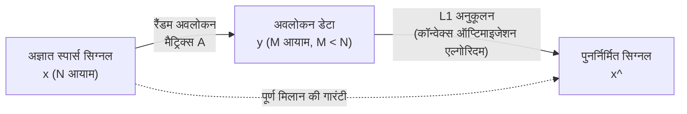

# कंप्रेस्ड सेंसिंग (Compressed Sensing) क्या है?

आधुनिक डेटा विज्ञान और सिग्नल प्रोसेसिंग में, "कंप्रेस्ड सेंसिंग (Compressed Sensing / Compressive Sensing)" सबसे क्रांतिकारी प्रतिमान बदलावों (paradigm shifts) में से एक है। पारंपरिक रूप से, जब ऑडियो, छवियों, या विद्युत चुम्बकीय तरंगों जैसे एनालॉग सिग्नलों को डिजिटल डेटा के रूप में कंप्यूटर में कैप्चर किया जाता है, तो हम "Nyquist-Shannon सैंपलिंग प्रमेय" नामक एक पूर्ण नियम का पालन करते रहे हैं। हालाँकि, कंप्रेस्ड सेंसिंग इस सामान्य ज्ञान को पलट देता है और एक आश्चर्यजनक गणितीय गारंटी प्रदान करता है: "यदि कोई सिग्नल किसी निश्चित शर्त (स्पार्सिटी/Sparsity) को पूरा करता है, तो मूल सिग्नल को सैंपलिंग प्रमेय द्वारा आवश्यक अवलोकनों की तुलना में बहुत कम डेटा से पूरी तरह से पुनर्निर्मित (reconstruct) किया जा सकता है।"

इस लेख में, हम सैंपलिंग प्रमेय की मूल बातें से शुरू करेंगे, और स्पार्सिटी की गणितीय परिभाषा, $L_1$ अनुकूलन समस्या (optimization problem) में शिथिलीकरण (relaxation), और इमैनुएल कैंडेस (Emmanuel Candès) और टेरेंस ताओ (Terence Tao) जैसे लोगों द्वारा सैद्धांतिक सफलताओं (theoretical breakthroughs) के मूल को गणितीय सूत्रों के साथ गहराई से समझाएंगे। इसके अलावा, हम एमआरआई (MRI) के त्वरण और ब्लैक होल इमेजिंग जैसे अनुप्रयोगों (applications), और पायथन का उपयोग करके विशिष्ट कार्यान्वयन (implementation) कोड को भी शामिल करेंगे, जिससे कंप्रेस्ड सेंसिंग की पूरी तस्वीर स्पष्ट हो जाएगी।

## 1. Nyquist-Shannon सैंपलिंग प्रमेय और इसकी सीमाएं

### सैंपलिंग प्रमेय की मूल बातें
20वीं सदी के मध्य में क्लॉड शैनन (Claude Shannon) और हैरी नाइक्विस्ट (Harry Nyquist) द्वारा स्थापित सूचना सिद्धांत की नींव में "सैंपलिंग प्रमेय" शामिल है। यह प्रमेय निरंतर एनालॉग सिग्नलों को असतत (discrete) डिजिटल सिग्नलों में परिवर्तित करने की शर्तों को निम्नानुसार परिभाषित करता है:

> **Nyquist-Shannon सैंपलिंग प्रमेय**
> बैंडविड्थ $f_{\max}$ तक सीमित सिग्नल को पूरी तरह से फिर से बनाने के लिए, सिग्नल को कम से कम $2f_{\max}$ की सैंपलिंग आवृत्ति (नाइक्विस्ट दर) पर सैंपल किया जाना चाहिए।

उदाहरण के लिए, मानव कान द्वारा सुनी जा सकने वाली श्रव्य सीमा (audible range) की ऊपरी सीमा लगभग 20 kHz है। इसलिए, संगीत सीडी को इससे दोगुने से अधिक, 44.1 kHz पर सैंपल किया जाता है। गणितीय रूप से, यदि एक निरंतर सिग्नल $x(t)$ का फूरियर रूपांतरण $X(f)$ है और $|f| > f_{\max}$ के लिए $X(f) = 0$ है, तो $x(t)$ को निम्नलिखित सिंक फ़ंक्शन (sinc function) का उपयोग करके प्रक्षेप सूत्र (interpolation formula) द्वारा पूरी तरह से पुनर्निर्मित किया जा सकता है:

$$ x(t) = \sum_{n=-\infty}^{\infty} x\left(\frac{n}{2f_{\max}}\right) \operatorname{sinc}\left(2f_{\max}t - n\right) $$

### डेटा विस्फोट और प्रमेय की सीमाएं
सैंपलिंग प्रमेय बहुत शक्तिशाली है और आधुनिक डिजिटल संचार की आधारशिला है। हालाँकि, तकनीकी प्रगति के साथ, सेंसर द्वारा कैप्चर की जाने वाली जानकारी की मात्रा में भारी वृद्धि हुई है। उच्च-रिज़ॉल्यूशन चिकित्सा इमेजिंग (MRI या CT), खगोलीय रेडियो टेलीस्कोप एरे, और अल्ट्रा-वाइडबैंड रडार सिस्टम आदि में, यदि नाइक्विस्ट दर के अनुसार सैंपलिंग की जाती है, तो देखे जाने वाले डेटा की मात्रा बहुत अधिक हो जाती है।

परिणामस्वरूप, निम्नलिखित समस्याएं उत्पन्न होती हैं:
1. **स्कैन के समय में वृद्धि**: उदाहरण के लिए, MRI में, डेटा एकत्र करने में लंबा समय लगता है, जिससे रोगियों पर शारीरिक बोझ पड़ता है।
2. **हार्डवेयर की सीमाएं**: अल्ट्रा-हाई-फ्रीक्वेंसी सिग्नलों को सैंपल करने के लिए A/D कन्वर्टर्स का निर्माण तकनीकी रूप से कठिन या बेहद महंगा हो जाता है।
3. **डेटा स्टोरेज और संचार पर दबाव**: भारी मात्रा में सैंपलिंग डेटा को सहेजने और प्रसारित करने की लागत बढ़ जाती है।

पारंपरिक दृष्टिकोण यह था "बड़ी मात्रा में सैंपल लें, और फिर अनावश्यक डेटा को त्यागने के लिए सॉफ़्टवेयर (जैसे JPEG या MP3) का उपयोग करके इसे संपीड़ित (compress) करें।" हालाँकि, यह सवाल उठता है: "यदि हमें अंततः इसे त्यागना ही है, तो क्या हम शुरू से ही केवल आवश्यक जानकारी सीधे प्राप्त (सेंस) नहीं कर सकते?" कंप्रेस्ड सेंसिंग ने इसे संभव बनाया है।

## 2. स्पार्सिटी (Sparsity) की गणितीय परिभाषा

कंप्रेस्ड सेंसिंग के काम करने के लिए पूर्ण शर्त **स्पार्सिटी (Sparsity, विरलता)** है। स्पार्सिटी का अर्थ है कि "जब किसी सिग्नल को एक उपयुक्त आधार (basis / प्रतिनिधित्व विधि) में बदला जाता है, तो इसके अधिकांश घटक शून्य (या शून्य के बहुत करीब) हो जाते हैं।"

### स्पार्स वेक्टर का सूत्रीकरण
मान लें कि हमारे पास लंबाई $N$ का एक असतत (discrete) सिग्नल (वेक्टर) $\mathbf{x} \in \mathbb{R}^N$ है। मान लीजिए कि यह सिग्नल एक ऑर्थोगोनल बेसिस मैट्रिक्स (orthogonal basis matrix) $\mathbf{\Psi} \in \mathbb{R}^{N \times N}$ (उदाहरण के लिए, फूरियर ट्रांसफॉर्म मैट्रिक्स या वेवलेट ट्रांसफॉर्म मैट्रिक्स) का उपयोग करके निम्नानुसार व्यक्त किया जा सकता है:

$$ \mathbf{x} = \mathbf{\Psi} \mathbf{s} $$

यहाँ, $\mathbf{s} \in \mathbb{R}^N$, आधार $\mathbf{\Psi}$ पर गुणांक वेक्टर (coefficient vector) है।
इस वेक्टर $\mathbf{s}$ में, यदि गैर-शून्य तत्वों (non-zero elements) की संख्या $K$ है (जहाँ $K \ll N$), तो $\mathbf{x}$ को **$K$-स्पार्स ($K$-sparse)** कहा जाता है। गणितीय रूप से, इसे $L_0$ नॉर्म (एक फलन जो गैर-शून्य तत्वों की संख्या गिनता है) का उपयोग करके इस प्रकार परिभाषित किया जाता है:

$$ \|\mathbf{s}\|_0 = K $$

### वास्तविक दुनिया में स्पार्सिटी
आश्चर्यजनक रूप से, प्रकृति में मौजूद कई सिग्नल उपयुक्त आधार चुनने पर स्पार्स बन जाते हैं।
- **छवियां (Images)**: प्राकृतिक छवियां पिक्सेल स्पेस में स्पार्स नहीं होती हैं, लेकिन जब वेवलेट ट्रांसफॉर्म या डिस्क्रीट कोसाइन ट्रांसफॉर्म (DCT) किया जाता है, तो अधिकांश उच्च-आवृत्ति (high-frequency) घटक शून्य के करीब पहुंच जाते हैं और यह स्पार्स हो जाती हैं (यह JPEG संपीड़न का सिद्धांत है)।
- **ध्वनि (Audio)**: ध्वनि सिग्नल समय डोमेन में निरंतर होते हैं, लेकिन आवृत्ति डोमेन (फूरियर ट्रांसफॉर्म के बाद) में, केवल कुछ मुख्य आवृत्ति घटकों (मौलिक आवृत्ति और हार्मोनिक्स) के मान बड़े होते हैं।

कंप्रेस्ड सेंसिंग एक ऐसी तकनीक है जो "सिग्नल में अंतर्निहित अतिरिक्तता (redundancy)" का उपयोग करके सैंपलिंग चरण के दौरान ही डेटा संपीड़न कर देती है।

## 3. कंप्रेस्ड सेंसिंग का सूत्रीकरण और अवलोकन मैट्रिक्स

यह मानते हुए कि सिग्नल स्पार्स है, हम कम डेटा से सिग्नल को कैसे पुनर्निर्मित करते हैं?
मान लें कि हम एक अज्ञात सिग्नल $\mathbf{x} \in \mathbb{R}^N$ के लिए $M$ रैखिक अवलोकन (linear observations) करते हैं ($M < N$)। अवलोकन प्रक्रिया को अवलोकन मैट्रिक्स $\mathbf{\Phi} \in \mathbb{R}^{M \times N}$ का उपयोग करके निम्नानुसार दर्शाया जाता है:

$$ \mathbf{y} = \mathbf{\Phi} \mathbf{x} = \mathbf{\Phi} \mathbf{\Psi} \mathbf{s} = \mathbf{A} \mathbf{s} $$

यहाँ:
- $\mathbf{y} \in \mathbb{R}^M$: अवलोकन डेटा वेक्टर
- $\mathbf{A} = \mathbf{\Phi} \mathbf{\Psi} \in \mathbb{R}^{M \times N}$: सेंसिंग मैट्रिक्स

हमारा लक्ष्य दिए गए अवलोकन डेटा $\mathbf{y}$ और मैट्रिक्स $\mathbf{A}$ से अज्ञात गुणांक वेक्टर $\mathbf{s}$ (और अंततः $\mathbf{x}$) को पुनर्निर्मित करना है।

### अंडरडिटरमाइंड सिस्टम (Underdetermined System) की समस्या
हालाँकि, यहाँ हम एक गणितीय दीवार का सामना करते हैं। चूँकि $M < N$ (समीकरणों की संख्या से अज्ञात की संख्या अधिक है), यह रैखिक समीकरण प्रणाली $\mathbf{y} = \mathbf{A} \mathbf{s}$ एक **अंडरडिटरमाइंड सिस्टम (underdetermined system)** बन जाती है, और इसके अनंत समाधान (infinite solutions) होते हैं। सामान्य रैखिक बीजगणित (linear algebra) में एक अद्वितीय समाधान (unique solution) खोजना असंभव है।

यहाँ हम इस पूर्व ज्ञान (prior knowledge) का उपयोग करते हैं कि "$\mathbf{s}$ स्पार्स है (गैर-शून्य घटक बहुत कम हैं)"। अनंत उम्मीदवार समाधानों में से, यदि हम सबसे स्पार्स (सबसे कम गैर-शून्य घटकों वाले) समाधान की खोज करते हैं, तो इसके वास्तविक सिग्नल होने की अत्यधिक संभावना है। एक अनुकूलन समस्या (optimization problem) के रूप में तैयार करने पर यह इस प्रकार दिखता है:

$$ (P_0) \quad \min_{\mathbf{s} \in \mathbb{R}^N} \|\mathbf{s}\|_0 \quad \text{subject to} \quad \mathbf{y} = \mathbf{A} \mathbf{s} $$

### $L_0$ अनुकूलन की कठिनाई
आदर्श रूप से, हमें उपरोक्त $(P_0)$ समस्या को हल करना चाहिए, लेकिन गणितीय रूप से $\|\mathbf{s}\|_0$ न्यूनीकरण समस्या (minimization problem) को **NP-hard** माना जाता है। गैर-शून्य घटकों के संयोजनों की पूरी तरह से जांच करना आवश्यक है, और जैसे-जैसे आयाम $N$ बढ़ता है, आधुनिक सुपरकंप्यूटरों का उपयोग करने पर भी इसमें ब्रह्मांड के जीवनकाल से अधिक समय लगेगा।

## 4. $L_1$ अनुकूलन समस्या में शिथिलीकरण: कैंडेस और ताओ की सफलता

कंप्रेस्ड सेंसिंग के एक व्यावहारिक तकनीक के रूप में विस्फोटक रूप से लोकप्रिय होने का कारण यह आश्चर्यजनक गणितीय प्रमाण था कि भले ही इस अनसुलझी $L_0$ अनुकूलन समस्या को एक गणना योग्य **$L_1$ अनुकूलन समस्या** से बदल दिया जाए, फिर भी कुछ शर्तों के तहत हम **बिल्कुल उसी सही उत्तर** तक पहुँच सकते हैं।

2004 और 2006 के बीच, इमैनुएल कैंडेस (Emmanuel Candès), टेरेंस ताओ (Terence Tao), और डेविड डोनोहो (David Donoho) ने इस सिद्धांत की एक मजबूत नींव रखी।

### $L_1$ नॉर्म न्यूनीकरण (Minimization)
$L_0$ नॉर्म के बजाय, हम $L_1$ नॉर्म का उपयोग करते हैं, जो वेक्टर के प्रत्येक तत्व के निरपेक्ष मानों (absolute values) का योग है:

$$ \|\mathbf{s}\|_1 = \sum_{i=1}^N |s_i| $$

इससे समस्या निम्नानुसार शिथिल (relax) हो जाती है:

$$ (P_1) \quad \min_{\mathbf{s} \in \mathbb{R}^N} \|\mathbf{s}\|_1 \quad \text{subject to} \quad \mathbf{y} = \mathbf{A} \mathbf{s} $$

$L_1$ न्यूनीकरण समस्या कॉन्वेक्स ऑप्टिमाइजेशन (convex optimization) समस्या का एक प्रकार है, और इसके सटीक समाधान की गणना बहुपद समय (polynomial time) में लीनियर प्रोग्रामिंग (Linear Programming) जैसे मौजूदा अत्यधिक कुशल एल्गोरिदम का उपयोग करके की जा सकती है।

### $L_1$ ही क्यों? (ज्यामितीय अंतर्ज्ञान)
$L_2$ नॉर्म (कम से कम वर्ग विधि / least squares) के बजाय $L_1$ नॉर्म ही क्यों? इसे ज्यामितीय (geometrically) रूप से समझा जा सकता है।
शर्त $\mathbf{y} = \mathbf{A}\mathbf{s}$ उच्च-आयामी (high-dimensional) अंतरिक्ष में एक हाइपरप्लेन (hyperplane) बनाती है। नॉर्म को कम करने का अर्थ है मूल बिंदु (origin) पर केंद्रित एक समोच्च सतह (कंटूर बॉल) का विस्तार करना और वह बिंदु खोजना जहां यह पहली बार इस हाइपरप्लेन को छूता है।

- **$L_2$ बॉल ($\|\mathbf{s}\|_2 \le R$)**: इसका आकार एक चिकना गोला (smooth sphere) है। हाइपरप्लेन को छूने वाला बिंदु अधिकतर सभी समन्वय अक्षों (coordinate axes) से दूर एक स्थान होगा, जिसके परिणामस्वरूप एक "सघन (dense)" वेक्टर समाधान मिलेगा जिसमें सभी तत्व गैर-शून्य होंगे।
- **$L_1$ बॉल ($\|\mathbf{s}\|_1 \le R$)**: इसका आकार एक पॉलीहेड्रॉन (polyhedron - जैसे समचतुर्भुज, ऑक्टाहेड्रॉन आदि) है और इसमें कई "कोने (शीर्ष)" होते हैं। ये कोने समन्वय अक्षों (coordinate axes) पर स्थित होते हैं। जब हाइपरप्लेन को इसके खिलाफ दबाया जाता है, तो इसकी उच्च संभावना होती है कि यह इन "कोनों" में से किसी एक पर स्पर्श करेगा। कोने पर छूने का मतलब है कि अन्य समन्वय अक्षों का मान शून्य होगा, जिसके परिणामस्वरूप एक स्पार्स समाधान प्राप्त होता है।

### RIP (Restricted Isometry Property: प्रतिबंधित आइसोमेट्री संपत्ति)
कैंडेस और ताओ ने **RIP (प्रतिबंधित आइसोमेट्री संपत्ति)** की अवधारणा को एक पर्याप्त शर्त (sufficient condition) के रूप में पेश किया ताकि यह सुनिश्चित किया जा सके कि $L_1$ न्यूनीकरण $L_0$ न्यूनीकरण से मेल खाता है।
क्रम $K$ के RIP को संतुष्ट करने वाले सेंसिंग मैट्रिक्स $\mathbf{A}$ का अर्थ है कि किसी भी $K$-स्पार्स वेक्टर $\mathbf{s}$ के लिए एक छोटा स्थिरांक $\delta_K \in (0,1)$ मौजूद है जो निम्नलिखित असमानता को संतुष्ट करता है:

$$ (1 - \delta_K) \|\mathbf{s}\|_2^2 \le \|\mathbf{A}\mathbf{s}\|_2^2 \le (1 + \delta_K) \|\mathbf{s}\|_2^2 $$

सहज रूप से, इसका मतलब है कि "मैट्रिक्स $\mathbf{A}$ किसी भी स्पार्स वेक्टर की लंबाई को लगभग अपरिवर्तित रखते हुए संरक्षित करता है।" कैंडेस और ताओ ने शानदार ढंग से साबित कर दिया कि यदि $\mathbf{A}$ कुछ RIP शर्तों को पूरा करता है, तो बिना शोर (noise) वाली स्थिति में $(P_1)$ का समाधान पूरी तरह से $(P_0)$ के समाधान के समान होगा।

एक अधिक व्यावहारिक दृष्टिकोण से, यह दिखाया गया कि यदि एक **रैंडम मैट्रिक्स (जैसे कि गॉसियन या बर्नौली वितरण का पालन करने वाला यादृच्छिक संख्या मैट्रिक्स)** का उपयोग अवलोकन मैट्रिक्स $\mathbf{\Phi}$ के रूप में किया जाता है, तो यह उच्च संभावना के साथ RIP को संतुष्ट करेगा। दूसरे शब्दों में, कंप्रेस्ड सेंसिंग में "यादृच्छिक रूप से अवलोकन (random sensing)" सबसे कुशल और सार्वभौमिक सैंपलिंग रणनीति बन जाती है।

यह साबित हो चुका है कि आवश्यक अवलोकनों की संख्या $M$, सिग्नल की लंबाई $N$ और स्पार्सिटी $K$ के संबंध में निम्न क्रम (order) के लिए पर्याप्त है:

$$ M \ge C \cdot K \log\left(\frac{N}{K}\right) $$
(जहाँ $C$ एक स्थिरांक है)

इसका मतलब यह है कि सैंपलिंग प्रमेय द्वारा आवश्यक $N$ अवलोकनों की तुलना में बहुत कम अवलोकनों (जो $K$ पर निर्भर करता है) की आवश्यकता है।

## 5. कंप्रेस्ड सेंसिंग के अनुप्रयोग

कंप्रेस्ड सेंसिंग के सिद्धांत ने सूचना इंजीनियरिंग और भौतिकी के हर क्षेत्र में क्रांति ला दी है।

### 1. एमआरआई (MRI) का त्वरण
सबसे सफल व्यावसायिक अनुप्रयोगों में से एक एमआरआई है। एमआरआई मानव शरीर की क्रॉस-सेक्शनल छवियों को प्राप्त करने के लिए शक्तिशाली चुंबकीय क्षेत्रों का उपयोग करता है, लेकिन डेटा (आवृत्ति डोमेन डेटा जिसे k-स्पेस कहा जाता है) एकत्र करने की भौतिक सीमाएं हैं, और इसमें समय लगता है।
बाल रोगियों या हृदय जैसे गतिशील अंगों की इमेजिंग करते समय लंबे समय तक स्थिर रहना मुश्किल होता है। कंप्रेस्ड सेंसिंग को एमआरआई पर लागू करके, सैंपलिंग के लिए k-स्पेस डेटा को यादृच्छिक (randomly) रूप से कम करके स्कैन के समय को पारंपरिक समय के एक अंश तक कम करने में सफलता मिली। वर्तमान में, सीमेंस और जीई जैसे प्रमुख चिकित्सा उपकरण निर्माता कंप्रेस्ड सेंसिंग तकनीक से सुसज्जित एमआरआई बेचते हैं।

### 2. ब्लैक होल इमेजिंग (इवेंट होराइजन टेलीस्कोप)
2019 में, अंतर्राष्ट्रीय शोध दल "इवेंट होराइजन टेलीस्कोप (EHT)" ने मानव इतिहास में पहली बार ब्लैक होल शैडो की छवि सफलतापूर्वक कैप्चर की। पृथ्वी के आकार के विशाल आभासी टेलीस्कोप के निर्माण के लिए, दुनिया भर में बिखरे हुए रेडियो टेलीस्कोप से डेटा एकीकृत किया गया था (Very Long Baseline Interferometry: VLBI), लेकिन पृथ्वी पर टेलीस्कोप की नियुक्ति की सीमाएं थीं, और अवलोकन डेटा में बहुत सारे "अंतराल (missing data)" थे।
इस कम डेटा से ब्लैक होल की छवि को फिर से बनाने के लिए CHIRP (Continuous High-resolution Image Reconstruction using Patch priors) नामक एक एल्गोरिदम विकसित किया गया था। इसे भी कंप्रेस्ड सेंसिंग का एक अनुप्रयोग कहा जा सकता है जो अंतरिक्ष छवियों की स्पार्सिटी और संरचनात्मक पूर्व ज्ञान (structural prior knowledge) का उपयोग करता है।

### 3. सिंगल पिक्सेल कैमरा (Single-Pixel Camera)
राइस यूनिवर्सिटी (Rice University) की एक शोध टीम ने केवल एक लाइट-रिसीविंग एलिमेंट (पिक्सेल) वाला एक कैमरा विकसित किया है।
एक DMD (डिजिटल माइक्रोमिरर डिवाइस) का उपयोग करके, वस्तु के प्रकाश को एक यादृच्छिक पैटर्न (random pattern) में परावर्तित किया जाता है, और एक ही सेंसर से कुल योग मापा जाता है। इसे हजारों बार दोहराकर, लाखों पिक्सेल की छवि का पुनर्निर्माण किया जाता है। यह तकनीक उन तरंग दैर्ध्य बैंड (wavelength bands) में इमेजिंग के लिए अत्यंत उपयोगी है जहां मल्टी-पिक्सेल सेंसर का निर्माण अत्यधिक महंगा है, जैसे कि इन्फ्रारेड और टेराहर्ट्ज़ तरंगें।

## 6. पायथन के साथ कंप्रेस्ड सेंसिंग का कार्यान्वयन उदाहरण

चूँकि केवल सिद्धांत से इसे महसूस करना मुश्किल है, आइए वास्तव में पायथन का उपयोग करके कंप्रेस्ड सेंसिंग का अनुकरण (simulation) करें।
यहाँ, हम 1D स्पार्स सिग्नल उत्पन्न करेंगे और $L_1$ अनुकूलन का उपयोग करके थोड़ी संख्या में यादृच्छिक अवलोकनों से मूल सिग्नल को पुनर्निर्मित करेंगे। हम अनुकूलन के लिए `cvxpy` लाइब्रेरी का उपयोग करेंगे।

### आवश्यक लाइब्रेरी स्थापित करना
```bash
pip install numpy matplotlib cvxpy
```

### कार्यान्वयन कोड

```python
import numpy as np
import matplotlib.pyplot as plt
import cvxpy as cp

# यादृच्छिक बीज (random seed) सेट करना
np.random.seed(42)

# --- 1. समस्या सेटअप ---
N = 1000  # सिग्नल आयाम (मूल रूप से सैंपल की जाने वाली संख्या)
K = 50    # स्पार्सिटी (गैर-शून्य तत्वों की संख्या)
M = 250   # अवलोकन संख्या (N का केवल 25%)

# --- 2. स्पार्स वास्तविक सिग्नल बनाना ---
# वास्तविक सिग्नल x_true बनाएं (प्रारंभिक मान सभी शून्य हैं)
x_true = np.zeros(N)
# यादृच्छिक रूप से K अनुक्रमणिकाएं (indices) चुनें और गैर-शून्य मान सेट करें (गॉसियन वितरण)
nonzero_indices = np.random.choice(N, K, replace=False)
x_true[nonzero_indices] = np.random.randn(K)

# --- 3. अवलोकन प्रक्रिया का अनुकरण ---
# यादृच्छिक गॉसियन अवलोकन मैट्रिक्स A (M x N) बनाएं
A = np.random.randn(M, N)
# प्रत्येक कॉलम को सामान्यीकृत (normalize) करें (नॉर्म 1 बनाने के लिए)
A = A / np.linalg.norm(A, axis=0)

# अवलोकन डेटा y = A * x_true
y = A @ x_true

# --- 4. कंप्रेस्ड सेंसिंग द्वारा सिग्नल रिकंस्ट्रक्शन (L1 अनुकूलन) ---
# cvxpy का उपयोग करके अनुकूलन समस्या को परिभाषित करें
x_reconstruct = cp.Variable(N)
# उद्देश्य फलन (Objective function): L1 नॉर्म न्यूनीकरण
objective = cp.Minimize(cp.norm(x_reconstruct, 1))
# बाधाएं (Constraints): y = A * x (अवलोकन डेटा से मेल खाता है)
constraints = [A @ x_reconstruct == y]

# समस्या को परिभाषित करें और हल करें
prob = cp.Problem(objective, constraints)
print("अनुकूलन गणना चल रही है...")
prob.solve(solver=cp.ECOS)

# पुनर्निर्मित सिग्नल
x_rec = x_reconstruct.value

# --- 5. परिणामों का दृश्य (Visualization) ---
plt.figure(figsize=(12, 6))

plt.subplot(2, 1, 1)
plt.plot(x_true, label='True Signal', alpha=0.7)
plt.title(f'Original Sparse Signal (N={N}, K={K})')
plt.legend()
plt.grid(True)

plt.subplot(2, 1, 2)
plt.plot(x_rec, color='red', label='Reconstructed Signal', alpha=0.7)
plt.title(f'Reconstructed via L1 Minimization (M={M} measurements)')
plt.legend()
plt.grid(True)

plt.tight_layout()
plt.show()

# पुनर्निर्माण सटीकता की जाँच
error = np.linalg.norm(x_true - x_rec)
print(f"पुनर्निर्माण त्रुटि (L2 norm): {error:.6e}")
```

### कोड का स्पष्टीकरण
1. **सिग्नल जेनरेशन**: आयाम $N=1000$ में से, हम एक स्पार्स वेक्टर `x_true` बनाते हैं जिसमें केवल $K=50$ स्थानों के मान होते हैं (बाकी शून्य होते हैं)।
2. **अवलोकन**: सैंपलिंग प्रमेय के अनुसार 1000 मापन की आवश्यकता होगी, लेकिन यहाँ हम डेटा `y` प्राप्त करने के लिए केवल $M=250$ (25%) के रैंडम अवलोकन मैट्रिक्स `A` का उपयोग करते हैं।
3. **पुनर्निर्माण**: अवलोकन डेटा `y` और मैट्रिक्स `A` को इनपुट के रूप में उपयोग करते हुए, हम `cvxpy` का उपयोग करके उस $\mathbf{x}$ को खोजते हैं जो "सबसे छोटे $L_1$ नॉर्म के साथ $\mathbf{y} = \mathbf{A}\mathbf{x}$ को संतुष्ट करता है।"
4. **परिणाम**: जब गणना पूरी हो जाती है, तो पुनर्निर्माण त्रुटि `1e-9` से कम बहुत छोटी हो जाती है, और हम यह पुष्टि कर सकते हैं कि केवल 25% अवलोकन डेटा से वास्तविक सिग्नल **पूरी तरह से (Exactly)** पुनर्निर्मित किया गया है।



## 7. निष्कर्ष और भविष्य की संभावनाएं

कंप्रेस्ड सेंसिंग ने सिग्नल प्रोसेसिंग के इतिहास में प्रतिमानों (paradigms) को मौलिक रूप से बदल दिया है। "बड़ी मात्रा में मापना और फिर त्यागना" के बजाय "शुरू से ही केवल आवश्यक मात्रा को समझदारी से मापना" का दृष्टिकोण गणित के गहरे सिद्धांतों (कॉन्वेक्स ऑप्टिमाइजेशन, रैंडम मैट्रिक्स सिद्धांत और उच्च-आयामी ज्यामिति) द्वारा समर्थित है।

वर्तमान में, डीप लर्निंग (Deep Learning) और कंप्रेस्ड सेंसिंग के संयोजन पर सक्रिय रूप से शोध किया जा रहा है। पारंपरिक $L_1$ अनुकूलन एल्गोरिदम के बजाय, न्यूरल नेटवर्क का उपयोग करके विपरीत समस्याओं (inverse problems) को तेज़ी से और अधिक सटीकता के साथ हल करने का दृष्टिकोण (Deep Unfolding / Algorithm Unrolling) मुख्यधारा बनता जा रहा है। इसके कारण, अब अवलोकन मैट्रिक्स के डिज़ाइन को ही डेटा-संचालित तरीके से सीखना संभव हो गया है, जिससे एमआरआई के और अधिक त्वरण और शोर-प्रतिरोधी (noise-resistant) इमेज रिकंस्ट्रक्शन जैसे अनुप्रयोगों में प्रगति हो रही है।

थोड़ी सी जानकारी से पूरी तस्वीर का सटीक रूप से अनुमान लगाने वाला कंप्रेस्ड सेंसिंग का गणितीय जादू, ऑटोनोमस ड्राइविंग (autonomous driving), IoT सेंसर नेटवर्क और अंतरिक्ष अन्वेषण (space exploration) जैसे हर उस क्षेत्र में जहां डेटा विस्फोट एक चुनौती है, আমাদেরকে नई "आँखें" प्रदान करना जारी रखेगा।
